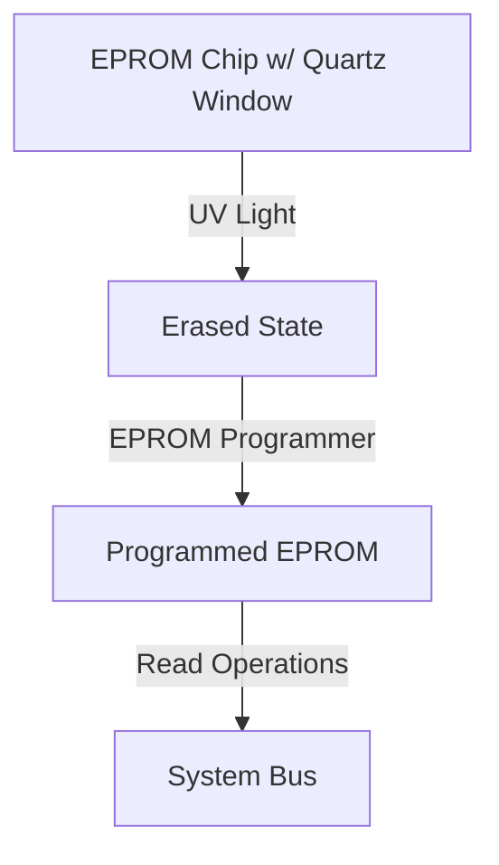

---
tags:
  - linux
  - hardware
  - concept
  - memory
  - storage
aliases:
  - Erasable Programmable Read-Only Memory
  - Read-Only Memory
related:
  - "[[ROM]]"
  - "[[PROM]]"
  - "[[EEPROM]]"
  - "[[Flash_Memory]]"
  - "[[BIOS]]"
  - "[[Firmware]]"
  - "[[Memory_Hierarchy]]"
  - "[[RAM]]"
  - "[[EPROM]]"
worksheet:
  - WS1
date_created: 2025-04-21
---
# EPROM (Erasable Programmable Read-Only Memory)

## Definition

**EPROM (Erasable Programmable Read-Only Memory)** is a type of non-volatile [[ROM|read-only memory]] chip whose stored data can be erased by exposing it to strong ultraviolet (UV) light and then reprogrammed electronically.

## Key Aspects / Characteristics

- **Non-Volatile:** Retains data even when power is turned off.
- **Programmable:** Can be programmed (written to) electronically, usually outside the main circuit using a special EPROM programmer device. This contrasts with mask ROMs programmed at the factory.
- **Erasable (UV Light):** Unlike [[PROM]] (Programmable ROM), EPROMs can be erased and reprogrammed multiple times. Erasure requires removing the chip from the circuit and exposing the internal silicon die (visible through a characteristic quartz window on top of the chip) to intense UV light for several minutes.
- **Read-Only in Operation:** Once programmed and installed in a circuit, it functions as read-only memory.
- **Older Technology:** Largely superseded by [[EEPROM]] (Electrically Erasable PROM) and especially [[Flash_Memory]], which allow electrical erasure and reprogramming without removal from the circuit or UV light.
- **Use Cases (Historical):** Commonly used for storing [[Firmware]] or [[BIOS]] in older computers and embedded systems where occasional updates might be needed but frequent changes were not expected.

## Visualization

*Note: Visualizing the UV erasure process is difficult in text diagrams.*

Conceptual Diagram:

## Related Concepts
- [[ROM]] (General category)
- [[PROM]] (Programmable once)
- [[EEPROM]] (Electrically erasable, byte/page level)
- [[Flash_Memory]] (Electrically erasable, block level, dominant modern type)
- [[BIOS]], [[Firmware]] (Common applications for EPROM historically)
- Non-Volatile Memory

---
**Source:** Worksheet WS1

# ROM (Read-Only Memory)

## Definition

**ROM (Read-Only Memory)** is a type of non-volatile memory used in computers and other electronic devices. As the name indicates, data stored in ROM can, under normal operation, only be read, not written to or modified easily or quickly. It is primarily used to store [[Firmware]] or application software that is rarely or never expected to change during the device's lifetime.

## Key Aspects / Characteristics

- **Non-Volatile:** Retains its contents even when the power supply is cut off. Contrasts with volatile memory like [[RAM]].
- **Read-Only (Primarily):** Designed for reading data. Writing is either impossible (Mask ROM) or requires special procedures (Programmable/Erasable ROM types).
- **Firmware Storage:** Commonly used to store low-level system software like the [[BIOS]] or [[UEFI]] firmware on a computer motherboard, bootloaders, or the operating system in simple embedded devices.
- **Types of ROM:** The term ROM encompasses several types with varying degrees of programmability:
    - **Mask ROM:** Programmed during manufacturing; cannot be changed afterwards. Cheapest for high-volume production.
    - **[[PROM]] (Programmable ROM):** Can be programmed (written to) exactly once by the user/manufacturer after fabrication using special equipment.
    - **[[EPROM]] (Erasable PROM):** Can be erased using ultraviolet light and reprogrammed.
    - **[[EEPROM]] (Electrically Erasable PROM):** Can be erased and reprogrammed electrically, often byte-by-byte, without removal from the circuit. Slower write/erase than Flash.
    - **[[Flash_Memory]]:** A type of EEPROM that allows faster electrical erasure and reprogramming in blocks. Dominant form for firmware (BIOS/UEFI), SSDs, USB drives. Often loosely referred to as ROM in firmware contexts despite being writable.

## Related Concepts
- [[Memory_Hierarchy]]
- [[RAM]] (Contrast: Volatile, Read-Write)
- [[PROM]], [[EPROM]], [[EEPROM]], [[Flash_Memory]] (Specific types)
- [[BIOS]], [[UEFI]], [[Firmware]] (Common applications)
- Non-Volatile Memory

---
**Source:** Worksheet WS1