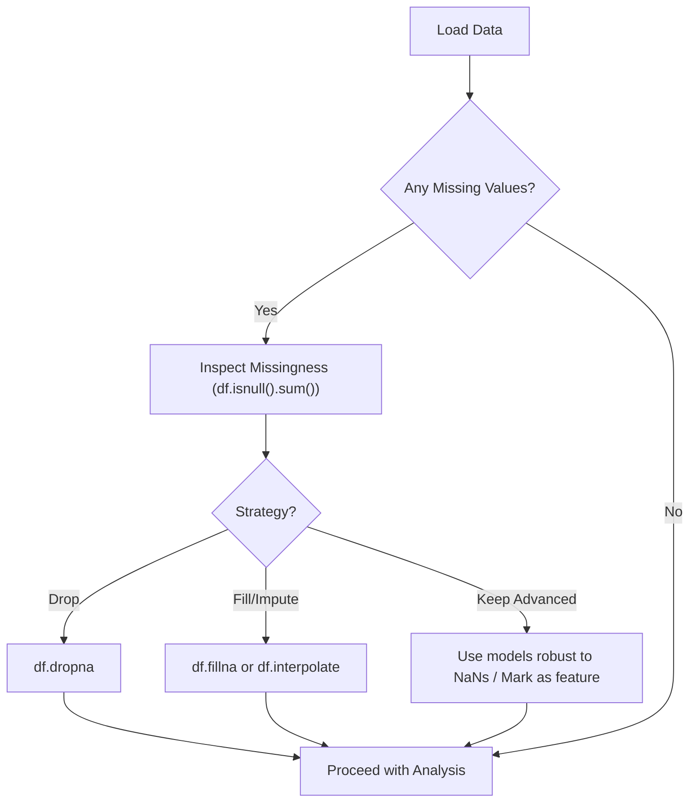

---
tags:
  - pandas
  - python
  - data_cleaning
  - data_preprocessing
  - missing_data
  - concept
aliases:
  - Pandas Missing Values
  - Pandas NaN Handling
  - pd.isnull
  - pd.notnull
  - df.dropna
  - df.fillna
related:
  - "[[Pandas_DataFrame]]"
  - "[[Pandas_Series]]"
  - "[[NumPy_NaN]]"
  - "[[Data_Cleaning]]"
worksheet: [WS_Pandas_Cleaning] # Assuming a worksheet name
date_created: <% tp.file.creation_date("YYYY-MM-DD") %>
---
# Pandas: Handling Missing Data

## Definition

Missing data is a common issue in real-world datasets. [[Pandas]] represents missing numerical data primarily with [[NumPy_NaN|`np.nan` (Not a Number)]], which is a special floating-point value. For object `dtype` columns (like strings), Pandas may use `None` or `np.nan`. Pandas provides several methods to detect, remove, and replace missing values.

## Detecting Missing Data

1.  **`isnull()` / `isna()`**:
    -   Return a boolean DataFrame or Series of the same shape as the input, indicating `True` where data is missing (`NaN` or `None`) and `False` otherwise.
    -   `df.isnull()` or `pd.isnull(df)`
    -   `series.isnull()` or `pd.isnull(series)`

2.  **`notnull()` / `notna()`**:
    -   The opposite of `isnull()`. Returns `True` where data is *not* missing, `False` otherwise.
    -   `df.notnull()` or `pd.notnull(df)`

**Usage Example:**
```python
import pandas as pd
import numpy as np

data = {'col1': [1, 2, np.nan, 4], 'col2': [5, np.nan, 7, 8], 'col3': ['a', 'b', 'c', None]}
df = pd.DataFrame(data)

print("DataFrame:\n", df)
print("\nIs Null? (df.isnull()):\n", df.isnull())
print("\nSum of nulls per column:\n", df.isnull().sum()) # Very common check
print("\nIs Not Null? (df.notnull()):\n", df.notnull())
```

## Removing Missing Data

**`dropna(axis=0, how='any', thresh=None, subset=None, inplace=False)`**
-   Removes rows or columns containing missing values.
-   **`axis`**: `0` or `'index'` to drop rows, `1` or `'columns'` to drop columns. Default is `0`.
-   **`how`**:
    -   `'any'` (default): Drop if *any* NA values are present in the row/column.
    -   `'all'`: Drop only if *all* values are NA in the row/column.
-   **`thresh`**: Integer. Keep only rows/columns with at least `thresh` non-NA values.
-   **`subset`**: List of column/index labels to consider when looking for NAs (e.g., only drop rows if NAs are in specific columns).
-   **`inplace`**: If `True`, modifies the DataFrame directly and returns `None`. Default is `False` (returns a new DataFrame).

**Usage Example:**
```python
# (using df from above)
print("\nOriginal DataFrame:\n", df)

# Drop rows with any NaN
df_dropped_rows_any = df.dropna() # how='any', axis=0 by default
print("\nDropped rows with any NaN:\n", df_dropped_rows_any)

# Drop columns with any NaN
df_dropped_cols_any = df.dropna(axis=1)
print("\nDropped columns with any NaN:\n", df_dropped_cols_any)

# Drop rows where all values are NaN (none in this example)
df_dropped_rows_all = df.dropna(how='all')
print("\nDropped rows where all values are NaN:\n", df_dropped_rows_all)

# Drop rows if NaN is present in 'col1' or 'col2'
df_dropped_subset = df.dropna(subset=['col1', 'col2'])
print("\nDropped rows if NaN in col1 or col2:\n", df_dropped_subset)

# Keep rows with at least 2 non-NA values
df_thresh = df.dropna(thresh=2)
print("\nKeep rows with at least 2 non-NA values:\n", df_thresh)
```

## Filling Missing Data (Imputation)

**`fillna(value=None, method=None, axis=None, inplace=False, limit=None, downcast=None)`**
-   Fills NA/NaN values using a specified method or value.
-   **`value`**: Scalar, dictionary, Series, or DataFrame used to fill missing values.
    -   Scalar: Fills all NAs with this value.
    -   Dictionary: `{column_name: fill_value}` to fill NAs in specific columns differently.
-   **`method`**: Method to use for filling holes in reindexed Series or DataFrames.
    -   `'ffill'` or `'pad'`: Propagate last valid observation forward to next valid.
    -   `'bfill'` or `'backfill'`: Use next valid observation to fill gap.
-   **`axis`**: Axis along which to fill missing values (0 for index, 1 for columns).
-   **`inplace`**: If `True`, modifies directly. Default `False`.
-   **`limit`**: If method is specified, this is the maximum number of consecutive NA values to forward/backward fill.

**Usage Example:**
```python
# (using df from initial example)
print("\nOriginal DataFrame:\n", df)

# Fill all NAs with 0
df_filled_zero = df.fillna(0)
print("\nFilled NAs with 0:\n", df_filled_zero)

# Fill NAs in 'col1' with its mean, 'col2' with a specific value
fill_values = {'col1': df['col1'].mean(), 'col2': 999, 'col3': 'missing'}
df_filled_custom = df.fillna(value=fill_values)
print("\nFilled NAs with custom values per column:\n", df_filled_custom)

# Forward fill
df_ffill = df.fillna(method='ffill')
print("\nForward filled NAs:\n", df_ffill)

# Backward fill with a limit
df_bfill_limit = df.fillna(method='bfill', limit=1)
print("\nBackward filled NAs (limit 1):\n", df_bfill_limit)
```

## Other Related Methods

- **`interpolate()`**: Fills `NaN` values using various interpolation methods (linear, polynomial, etc.).
- **Replacing values:** `df.replace(to_replace, value)` can also be used to replace specific values (which might represent missing data not yet as `NaN`) with `np.nan`.

## Missing Data Workflow



## Related Concepts
- [[Pandas_DataFrame]], [[Pandas_Series]]
- [[NumPy_NaN]] (The primary representation of missing numerical data)
- [[Data_Cleaning]], [[Data_Preprocessing]]
- Imputation (The process of filling missing values)

---
**Source:** Pandas Documentation