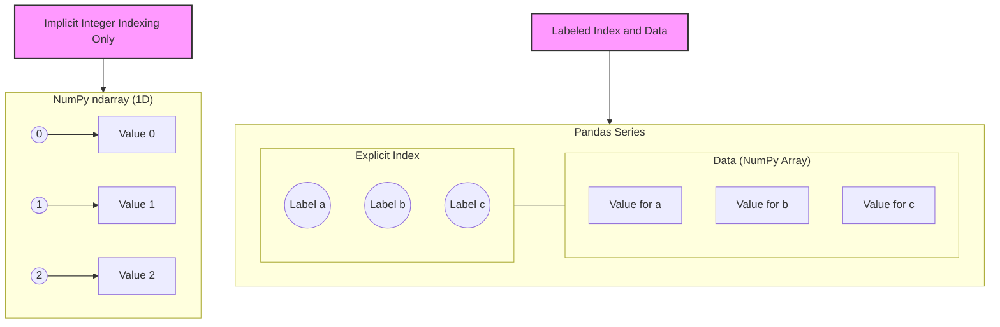

---
tags:
  - pandas
  - numpy
  - python
  - data_structure
  - comparison
  - core
aliases:
  - Series vs ndarray
  - pd.Series vs np.array
related:
  - "[[Pandas_Series]]"
  - "[[NumPy_ndarray]]"
  - "[[Pandas_Index_Object]]"
  - "[[NumPy_Data_Types]]"
  - "[[NumPy_Vectorization]]"
worksheet: [WS_Pandas_Main] # Assuming a main Pandas worksheet name
date_created: <% tp.file.creation_date("YYYY-MM-DD") %>
---
# Pandas `Series` vs. NumPy `ndarray`

## Definition

- **[[NumPy_ndarray|NumPy `ndarray`]]:** A fundamental N-dimensional array object in NumPy designed for efficient numerical computation. It's a grid of values, all of the **same data type**, indexed by a tuple of non-negative integers.
- **[[Pandas_Series|Pandas `Series`]]:** A one-dimensional **labeled** array in Pandas, capable of holding data of any NumPy data type. It's built on top of a NumPy array and adds an explicit **[[Pandas_Index_Object|index]]** for labeling.

## Key Differences (WS_Pandas_Main Question 1)

[list2card|addClass(ab-col2)]
- **Labels (Index)**
  - **`pd.Series`**: Has an explicit, user-definable index (e.g., strings, datetimes, integers). This index allows for powerful label-based lookups, alignment during operations, and handling of time series data.
  - **`np.ndarray`**: Has an implicit integer index (0-based positional indexing). It does not have named labels for its elements in the same way a Series does.
- **Data Types**
  - **`pd.Series`**: While the underlying data is often a homogeneous NumPy array, a Series itself can be thought of as more flexible for representing a column in a table, which might include `NaN` for missing numerical data or even hold Python objects (though this reduces performance benefits).
  - **`np.ndarray`**: Strictly homogeneous; all elements must be of the same [[NumPy_Data_Types|dtype]].
- **Functionality**
  - **`pd.Series`**: Offers a richer set of methods specifically designed for data analysis and manipulation, including handling of missing data (`.fillna()`, `.dropna()`), string operations (`.str` accessor), time series functionalities, and integration with DataFrame operations like `groupby`.
  - **`np.ndarray`**: Focuses on raw numerical computation, mathematical functions, and linear algebra.
- **Missing Data Handling**
  - **`pd.Series`**: Has robust, built-in handling for missing data, typically representing them as [[NumPy_NaN|`np.nan`]] for numeric types or `None`/`pd.NaT` for object/datetime types. Many operations can ignore or account for NaNs.
  - **`np.ndarray`**: `np.nan` is used for missing float data. Operations on integer arrays with NaNs are problematic (often requires upcasting to float).
- **Use Case**
  - **`pd.Series`**: Ideal for representing a single column of data in a tabular dataset, time series data, or any 1D sequence where labeled indexing is beneficial. Often a component of a [[Pandas_DataFrame]].
  - **`np.ndarray`**: Best for purely numerical computations, linear algebra, image processing, or when a simple, fast, multi-dimensional array of homogeneous data is needed.

## Visualization: Core Difference

## When to Choose

- **Choose `np.ndarray` if:**
    - You are doing pure numerical computation where labels are not important.
    - Maximum performance for mathematical operations on homogeneous data is critical.
    - You are working with multi-dimensional arrays beyond 1D in a purely numerical context (though DataFrames can handle 2D well).
- **Choose `pd.Series` if:**
    - You need labeled indexing for meaningful data access.
    - You are working with data that might have missing values that need sophisticated handling.
    - You need time series specific functionalities.
    - The data represents a column that will eventually be part of a DataFrame.
    - You need convenient data alignment features.

Essentially, a Pandas Series is a NumPy array with an added layer of intelligence (the index) and more specialized data analysis methods.

---
**Source:** WS_Pandas_Main, Pandas & NumPy Documentation