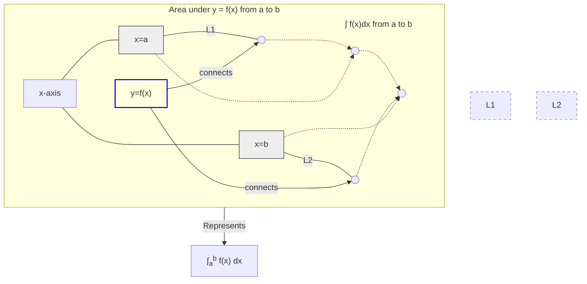

---
tags:
  - mathematics
  - calculus
  - integrals
  - area_under_curve
  - accumulation
  - antiderivative
  - concept
aliases:
  - Integral
  - Integration
  - Antiderivative
  - Area under the curve
related:
  - "[[_Calculus_MOC]]"
  - "[[Limits]]"
  - "[[Calculus_Derivatives]]"
  - "[[Fundamental_Theorem_of_Calculus]]"
worksheet:
  - WS_Math_Foundations_1
date_created: 2025-05-30
---
# Integrals

## Definition
In calculus, an **integral** is a mathematical object that can be interpreted as an area or a generalization of area. Integrals, together with [[Calculus_Derivatives|derivatives]], are the two main operations of calculus. The process of finding an integral is called **integration**.

There are two main types of integrals:
1.  **Definite Integral:** Represents the signed area bounded by the graph of a function, the x-axis, and two vertical lines (the limits of integration).
2.  **Indefinite Integral (Antiderivative):** Represents a family of functions whose derivative is the given function.

## Definite Integral
The definite integral of a function $f(x)$ from $a$ to $b$ is denoted as:
$$ \int_{a}^{b} f(x) \,dx $$
It represents the net signed area between the curve $y=f(x)$ and the x-axis, over the interval $[a, b]$.
- Areas above the x-axis are positive.
- Areas below the x-axis are negative.

It is formally defined as the limit of a Riemann sum:
$$ \int_{a}^{b} f(x) \,dx = \lim_{n \to \infty} \sum_{i=1}^{n} f(x_i^*) \Delta x $$
where $\Delta x = \frac{b-a}{n}$ and $x_i^*$ is a point in the $i$-th subinterval.

## Indefinite Integral (Antiderivative)
The indefinite integral of a function $f(x)$, denoted as:
$$ \int f(x) \,dx $$
represents the set of all functions $F(x)$ such that $F'(x) = f(x)$. If $F(x)$ is an antiderivative of $f(x)$, then any function of the form $F(x) + C$, where $C$ is an arbitrary constant (the constant of integration), is also an antiderivative.
So, $\int f(x) \,dx = F(x) + C$.

## The Fundamental Theorem of Calculus
This theorem links differentiation and integration. It has two parts:
1.  **First Part:** If $F(x) = \int_{a}^{x} f(t) \,dt$, then $F'(x) = f(x)$. (The derivative of an integral with a variable upper limit is the integrand).
2.  **Second Part (Evaluation Theorem):** If $F(x)$ is any antiderivative of $f(x)$ (i.e., $F'(x) = f(x)$), then:
    $$ \int_{a}^{b} f(x) \,dx = F(b) - F(a) $$
This part provides a powerful method for calculating definite integrals.

## Key Aspects & Interpretations
[list2tab|#Integral Aspects]
- **Area under a Curve**
    - The primary geometric interpretation of a definite integral.
- **Accumulation**
    - Integrals can represent the total accumulation of a quantity when its rate of change is known. For example, if $v(t)$ is velocity, then $\int_{t_1}^{t_2} v(t) \,dt$ is the total displacement from time $t_1$ to $t_2$.
- **Average Value of a Function**
    - The average value of a function $f(x)$ on an interval $[a, b]$ is given by $\frac{1}{b-a} \int_{a}^{b} f(x) \,dx$.
- **Inverse of Differentiation**
    - Integration (specifically, finding an indefinite integral) is the reverse process of differentiation.

## Common Integration Rules/Techniques
- **Power Rule (for integrals):** $\int x^n \,dx = \frac{x^{n+1}}{n+1} + C$ (for $n \neq -1$)
- **Integral of $\frac{1}{x}$:** $\int \frac{1}{x} \,dx = \ln|x| + C$
- **Integral of $e^x$:** $\int e^x \,dx = e^x + C$
- **Integrals of Trigonometric Functions:**
    - $\int \cos x \,dx = \sin x + C$
    - $\int \sin x \,dx = -\cos x + C$
- **Linearity:**
    - $\int (f(x) \pm g(x)) \,dx = \int f(x) \,dx \pm \int g(x) \,dx$
    - $\int k f(x) \,dx = k \int f(x) \,dx$ (where $k$ is a constant)
- **Integration by Substitution:** Analogue of the chain rule for derivatives.
- **Integration by Parts:** Analogue of the product rule for derivatives: $\int u \,dv = uv - \int v \,du$.

## Applications in AI/ML
- **Probability Theory:**
    - Calculating probabilities for continuous random variables using Probability Density Functions (PDFs). The probability $P(a \le X \le b) = \int_{a}^{b} p(x) \,dx$, where $p(x)$ is the PDF.
    - Calculating expected values: $E[X] = \int_{-\infty}^{\infty} x p(x) \,dx$.
- **Calculating Cumulative Distribution Functions (CDFs):** $F_X(x) = P(X \le x) = \int_{-\infty}^{x} p(t) \,dt$.
- **Signal Processing:** Used in Fourier transforms and other signal analysis techniques.
- **Reinforcement Learning:** Integrals can appear in the formulation of value functions or policies in continuous state/action spaces.
- **Generative Models:** Some generative models involve calculating integrals, for example, when dealing with partition functions or normalizing constants.

## Diagram: Definite Integral as Area

> The diagram illustrates the definite integral $\int_{a}^{b} f(x) \,dx$ as the shaded area between the curve $y=f(x)$, the x-axis, and the vertical lines $x=a$ and $x=b$.

---