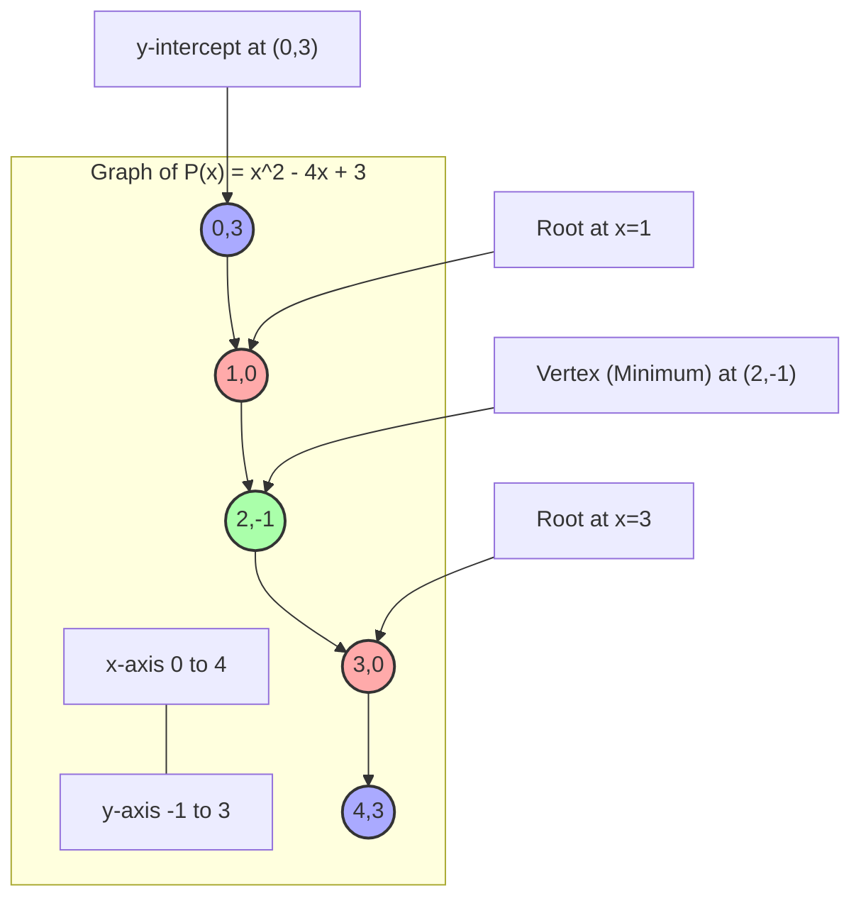

---
tags:
  - mathematics
  - functions
  - algebra
  - polynomials
  - concept
aliases:
  - Polynomial Function
  - Polynomial Equations
related:
  - "[[_Functions_MOC]]"
  - "[[Calculus_Derivatives]]"
  - "[[Calculus_Integrals]]"
  - "[[Linear_Function]]"
  - "[[Quadratic_Function]]"
worksheet:
  - WS_Math_Foundations_1
date_created: 2025-05-30
---
# Polynomials

## Definition
A **polynomial** is an expression consisting of variables (also called indeterminates) and coefficients, that involves only the operations of addition, subtraction, multiplication, and non-negative integer exponentiation of variables.

A **polynomial function** in a single variable $x$ can be written in the general form:
$$ P(x) = a_n x^n + a_{n-1} x^{n-1} + \dots + a_2 x^2 + a_1 x + a_0 $$
where:
[list2table]
- $a_n, a_{n-1}, \dots, a_0$ 
	- are constants called the **coefficients** of the polynomial.
- $x$ 
	- is the variable.
- $n$ i
	- s a non-negative integer called the **degree** of the polynomial (if $a_n \neq 0$). The degree is the highest exponent of $x$ with a non-zero coefficient.
- Each $a_k x^k$ 
	- is called a **term** of the polynomial.
- $a_n x^n$ 
	- is the **leading term**, and $a_n$ is the **leading coefficient**.
- $a_0$ 
	- is the **constant term** (or y-intercept).

Polynomials can also involve multiple variables, e.g., $P(x,y) = 2x^2y + 3xy^3 - 5$.

## Classification by Degree
[list2tab|#Polynomial Degrees]
- **Degree 0: Constant Polynomial**
    - $P(x) = a_0$ (where $a_0 \neq 0$)
    - Example: $P(x) = 5$. Graph is a horizontal line.
    - The zero polynomial $P(x)=0$ is sometimes said to have degree -1 or $-\infty$, or its degree is undefined.
- **Degree 1: [[Linear_Function|Linear Polynomial]]**
    - $P(x) = a_1 x + a_0$ (where $a_1 \neq 0$)
    - Example: $P(x) = 2x + 3$. Graph is a straight line.
- **Degree 2: [[Quadratic_Function|Quadratic Polynomial]]**
    - $P(x) = a_2 x^2 + a_1 x + a_0$ (where $a_2 \neq 0$)
    - Example: $P(x) = x^2 - 3x + 2$. Graph is a parabola.
- **Degree 3: Cubic Polynomial**
    - $P(x) = a_3 x^3 + a_2 x^2 + a_1 x + a_0$ (where $a_3 \neq 0$)
    - Example: $P(x) = x^3 - 6x^2 + 11x - 6$.
- **Degree 4: Quartic Polynomial**
- **Degree 5: Quintic Polynomial**

## Properties
- **Continuity and Differentiability:** Polynomial functions are continuous and infinitely differentiable everywhere.
- **Roots (Zeros):** A root of a polynomial $P(x)$ is a value $r$ such that $P(r) = 0$.
    - A polynomial of degree $n$ has at most $n$ real roots.
    - The Fundamental Theorem of Algebra states that a polynomial of degree $n$ with complex coefficients has exactly $n$ complex roots (counting multiplicities).
- **Factor Theorem:** If $r$ is a root of $P(x)$, then $(x-r)$ is a factor of $P(x)$.
- **End Behavior:** The behavior of $P(x)$ as $x \to \infty$ or $x \to -\infty$ is determined by its leading term $a_n x^n$.

## Operations on Polynomials
- **Addition/Subtraction:** Add/subtract corresponding coefficients of terms with the same degree.
- **Multiplication:** Multiply each term of the first polynomial by each term of the second polynomial and collect like terms.
- **Division:** Polynomial long division or synthetic division can be used.
- **Differentiation:** The [[Calculus_Derivatives|derivative]] of $a_k x^k$ is $k a_k x^{k-1}$. The derivative of a polynomial is another polynomial of degree $n-1$ (if $n \ge 1$).
- **Integration:** The [[Calculus_Integrals|integral]] of $a_k x^k$ is $\frac{a_k}{k+1} x^{k+1} + C$. The indefinite integral of a polynomial is another polynomial of degree $n+1$.

## Applications
- **Function Approximation (Taylor Series):** Many complex functions can be approximated locally by polynomials (Taylor polynomials). The Taylor series of an infinitely differentiable function is a power series (an infinite polynomial).
- **Curve Fitting / Regression:** Polynomial regression is used to model relationships between variables where the relationship is non-linear but can be approximated by a polynomial.
    - Example: Fitting a quadratic curve $y = \beta_0 + \beta_1 x + \beta_2 x^2$ to data points.
- **Interpolation:** Finding a polynomial that passes exactly through a given set of points (e.g., Lagrange interpolation, Newton polynomials).
- **Numerical Analysis:** Used in methods for numerical integration (e.g., Simpson's rule) and solving differential equations.
- **Computer Graphics:** Polynomial curves (like Bézier curves, which are parametrically defined by polynomials) are used to draw smooth shapes.
- **Signal Processing:** Polynomial filters.
- **Cryptography:** Some cryptographic schemes are based on properties of polynomials over finite fields.
- **Physics and Engineering:** Describing trajectories, potentials, and various physical phenomena.

## Example: Quadratic Polynomial
Consider $P(x) = x^2 - 4x + 3$.
- **Degree:** 2
- **Coefficients:** $a_2=1, a_1=-4, a_0=3$
- **Roots:** To find roots, set $P(x)=0$: $x^2 - 4x + 3 = 0$.
  Factoring: $(x-1)(x-3) = 0$. So, roots are $x=1$ and $x=3$.
- **Derivative:** $P'(x) = 2x - 4$.
  Critical point where $P'(x)=0 \implies 2x-4=0 \implies x=2$.
- **Second Derivative:** $P''(x) = 2$. Since $P''(x) > 0$, the critical point $x=2$ is a local minimum.
  Vertex of the parabola is at $(2, P(2)) = (2, 2^2 - 4(2) + 3) = (2, 4-8+3) = (2, -1)$.

---