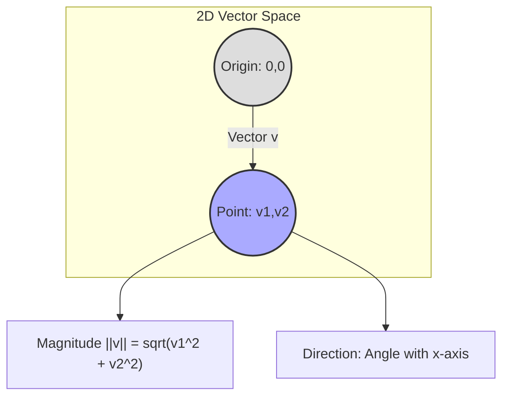

---
tags:
  - mathematics
  - linear_algebra
  - vector
  - concept
aliases:
  - Vectors
related:
  - "[[_Linear_Algebra_MOC]]"
  - "[[Row_Vector]]"
  - "[[Column_Vector]]"
  - "[[Matrix]]"
  - "[[Scalar]]"
  - "[[Vector_Operations]]"
  - "[[Dot_Product]]"
  - "[[p-norm]]"
  - "[[Vector_Space]]"
worksheet:
  - WS_Math_Foundations_1
date_created: 2025-05-30
---
# Vector

## Definition
In mathematics and physics, a **vector** is a geometric object that has both **magnitude** (or length) and **direction**. Vectors can be added to other vectors according to vector algebra, and they can be multiplied by [[Scalar|scalars]] (scalar multiplication).

In the context of data science and linear algebra, vectors are typically represented as an ordered list of numbers, called **components** or **elements**. A vector with $n$ components is said to be an $n$-dimensional vector.

## Representation
Vectors are often denoted by bold lowercase letters (e.g., $\mathbf{v}$), or with an arrow above the letter (e.g., $\vec{v}$).
An $n$-dimensional vector $\mathbf{v}$ can be written as:
$$ \mathbf{v} = \begin{pmatrix} v_1 \\ v_2 \\ \vdots \\ v_n \end{pmatrix} \quad \text{or} \quad \mathbf{v} = (v_1, v_2, \dots, v_n) $$
The first form is a [[Column_Vector|column vector]], and the second is often used to represent a [[Row_Vector|row vector]] or a general coordinate vector.

>[!question] Are vectors just 1×n (or n×1) matrices?
>Yes, from a structural and operational perspective in linear algebra, vectors can be considered special cases of [[Matrix|matrices]].
>- A **[[Column_Vector|column vector]]** with $n$ components can be viewed as an $n \times 1$ matrix (a matrix with $n$ rows and 1 column).
>- A **[[Row_Vector|row vector]]** with $n$ components can be viewed as a $1 \times n$ matrix (a matrix with 1 row and $n$ columns).
>
>This perspective is useful because operations defined for matrices (like matrix addition and matrix multiplication) are consistent with vector operations when vectors are treated as such matrices. For example, the [[Dot_Product|dot product]] of two vectors can be expressed as a [[Matrix_Product|matrix product]] involving a row vector and a column vector.

## Key Properties and Concepts
[list2tab|#Vector Properties]
- Magnitude
	(Length or Norm)
    - The magnitude of a vector $\mathbf{v} = (v_1, v_2, \dots, v_n)$ is typically its Euclidean length (or L2 norm), calculated as:
      $$ \|\mathbf{v}\| = \sqrt{v_1^2 + v_2^2 + \dots + v_n^2} $$
    - Other [[p-norm|norms]] (like L1 norm) can also define a vector's "length".
- Direction
    - The orientation of the vector in space. Often represented by a unit vector (a vector with magnitude 1) pointing in the same direction.
    - For $\mathbf{v} \neq \mathbf{0}$, the unit vector $\hat{\mathbf{u}}$ in the direction of $\mathbf{v}$ is $\hat{\mathbf{u}} = \frac{\mathbf{v}}{\|\mathbf{v}\|}$.
- Zero Vector
    - A vector with all components equal to zero, denoted $\mathbf{0}$ or $\vec{0}$. It has zero magnitude and no specific direction. It is the additive identity in a [[Vector_Space|vector space]].
- Vector Equality
    - Two vectors are equal if and only if they have the same dimension and their corresponding components are equal.

## Geometric Interpretation
In 2D or 3D space, a vector can be visualized as an arrow:
- The **length** of the arrow represents the vector's magnitude.
- The **direction** the arrow points represents the vector's direction.
Vectors are often drawn starting from the origin $(0,0)$ or $(0,0,0)$, in which case the coordinates of the vector's endpoint are the same as its components. However, a vector is defined by its magnitude and direction, not its specific location in space (unless it's a position vector).

## Applications in AI/ML
- **Feature Vectors:** Rows in a dataset (representing individual samples) are often treated as feature vectors, where each component corresponds to a feature value.
- **Word Embeddings (NLP):** Words are represented as dense vectors in a high-dimensional space (e.g., Word2Vec, GloVe, FastText).
- **Representing State:** In reinforcement learning, the state of an environment can be represented as a vector.
- **Gradients:** The [[Gradient|gradient]] of a scalar function with respect to multiple variables is a vector of partial derivatives.
- **Directions & Movements:** Used in physics engines, robotics, and computer graphics.

See also [[Vector_Operations]] for addition, scalar multiplication, etc.

---