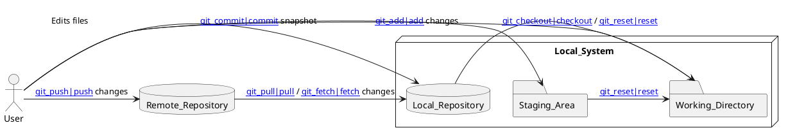

# Git

## Definition

**Git** is a distributed [[Version_Control]] system designed to handle everything from small to very large projects with speed and efficiency. It tracks changes to source code (and other files) over time, allowing developers to collaborate, revert to previous versions, and manage different lines of development ([[Branching]]).

## Key Aspects / Characteristics

- **Distributed:** Every developer has a full copy of the [[Repository]], including its entire history. This allows for offline work and redundancy.
- **Speed:** Most operations (committing, branching, merging) are performed locally, making them very fast.
- **Branching and Merging:** Git has powerful and flexible [[Branching]] and [[Merging]] capabilities, supporting complex workflows.
- **Integrity:** Content is checksummed using SHA-1 hashes, ensuring the history cannot be easily corrupted without detection.
- **Staging Area:** Git uses a unique [[Staging_area]] (or index) that allows developers to precisely choose which changes go into the next [[Commit_object|commit]].
- **Snapshots, Not Differences:** Git primarily thinks about data as snapshots of the entire project state at a given time, rather than just file differences (though it can calculate differences efficiently).

## Examples / Use Cases

- Managing source code for software projects (its primary use).
- Tracking changes in configuration files.
- Collaborating on documents or research papers.
- Managing website content.

## Related Concepts
- [[Version_Control]] (The general concept)
- [[Distributed_Version_Control]] (The category Git belongs to)
- [[Repository]] (Where the history is stored)
- [[Working_directory]], [[Staging_area]], [[Commit_object]] (The three main states/areas)
- [[Git_HEAD|HEAD]] (Pointer to the current commit/branch)
- Commands like [[git_init]], [[git_clone]], [[git_add]], [[git_commit]], [[git_push]], [[git_pull]], [[git_branch]], [[git_merge]]

## Diagrams (Optional)

## Questions / Further Study

> [!question] Why is Git called a distributed version control system?  
> Because unlike centralized systems (like SVN), each developer's working copy contains the entire history of the project. There isn't one single central server that holds the "master" history; multiple repositories can exist and synchronize with each other.

