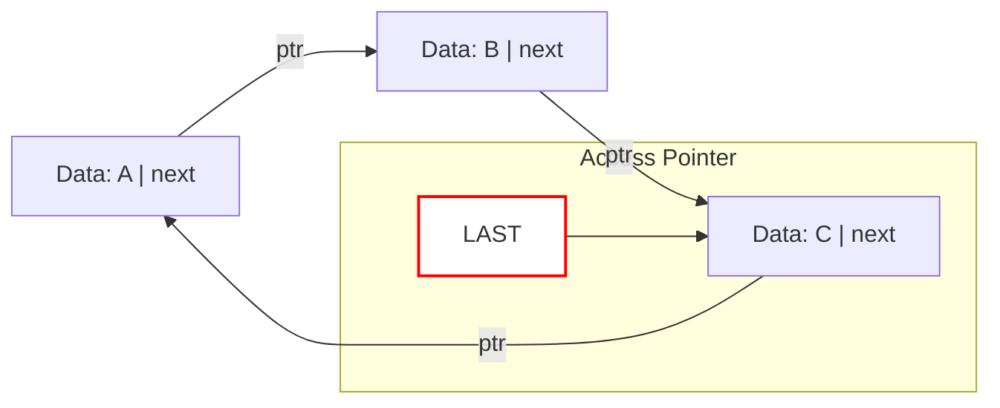

---
tags:
  - data_structures
  - concept
  - implementation
  - list
  - linked_list
aliases:
  - Circular Linked List
related:
  - "[[Data_Structure]]"
  - "[[Linked_List_ADT]]"
  - "[[Singly_Linked_List_DS]]"
  - "[[Doubly_Linked_List_DS]]"
  - "[[Node_DS]]"
  - "[[Pointer_C]]"
  - "[[Queue_ADT]]" # Can be used for implementation
worksheet: [WS7]
date_created: 2025-04-21
---
# Circular Linked List

## Definition

A **Circular Linked List** is a variation of a [[Linked_List_ADT|linked list]] (either [[Singly_Linked_List_DS|singly]] or [[Doubly_Linked_List_DS|doubly]]) in which the last node points back to the first node, forming a circle or ring. There is no `NULL` pointer at the end of the list.

## Key Aspects / Characteristics

- **Circular Structure:** The `next` pointer of the last node points to the `head` node (in a singly circular list). In a doubly circular list, the `next` of the last node points to the head, and the `prev` of the head node points to the last node.
- **No NULL End:** Traversal can continue indefinitely around the circle.
- **Single Entry Point:** Often accessed via a single pointer, typically pointing to the "last" node (or any node, really). Pointing to the last node can be convenient because it gives O(1) access to both the last element (the node itself) and the first element (`last->next`).
- **Traversal Termination:** Care must be taken during traversal to detect when a full circle has been completed to avoid infinite loops (e.g., by stopping when you reach the starting node again).
- **Variations:** Can be singly or doubly linked.

## Visualization (Singly Circular Linked List)

*(Here, `LAST->next` gives access to NodeA (the head).)*

## Use Cases

- **Implementing Circular Buffers/Queues:** Can be used as the underlying structure for a [[Circular_Queue_DS]]. Using a pointer to the "last" element allows O(1) enqueue (insert after last) and O(1) dequeue (delete `last->next`).
- **Round-Robin Scheduling:** Managing processes or resources in a circular manner where the scheduler cycles through the list.
- **Multiplayer Games:** Managing turns for players arranged in a circle.
- **Computer Graphics:** Representing circular structures or paths.

## Advantages

- Any node can be a starting point for traversal.
- Efficient for applications requiring circular processing or queue implementations (with tail pointer).

## Disadvantages

- Traversal requires careful termination conditions to avoid infinite loops.
- Slightly more complex pointer manipulation than standard linear lists.

## Related Concepts
- [[Data_Structure]], [[Linked_List_ADT]]
- [[Singly_Linked_List_DS]], [[Doubly_Linked_List_DS]]
- [[Node_DS]], [[Pointer_C]]
- [[Circular_Queue_DS]], [[Circular_Buffer_DS]]
- Round-Robin Algorithms

---
**Source:** Worksheet WS7