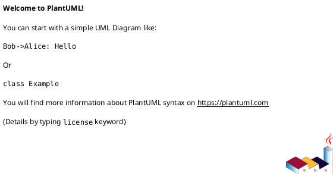

---
tags:
  - 50_data_structures
  - concept
  - data_structures
  - math
  - linear_algebra
  - matrix
aliases:
  - Column Matrix
related:
  - Linear_Algebra
  - Vector_Math
  - Matrix_DS
  - Row_Vector
worksheet:
  - WS
  - WS11
date_created: 2025-04-21
---
# Untitled

## Definition


## Key Aspects / Characteristics

- Aspect 1
- Aspect 2

## Examples / Use Cases

- Example 1
- Example 2

## Related Concepts
<% tp.file.cursor(3) %>
- [[Link 1]]
- [[Link 2]]

## Diagrams (Optional)
<% tp.file.cursor(4) %>



## Questions / Further Study

> [!question] Question Title  
> Answer or discussion point.
> 
> - Follow-up task related to this concept @today
>     

---

**Source:** Worksheet <% tp.file.cursor(5) %>

# Column Vector

## Definition

A **Column Vector** (or Column Matrix) is a [[Matrix_DS|matrix]] consisting of a **single column**. An `m × 1` matrix is a column vector with `m` elements (rows).

## Representation

A column vector `v` with `m` elements is written as:
```
[ v1 ]
[ v2 ]
[ .. ]
[ vm(a_21);
        R2 --> C22(a_22);
        R3["Row 3"] --> C31(a_31);
        R3 --> C32(a_32);

        subgraph Columns
           direction TB
           Col1["Col 1"] --> C11; Col1 --> C21; Col1 --> C31;
           Col2["Col 2"] --> C12; Col2 --> C22; Col2 --> C32;
        end
    end
```

## Use Cases

- Representing and solving systems of linear equations.
- Representing linear transformations (rotation, scaling, shearing) in geometry and graphics.
- Storing data (e.g., datasets where rows are samples and columns are features).
- Representing adjacency in graphs (Adjacency Matrix).
- Quantum mechanics, economics, probability theory, computer science.

## Related Concepts
- [[Linear_Algebra]]
- [[Vector_Math]] (Vectors as special matrices)
- [[Matrix_Operations]] (Addition, multiplication, transpose, etc.)
- Specific types: [[Square_Matrix]], [[Identity_Matrix]], [[Column_Vector]]
- [[Matrix_DS]] (How matrices are often stored in code)

---
**Source:** Worksheet WS11