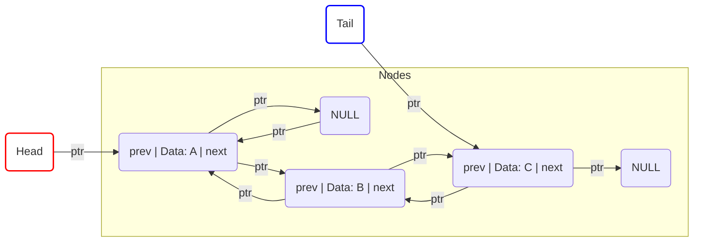

---
tags:
  - data_structures
  - concept
  - implementation
  - list
  - linked_list
aliases:
  - Doubly Linked List
  - DLL
related:
  - "[[Data_Structure]]"
  - "[[Linked_List_ADT]]"
  - "[[Singly_Linked_List_DS]]"
  - "[[Circular_Linked_List_DS]]"
  - "[[Node_DS]]"
  - "[[Pointer_C]]"
  - "[[Sequential_Access]]"
  - "[[Double-Ended_Queue_ADT]]"
worksheet: [WS7]
date_created: 2025-04-21
---
# Doubly Linked List

## Definition

A **Doubly Linked List** is a concrete [[Data_Structure]] implementation of a linear list ([[Linked_List_ADT]]) where each element (node) contains the data, a pointer (`next`) to the **next** node in the sequence, and an additional pointer (`prev`) to the **previous** node in the sequence.

## Key Aspects / Characteristics

- **Node Structure:** Each node contains:
    - Data field(s).
    - A pointer (`next`) to the next node.
    - A pointer (`prev`) to the previous node.
- **Head and Tail Pointers:** The list is typically accessed via pointers to the first node (`head`) and the last node (`tail`).
    - `head->prev` is usually `NULL`.
    - `tail->next` is usually `NULL`.
    - An empty list has `head` and `tail` both equal to `NULL`.
- **Bidirectional Traversal:** Allows traversal both forwards (using `next` pointers) and backwards (using `prev` pointers) from any given node.
- **[[Sequential_Access]]:** Accessing the Nth element still generally requires traversing from the head or tail (O(N/2) which is O(N)), but traversal can start from the closest end.
- **Efficient Insertion/Deletion (at known location/ends):**
    - *At Head/Tail:* Very efficient (O(1)) if `head` and `tail` pointers are maintained.
    - *In Middle (given pointer to node):* Deleting a node when you have a pointer *to that node* is O(1) (unlike singly linked lists where you need the *previous* node). Inserting before/after a known node is also O(1). Finding the node first still takes O(n).
- **Memory Overhead:** Requires more memory per node compared to a [[Singly_Linked_List_DS]] due to the extra `prev` pointer.

## Node Structure (Conceptual C)

```c
typedef struct Node {
    DataType data; // Replace DataType with actual type
    struct Node *next;
    struct Node *prev; // Pointer to the previous node
} Node;

// List structure might hold head and tail
typedef struct {
    Node *head;
    Node *tail;
    // size_t size; // Optional
} DoublyLinkedList;
```

## Visualization



## Use Cases

- Implementing [[Double-Ended_Queue_ADT|Deques]].
- Implementing caches (like LRU Cache where nodes need to be moved easily).
- Maintaining lists where frequent backward traversal or deletion at arbitrary (known) locations is needed.
- Undo/Redo functionality where moving back and forth through actions is required.

## Related Concepts
- [[Data_Structure]], [[Linked_List_ADT]]
- [[Singly_Linked_List_DS]], [[Circular_Linked_List_DS]]
- [[Node_DS]]
- [[Pointer_C]]
- [[Sequential_Access]]
- Bidirectional Traversal

---
**Source:** Worksheet WS7