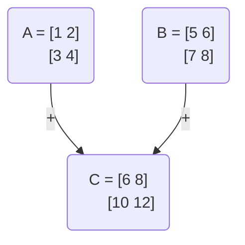
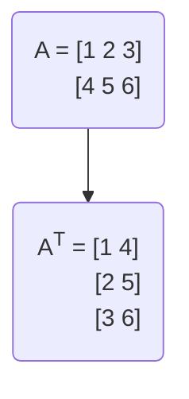

---
tags:
  - math
  - linear_algebra
  - concept
  - matrix
  - operation
aliases:
  - Matrix Arithmetic
related:
  - "[[Matrix_Math]]"
  - "[[Linear_Algebra]]"
  - "[[Vector_Math]]"
  - "[[Identity_Matrix]]"
  - "[[Matrix_Properties]]"
  - "[[Dot_Product]]"
  - "[[Matrix_Addition]]"
  - "[[Matrix_Subtraction]]"
  - "[[Scalar_Matrix_Multiplication]]"
  - "[[Matrix_Multiplication]]"
  - "[[Matrix_Transpose]]"
worksheet:
  - WS11
date_created: 2025-04-12
---
# Matrix Operations

## Definition

[[Matrix_Math|Matrices]] support several standard algebraic operations, provided their dimensions are compatible. Key operations include addition, subtraction, scalar multiplication, matrix multiplication, and transpose.

## Core Operations

1.  **[[Matrix_Addition|Addition]] / [[Matrix_Subtraction|Subtraction]]:**
    -   **Condition:** Matrices must have the **same dimensions**.
    -   **Operation:** Performed element-wise. `(A ± B)_ij = A_ij ± B_ij`.
    -   **Properties:** Commutative, Associative.

2.  **[[Scalar_Matrix_Multiplication|Scalar Multiplication]]:**
    -   **Operation:** Multiply every element of the matrix by a scalar `c`. `(c * A)_ij = c * A_ij`.

3.  **[[Matrix_Transpose|Transpose]]:**
    -   **Operation:** Swap rows and columns. `(A^T)_ij = A_ji`. If `A` is `m x n`, `A^T` is `n x m`.
    -   **Properties:** `(A^T)^T = A`, `(A + B)^T = A^T + B^T`, `(c*A)^T = c*A^T`, `(A * B)^T = B^T * A^T`.

4.  **[[Matrix_Multiplication|Matrix Multiplication]]:**
    -   **Condition:** To multiply `A * B`, the number of columns in `A` must equal the number of rows in `B`. If `A` is `m x n` and `B` is `n x p`, the result `C` is `m x p`.
    -   **Operation:** The element `C_ij` is the [[Dot_Product]] of the `i`-th row of `A` and the `j`-th column of `B`. `C_ij = Σ (A_ik * B_kj)` (sum over `k`).
    -   **Properties:** Associative, Distributive over addition. **Not Commutative** generally (`AB != BA`).

## Visualizations

**Addition (2x2):**


**Transpose (2x3 -> 3x2):**


**Multiplication (Conceptual: Row x Column -> Element):**
```d2
# C = A * B
# C_ij = Dot(Row_i(A), Col_j(B))

A: {
  shape: rectangle
  label: Matrix A
  style.stroke-dash: 5
  Row_i: {
    label: "Row i"
    style.fill: lightblue
  }
}

B: {
  shape: rectangle
  label: Matrix B
  style.stroke-dash: 5
  Col_j: {
    label: "Col j"
    style.fill: lightgreen
  }
}

C: {
  shape: rectangle
  label: Matrix C
  style.stroke-dash: 5
  C_ij: {
    label: "C_ij"
    style.fill: yellow
  }
}

# Indication of operation
op: {
  shape: oval
  label: "Dot Product"
}

Row_i -> op
Col_j -> op
op -> C_ij
```

## Related Concepts
- [[Matrix_Math]], [[Linear_Algebra]]
- [[Dot_Product]] (Used in multiplication)
- [[Matrix_Properties]] ([[Commutativity_Matrix]], [[Associativity_Matrix]], [[Distributive_Law_Matrix]])
- [[Identity_Matrix]] (Identity for multiplication)

## Questions / Further Study
>[!question] How do you add two matrices together, and what conditions must be met for this operation? (WS11)
> To add two matrices `A` and `B`, they **must have the exact same dimensions** (same number of rows and same number of columns). The addition is performed **element-wise**: the element in the `i`-th row and `j`-th column of the resulting matrix `C` is the sum of the elements in the `i`-th row and `j`-th column of `A` and `B`. `C_ij = A_ij + B_ij`.

>[!question] What is a transpose of a matrix? (WS11)
> The transpose of a matrix `A`, denoted `A^T`, is obtained by **swapping its rows and columns**. If `A` has dimensions `m x n`, then `A^T` has dimensions `n x m`. The element at row `i`, column `j` of `A^T` is the element that was at row `j`, column `i` of the original matrix `A`. `(A^T)_ij = A_ji`.

---
**Source:** Worksheet WS11