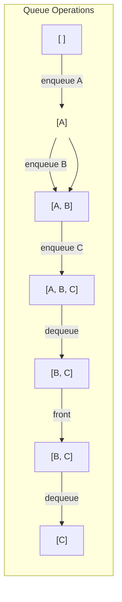

---
tags:
  - data_structures
  - concept
  - adt
  - linear
aliases:
  - Queue
  - FIFO
related:
  - Abstract_Data_Type
  - Data_Structure
  - Stack_ADT
  - Array_C
  - Linked_List_ADT
  - Circular_Queue_DS
  - Priority_Queue_ADT
  - Double-Ended_Queue_ADT
  - Breadth_First_Search
worksheet:
  - WS7
date_created: 2025-04-14
---
# Queue (ADT)

## Definition

A **Queue** is a linear [[Abstract_Data_Type|Abstract Data Type (ADT)]] that follows the **FIFO (First-In, First-Out)** principle. Elements are added (enqueued) at one end, called the **rear** (or tail), and removed (dequeued) from the other end, called the **front** (or head). The first element added is always the first one to be removed.

## Core Operations

-   **`enqueue(item)`:** Adds an `item` to the rear of the queue.
-   **`dequeue()`:** Removes and returns the item currently at the front of the queue. An error occurs if the queue is empty.
-   **`front()`** (or `peek()`): Returns the item at the front of the queue *without* removing it. An error occurs if the queue is empty.
-   **`isEmpty()`:** Returns true if the queue contains no elements, false otherwise.
-   **`size()`:** Returns the number of items currently in the queue. (Optional operation)
-   **`create()`:** Creates an empty queue. (Implicit operation)

## Key Aspects

- **FIFO Principle:** First element added is the first one accessed/removed. Think of a waiting line or queue.
- **Two Ends:** Operations occur at different ends (front for removal, rear for addition).
- **Implementation:** Can be implemented using various concrete [[Data_Structure|data structures]]:
    - **[[Array_C]] / [[Vector_DS]]:** Can be simple, but naive implementations where dequeue involves shifting elements are inefficient (O(n)). [[Circular_Queue_DS|Circular arrays]] are commonly used for efficient O(1) enqueue and dequeue.

## Visualization (Conceptual)



*Elements added at Rear (right), removed from Front (left).*

## Examples

### Python Example: Queue Implementation Using a List

A simple implementation of a queue using a Python list (inefficient for dequeuing due to O(n) shifting):

```python
class Queue:
  def __init__(self):
    self.items = []  # Initialize empty queue

  def enqueue(self, item):
    self.items.append(item)  # Add to the rear (O(1))

  def dequeue(self):
    if self.isEmpty():
      raise IndexError("Dequeue from empty queue")
    return self.items.pop(0)  # Remove from the front (O(n) due to shifting)

  def front(self):
    if self.isEmpty():
      raise IndexError("Front of empty queue")
    return self.items[0]  # Peek at the front (O(1))

  def isEmpty(self):
    return len(self.items) == 0

  def size(self):
    return len(self.items)

# Example usage
q = Queue()
q.enqueue("A")
q.enqueue("B")
q.enqueue("C")
print("Queue after enqueues:", q.items)  # ['A', 'B', 'C']
print("Front:", q.front())  # 'A'
print("Dequeue:", q.dequeue())  # 'A'
print("Queue after dequeue:", q.items)  # ['B', 'C']
print("Size:", q.size())  # 2
```

**Output:**

```
Queue after enqueues: ['A', 'B', 'C']
Front: A
Dequeue: A
Queue after dequeue: ['B', 'C']
Size: 2
```
### Python Example: Using collections.deque for Efficient Queue

For better performance, Python’s collections.deque provides O(1) operations for both enqueue and dequeue:

```python
from collections import deque

# Create a queue
q = deque()

# Enqueue
q.append("A")  # Add to the rear
q.append("B")
q.append("C")
print("Queue after enqueues:", list(q))  # ['A', 'B', 'C']

# Front
print("Front:", q[0])  # 'A'

# Dequeue
print("Dequeue:", q.popleft())  # 'A'
print("Queue after dequeue:", list(q))  # ['B', 'C']

# Size
print("Size:", len(q))  # 2
```

Output:

```
Queue after enqueues: ['A', 'B', 'C']
Front: A
Dequeue: A
Queue after dequeue: ['B', 'C']
Size: 2
```
## Use Cases / Real-World Examples (WS7)

- **Request Handling:** Managing requests for a shared resource (e.g., printer queue, web server request queue).
- **Scheduling:** CPU scheduling, task scheduling in operating systems.
- **Breadth-First Search (BFS):** Used in graph traversal algorithms to keep track of nodes to visit.
- **Buffering:** Buffering data between processes or in I/O operations (e.g., keyboard buffer).
- **Simulations:** Modeling waiting lines in real-world scenarios.

## Related Concepts

## Related Concepts
- [[Abstract_Data_Type]], [[Data_Structure]]
- [[Stack_ADT]] (Contrast: LIFO)
- FIFO (First-In, First-Out)
- Implementation using [[Array_C]], [[Vector_DS]], [[Linked_List_ADT]], [[Circular_Queue_DS]]
- [[Priority_Queue_ADT]], [[Double-Ended_Queue_ADT]] (Variations)
- [[Data_Structure]] (Underlying implementations)
- [[Array_Python]] (Basic implementation)

---
**Source:** Worksheet WS7, WS10