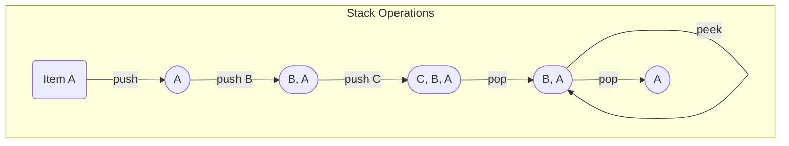

---
tags:
  - data_structures
  - concept
  - adt
  - linear
aliases:
  - Stack
  - LIFO
related:
  - Abstract_Data_Type
  - Data_Structure
  - Queue_ADT
  - Array_C
  - Linked_List_ADT
  - Function_Call_C
  - Stack_Memory_C
  - Recursion_C
worksheet:
  - WS7
date_created: 2025-04-14
---
# Stack (ADT)

## Definition

A **Stack** is a linear [[Abstract_Data_Type|Abstract Data Type (ADT)]] that follows the **LIFO (Last-In, First-Out)** principle. Elements can only be added (pushed) and removed (popped) from one end, called the **top** of the stack. The last element added is always the first one to be removed.

## Core Operations

-   **`push(item)`:** Adds an `item` to the top of the stack.
-   **`pop()`:** Removes and returns the item currently at the top of the stack. An error occurs if the stack is empty.
-   **`peek()`** (or `top()`): Returns the item at the top of the stack *without* removing it. An error occurs if the stack is empty.
-   **`isEmpty()`:** Returns true if the stack contains no elements, false otherwise.
-   **`size()`:** Returns the number of items currently in the stack. (Optional operation)
-   **`create()`:** Creates an empty stack. (Implicit operation)

## Key Aspects

- **LIFO Principle:** Last element added is the first one accessed/removed. Think of a stack of plates.
- **Restricted Access:** Access is limited to the top element.
- **Implementation:** Can be implemented using various concrete [[Data_Structure|data structures]]:
    - **[[Array_C]] / [[Vector_DS]]:** Simple and efficient if a maximum size is known or dynamic arrays are used. The "top" corresponds to the end of the array/vector. `push` is append, `pop` is remove from end (both typically O(1) or amortized O(1)). Can suffer from overflow if fixed-size array is used.
    - **[[Linked_List_ADT|Linked List]]:** More flexible regarding size. The "top" corresponds to the head of the list. `push` is insert at head, `pop` is remove from head (both O(1)).

## Visualization (Conceptual)

*Elements are added/removed from the right (Top).*

## Use Cases / Real-World Examples (WS7)

- **Function Call Stack:** The [[Stack_Memory_C|call stack]] used by programs to manage [[Function_Call_C|function calls]], local variables, and return addresses operates as a stack.
- **Undo/Redo Mechanisms:** Storing actions on a stack allows easy reversal (undo = pop). A separate redo stack might also be used.
- **Expression Evaluation:** Converting infix expressions to postfix (Reverse Polish Notation) and evaluating postfix expressions often uses stacks.
- **Backtracking Algorithms:** Used in algorithms like depth-first search (DFS) or solving mazes to keep track of paths taken.
- **Browser History:** The "Back" button often uses a stack to store previously visited pages.
- **Syntax Parsing:** Compilers use stacks for parsing programming language syntax.

## Related Concepts
- [[Abstract_Data_Type]], [[Data_Structure]]
- [[Queue_ADT]] (Contrast: FIFO)
- LIFO (Last-In, First-Out)
- Implementation using [[Array_C]], [[Vector_DS]], [[Linked_List_ADT]]
- [[Stack_Memory_C]] (System stack)

---
**Source:** Worksheet WS7