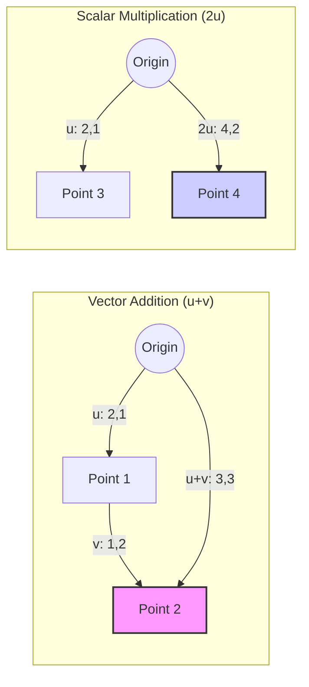

---
tags:
  - math
  - linear_algebra
  - concept
  - vector
aliases:
  - Mathematical Vector
  - Geometric Vector
related:
  - "[[Linear_Algebra]]"
  - "[[Matrix_Math]]"
  - "[[Dot_Product]]"
  - "[[Column_Vector]]"
  - "[[Row_Vector]]"
  - "[[Vector_DS]]]]"
  - "[[Array_C]]]]"
worksheet: [WS11]
date_created: 2025-04-21
---
# Vector (Mathematical)

## Definition

In mathematics and physics, a **Vector** is an object that has both **magnitude** (or length) and **direction**. Geometrically, it can be represented as a directed line segment (an arrow). Algebraically, in a coordinate system (like 2D or 3D space), a vector is often represented as an ordered list or array of numbers called **components** or **coordinates**.

*Note: This is distinct from the [[Vector_DS|Vector data structure]] (dynamic array), although dynamic arrays are often used to store the components of mathematical vectors.*

## Representation

- **Geometrically:** An arrow from a starting point to an ending point.
- **Algebraically (Components):**
    - Row Vector: `[x, y, z]`
    - [[Column_Vector|Column Vector]]:
```latex
\begin{bmatrix} x \\ y \\ z \end{bmatrix}
```
- The number of components defines the vector's **dimension**.

## Key Operations

- **Addition:** Adding two vectors results in a new vector found by adding corresponding components (geometrically, placing vectors head-to-tail).
  `[x1, y1] + [x2, y2] = [x1+x2, y1+y2]`
- **Scalar Multiplication:** Multiplying a vector by a scalar (a single number) scales its magnitude. Direction is reversed if the scalar is negative.
  `c * [x, y] = [c*x, c*y]`
- **Magnitude (Norm):** The length of the vector. For a vector `v = [x, y, z]`, the Euclidean norm (L2 norm) is `||v|| = sqrt(x^2 + y^2 + z^2)`.
- **[[Dot_Product|Dot Product]] (Inner Product):** `v · w = x1*x2 + y1*y2 + z1*z2`. Result is a scalar. Related to the angle between vectors: `v · w = ||v|| * ||w|| * cos(theta)`.
- **Cross Product (3D only):** Produces a new vector perpendicular to the two input vectors.

## Visualization (2D Vectors)

## Use Cases

- Physics: Representing forces, velocities, accelerations, fields.
- Computer Graphics: Representing positions, directions, colors.
- AI/Data Science: Representing data points (feature vectors), weights in models, embeddings.
- Engineering: Many applications involving quantities with magnitude and direction.

## Related Concepts

- [[Linear_Algebra]]
- [[Matrix_Math]] (Vectors can be seen as single-row or single-column matrices)
- [[Dot_Product]]
- [[Column_Vector]] (Common representation in matrix operations)
- [[Row_Vector]]
- [[Vector_DS]] (Data structure often used to store vector components) 

---

**Source:** Worksheet WS11