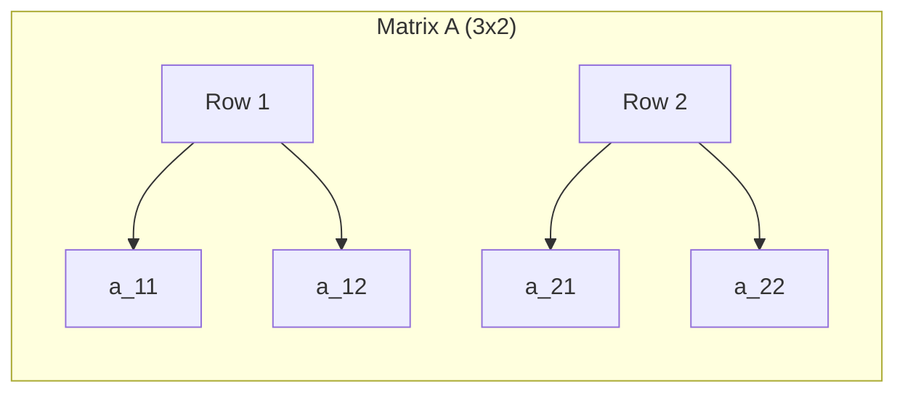

**File: `50_Data_Structures/Linear_Algebra.md`**
*(Use `T_Concept.md` template)*

```markdown
---
tags: [data_structures, math, concept, linear_algebra]
aliases: []
related: [Vector_Math, Matrix_DS, Dot_Product, Matrix_Operations, Determinant, Inverse_Matrix]
worksheet: [WS11]
date_created: 2025-04-21
---
# Linear Algebra

## Definition

**Linear Algebra** is a branch of mathematics concerning vector spaces and linear mappings between such spaces. It includes the study of lines, planes, and subspaces, but is also concerned with properties common to all vector spaces. Key objects of study include [[Vector_Math|vectors]], [[Matrix_DS|matrices]], systems of linear equations, linear transformations, eigenvalues, and eigenvectors.

## Relevance to AI/Data Science

Linear algebra is fundamental to many areas of AI, machine learning, and data science:
- **Data Representation:** Datasets are often represented as matrices (rows = samples, columns = features). Images can be represented as matrices of pixel values.
- **Machine Learning Algorithms:** Many algorithms rely heavily on matrix operations:
    - Linear Regression
    - Principal Component Analysis (PCA) ([[Dimensionality_Reduction]])
    - Support Vector Machines (SVM)
    - [[Neural_Networks]] (weights, activations, backpropagation involve matrix/vector math)
- **Dimensionality Reduction:** Techniques like PCA and SVD use linear algebra concepts.
- **Natural Language Processing (NLP):** Word embeddings (like Word2Vec, GloVe) represent words as vectors; document similarity can involve vector operations.
- **Computer Vision:** Image transformations (scaling, rotation, translation) are represented by matrices.

## Core Concepts Covered (WS11)
- [[Vector_Math]]
- [[Matrix_DS]]
- [[Dot_Product]]
- [[Matrix_Operations]] (Addition, Subtraction, Multiplication)
- [[Identity_Matrix]]
- [[Inverse_Matrix]]
- [[Determinant]]
- [[Trace]]
- Properties: [[Distributive_Law_Matrix]], [[Commutativity_Matrix]], [[Associativity_Matrix]]

## Related Concepts (Broader)
- Vector Spaces
- Linear Transformations
- Eigenvalues and Eigenvectors
- Singular Value Decomposition (SVD)

---
**Source:** Worksheet WS11
```

**File: `50_Data_Structures/Vector_Math.md`**
*(Use `T_Concept.md` template)*

```markdown
---
tags: [data_structures, math, concept, linear_algebra]
aliases: [Vector (Mathematical), Geometric Vector]
related: [Linear_Algebra, Matrix_DS, Column_Vector, Dot_Product, Vector_DS] # Note: Distinguish from DS Vector
worksheet: [WS11]
date_created: 2025-04-21
---
# Vector (Mathematical Context)

## Definition

In the context of [[Linear_Algebra]], a **Vector** is typically an ordered list (or tuple) of numbers, called components or elements. Geometrically, a vector can be represented as an arrow in space having both magnitude (length) and direction. Vectors are fundamental elements of vector spaces.

*(Note: This is distinct from the [[Vector_DS|Vector data structure]], which is a dynamic array).*

## Representation

- **As a list/tuple:** `v = (v1, v2, ..., vn)`
- **As a [[Column_Vector]]:** (Common in linear algebra texts and ML)
  ```
  [ v1 ]
  [ v2 ]
  [ .. ]
  [ vn ]
  ```
- **As a Row Vector:** `[ v1 v2 ... vn ]`

## Key Operations

- **Addition/Subtraction:** Performed element-wise. Vectors must have the same dimension.
  `(a1, a2) + (b1, b2) = (a1+b1, a2+b2)`
- **Scalar Multiplication:** Multiplying a vector by a scalar (a single number) multiplies each component.
  `c * (v1, v2) = (c*v1, c*v2)`
- **Magnitude (Norm):** Length of the vector. For Euclidean norm (L2 norm): `||v|| = sqrt(v1^2 + v2^2 + ... + vn^2)`
- **[[Dot_Product]]:** Operation between two vectors of the same dimension, resulting in a scalar.

## Visualization (2D Vector)

```mermaid
graph TD
    subgraph 2D Space
        Origin((0,0));
        Point(v=(3,2```markdown
---
tags: [math, linear_algebra, concept, core]
aliases: []
related: [Vector_Math, Matrix_Math, Dot_Product, Matrix_Operations, Matrix_Determinant, Matrix_Inverse]
worksheet: [WS11]
date_created: 2025-04-21
---
# Linear Algebra

## Definition

**Linear Algebra** is a branch of mathematics concerning linear equations, linear maps (transformations), and their representations in vector spaces and through matrices. It is fundamental to many areas of science, engineering, computer graphics, machine learning, and data science.

## Core Concepts

Key objects and operations in linear algebra include:

-   **[[Vector_Math|Vectors]]:** Geometric objects with magnitude and direction, often represented as arrays of numbers (coordinates). Used to represent points, displacements, features, etc.
-   **Vector Spaces:** Collections of vectors where operations like vector addition and scalar multiplication are defined and follow certain axioms.
-   **[[Matrix_Math|Matrices]]:** Rectangular arrays of numbers, symbols, or expressions, arranged in rows and columns. Used to represent linear transformations, systems of linear equations, and datasets.
-   **Linear Transformations:** Functions between vector spaces that preserve vector addition and scalar multiplication (e.g., rotation, scaling, shearing). Matrices provide a way to represent these transformations.
-   **Systems of Linear Equations:** Sets of equations involving linear combinations of variables. Linear algebra provides methods (like Gaussian elimination, matrix inversion) to solve such systems.
-   **[[Matrix_Operations|Matrix Operations]]:** Addition, scalar multiplication, matrix multiplication, transpose.
-   **[[Dot_Product|Dot Product]] (Inner Product):** An operation on two vectors yielding a scalar value, related to the angle between them and their magnitudes.
-   **[[Matrix_Determinant|Determinants]]:** A scalar value associated with a square matrix, indicating properties like invertibility and scaling factor of the corresponding linear transformation.
-   **[[Matrix_Inverse|Matrix Inverse]]:** For some square matrices, an inverse matrix exists which, when multiplied by the original matrix, yields the [[Identity_Matrix]]. Used for solving linear systems.
-   Eigenvalues and Eigenvectors: Special vectors whose direction is unchanged by a linear transformation, only scaled by a factor (the eigenvalue). Crucial for understanding transformations and in algorithms like Principal Component Analysis (PCA). (*Placeholder - add if covered later*)

## Relevance to AI/Data Science

Linear algebra is essential for:
- Representing data (feature vectors, datasets as matrices).
- Dimensionality reduction techniques (PCA, SVD).
- Machine learning algorithms (linear regression, support vector machines, neural network weight matrices).
- Optimization problems.
- Computer graphics and image processing.

## Related Concepts
- [[Vector_Math]]
- [[Matrix_Math]]
- [[Matrix_Operations]]
- [[Matrix_Determinant]]
- [[Matrix_Inverse]]
- Calculus (often used alongside linear algebra in optimization)
- Probability & Statistics (used in data analysis and ML models)

---
**Source:** Worksheet WS11
```


```d2
origin: [0, 0]
v_end: [3, 2]

arrow: origin -> v_end {
  stroke-width: 4File: `50_Data_Structures/Vector_Math.md`**
*(Use `T_Concept.md` template)*

  label: "v = (3, 2)"
}

origin_label: "(0,0)" { near: origin; font-size: 10; }
v_label: "(3,2)" { near: v_end; font-size: 10; }

grid: {
  grid-gap: 1
  style: {
    stroke: lightgray
    stroke-dash: 2
  }
}

```

---
````
---
tags: [math, linear_algebra, concept, vector]
aliases: [Mathematical Vector, Geometric Vector]
related: [Linear_Algebra, Matrix_Math, Dot_Product, Column_Vector, Vector_DS, Array_C]
worksheet: [WS11]
date_created: 2025-04-21
---
# Vector (Mathematical)

## Definition

In mathematics and physics, a **Vector** is an object that has both **magnitude** (or length) and **direction**. Geometrically, it can be represented as a directed line segment (an arrow). Algebraically, in a coordinate system (like 2D or 3D space), a vector is often represented as an ordered list or array of numbers called **components** or **coordinates**.

*Note: This is distinct from the [[Vector_DS|Vector data structure]] (dynamic array), although dynamic arrays are often used to store the components of mathematical vectors.*

## Representation

- **Geometrically:** An arrow from a starting point to an ending point.
- **Algebraically (Components):**
    - Row Vector: `[x, y, z]`
    - [[Column_Vector|Column Vector]]:
      ```
      [ x ]
      [ y ]
      [ z 3] { style.stroke: black }
	  ```

## Related Concepts
- [[Linear_Algebra]]
- [[Matrix_DS]] (Vectors can be seen as single-column/row matrices)
- [[Column_Vector]] (Common representation)
- [[Dot_Product]]
- Vector Space
- [[Vector_DS]] (The dynamic array data structure - different concept)

---
**Source:** Worksheet WS11
````

)*

 ]
      ```
    - The number of components defines the vector's **dimension**.

## Key Operations

- **Addition:** Adding two vectors results in a new vector found by adding corresponding components (geometrically, placing vectors head-to-tail).
  `[x1, y1] + [x2, y2] = [x1+x2, y1+y2]`
- **Scalar Multiplication:** Multiplying a vector by a scalar (a single number) scales its magnitude. Direction is reversed if the scalar is negative.
  `c * [x, y] = [c*x, c*y]`
- **Magnitude (Norm):** The length of the vector. For a vector `v = [x, y, z]`, the Euclidean norm (L2 norm) is `||v|| = sqrt(x^2 + y^2 + z^2)`.
- **[[Dot_Product|Dot Product]] (Inner Product):** `v · w = x1*x2 + y1*y2 + z1*z2`. Result is a scalar. Related to the angle between vectors: `v · w = ||v|| * ||w|| * cos(theta)`.
- **Cross Product (3D only):** Produces a new vector perpendicular to the two input vectors.

## Visualization (2D Vectors)

```mermaid
graph TD
    subgraph "Vector Addition (u+v)"
        direction LR
        O((Origin)) -- u [2, 1] --> P1;
        P1 -- v [1, 2] --> P2;
        O -- u+v [3, 3] --> P2;
        style P2 fill:#f9f,stroke:#333,stroke-width:2px
    end
    subgraph "Scalar Multiplication (2u)"
         direction LR
         O2((Origin)) -- u [2, 1] --> P3;
         O2 -- 2u [4, 2] --> P4;
```

---

```

**File: `50_Data_px
    end
Structures/Matrix_DS.md`**
*(Use `T_Concept```

## Use Cases

- Physics: Representing forces, velocities, accelerations, fields.
- Computer Graphics: Representing positions, directions, colors.
- AI/Data Science: Representing data points (feature vectors), weights in models, embeddings.
- Engineering: Many applications involving quantities with magnitude and direction.

## Related Concepts
- [[Linear_Algebra]]
- [[Matrix_Math]] (Vectors can be seen as single-row or single-column matrices)
- [[Dot_Product]]
- [[Column_Vector]] (Common representation in matrix operations)
- [[Vector_DS]] (Data structure often used to store vector components)

---
**Source:** Worksheet WS11
```

**.md` template)*

File: `50_Data_Structures/Dot_Product.md`**
*(Use `T_Concept.md` template)*

```markdown
---
tags: [data_structures, math, concept, linear_algebra, implementation]
aliases: [Matrix, Matrices]
related: [Linear_Algebra, Vector_Math, Column_Vector, Row_Vector, Matrix_Operations, Square_Matrix, Identity_Matrix, Inverse_Matrix, Determinant, Trace, Array_C, Multidimensional_Array_C]
worksheet: [WS11]
date_created: 2025-04-21
---
# Matrix

## Definition

A **Matrix** is a rectangular array or table of numbers, symbols, or expressions, arranged in **rows** and **columns**. Matrices are fundamental objects in [[Linear_Algebra]] and are used to represent linear transformations, systems of linear equations, and store data in a structured way.

## Representation

An `m × n` matrix (read "m by n") has `m` rows and `n` columns:

```
      Col 1   Col 2  ...  Col n
Row 1 [ A11     A12    ...   A1n  ]
Row 2 [ A21     A22    ...   A2n  ]
  ... [ ...     ...    ...   ...  ]
Row m [ Am1     Am2    ...   Amn  ]
```
- `Aij` represents the element in the `i`-th row and `j`-th column.

## Key Aspects

- **Dimensions:** Defined by the number of rows (`m`) and columns (`n`).
- **Elements:** The individual entries within the matrix.
- **Special Types:**
    - [[Vector_Math|Vector]]: Can be seen as a matrix with only one column ([[Column_Vector]]) or one row (Row Vector).
    - [[Square_Matrix]]: Number of rows equals number of columns (`m = n`).
    - [[Identity_Matrix]]: A square matrix with 1s on the main diagonal and 0s elsewhere.
    - Zero Matrix: All elements are 0.
    - Diagonal Matrix: Non-zero elements only on the main diagonal.
- **Operations:** [[Matrix_Operations]] include addition, subtraction, scalar multiplication, matrix multiplication, transpose, finding the [[Determinant]] and [[Inverse_Matrix]] (for square matrices), and calculating the [[Trace]].
- **Implementation:** In programming, matrices are often implemented using 2D arrays ([[Multidimensional_Array_C]]) or sometimes arrays of pointers to arrays, especially if dynamically sized. Libraries like NumPy (Python) or Eigen (C++) provide optimized matrix implementations.

## Visualization (3x2 Matrix)

``````markdown
---
tags: [math, linear_algebra, concept, vector, operation]
aliases: [Scalar Product, Inner Product]
related: [Vector_Math, Linear_Algebra, Matrix_Operations]
worksheet: [WS11]
date_created: 2025-04-21
---
# Dot Product

## Definition

The **Dot Product** (also known as the **Scalar Product** or sometimes Inner Product in Euclidean space) is an algebraic operation that takes two equal-length sequences of numbers (usually coordinate [[Vector_Math|vectors]]) and returns a single **scalar** number.

## Calculation

For two vectors `a = [a1, a2, ..., an]` and `b = [b1, b2, ..., bn]`, the dot product `a · b` is calculated as:

`a · b = Σ (ai * bi) = a1*b1 + a2*b2 + ... + an*bn`

## Geometric Interpretation

Geometrically, the dot product is related to the angle (`θ`) between the two vectors and their magnitudes (lengths, `||a||` and `||b||`):

`a · b = ||a|| * ||b|| * cos(θ)`

This implies:
- If `a · b = 0`, the vectors are orthogonal (perpendicular), assuming non-zero vectors.
- If `a · b > 0`, the angle between them is acute (< 90°).
- If `a · b < 0`, the angle between them is obtuse (> 90°).
- `a · a = ||a||^2` (The dot product of a vector with itself is the square of its magnitude).

## Properties

- **Commutative:** `a · b = b · a`
- **Distributive over vector addition:** `a · (b + c) = a · b + a · c`
- **Bilinear:** `(c*a) · b = a · (c*b) = c * (a · b)` for scalar `c`.

## Example Calculation

Let `a = [1, 2, 3]` and `b = [4, -5, 6]`

`a · b = (1 * 4) + (2 * -5) + (3 * 6)`
`a · b = 4 - 10 + 18`
`a · b = 12`

## Use Cases

- Calculating the angle between two vectors.
- Projecting one vector onto another.
- Checking for orthogonality (perpendicularity).
- Used extensively in physics (e.g., calculating work: Work = Force · Displacement).
- Core operation in machine learning (e.g., calculating weighted sums in neural networks, similarity measures like cosine similarity).

## Related Concepts
- [[Vector_Math]]
- [[Linear_Algebra]]
- [[Matrix_Operations]] (Dot products are fundamental to matrix multiplication)
- Vector Magnitude (Norm)
- Orthogonality

---
**Source:** Worksheet WS11
```d

**File: `50_Data_Structures/Matrix_Math.md`**
*(Use 2
# Matrix A (3 rows, 2 columns)
shape: square

# Define elements using grid layout implicitly
A_11: 5
A_12: 2
A_21: -1
A_22: 0
A_31: 7`T_Concept.md` template)*


A_32: 3

# Arrange in grid
{
  direction: right
  1: { direction: down; 11: A_11; 21: A_21; 31: A_31 }
  2: { direction: down; 12: A_12; 22: A_22; 32: A_3```markdown
---
tags: [math, linear_algebra, concept, matrix, data_structure]
aliases: [Matrices]
related: [Linear_Algebra, Vector_Math, Matrix_Operations, Square_Matrix, Identity_Matrix, Column_Vector, Row_Vector, Matrix_DS]
worksheet: [WS11]
date_created: 2025-04-21
---
# Matrix (Mathematical)

## Definition

A **Matrix** is a rectangular array or table of numbers, symbols, or expressions, arranged in **rows** and **columns**. Matrices are fundamental objects in [[Linear_Algebra]] used to represent linear transformations, systems of linear equations, datasets, and more.

## Representation

A matrix `A` with `m` rows and `n` columns (an `m x n` matrix) is typically written as:

```2 }
}

style: {
  font-size: 14
      [ a_11  a_
  stroke-width: 0 # Hide cell borders if desired
}

# Add brackets (approximate)
left_bracket: "[" { style12  ...  a_1n ]
      [ a_21  a_22.font-size: 60; style.stroke-width: 0 }
right_bracket: "]" { style.font-size: 60; style.stroke-  ...  a_2n ]
A =   [  ...   ...  ...   ... ]
      [ a_m1  a_m2  ...  awidth: 0 }
left_bracket -> 1 { style.stroke-width: 0 }
2 -> right_bracket { style.stroke-width: 0 }
```
*Note: D2/Mermaid might not be ideal for perfect matrix bracket rendering.*

Using LaTeX:
```latex
$$
A =
\begin{bmatrix}
5 & 2 \\
-1 & 0 \\
7 & 3
\end{bmatrix}
$$
```

## Use Cases

- Solving systems of linear equations.
- Representing linear transformations (rotation, scaling, shearing).
- Storing data (datasets in ML, adjacency matrices for graphs, pixel data in images).
- Markov chains.
- Quantum mechanics.
- Computer graphics.

## Related Concepts
- [[Linear_Algebra]]
- [[Vector_Math]], [[Column_Vector]]
- [[Matrix_Operations]]
- Special types: [[Square_Matrix]], [[Identity_Matrix]], [[Inverse_Matrix]]
- Properties: [[Determinant]], [[Trace]]
- Implementation: [[Array_C]], [[Multidimensional_Array_C]]

---
**Source:** Worksheet WS11
```_mn ]
```
- `a_ij` represents the element in the `i`-th row and `j`-th column.

## Key Terminology & Types

- **Dimensions:** `m x n` (rows x columns).
- **Elements/Entries:** The individual items `a_ij` within the matrix.
- **[[Square_Matrix|Square Matrix]]:** A matrix where the number of rows equals the number of columns (`m = n`).
- **[[Column_Vector|Column Vector]]:** A matrix with only one column (`n = 1`).
- **Row Vector:** A matrix with only one row (`m = 1`).
- **[[Identity_Matrix|Identity Matrix (I)]]:** A square matrix with `1`s on the main diagonal (top-left to bottom-right) and `0`s elsewhere. Acts as the multiplicative identity.
- **Zero Matrix:** A matrix where all elements are `0`.
- **Diagonal Matrix:** A square matrix where all off-diagonal elements are `0`.
- **Transpose (`A^T`):** A matrix obtained by swapping the rows and columns of matrix `A`. If `A` is `m x n`, `A^T` is `n x m`, and `(A^T)_ij = A_ji`.

## Visualization (3x2 Matrix)




**File: `50_Data_Structures/Square_Matrix.md`**
*(Use `T_Concept.md` template)*```markdown
````markdown


**File: `50_Data_Structures/Identity_Matrix.md`**
*(Use `T_Concept.md` template)*

```markdown
---
tags: [data_structures, math, concept, linear_algebra, matrix]
aliases: [Unit Matrix, I]
related: [Linear_Algebra, Matrix_DS, Square_Matrix, Inverse_Matrix, Matrix_Multiplication]
worksheet: [WS11]
date_created: 2025-04-21
---
# Identity Matrix

## Definition

The **Identity Matrix** (often denoted as **I**, or **I<sub>n</sub>** to specify its dimension) is a special [[Square_Matrix|square matrix]] where all the elements on the **main diagonal** are **1**s, and all other elements are **0**s.

## Representation

The `n × n` identity matrix I<sub>n</sub> has elements `Iij` such that:
- `Iij = 1` if `i = j` (on the main diagonal)
- `Iij = 0` if `i ≠ j` (off the main diagonal)

**Examples:**
I<sub>2</sub> (2x2):
```latex
$$```markdown
---
tags: [math, linear_algebra, concept, matrix]
aliases: []
related: [Matrix_Math, Linear_Algebra, Identity_Matrix, Matrix_Determinant, Matrix_Inverse, Matrix_Trace, Diagonal_Matrix]
worksheet: [WS11]
date_created: 2025-04-21
---
# Square Matrix

## Definition

A **Square Matrix** is a [[Matrix_Math|matrix]] with the same number of **rows** and **columns**. An `n x n` matrix is a square matrix of order `n`.

## Key Aspects / Characteristics

- **Equal Rows and Columns:** `m = n`.
- **Main Diagonal:** The elements from the top-left corner to the bottom-right corner (`a_ii`, where row index equals column index) form the main diagonal.
- **Special Properties:** Many important concepts and operations in linear algebra are defined specifically for square matrices, including:
    - **[[Matrix_Determinant|Determinant]]:** A scalar value associated with the matrix.
    - **[[Matrix_Inverse|Inverse]]:** A matrix `A^-1` such that `A * A^-1 = A^-1 * A = I` (the [[Identity_Matrix]]). Only exists if the determinant is non-zero.
    - **[[Matrix_Trace|Trace]]:** The sum of the elements on the main diagonal.
    - Eigenvalues and Eigenvectors.
    - Matrix powers (`A^2`, `A^3`, etc.).
- **[[Identity_Matrix]]:** The identity matrix `I` is always a square matrix.
- **Diagonal Matrix:** A square matrix where all off-diagonal elements are zero.

## Examples (Order 3)

```
I_2 =
\begin{bmatrix}
1 & 0 \\

      [ 1  2  3 ]0 & 1
\end{bmatrix}
$$

A =   [ 4  5  6 ]
      [ 7```
I<sub>3</sub> (3x3):
```latex
$$
I_3 =
\begin{bmatrix  8  9 ]
```
- Main Diagonal: 1, 5, 9

```}
1 & 0 & 0 \\
0 & 1 & 0 \\
0 &
      [ 1  0  0 ]
I =   [ 0  1  0 ]  (Identity Matrix, Order 3)
      [ 0  0  1 ]
```

```
      [ 7  0  0 ]
D 0 & 1
\end{bmatrix}
$$
```

## Key Properties

- **Multiplicative Identity:** The identity matrix acts as the multiplicative identity in [[Matrix_Multiplication]]. For any `m × n` matrix `A`, and the appropriately sized identity matrices `Im` and `In`:
    - `Im * A = A`
    - `A * In = A`
- **Inverse Property:** For an invertible [[Square_Matrix]] `A`, its [[Inverse_Matrix]] `A^-1` satisfies `A * A^-1 = A^-1 * A = I`.
- **Determinant:** The [[Determinant]] of any identity matrix is 1.
- **Trace:** The [[Trace]] of an `n × n` identity matrix is `n`.

## Importance & Use Cases (WS11)

The identity matrix is important because:
- It acts like the number "1" in matrix multiplication. Multiplying by `I` doesn't change a matrix.
- It is the result of multiplying a matrix by its inverse, fundamental to solving linear equations (`Ax = b` -> `x = A^-1 * b`).
- It represents an identity transformation (a transformation that doesn't change vectors).
- It serves as a starting point for algorithms like Gaussian elimination when finding matrix inverses.

## Related Concepts
- [[Linear_Algebra]], [[Matrix_DS]], [[Square_Matrix]]
- [[Matrix_Multiplication]] (Identity property)
- [[Inverse_Matrix]] (Definition involves `I`)
- [[Determinant]], [[Trace]]

---
**Source:** Worksheet WS11
``` =   [ 0 -2  0 ]  (Diagonal Matrix, Order 3)
      [

**File:  0  0  5 ]
`50_Data_Structures/Inverse_Matrix.md`**
*(```

## Related Concepts
- [[Matrix_Math]], [[Linear_Algebra]]
- [[Identity_Matrix]], Diagonal Matrix
- [[Matrix_Determinant]], [[Matrix_Inverse]], [[Matrix_Trace]] (Operations/properties often specific to square matrices)

---
**Source:** Worksheet WS11
```Use `T_Concept.md` template)*


**File: `50_Data_Structures/Identity_Matrix.md`**
*(Use `T_Concept.md` template)*

```markdown
---
tags: [math, linear_algebra, concept, matrix, square_matrix]
aliases: [Unit Matrix, I]
related: [Matrix_Math, Square_Matrix, Linear_Algebra, Matrix_Operations, Matrix_Inverse]
worksheet: [WS11]
date_created: 2025-04-21
---
# Identity Matrix (I)

## Definition

The **Identity Matrix**, usually denoted by `I` (or `I_n` to specify its size), is a [[Square_Matrix|square matrix]] where all the elements on the **main diagonal** are `1`s, and all other elements (off-diagonal) are `0`s.

## Representation (Order n)

The `n x n` identity matrix `I_n` has elements `(I_n)_ij` such that:
- `(I_n)_ii = 1` (for `i = 1 to n`)
- `(I_n)_ij = 0` (for `i != j`)

## Examples

**I_2 (Order 2):**
```
[ 1  0 ]
[ 0  1 ]
```

**I_3 (Order 3):**
```
[ 1  0  0 ]
[ 0  1  0 ]
[ 0  0  1 ]
```

**I_4 (Order 4):**
```
[ 1  0  0  0 ]
[ 0  1  0  0 ]
[ 0  0  1  0 ]
[ 0  0  0  1 ]
```

## Key Properties

- **Multiplicative Identity:** The identity matrix acts as the neutral element for [[Matrix_Operations|matrix multiplication]]. For any `m x n` matrix `A`:
    - `I_m * A = A`
    - `A * I_n = A`
- **Inverse Relationship:** A square matrix `A` is invertible if and only if there exists a [[Matrix_Inverse|matrix inverse]] `A^-1` such that `A * A^-1 = A^-1 * A = I`.
- **Linear Transformations:** As a linear transformation, the identity matrix represents the identity function, which leaves every vector unchanged (`Ix = x`).
- **Determinant:** The [[Matrix_Determinant|determinant]] of any identity matrix is `1`.
- **Trace:** The [[Matrix_Trace|trace]] of `I_n` is `n`.

## Importance (WS11 Question)

>[!question] What is an identity matrix, and why is it important? (WS11)
> An **Identity Matrix (I)** is a square matrix with 1s on the main diagonal and 0s everywhere else. It is important because:
> 1.  **Multiplicative Identity:** It acts like the number '1' in scalar multiplication; multiplying any matrix `A` by an appropriately sized identity matrix `I` leaves `A` unchanged (`IA = A`, `AI = A`).
> 2.  **Definition of Inverse:** It is fundamental to the concept of the [[Matrix_Inverse]]. The inverse `A^-1` of a matrix `A` is defined by the property `A * A^-1 = A^-1 * A = I`.
> 3.  **Solving Linear Systems:** It represents the target matrix when solving systems of equations using methods like Gaussian elimination (transforming the augmented matrix `[A|b]` towards `[I|x]`).
> 4.  **Identity Transformation:** In terms of linear transformations, it represents the transformation that does nothing, leaving all vectors unchanged.

## Related Concepts
- [[Matrix_Math]], [[Square_Matrix]], [[Linear_Algebra]]
- [[Matrix_Operations]] (Especially multiplication)
- [[Matrix_Inverse]] (Defined relative to `I`)
- [[Matrix_Determinant]], [[Matrix_Trace]]

---
**Source:** Worksheet WS11
```

**File: ```markdown
---
tags: [data_structures, math, concept, linear_algebra, matrix]
aliases: [Matrix Inverse, Invertible Matrix, Nonsingular Matrix, A^-1]
related: [Linear_Algebra, Matrix_DS, Square_Matrix, Identity_Matrix, Determinant, Matrix_Multiplication, Gaussian_Elimination, Adjugate_Matrix]
worksheet: [WS11]
date_created: 2025-04-21
---
# Inverse Matrix

## Definition

For a given [[Square_Matrix]] `A`, its **Inverse Matrix** (denoted as **A<sup>-1</sup>**) is another square matrix of the same dimension such that when multiplied by `A` (in either order), the result is the [[Identity_Matrix]] `I`.

`A * A^-1 = A^-1 * A = I`

A square matrix that *has* an inverse is called **invertible** or **nonsingular**. A matrix that does *not* have an inverse is called **non-invertible** or **singular**.

## Key Aspects / Characteristics

- **Only for Square Matrices:** Only [[Square_Matrix|square matrices]] can potentially have an inverse.
- **Existence Condition:** A square matrix `A` is invertible **if and only if** its [[Determinant]] is non-zero (`det(A) ≠ 0`). If `det(A) = 0`, the matrix is singular and has no inverse.
- **Uniqueness:** If a matrix inverse exists, it is unique.
- **Finding the Inverse:** Common methods include:
    - **Gaussian Elimination:** Augmenting the matrix `A` with the identity matrix `I` (forming `[A | I]`) and performing row operations to transform `A` into `I`. The same row operations transform `I` into `A^-1` (resulting in `[I | A^-1]`).
    - **Adjugate Matrix / Determinant Method:** `A^-1 = (1 / det(A)) * adj(A)`, where `adj(A)` is the adjugate (or classical adjoint) of `A`, which is the transpose of the cofactor matrix of `A`. This is often computationally expensive for larger matrices compared to Gaussian elimination. See [Matrix Inverse using Minors, Cofactors and Adjugate](https://www.mathsisfun.com/algebra/matrix-inverse-minors-cofactors-adjugate.html).
- **Properties:**
    - `(A^-1)^-1 = A`
    - `(A * B)^-1 = B^-1 * A^-1` (Note the reversed order)
    - `(A^T)^-1 = (A^-1)^T` (Inverse of transpose is transpose of inverse)
    - `(k * A)^-1 = (1/k) * A^-1` for non-zero scalar `k`.

## Use Cases

- **Solving Systems of Linear Equations:** If `Ax = b` represents a system of equations and `A` is invertible, the unique solution is `x = A^-1 * b`.
- **Undoing Linear Transformations:** If `A` represents a transformation, `A^-1` represents the inverse transformation.
- **Calculating Matrix Powers:** Can be used with diagonalization.

## Visualization (Concept)

````50_Data_Structures/Matrix_Inverse.md`**
*(mermaid
graph LR
    A(Matrix A) -- Multiply --> I(Identity Matrix I);
    I -- Multiply --> A;
    A -- InverseUse `T_Concept.md` template)*

 --> A_inv(Inverse A⁻¹);
    A_inv -- Inverse --> A;
    A -- Multiply by A⁻¹ --> I;
    A_inv -- Multiply by A --> I;
```

## Related Concepts
- [[Linear_Algebra]], [[Matrix_DS]], [[Square_Matrix]]
- [[Identity_Matrix]] (Result of `A * A^-1`)
- [[Determinant]] (Determines invertibility)
- [[Matrix_Multiplication]]
- Methods: Gaussian Elimination, Adjugate Matrix
- Singular Matrix (Non-invertible)

## Questions / Further Study
>[!question] What does it mean for a matrix to be invertible, and how can you find the inverse? (WS11)
> - **Meaning:** A [[Square_Matrix]] is invertible if there exists another matrix (its inverse) which, when multiplied by the original matrix, yields the [[Identity_Matrix]]. This implies the matrix represents a reversible linear transformation and that systems of equations involving the matrix have a unique solution. A matrix is invertible if and only if its [[Determinant]] is non-zero.
> - **Finding Inverse:** Common methods are Gaussian elimination (augmenting with `I` and row-reducing `A` to `I`) or using the formula `A^-1 = (1 / det(A)) * adj(A)` involving the adjugate matrix.

---
**Source:** Worksheet WS11
```

**File: `50_Data_Structures/Distributive_Law_Matrix.md`**
*(Use `T_Concept.md` template)*

```markdown
---
tags: [math, linear_algebra, concept, matrix, square_matrix, operation]
aliases: [Inverse Matrix, Matrix Inversion, Invertible Matrix, Non-singular Matrix]
related: [Matrix_Math, Square_Matrix, Identity_Matrix, Matrix_Determinant, Matrix_Operations, Linear_Equations]
worksheet: [WS11]
date_created: 2025-04-21
---
# Matrix Inverse

## Definition

For a given [[Square_Matrix|square matrix]] `A`, its **Inverse Matrix** (if it exists) is another square matrix of the same size, denoted `A^-1`, such that their product (in either order) results in the [[Identity_Matrix|identity matrix `I`]].

`A * A^-1 = A^-1 * A = I`

A square matrix that has an inverse is called **invertible** or **non-singular**. A matrix that does not have an inverse is called **non-invertible** or **singular**.

## Key Aspects / Characteristics

- **Square Matrices Only:** Only square matrices can have inverses (in the standard definition).
- **Existence Condition:** A square matrix `A` is invertible if and only if its [[Matrix_Determinant|determinant]] is non-zero (`det(A) != 0`). If `det(A) = 0`, the matrix is singular and has no inverse.
- **Uniqueness:** If a matrix has an inverse, that inverse is unique.
- **Finding the Inverse:** Methods for finding the inverse include:
    - **Gaussian Elimination (Gauss-Jordan):** Augment the matrix `A` with the identity matrix `[A | I]` and perform row operations to transform `A` into `I`. The right side will then be transformed into `A^-1`, resulting in `[I | A^-1]`.
    - **Adjugate Matrix / Cofactor Method:** `A^-1 = (1 / det(A)) * adj(A)`, where `adj(A)` is the adjugate (or classical adjoint) of A, which is the transpose of the cofactor matrix of A. This is computationally expensive for larger matrices. (See WS11 Research link).
    - **Special Case (2x2 Matrix):**
      For `A = [ [a, b], [c, d] ]`,
      `A^-1 = (1 / (ad - bc)) * [ [d, -b], [-c, a] ]`
      (Note: `ad - bc` is the determinant).
- **Solving Linear Systems:** If `A` is invertible, the unique solution to the system of linear equations `Ax = b` is given by `x = A^-1 * b`. However, directly computing the inverse is often less efficient and numerically stable than using methods like Gaussian elimination to solve the system directly.

## Importance & Use Cases

- Solving systems of linear equations (`x = A^-1 * b`).
- Representing the inverse of a linear transformation.
- Used in various calculations in statistics, optimization, computer graphics, etc.

## Questions / Further Study
>[!question] What does it mean for a matrix to be invertible, and how can you find the inverse? (WS11)
> - **Meaning:** A [[Square_Matrix|square matrix]] `A` is **invertible** (or non-singular) if there exists another matrix `A^-1` such that multiplying them together yields the [[Identity_Matrix]] (`A * A^-1 = A^-1 * A = I`). Geometrically, it means the linear transformation represented by `A` can be undone or reversed by `A^-1`. A matrix is invertible if and only if its [[Matrix_Determinant|determinant]] is non-zero.
> - **How to Find:**
>     1.  **Gauss-Jordan Elimination:** Augment `A` with `I` to get `[A | I]`, then use elementary row operations to transform the left side (`A`) into `I`. The right side will become `A^-1`.
>     2.  **Adjugate/Cofactor Method:** Calculate the determinant `det(A)`. If non-zero, find the matrix of cofactors, transpose it to get the adjugate matrix `adj(A)`, and then `A^-1 = (1 / det(A)) * adj(A)`. (Practical mainly for small matrices).
>     3.  **Formula for 2x2:** Use the specific formula involving swapping diagonal elements, negating off-diagonal elements, and dividing by the determinant.

---
**Source:** Worksheet WS11
```

**File: `50_Data_Structures/Matrix_Determinant.md`**
*(Use```markdown
---
tags: [math, concept, linear_algebra, matrix, property, matrix_operations]
aliases: [Matrix Distributivity]
related: [Linear_Algebra, Matrix_DS, Matrix_Operations, Matrix_Addition, Matrix_Multiplication]
worksheet: [WS11]
date_created: 2025-04-21
---
# Distributive Law (Matrices)

## Definition

The **Distributive Law** (or Distributivity) in the context of matrices describes how [[Matrix_Multiplication]] interacts with [[Matrix_Addition|matrix addition]]. Matrix multiplication distributes over matrix addition, provided the matrix dimensions are compatible for the operations involved.

## Laws

There are two distributive laws for matrices:

1.  **Left Distributivity:** `A * (B + C) = A * B + A * C`
    - Requires `A` to be compatible for multiplication with `B` and `C` (number of columns in `A` = number of rows in `B` = number of rows in `C`).
    - Requires `B` and `C` to have the same dimensions so they can be added.

2.  **Right Distributivity:** `(A + B) * C = A * C + B * C`
    - Requires `A` and `B` to have the same dimensions so they can be added.
    - Requires `A` and `B` to be compatible for multiplication with `C` (number of columns in `A` = number of columns in `B` = number of rows in `C`).

## Importance

These laws are fundamental properties used in algebraic manipulation of matrix expressions, similar to how distributivity works with regular numbers (`a * (b + c) = a*b + a*c`). They are essential for simplifying expressions and solving matrix equations.

## Related Concepts
- [[Linear_Algebra]], [[Matrix_DS]]
- [[Matrix_Operations]], [[Matrix_Addition]], [[Matrix_Multiplication]]
- [[Commutativity_Matrix]] (Matrix multiplication is generally *not* commutative)
- [[Associativity_Matrix]]

## Questions / Further Study
>[!question] Describe the distributive, commutative and associative properties of matrix operations. (WS11)
> - **Distributive:** Matrix multiplication distributes over matrix addition: `A(B+C) = AB + AC` and `(A+B)C = AC + BC` (see above).
> - **[[Commutativity_Matrix|Commutative]]:**
>     - Matrix *addition* IS commutative: `A + B = B + A`.
>     - Matrix *multiplication* IS **NOT** generally commutative: `A * B ≠ B * A` (except for special cases, e.g., if one is the [[Identity_Matrix]] or the [[Inverse_Matrix]] of the other, or if both are diagonal).
> - **[[Associativity_Matrix|Associative]]:**
>     - Matrix *addition* IS associative: `(A + B) + C = A + (B + C)`.
>     - Matrix *multiplication* IS associative: `(A * B) * C = A * (B * C)`.

---
**Source:** Worksheet WS11
```

**File:  `T_Concept.md` template)*

`50_Data_Structures/Commutativity_Matrix.md`**
*(Use `T_Concept.md` template)*

```markdown
---
tags: [math, concept, linear_algebra, matrix, property, matrix_operations]
aliases: [Matrix Commutativity]
related: [Linear_Algebra, Matrix_DS, Matrix_Operations, Matrix_Addition, Matrix_Multiplication, Distributive_Law_Matrix, Associativity_Matrix]
worksheet: [WS11]
date_created: 2025-04-21
---
# Commutativity (Matrices)

## Definition

**Commutativity** is a property of binary operations where changing the order of the operands does not change the result (i.e., `a op b = b op a`). In the context of matrices:

-   **Matrix Addition IS Commutative:** For any two matrices `A` and `B` of the same dimensions:
    `A + B = B + A`

-   **Matrix Multiplication IS *NOT* Generally Commutative:** For two matrices `A` and `B` where the product `A * B` is defined, the product `B * A` may not even be defined (if dimensions don't match appropriately). Even if both `A * B` and `B * A` are defined (e.g., if `A` and `B` are [[Square_Matrix|square matrices]] of the same order), it is generally **not true** that `A * B = B * A`.

## Example (Non-Commutativity of Multiplication)

Let:
```latex
$$
A =
\begin{bmatrix}
1 & 2 \\
3 & 4
\end{bmatrix}
\quad
B =
\begin{bmatrix}
0 & 1 \\
1 & 0
\end{bmatrix}
$$
```

Then:
```latex
$$
A * B =
\begin{bmatrix}
(1*0 + 2*1) & (1*1 + 2*0) \\
(3*0 + 4*1) & (3*1 + 4*0)
\end{bmatrix}
=
\begin{bmatrix}
2 & 1 \\
4 & 3
\end{bmatrix}
$$
```

```latex
$$
B * A =
\begin{bmatrix}
(0*1 + 1*3) & (0*2 + 1*4) \\
(1*1 + 0*3) & (1*2 + 0*4)
\end{bmatrix}
=
\begin{bmatrix}
3 & 4 \\
1 & 2
\end{bmatrix}
$$
```markdown

# Matrix Determinant

## Definition

The **Determinant** is a scalar value that can be computed from the elements of a [[Square_Matrix|square matrix]]. It encodes certain properties of the matrix and the linear transformation it represents. The determinant of a matrix `A` is denoted as `det(A)`, `det A`, or `|A|`.

## Calculation

- **1x1 Matrix:** `A = [a]`, `det(A) = a`.
- **2x2 Matrix:** `A = [ [a, b], [c, d] ]`, `det(A) = ad - bc`.
- **3x3 Matrix:** Can use Sarrus' rule or cofactor expansion.
  `A = [ [a, b, c], [d, e, f], [g, h, i] ]`
  `det(A) = a(ei - fh) - b(di - fg) + c(dh - eg)`
- **NxN Matrix (General):** Typically calculated using **Cofactor Expansion** (Laplace expansion) along any row or column. This involves calculating determinants of smaller submatrices (minors) recursively. Alternatively, properties related to row operations during Gaussian elimination can be used (swapping rows negates determinant, multiplying row by scalar multiplies determinant, adding multiple of one row to another doesn't change determinant; determinant of triangular matrix is product of diagonal elements).

## Geometric Interpretation

- **2D:** The absolute value of the determinant `|det(A)|` of a 2x2 matrix `A` represents the **area** of the parallelogram formed by the vectors representing the columns (or rows) of `A` after they are transformed from the standard basis vectors by `A`. The sign indicates orientation (whether the transformation preserves or reverses orientation).
- **3D:** The absolute value `|det(A)|` of a 3x3 matrix represents the **volume** of the parallelepiped formed by the transformed basis vectors. The sign indicates orientation (right-hand rule vs. left-hand rule).
- **General:** `|det(A)|` represents the volume scaling factor of the linear transformation represented by `A`.

## Properties and Significance

- **Invertibility:** A square matrix `A` is invertible ([[Matrix_Inverse]]) if and only if `det(A) != 0`. If `det(A) = 0`, the matrix is singular (non-invertible).
- **Linear Equations:** Used in Cramer's rule for solving systems of linear equations (though often computationally inefficient). The determinant indicates if a system `Ax = b` has a unique solution (`det(A) != 0`).
- **Multiplication:** `det(A * B) = det(A) * det(B)`.
- **Transpose:** `det(A^T) = det(A)`.
- **Scalar Multiplication:** `det(c * A) = c^n * det(A)` for an `n x n` matrix `A` and scalar `c`.
- **Row Operations:** Effect on determinant is well-defined (see Calculation section).

## Questions / Further Study
>[!question] What is a determinant, and how does it relate to the properties of a matrix? (WS11)
> A **Determinant** is a scalar value calculated from a [[Square_Matrix]]. It relates to matrix properties in several key ways:
> 1.  **Invertibility:** The most crucial relationship. A matrix is invertible (has a [[Matrix_Inverse]]) if and only if its determinant is **non-zero**. A zero determinant means the matrix is singular.
> 2.  **Linear Independence:** The determinant is non-zero if and only if the rows (and columns) of the matrix are linearly independent vectors.
> 3.  **Solving Systems:** It indicates whether a system of linear equations `Ax = b` has a unique solution (`det(A) != 0`).
> 4.  **Geometric Scaling:** It represents the factor by which the corresponding linear transformation scales area (2D) or volume (3D). A zero determinant implies the transformation collapses space onto a lower dimension (e.g., mapping a plane to a line or point).

---
**Source:** Worksheet WS11
``````
Clearly, `A * B ≠ B * A`.

## Special Cases for Multiplication Commutativity

Matrix multiplication *can* commute in specific cases:
- If one matrix is the [[Identity_Matrix]] (`A * I = I * A = A`).
- If one matrix is the [[Inverse_Matrix]] of the other (`A * A^-1 = A^-1 * A = I`).
- If one matrix is a scalar multiple of the other (`A * (c*A) = (c*A) * A`).
- If both matrices are diagonal matrices of the same order.

## Related Concepts
- [[Linear_Algebra]], [[Matrix_DS]]
- [[Matrix_Operations]], [[Matrix_Addition]], [[Matrix_Multiplication]]
- [[Distributive_Law_Matrix]]
- [[Associativity_Matrix]]

---
**Source:** Worksheet WS11
```

**File: 

**File: `50_Data_Structures/Matrix_Trace.md`**
*(Use`50_Data_Structures/Associativity_Matrix.md`**
 `T_Concept.md` template)*

*(Use `T_Concept.md` template)*

```markdown
---
tags: [math, concept, linear_algebra, matrix, property, matrix_operations]
aliases: [Matrix Associativity]
related: [Linear_Algebra, Matrix_DS, Matrix_Operations, Matrix_Addition, Matrix_Multiplication, Distributive_Law_Matrix, Commutativity_Matrix]
worksheet: [WS11]
date_created: 2025-04-21
---
# Associativity (Matrices)

## Definition

**Associativity** is a property of binary operations where rearranging the parentheses in an expression involving only that operation does not change the result (i.e., `(a op b) op c = a op (b op c)`). In the context of matrices:

-   **Matrix Addition IS Associative:** For any three matrices `A`, `B`, and `C` of the same dimensions:
    `(A + B) + C = A + (B + C)`

-   **Matrix Multiplication IS Associative:** For any three matrices `A`, `B`, and `C` where the dimensions are compatible for the multiplications involved:
    `(A * B) * C = A * (B * C)`

## Importance

- **Addition:** Associativity means we can sum multiple matrices without worrying about the order of pairwise additions (`A + B + C`).
- **Multiplication:** Associativity is crucial. It means we can multiply a chain of matrices `A * B * C * D` by grouping the multiplications in any way (e.g., `(AB)(CD)`, `A(BC)D`, `((AB)C)D`), and the final result will be the same. This is important because the *cost* of matrix multiplication depends heavily on the dimensions, and choosing an optimal multiplication order (though yielding the same result) can significantly impact performance (e.g., matrix chain multiplication problem).

## Note on Commutativity

While matrix multiplication is associative, it is **not** generally [[Commutativity_Matrix|commutative]]. The order of matrices matters (`A * B ≠ B * A`), but the grouping for a sequence of multiplications does not (`(A * B) * C = A * (B * C)`).

## Related Concepts
- [[Linear_Algebra]], [[Matrix_DS]]
- [[Matrix_Operations]], [[Matrix_Addition]], [[Matrix_Multiplication]]
- [[Distributive_Law_Matrix]]
- [[Commutativity_Matrix]]

---
**Source:** Worksheet WS11
```

**File: `50_Data_Structures/Determinant.md`**
*(Use `T_Concept.md` template)*

```markdown
---
tags: [math, concept, linear_algebra, matrix, property]
aliases: [Matrix Determinant, det(A), |A|]
related: [Linear_Algebra, Matrix_DS, Square_Matrix, Inverse_Matrix, Singularity, Minors_Cofactors_Adjugate]
worksheet: [WS11]
date_created: 2025-04-21
---
# Determinant

## Definition

The **Determinant** is a scalar value that can be computed from the elements of a [[Square_Matrix]]. It encodes certain properties of the matrix and the linear transformation it represents. The determinant of a matrix `A` is denoted as `det(A)`, `det A`, or `|A|`.

## Calculation

- **1x1 Matrix:** `A = [a]` -> `det(A) = a`
- **2x2 Matrix:**
  ```latex
  $$
  A =
  \begin{bmatrix}
  a & b \\
  c & d
  \end{bmatrix}
  \quad \implies \quad
  \det(A) = ad```markdown
---
tags: [math, linear_algebra, concept, matrix, square_matrix, operation]
aliases: [Trace of a Matrix, tr(A)]
related: [Matrix_Math, Square_Matrix, Linear_Algebra, Matrix_Operations, Eigenvalue]
worksheet: [WS11]
date_created: 2025-04-21
---
# Matrix Trace

## Definition

The **Trace** of a [[Square_Matrix|square matrix]] `A`, denoted as `tr(A)`, is the **sum of the elements on the main diagonal** (from the upper left to the lower right).

## Calculation

For an `n x n` square matrix `A` with elements `a_ij`:

`tr(A) = Σ (a_ii) = a_11 + a_22 + ... + a_nn`

## Properties

- **Linearity:**
    - `tr(A + B) = tr(A) + tr(B)`
    - `tr(c * A) = c * tr(A)` (where `c` is a scalar)
- **Transpose:** `tr(A^T) = tr(A)` (The diagonal elements remain the same after transpose).
- **Cyclic Property:** `tr(ABC) = tr(BCA) = tr(CAB)` (for square matrices A, B, C where products are defined). Note that `tr(ABC) != tr(ACB)` in general.
- **Similarity Invariance:** Similar matrices have the same trace (`tr(P^-1 * A * P) = tr(A)`).
- **Relation to Eigenvalues:** The trace of a matrix is equal to the sum of its eigenvalues (counting multiplicity).

## Example

Let `A = [ [1, 2, 3], [4, 5, 6], [7, 8, 9] ]`

The main diagonal elements are 1, 5, 9.

`tr(A) = 1 + 5 + 9 = 15`

Let `B = [ [-2, 0], [ 1, 3] ]`

`tr(B) = -2 + 3 = 1`

## Use Cases

- Invariant under change of basis (due to similarity invariance).
- Relation to eigenvalues provides theoretical insights.
- Used in some physics and engineering formulas.
- Can appear in optimization problems involving matrices.

## Related Concepts
- [[Matrix_Math]], [[Square_Matrix]], [[Linear_Algebra]]
- Main Diagonal
- Eigenvalues
- [[Matrix_Operations]]

---
**Source:** Worksheet WS11
```

**File: `50_Data_Structures/Matrix - bc
  $$
  ```
- **3x3 Matrix (Sarrus' Rule or Cofactor Expansion):**
  ```_Operations.md`**
*(Use `T_Concept.mdlatex
  $$
  A =
` template)*

  \begin{bmatrix}
  a & b & c \\
  d & e & f \\
  g & h & i
  \end{bmatrix}
  ```markdown
---
tags: [math, linear_algebra, concept, matrix, operation]
aliases: [Matrix Arithmetic]
related: [Matrix_Math, Linear_Algebra, Vector_Math, Identity_Matrix, Matrix_Properties, Dot_Product]
worksheet: [WS11]
date_created: 2025-04-21
---
# Matrix Operations

## Definition

[[Matrix_Math|Matrices]] support several standard algebraic operations, provided their dimensions are compatible. Key operations include addition, scalar multiplication, transpose, and matrix multiplication.

## Core Operations

1.  **Matrix Addition:**
    -   **Condition:** Two matrices can be added only if they have the **same dimensions** (`m x n`).
    -   **Operation:** Addition is performed element-wise. If `C = A + B`, then `c_ij = a_ij + b_ij`.
    -   **Example:**
        ```\implies
  \det(A) = a(ei - fh)
        [1 2] + [5 6] = [1+5 2+6] = [6 8]
        [3 4]   [7 8]   [3+7 4+8]   [10 12]
        ```
    -   **Properties:** Commutative (`A+B = B+A`), Associative (`(A+B)+C = A+(B+C)`).

2.  **Scalar Multiplication:**
    -   **Operation:** Multiplying a matrix `A` by a scalar `c` involves multiplying *every* element of `A` by `c`. If `B = c * A`, then `b_ij = c * a_ij`.
    -   **Example:**
        ```
        2 * [1 2] = [2*1 2*2] = [2 4]
            [3 4]   [2*3 2*4]   [6 8]
        ```

3.  **Matrix Transpose:**
    -   **Operation:** The transpose of an `m x n` matrix `A`, denoted `A^T`, is an `n x m` matrix obtained by swapping rows and columns. `(A^T)_ij = A_ji`.
    -   **Example:**
        ```
              [1 2 3]
        A =   [4 5 6]  (2x3)

              [1 4]
        A^T = [2 5]  (3x2)
              [3 6]
         - b(di - fg) + c(dh - eg)
  $$
  ```
- **NxN Matrix:** Generally calculated using **Cofactor Expansion** along any row or column, or more efficiently using methods derived from Gaussian elimination (row reduction to triangular form, determinant is product of diagonal entries, adjusted for row swaps). See [[Minors_Cofactors_Adjugate]].

## Key Properties and Significance

- **Invertibility:** A square matrix `A` has an [[Inverse_Matrix|inverse]] (is invertible or nonsingular) **if and only if** `det(A) ≠ 0`. If `det(A) = 0`, the matrix is singular (non-invertible).
- **Geometric Interpretation:**
    - In 2D, `|det(A)|` represents the **area scaling factor** of the linear transformation represented by `A`. If the determinant is positive, orientation is preserved; if negative, orientation is reversed (like a reflection). If zero, the transformation collapses space onto a line or point (area becomes zero).
    - In 3D, `|det(A)|` represents the **volume scaling factor**.
- **Linear Equations:** Used in Cramer's rule for solving systems of linear equations (though often computationally inefficient).
- **Properties:**
    - `det(I) = 1` (Determinant of [[Identity_Matrix]])
    - `det(A * B) = det(A) * det(B)`
    - `det(A^T) = det(A)` (Transpose has same determinant)
    - `det(A^-1) = 1 / det(A)` (If A is invertible)
    - `det(k * A) = k^n * det(A)` (For scalar `k` and `n x n` matrix `A`)
    - If a matrix has a row or column of zeros, `det(A) = 0`.
    - If two rows or columns are identical, `det(A) = 0`.
    - Swapping two rows or columns multiplies the determinant by -1.
    - Adding a multiple of one row/column to another does *not* change the determinant.

## Related Concepts
- [[Linear_Algebra]], [[Matrix_DS]], [[Square_Matrix]]
- [[Inverse_Matrix]], Singularity
- [[Minors_Cofactors_Adjugate]] (Used in calculation - *to be created*)
- Geometric Transformations (Scaling factor interpretation)

## Questions / Further Study
>[!question] What is a determinant, and how does it relate to the properties of a matrix? (WS11)
> The [[Determinant]] is a scalar value calculated from a [[Square_Matrix]]. It relates to key properties:
> - **Invertibility:** A non-zero determinant means the matrix is invertible ([[Inverse_Matrix]] exists) and non-singular. A zero determinant means the matrix is singular (non-invertible).
> - **Linear Independence:** A zero determinant implies the rows (and columns) of the matrix are linearly dependent. A non-zero determinant implies linear independence.
> - **Geometric Scaling:** The absolute value of the determinant represents the factor by which the corresponding linear transformation scales area (in 2D) or volume (in 3D).
> - **System of Equations:** A non-zero determinant for the coefficient matrix `A` in `Ax=b` usually implies a unique solution exists.

---
**Source:** Worksheet WS11
``````
    -   **Properties:** `(A^T)^T = A`, `(A + B)^T = A^T + B^T`, `(c*A)^T = c*A^T`, `(A * B)^T = B^T * A^T` (note the reversal of order for product).

4.  **Matrix Multiplication:**
    -   **Condition:** The product `C = A * B` is defined only if the number of **columns** in matrix `A` is equal to the number of **rows** in matrix `B`. If `A` is `m x n` and `B` is `n x p`, then the resulting matrix `C` will have dimensions `m x p`.
    -   **Operation:** The element `c_ij` (in the `i`-th row, `j`-th column of `C`) is calculated by taking the **[[Dot_Product]]** of the `i`-th **row** of `A` and the `j`-th **column** of `B`.
        `c_ij = Σ (a_ik * b_kj)` (summing over `k` from 1 to `n`)
    -   **Example:** `A (2x2)`, `B (2x2)` -> `C (2x2)`
        ```
        A = [1 2]   

**File: `50_Data_Structures/Trace.md`**
*(Use `T_Concept.md` template)*

B = [5 6]
            [3 4]       [7 8]

        C = A * B = [ (1*5 + 2*7)  ```markdown
---tags: [math, concept, linear_algebra, matrix, property]
aliases: [Matrix Trace, tr(A)]
related: [Linear_Algebra, Matrix_DS, Square_Matrix, Main_Diagonal, Eigenvalues]
worksheet: [WS11]
​date_created: 2025-04-21
---
​Trace (Matrix)

​Definition

The Trace of a Square_Matrix A (denoted as tr(A)) is the sum of the elements on the main diagonal (the diagonal from the upper left to the lower right).

​Formula

For an n × n square matrix A with elements Aij:

tr(A) = Σ(Aii) = A11 + A22 + ... + Ann

​Calculation Example

```(1*6 + 2*8) ] = [ (5+1latex
$$
A =
\begin{bmatrix}
\4)  (6+16) ] = [ 19 mathbf{5} & 2 & 9 \\
-1 & \mathbf{0} & 6 \\
​7 & 3 & \mathbf{-422 ]
                    [ (3*5 + 4*7)  (3*6 + 4*8) ]   [ (15+28) (18+32)]   [ 43 50 ]
        ```
    -   **Properties:** See [[Matrix_Properties]]. **Not Commutative** in general (`AB != BA`). Associative (`(AB)C = A(BC)`). Distributive (`A(B+C) = AB + AC`, `(B+C)A = BA + CA`).

## Visualizations

**Addition:**
```mermaid
​graph TD
    ​subgraph A (2x2)
     A11((1)); A12((2)); A21((3)); A22((4));
     A11---A12; A21---A22; A11---A21; A12---A22;}
\end{bmatrix}
​$$

    end
    ​subgraph B (2x2)
     B11```
((5)); B12((6)); B21((7)); B22((

