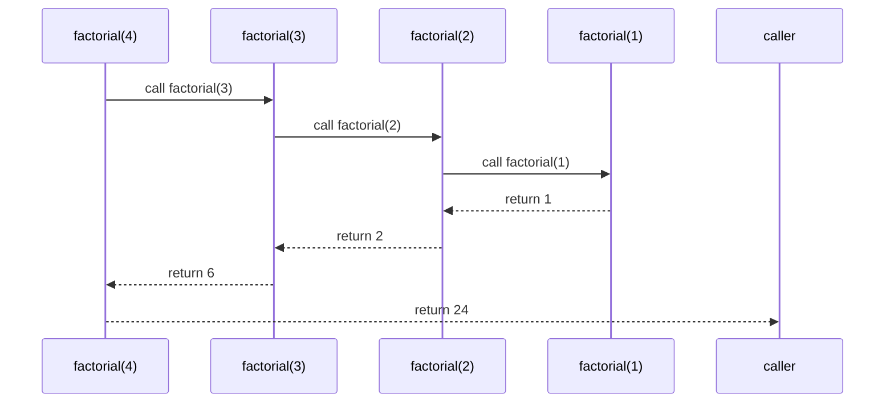

---
tags:
  - algorithms
  - concept
  - technique
  - function
  - c
  - python
aliases:
  - Recursive Function C
related:
  - "[[Function_C]]"
  - "[[Function_Call_C]]"
  - "[[Stack_Memory_C]]"
  - "[[Stack_Overflow]]"
  - "[[Stop_Condition_C]]"
  - "[[Base_Case_C]]"
  - "[[Tail_Recursion_C]]"
  - "[[Divide_and_Conquer]]"
  - "[[Tree_Traversal]]"
  - "[[Backtracking]]"
worksheet:
  - WS10
  - WS18
date_created: 2025-04-14
---
# Recursion (C and Python)

## Definition

**Recursion** is a programming technique where a [[Function_C|function]] calls itself, either directly or indirectly, in order to solve a problem. A recursive function breaks down a problem into smaller, self-similar subproblems until it reaches a simple **[[Stop_Condition_C|base case]]** that can be solved directly without further recursion.

## Key Components of a Recursive Function

1.  **Base Case(s) ([[Stop_Condition_C]]):** One or more simple cases that can be solved directly without making a recursive call. This is essential to prevent infinite recursion.
2.  **Recursive Step:** The part of the function where it calls itself, but with modified arguments that move the problem closer to a base case. The function typically combines the result of the recursive call with some other computation to produce its own result.

## How it Works (Conceptual)

- When a function calls itself, a new [[Stack_Frame_C]] is pushed onto the [[Stack_Memory_C|call stack]] for the new invocation, just like any other function call.
- This frame holds the parameters and local variables for that specific call.
- The function executes. If it makes another recursive call, another frame is pushed.
- When a call reaches a base case, it returns a value.
- The calling function receives the return value, performs its computation, and then returns, popping its frame off the stack.
- This process unwinds until the original call completes.

## Advantages

- **Elegance and Readability:** Can lead to simpler, more elegant solutions for problems that are naturally recursive (e.g., tree traversals, factorial, Fibonacci sequence, divide and conquer algorithms).
- **Problem Decomposition:** Naturally fits problems that can be broken down into smaller instances of the same problem.

## Disadvantages

- **Overhead:** Each function call adds overhead (pushing/popping stack frames, saving state), which can make recursion slower than an equivalent iterative solution.
- **[[Stack_Overflow|Stack Overflow]]:** If the recursion depth becomes too large (e.g., due to very large input or a missing/incorrect base case), the call stack can run out of memory, leading to a stack overflow error and program crash.
- **Complexity:** Can sometimes be harder to understand or debug than iterative solutions, especially tracking the state across multiple recursive calls.

## Visualization of Recursion

The following Mermaid sequence diagram illustrates the recursive calls and returns for calculating `factorial(4)`, showing how the call stack grows and unwinds:



## Examples

### C Example: Factorial

```c
#include <stdio.h>

// Recursive factorial function
long long factorial(int n) {
    // Base Case: Factorial of 0 or 1 is 1
    if (n < 0) {
        return -1; // Error case
    } else if (n == 0 || n == 1) {
        printf("Base Case: factorial(%d) = 1\n", n);
        return 1;
    }
    // Recursive Step: n! = n * (n-1)!
    else {
        printf("Recursive Step: calling factorial(%d)\n", n - 1);
        long long result = n * factorial(n - 1);
        printf("Returning %d * factorial(%d) = %lld\n", n, n-1, result);
        return result;
    }
}

int main() {
    int num = 4;
    printf("Calculating factorial of %d...\n", num);
    long long fact = factorial(num);
    if (fact != -1) {
        printf("\nFactorial of %d is %lld\n", num, fact);
    } else {
        printf("\nCannot calculate factorial of negative number.\n");
    }
    return 0;
}
```

**Output:**
```
Calculating factorial of 4...
Recursive Step: calling factorial(3)
Recursive Step: calling factorial(2)
Recursive Step: calling factorial(1)
Base Case: factorial(1) = 1
Returning 2 * factorial(1) = 2
Returning 3 * factorial(2) = 6
Returning 4 * factorial(3) = 24

Factorial of 4 is 24
```

### Python Example: Factorial

```python
def factorial(n):
    if n == 0:
        return 1
    else:
        return n * factorial(n-1)

# Example usage
num = 4
print(f"Factorial of {num} is {factorial(num)}")
```

**Output:**
```
Factorial of 4 is 24
```

### Python Example: Fibonacci

```python
def fibonacci(n):
    if n <= 1:
        return n
    return fibonacci(n-1) + fibonacci(n-2)

# Example usage
num = 5
print(f"Fibonacci of {num} is {fibonacci(num)}")
```

**Output:**
```
Fibonacci of 5 is 5
```
**Note:** This recursive implementation is inefficient for large `n` due to repeated calculations. In practice, use an iterative approach or memoization.

### Python Example: Check if List is Sorted

```python
def is_sorted(lst):
    if len(lst) <= 1:
        return True
    return lst[0] <= lst[1] and is_sorted(lst[1:])

# Example usage
lst1 = [1, 2, 3, 4, 5]
lst2 = [1, 3, 2, 4]
print(f"Is {lst1} sorted? {is_sorted(lst1)}")  # True
print(f"Is {lst2} sorted? {is_sorted(lst2)}")  # False
```

**Output:**
```
Is [1, 2, 3, 4, 5] sorted? True
Is [1, 3, 2, 4] sorted? False
```

## Note on Recursion Limit in Python

Python has a default recursion limit of 1000, which can lead to a `RecursionError` for deep recursions:

```python
import sys
print(sys.getrecursionlimit())  # Default is 1000
```

For deep recursions, consider using an iterative approach or increasing the limit with `sys.setrecursionlimit()` (not recommended for production).

## Related Concepts
- [[Function_C]], [[Function_Call_C]]
- [[Stack_Memory_C]], [[Stack_Frame_C]], [[Stack_Overflow]]
- [[Stop_Condition_C]] (Base Case)
- [[Tail_Recursion_C]] (Optimization possibility)
- [[Divide_and_Conquer]] (Algorithm paradigm often using recursion)
- Iteration (Alternative approach using loops)

---
**Source:** Worksheet WS10
