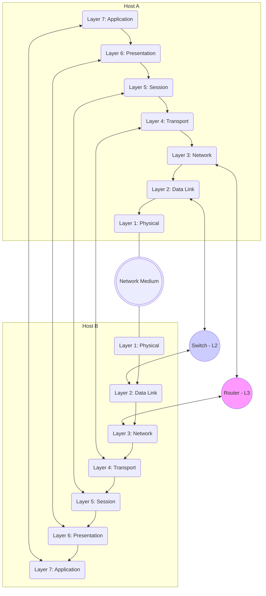

---
tags:
  - networking
  - concept
  - model
  - standard
aliases:
  - Open Systems Interconnection Model
related:
  - "[[TCP_IP_Model]]"
  - "[[Networking_Protocols]]"
  - "[[Physical_Layer]]"
  - "[[Data_Link_Layer]]"
  - "[[Network_Layer]]"
  - "[[Transport_Layer]]"
  - "[[Session_Layer]]"
  - "[[Presentation_Layer]]"
  - "[[Application_Layer]]"
worksheet: [WS26]
date_created: 2025-04-21
---
# OSI Model

## Definition

The **Open Systems Interconnection (OSI) Model** is a conceptual framework developed by the International Organization for Standardization (ISO) that standardizes the functions of a telecommunication or computing system in terms of abstraction layers. It partitions network communication into **seven distinct layers**, each responsible for specific tasks and providing services to the layer above it while using services from the layer below it.

## Purpose

- **Standardization:** Provides a standard model for network protocol development and understanding.
- **Modularity:** Breaks down complex network communication into smaller, more manageable layers. Changes in one layer ideally don't affect others, as long as the interface remains the same.
- **Interoperability:** Helps ensure that products from different vendors can interoperate.
- **Teaching Tool:** Provides a framework for teaching and understanding networking concepts.

## The Seven Layers

*(Mnemonic: **P**lease **D**o **N**ot **T**hrow **S**ausage **P**izza **A**way)*

1.  **[[Physical_Layer|Layer 1: Physical Layer]]:**
    -   *Responsibility:* Transmission and reception of raw bit streams over a physical medium. Deals with physical characteristics like voltage levels, timing, data rates, physical connectors, cables (e.g., Ethernet cables, fiber optics).
    -   *Examples:* Ethernet PHY, Hubs, Repeaters, Cables, Connectors.
2.  **[[Data_Link_Layer|Layer 2: Data Link Layer]]:**
    -   *Responsibility:* Reliable transmission of data frames between two directly connected nodes (node-to-node delivery). Handles physical addressing (MAC addresses), error detection/correction (at the link level), and flow control on the physical link.
    -   *Sublayers:* Often divided into LLC (Logical Link Control) and MAC (Media Access Control).
    -   *Examples:* Ethernet, Wi-Fi (802.11), PPP, Switches, Bridges, MAC Addresses.
3.  **[[Network_Layer|Layer 3: Network Layer]]:**
    -   *Responsibility:* Structuring and managing a multi-node network, including logical addressing (IP addresses), routing (determining paths across networks), and forwarding of packets from source to destination across potentially multiple links.
    -   *Examples:* [[ip|IP (IPv4, IPv6)]], ICMP, IGMP, [[Router|Routers]].
4.  **[[Transport_Layer|Layer 4: Transport Layer]]:**
    -   *Responsibility:* Providing reliable or unreliable data transfer services between *processes* running on different hosts (end-to-end connection). Manages segmentation/reassembly, connection establishment (for connection-oriented protocols), error control, flow control, and multiplexing/demultiplexing using port numbers.
    -   *Examples:* [[TCP]] (reliable, connection-oriented), [[UDP]] (unreliable, connectionless), [[Port_Number|Port Numbers]].
5.  **[[Session_Layer|Layer 5: Session Layer]]:**
    -   *Responsibility:* Establishing, managing, and terminating communication sessions between applications. Handles dialogue control (whose turn it is to transmit), synchronization (checkpointing long transfers).
    -   *Examples:* NetBIOS, RPC (some aspects), PAP. *(Note: Functionality often integrated into Application or Transport layers in the TCP/IP model).*
6.  **[[Presentation_Layer|Layer 6: Presentation Layer]]:**
    -   *Responsibility:* Translating data between the application layer format and a common network format. Handles data encryption/decryption, compression/decompression, and character encoding translation (e.g., ASCII to EBCDIC, though less relevant now with Unicode).
    -   *Examples:* SSL/TLS (provides encryption), MIME data formatting. *(Note: Functionality often integrated into Application layer in the TCP/IP model).*
7.  **[[Application_Layer|Layer 7: Application Layer]]:**
    -   *Responsibility:* Provides network services directly to end-user applications. Contains protocols that applications use to communicate over the network. This is the layer users typically interact with.
    -   *Examples:* [[HTTP]], [[HTTPS]], [[FTP]], [[SMTP]], [[POP3]], [[IMAP]], [[DNS]], [[SSH]], Telnet.

## Visualization

## OSI vs. TCP/IP Model

The [[TCP_IP_Model]] is a more practical model used for the Internet, typically described with 4 or 5 layers. The OSI model's Application, Presentation, and Session layers are often collapsed into the Application layer of the TCP/IP model.

## Related Concepts
- [[TCP_IP_Model]] (Alternative, more practical model)
- [[Networking_Protocols]] (Fit into different OSI layers)
- Each individual layer: [[Physical_Layer]], [[Data_Link_Layer]], [[Network_Layer]], [[Transport_Layer]], [[Session_Layer]], [[Presentation_Layer]], [[Application_Layer]]
- Encapsulation / Decapsulation

---
**Source:** Worksheet WS26