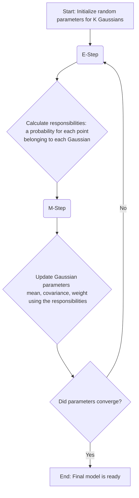
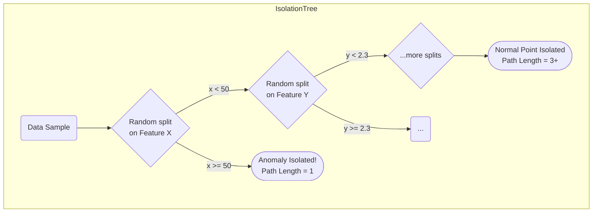
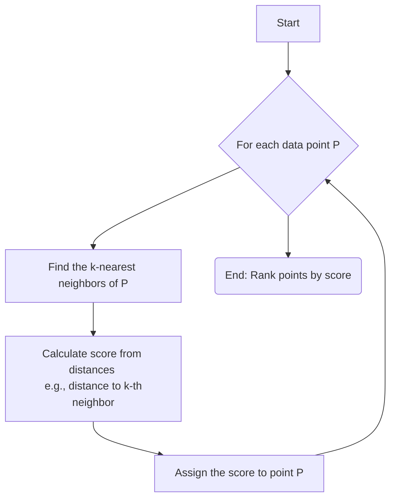
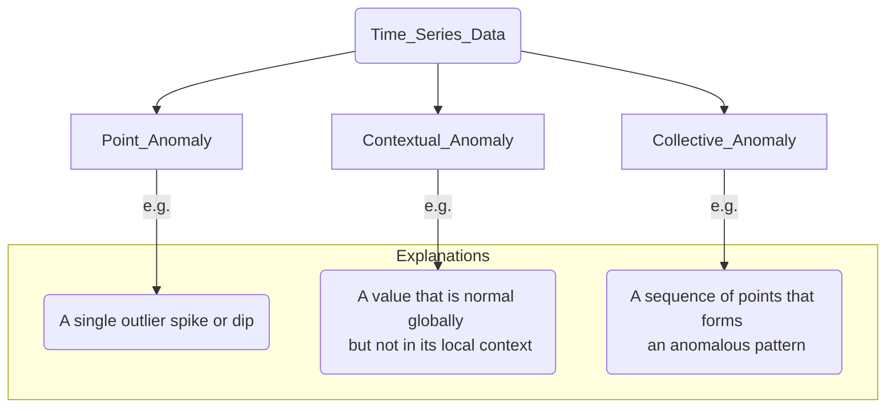
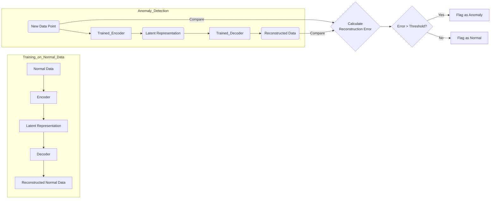

# Prompt

New Worksheet, new chapter: "Anomaly Detection":

you are provided with a worksheet filled with keywords and questions.

For the following keywords , provide answers in bullet point format and the following answers if applicable.

1) Short Description/what is it/one-sentence
2) What is it good for? Why is it done?
3) 3-5 bullet points with more details, dont just stretch sentences, actually inject more information
4) Examples, can be conceptual, analogy, or (preferred) real python code, if possible both a ready  implementation by a library like sklearn, and a from-scratch version.
5) If possible some math, using Latex and explanations. It should explain how it works, why it works, etc
6) If you mention any new term that is not part of the worksheet (like a specific type of a high-level keyword - for example keyword is optimization and your answer mentions 2 examples for optimization techniques), then make a seperate "chapter" for that new keyword in the same format (point 1-5) - never mention something datascience related or machine learning related without properly explaining it

IMPORTANT: The output will be copied into obsidian, therefore your answer should be markdown inside a 4-backtick codeblock, such that following embedded 3tick codeblocks won't be disturbed

For the questions, provide a short answer and a long answer
```Gemini
# Keywords

1. Outlier
2. Anomaly
3. Supervized / Unsupervized
4. Multivariate outliers


# Methods/Models

1. Gaussian Mixture Models
- Expectation-Maximization
2. Isolation Forest
3. Histogram-Based Outlier Score (HBOS)
4. One-Class SVM

# Questions

1. What is the difference between outliers and anomalies?
2. List 3 real-life problems where anomaly detection is not just an analysis step, but the ultimate goal of the analysis itself.
3. Is supervized anomaly detection different from a (potentially very) imbalanced classification problem?
4. How does Isolation Forest differ from a classical Random Forest?
5. How can k-NN be used for anomaly detection?
6. What are the specificities of anomaly detection in the context of Time Series?
7. How can Autoencoders assist in anomaly detection?
8. Why is HBOS effective for high-dimensional data?
9. How do you quantify the level of isolation for a point?
- Are isolated points always considered anomalies?
1. How can you measure the quality of your anomaly detector with no ground truth for anomalies?
```

---

# Output

## Keywords

---

### 1. Outlier
1.  **Short Description:** An **outlier** is a data point that is numerically distant from the rest of the data.
2.  **What is it good for?:** Identifying outliers is crucial for data cleaning, as they can skew statistical analyses and degrade the performance of machine learning models. They can also represent important, albeit rare, events.
3.  **Details:**
    * Outliers can be classified into **global** (or point) outliers, which are far from all other points, and **local** outliers, which are far from their local neighbors but might be in a dense region overall.
    * They can arise from various sources, including measurement errors, data entry mistakes, experimental errors, or genuine, novel observations (e.g., a fraudulent transaction).
    * The definition of "distant" is context-dependent. A common rule of thumb is to consider points falling more than 1.5 times the interquartile range (IQR) below the first quartile or above the third quartile as outliers.
    * Handling outliers isn't always about removal. Sometimes they are the most interesting points in the dataset and are the primary target of the analysis (which is then called anomaly detection).
4.  **Examples:**
    * **Conceptual:** In a dataset of human heights, a value of `3.5 meters` would be a clear outlier, likely due to a data entry error. A value of `2.1 meters` is rare but possible, representing a genuine but extreme observation.
    * **Code (from scratch):** A simple method to find outliers is using the Interquartile Range (IQR).

    ```python
    import numpy as np

    def find_outliers_iqr(data):
        """Finds outliers in a 1D dataset using the IQR method."""
        q1 = np.percentile(data, 25)
        q3 = np.percentile(data, 75)
        iqr = q3 - q1
        lower_bound = q1 - 1.5 * iqr
        upper_bound = q3 + 1.5 * iqr
        
        outliers = [x for x in data if x < lower_bound or x > upper_bound]
        return outliers

    # Example usage
    data = [17, 20, 22, 23, 23, 24, 25, 28, 32, 110]
    outliers = find_outliers_iqr(data)
    print(f"Data: {data}")
    print(f"Outliers: {outliers}") 
    # Output: Outliers: [110]
    ```

5.  **Math:** The most common statistical definition of an outlier is based on the **Z-score**, which measures how many standard deviations a data point is from the mean. For a data point $x$, the Z-score is calculated as:
    $$
    Z = \frac{x - \mu}{\sigma}
    $$
    Where:
    * $x$ is the data point.
    * $\mu$ is the mean of the dataset.
    * $\sigma$ is the standard deviation of the dataset.
    A common threshold is to classify any point with a Z-score greater than 3 or less than -3 as an outlier, as over 99.7% of data in a normal distribution falls within 3 standard deviations of the mean.

---

### 2. Anomaly
1.  **Short Description:** An **anomaly** is a data point or pattern that does not conform to the expected, normal behavior.
2.  **What is it good for?:** Detecting anomalies is the primary goal in many critical applications like fraud detection (unusual spending patterns), network security (intrusion detection), and predictive maintenance (identifying machine failures before they happen).
3.  **Details:**
    * While often used interchangeably with "outlier," "anomaly" can carry a stronger implication that the data point was generated by a **different process** than the "normal" data.
    * Anomalies can be categorized as:
        * **Point Anomalies:** A single instance is anomalous (e.g., a huge credit card purchase).
        * **Contextual Anomalies:** An instance is anomalous within a specific context (e.g., buying a winter coat in summer).
        * **Collective Anomalies:** A collection of related data instances is anomalous, while individual instances may not be (e.g., a human heartbeat EKG showing a flatline). 
    * The "expected behavior" or "normality" is often learned from the data itself, which makes anomaly detection a fundamentally challenging problem.
4.  **Examples:**
    * **Analogy:** If cars are driving down a highway, a car driving at 200 km/h is an outlier (numerically distant from the average speed). A car driving backward on the highway is an anomaly (violates the expected pattern of behavior, even if its speed is normal).
    * **Conceptual:** In server monitoring, a sudden spike in CPU usage to 100% is a point anomaly. High CPU usage during a scheduled backup (e.g., every Sunday at 2 AM) is normal, but the same high usage on a Tuesday afternoon might be a contextual anomaly.

---

### 3. Supervised / Unsupervised
1.  **Short Description:** These terms describe whether the learning algorithm uses labeled data. **Supervised** learning uses labeled data (input-output pairs), while **unsupervised** learning works with unlabeled data to find inherent structures.
2.  **What is it good for?:**
    * **Supervised learning** is used when you have a clear target to predict and historical data with correct labels (e.g., classifying emails as spam/not-spam).
    * **Unsupervised learning** is used when you don't have labels and want to discover patterns, groups, or anomalies in the data (e.g., clustering customers into segments).
3.  **Details:**
    * **Supervised Anomaly Detection:** This is treated as a classification problem. You need a dataset with labels indicating which points are "normal" and which are "anomalies." This is rare because anomalies are, by definition, infrequent and novel, making them hard to collect and label.
    * **Unsupervised Anomaly Detection:** This is the most common approach. The algorithm assumes that the vast majority of the data is "normal" and tries to find points that don't fit this normal profile. No pre-existing labels are needed.
    * **Semi-Supervised Anomaly Detection:** A hybrid approach where the algorithm is trained *only* on a dataset of "normal" data. When presented with new data, it flags any point that deviates significantly from the learned normal profile. This is very common in practice (e.g., training a model on normal machine behavior).
4.  **Examples:**
    * **Supervised:** You have a dataset of credit card transactions, each labeled as `fraudulent` or `legitimate`. You train a classifier like a Logistic Regression or Random Forest to predict the label for new transactions.
    * **Unsupervised:** You have a dataset of network traffic logs without any labels. You use an algorithm like Isolation Forest to assign an "anomaly score" to each log entry, flagging those with the highest scores for investigation.

---

### 4. Multivariate outliers
1.  **Short Description:** A **multivariate outlier** is a combination of unusual scores on at least two variables.
2.  **What is it good for?:** Identifying multivariate outliers is essential because looking at variables one by one (univariate analysis) can miss them. They represent unusual combinations of values that can reveal complex, hidden patterns or errors.
3.  **Details:**
    * A data point can be a multivariate outlier even if each of its individual feature values is within the normal range.
    * The core idea is to look at the relationship *between* variables.
    * For example, a person's weight might be normal, and their height might be normal, but the combination of the two might be highly unusual (e.g., a 2-meter-tall person weighing 40 kg).
    * These are harder to detect than univariate outliers because they can't be found by simply looking at boxplots or histograms of single variables. You need to visualize or model the data in higher dimensions.
4.  **Examples:**
    * **Conceptual:** Consider a dataset of people's age and income. An age of 25 is normal. An income of $200,000 is normal. However, a 25-year-old with an income of $200,000 might be a multivariate outlier compared to the general population.
    * **Code (using Mahalanobis Distance):** One of the classic methods for detecting multivariate outliers is the **Mahalanobis distance**, which measures how far a point is from the center of a data cloud, accounting for the correlation between variables.

    ```python
    import numpy as np
    from scipy.spatial.distance import mahalanobis
    from scipy.stats import chi2

    # Generate some correlated 2D data
    np.random.seed(42)
    data = np.random.multivariate_normal([0, 0], [[1, 0.8], [0.8, 1]], 100)
    # Add an outlier
    outlier = np.array([[2.5, -2.5]])
    data_with_outlier = np.concatenate([data, outlier])

    # Calculate Mahalanobis distance
    cov_matrix = np.cov(data.T)
    inv_cov_matrix = np.linalg.inv(cov_matrix)
    mean = np.mean(data, axis=0)

    distances = [mahalanobis(point, mean, inv_cov_matrix) for point in data_with_outlier]
    
    # Use a Chi-squared distribution to find a cutoff
    # For 2 degrees of freedom (2 variables), a p-value of 0.001 corresponds to a cutoff of ~13.8
    cutoff = chi2.ppf(0.999, df=data.shape[1])
    
    outlier_indices = np.where(np.array(distances) > cutoff)[0]
    print(f"Cutoff distance: {cutoff:.2f}")
    print(f"Distances: ...{np.round(distances[-5:], 2)}")
    print(f"Outlier found at index: {outlier_indices[0]}")
    print(f"Outlier value: {data_with_outlier[outlier_indices[0]]}")
    # Output: Outlier found at index: 100
    ```
5.  **Math (Mahalanobis Distance):**
    The Mahalanobis distance ($D_M$) for a point $\vec{x}$ from a group of points with mean $\vec{\mu}$ and covariance matrix $S$ is defined as:
    $$
    D_M(\vec{x}) = \sqrt{(\vec{x} - \vec{\mu})^T S^{-1} (\vec{x} - \vec{\mu})}
    $$
    * **Why it works:** Unlike Euclidean distance, it accounts for the variance of each variable and the covariance between variables. If variables are highly correlated, it "stretches" the space along the axis of correlation, so points that are far in Euclidean terms might be close in Mahalanobis terms if they follow the correlation trend. The $S^{-1}$ (inverse covariance matrix) term is what accomplishes this transformation. It essentially projects the data onto a new space where the variables are uncorrelated and have unit variance, and then calculates the standard Euclidean distance in that transformed space. 

## Methods/Models

---

### 1. Gaussian Mixture Models (GMM)
1.  **Short Description:** GMM is a probabilistic model that assumes the data is generated from a mixture of a finite number of Gaussian distributions (bell curves) with unknown parameters.
2.  **What is it good for?:** It's great for clustering data, especially when the clusters are not necessarily spherical. For anomaly detection, it can model complex "normal" data distributions; points that have a very low probability of belonging to any of the learned Gaussian components are considered anomalies.
3.  **Details:**
    * GMM is a "soft clustering" method, meaning it provides a probability for each data point belonging to each cluster (Gaussian component).
    * The model learns the parameters of each Gaussian component: the mean ($\mu$), covariance ($\Sigma$), and the weight ($\pi$, i.e., how much of the data belongs to that component).
    * Anomalies are identified as points that fall in low-probability regions of the learned density function. You can set a probability threshold below which a point is flagged as an anomaly.
    * The number of Gaussian components (clusters) is a hyperparameter that must be chosen beforehand.
4.  **Examples:**
    * **Analogy:** Imagine a crowded room where people are gathered in several distinct conversation circles. GMM tries to identify the location (mean), shape/size (covariance), and number of people (weight) in each circle. A person standing alone in a corner, far from any circle, would be an anomaly. 
    * **Code (Scikit-learn):**
    ```python
    import numpy as np
    from sklearn.mixture import GaussianMixture

    # Generate data with two clusters
    X1 = np.random.normal(0, 1, (100, 2))
    X2 = np.random.normal(5, 1.5, (100, 2))
    X = np.vstack([X1, X2])
    # Add an outlier
    X_with_outlier = np.vstack([X, np.array([[20, 20]])])

    # Fit a GMM
    gmm = GaussianMixture(n_components=2, random_state=42)
    gmm.fit(X)

    # Calculate the log-likelihood for all points
    log_likelihood = gmm.score_samples(X_with_outlier)

    # Find anomalies by setting a percentile threshold
    threshold = np.percentile(log_likelihood, 1) # e.g., flag the bottom 1%
    anomalies = X_with_outlier[log_likelihood < threshold]
    
    print(f"Log-likelihood of last point (the outlier): {log_likelihood[-1]:.2f}")
    print(f"Threshold: {threshold:.2f}")
    print(f"Detected anomalies: {anomalies}")
    # Output: Detected anomalies: [[20. 20.]]
    ```
5.  **Math:** A GMM models the probability density of a data point $x$ as a weighted sum of $K$ Gaussian components:
    $$
    p(x) = \sum_{k=1}^{K} \pi_k \mathcal{N}(x | \mu_k, \Sigma_k)
    $$
    Where:
    * $K$ is the number of components.
    * $\pi_k$ is the mixture weight for component $k$, with $\sum_{k=1}^{K} \pi_k = 1$. It represents the probability that a point was drawn from component $k$.
    * $\mathcal{N}(x | \mu_k, \Sigma_k)$ is the probability density function of a multivariate Gaussian distribution with mean $\mu_k$ and covariance matrix $\Sigma_k$.
    * The model's parameters ($\pi_k, \mu_k, \Sigma_k$ for all $k$) are typically learned using the **Expectation-Maximization (EM)** algorithm. Anomaly detection then consists of calculating $p(x)$ for a new point $x$ and flagging it if the value is below a certain threshold $\epsilon$.

---

#### • Expectation-Maximization (EM)
1.  **Short Description:** EM is an iterative algorithm used to find maximum likelihood estimates of parameters in statistical models, where the model depends on unobserved **latent variables**.
2.  **What is it good for?:** It's the standard way to train Gaussian Mixture Models. It's also used in many other machine learning contexts with missing data or latent variables, like Hidden Markov Models (HMMs).
3.  **Details:**
    * The core problem EM solves is a "chicken-and-egg" one. In GMMs, if you knew which cluster each point belonged to (the latent variable), you could easily calculate each cluster's mean and covariance. Conversely, if you knew each cluster's mean and covariance, you could easily calculate the probability of a point belonging to each cluster.
    * EM breaks this loop by iterating between two steps:
        1.  **E-Step (Expectation):** Guess the values for the latent variables based on the current model parameters. In GMM, this means calculating the probability (called "responsibility") that each data point belongs to each Gaussian component.
        2.  **M-Step (Maximization):** Update the model parameters ($\pi_k, \mu_k, \Sigma_k$) using the "responsibilities" calculated in the E-step. This is done by calculating weighted averages for the means and covariances.
    * These two steps are repeated until the model parameters converge (i.e., they stop changing significantly).
4.  **Examples:**
    * **Analogy:** Imagine you have a recording of two people speaking simultaneously, and you want to separate their voices.
        * **E-Step:** You make an initial guess about the properties of each person's voice (e.g., pitch). Based on this guess, you go through the recording millisecond by millisecond and estimate the probability that each sound came from Person A vs. Person B.
        * **M-Step:** Now, using these probability estimates, you re-calculate a better estimate of the voice properties for Person A (by focusing on the sounds most likely to be from A) and Person B.
        * You repeat this until your estimates of their voices are stable.
5.  **Math (for GMM):**
    * **E-Step:** We calculate the "responsibility" $r_{ik}$ which is the posterior probability that point $x_i$ belongs to cluster $k$, given the current parameters.
        $$
        r_{ik} = \frac{\pi_k \mathcal{N}(x_i | \mu_k, \Sigma_k)}{\sum_{j=1}^{K} \pi_j \mathcal{N}(x_i | \mu_j, \Sigma_j)}
        $$
    * **M-Step:** We re-estimate the parameters using these responsibilities. For each cluster $k$:
        * **New Mean $\mu_k$:** The weighted average of all data points.
            $$ \mu_k^{\text{new}} = \frac{1}{N_k} \sum_{i=1}^{N} r_{ik} x_i $$
        * **New Covariance $\Sigma_k$:** The weighted covariance.
            $$ \Sigma_k^{\text{new}} = \frac{1}{N_k} \sum_{i=1}^{N} r_{ik} (x_i - \mu_k^{\text{new}})(x_i - \mu_k^{\text{new}})^T $$
        * **New Mixture Weight $\pi_k$:** The average responsibility for this cluster.
            $$ \pi_k^{\text{new}} = \frac{N_k}{N} \quad \text{where} \quad N_k = \sum_{i=1}^{N} r_{ik} $$




---

### 2. Isolation Forest
1.  **Short Description:** Isolation Forest is an unsupervised algorithm that explicitly isolates anomalies by randomly partitioning the data until each point is isolated on its own.
2.  **What is it good for?:** It's highly effective for finding anomalies in high-dimensional datasets. It's computationally efficient and doesn't rely on distance or density measures, which can be problematic in high dimensions (see Curse of Dimensionality).
3.  **Details:**
    * The core idea is that **anomalies are "few and different," which makes them easier to isolate** than normal points.
    * The algorithm builds an ensemble of "Isolation Trees" (iTrees). To build a tree, it recursively partitions the data by randomly selecting a feature and then randomly selecting a split value for that feature.
    * Anomalous points are likely to be isolated in just a few splits (having a short path from the root of the tree), while normal points, being in crowded regions, will require many more splits to be isolated.
    * The final anomaly score for a point is based on its average path length across all the trees in the forest.
4.  **Examples:**
    * **Analogy:** Imagine you're playing "Guess Who?" with data points. To isolate a point (a character), you ask random questions ("Is your person wearing glasses?"). An anomalous character (e.g., the only one with a purple hat) will be isolated very quickly with just one or two questions. A very typical character will require many questions to distinguish from others. The number of questions needed is the path length. 
    * **Code (Scikit-learn):**
    ```python
    import numpy as np
    from sklearn.ensemble import IsolationForest

    # Generate normal data and some outliers
    rng = np.random.RandomState(42)
    X_train = 0.2 * rng.randn(1000, 2)
    X_outliers = rng.uniform(low=-4, high=4, size=(50, 2))
    X = np.vstack([X_train, X_outliers])

    # Fit the model
    # contamination='auto' is a good default
    clf = IsolationForest(n_estimators=100, contamination='auto', random_state=42)
    y_pred = clf.fit_predict(X) # returns -1 for outliers, 1 for inliers

    # Get the raw anomaly scores
    anomaly_scores = clf.decision_function(X)

    print(f"Number of outliers detected: {np.sum(y_pred == -1)}")
    # The anomaly scores for the actual outliers should be lower (more negative)
    print(f"Average score for inliers: {np.mean(anomaly_scores[:1000]):.2f}")
    print(f"Average score for outliers: {np.mean(anomaly_scores[1000:]):.2f}")
    ```
5.  **Math:** The anomaly score $s(x, n)$ for an instance $x$ is defined as:
    $$
    s(x, n) = 2^{-\frac{E(h(x))}{c(n)}}
    $$
    Where:
    * $h(x)$ is the path length of instance $x$ in an Isolation Tree.
    * $E(h(x))$ is the average path length of $x$ across all trees in the forest.
    * $c(n)$ is the average path length of an unsuccessful search in a Binary Search Tree with $n$ nodes. It's a normalization factor: $c(n) = 2H(n-1) - \frac{2(n-1)}{n}$, where $H(k)$ is the harmonic number, which can be estimated as $\ln(k) + 0.577...$ (Euler's constant).
    * **Interpretation of the score:**
        * If $s$ is close to 1, $E(h(x))$ is very small, meaning the point is definitely an anomaly.
        * If $s$ is less than 0.5, $E(h(x))$ is large, meaning the point is likely normal.
        * If $s$ is around 0.5, the data is considered neither clearly normal nor anomalous.



---

### 3. Histogram-Based Outlier Score (HBOS)
1.  **Short Description:** HBOS is a fast, unsupervised algorithm that calculates anomaly scores by building histograms for each individual feature in the dataset.
2.  **What is it good for?:** It's extremely fast and works well on large, high-dimensional datasets. Its main advantage is that it processes each feature independently, which avoids the computational complexity and statistical problems (Curse of Dimensionality) that plague distance-based methods in high dimensions.
3.  **Details:**
    * For each feature, the algorithm creates a histogram. The density (height of the bar) in the histogram is used as an estimate of the probability.
    * The assumption is that anomalies will fall into low-density bins in these histograms.
    * The anomaly score for a data point is calculated by combining the scores from each individual feature. It's typically the sum of the inverse of the densities (or log of the inverse densities) from the bins the point falls into.
    * A higher HBOS score means the point is more likely to be an anomaly.
    * It's sensitive to the number of bins chosen for the histograms, which is a key hyperparameter.
4.  **Examples:**
    * **Analogy:** You are a city planner looking at census data (age, income, etc.). You make a histogram for each attribute. To check if a person is "unusual," you look at where they fall on each histogram. If they are in a very low bar for age (e.g., 110 years old) and a very low bar for income (e.g., $10M/year), they are likely an anomaly. HBOS combines these "unusualness" scores from each histogram.
    * **Code (from scratch, simplified):**
    
    ```python
    import numpy as np

    def hbos_score(data, n_bins=10):
        """Calculates HBOS scores for a dataset."""
        n_samples, n_features = data.shape
        scores = np.zeros(n_samples)
        
        for i in range(n_features):
            feature_data = data[:, i]
            # Create histogram for the feature
            hist, bin_edges = np.histogram(feature_data, bins=n_bins, density=True)
            
            # Find which bin each data point falls into
            bin_indices = np.digitize(feature_data, bin_edges[:-1]) - 1 # -1 to make it 0-indexed
            # Handle edge case where a value equals the last bin edge
            bin_indices[bin_indices == n_bins] = n_bins - 1

            # Get densities for each point
            # Add a small epsilon to avoid division by zero
            densities = hist[bin_indices] + 1e-10
            
            # Score is the inverse of the density (log is often used)
            feature_scores = np.log(1 / densities)
            scores += feature_scores
            
        return scores

    # Example Usage
    np.random.seed(0)
    X_normal = np.random.randn(100, 2)
    X_outlier = np.array([[5, 5], [-4, 6]])
    X = np.vstack([X_normal, X_outlier])

    scores = hbos_score(X)
    
    print(f"Score for a normal point: {scores[0]:.2f}")
    print(f"Score for outlier 1: {scores[100]:.2f}")
    print(f"Score for outlier 2: {scores[101]:.2f}")
    # Higher scores indicate anomalies
    ```
5.  **Math:** The HBOS score for a single data point $\vec{x} = (x_1, x_2, ..., x_d)$ is calculated assuming feature independence:
    $$
    HBOS(\vec{x}) = \sum_{i=1}^{d} \log\left(\frac{1}{hist_i(x_i)}\right) = - \sum_{i=1}^{d} \log(hist_i(x_i))
    $$
    * $d$ is the number of dimensions (features).
    * $hist_i(x_i)$ is the density estimate for the value $x_i$ from the histogram built for the $i$-th feature.
    * **Why it works:** This formula is based on the idea that the joint probability of an event under the assumption of independence is the product of the individual probabilities: $P(\vec{x}) = P(x_1)P(x_2)...P(x_d)$. By taking the logarithm, we turn this product into a sum, which is numerically more stable and easier to work with. A low probability (low histogram density) leads to a high inverse value, and thus a high HBOS score.

---

### 4. One-Class SVM
1.  **Short Description:** A One-Class Support Vector Machine (SVM) is a semi-supervised algorithm that learns a decision boundary around the "normal" data points to distinguish them from outliers.
2.  **What is it good for?:** It's effective for novelty detection, where the goal is to identify new or unseen patterns that are different from the training data. It works well on high-dimensional data and can capture complex, non-spherical shapes for the "normal" region.
3.  **Details:**
    * Unlike a standard SVM which finds a hyperplane to separate two classes of data, a One-Class SVM tries to find a hyperplane that separates *all* the data points from the origin.
    * It's trained on a dataset containing only (or mostly) normal instances. The goal is to learn a "tight" boundary around this cloud of normal points.
    * The key idea, via the "kernel trick," is to map the data into a higher-dimensional feature space where it becomes easier to separate the points from the origin with a single hyperplane.
    * A key hyperparameter is `nu` ($\nu$), which roughly corresponds to the upper bound on the fraction of training errors (points falling on the wrong side of the boundary) and the lower bound on the fraction of support vectors. It controls the trade-off between having a tight boundary and misclassifying some training points.
4.  **Examples:**
    * **Analogy:** Imagine you're building a fence (`boundary`) around a herd of sheep (`normal data`) to protect them. The One-Class SVM algorithm tries to build the smallest possible fence that encloses most of the sheep. Any animal found outside the fence is then considered a "novelty" (e.g., a wolf or a lost sheep). The `nu` parameter is like telling the fence-builder "it's okay if you leave up to 1% of the sheep outside the fence to make the fence shape simpler and tighter." 
    * **Code (Scikit-learn):**
    ```python
import numpy as np
from sklearn.svm import OneClassSVM

# Generate normal training data
X_train = np.random.randn(200, 2) - 1

# Fit the model on normal data only
# nu=0.01 means we expect up to 1% of our training data to be outliers
oc_svm = OneClassSVM(gamma='auto', nu=0.01)
oc_svm.fit(X_train)

# Create some new data points to test
X_test_normal = np.array([[-1.2, -0.8]])
X_test_novel = np.array([[3.0, 3.0]])

# Predict if they are inliers (1) or outliers (-1)
pred_normal = oc_svm.predict(X_test_normal)
pred_novel = oc_svm.predict(X_test_novel)

print(f"Prediction for normal point: {pred_normal[0]}")  # Expected: 1
print(f"Prediction for novel point: {pred_novel[0]}")    # Expected: -1
    ```
    
5.  **Math:** The algorithm tries to solve the following optimization problem:
    $$
    \min_{\rho, \mathbf{w}, \xi} \frac{1}{2}\|\mathbf{w}\|^2 + \frac{1}{\nu N} \sum_{i=1}^{N} \xi_i - \rho
    $$
    subject to the constraints:
    $$
    \mathbf{w} \cdot \phi(\mathbf{x}_i) \geq \rho - \xi_i, \quad \xi_i \geq 0
    $$
    * $\mathbf{w}$ and $\rho$ define the hyperplane in the high-dimensional feature space.
    * $\phi(\mathbf{x}_i)$ is a kernel function that maps the data $\mathbf{x}_i$ to that higher-dimensional space.
    * $\xi_i$ are slack variables that allow some points to be within the margin (i.e., on the "wrong" side of the boundary), penalized by the term $\frac{1}{\nu N} \sum \xi_i$.
    * $\nu$ (nu) is a hyperparameter between 0 and 1 that controls this penalty.
    * **How it works:** The term $\frac{1}{2}\|\mathbf{w}\|^2$ tries to maximize the margin (distance) between the origin and the hyperplane, while the term $-\rho$ tries to push the hyperplane as far from the origin as possible. The constraints ensure that most data points $\mathbf{x}_i$ end up on one side of the hyperplane. The decision function for a new point $\mathbf{x}$ is then $f(\mathbf{x}) = \text{sgn}(\mathbf{w} \cdot \phi(\mathbf{x}) - \rho)$. A negative value indicates an outlier.

# Questions

---

### 1. What is the difference between outliers and anomalies?
* **Short Answer:** In practice, the terms are often used interchangeably. However, technically, an **outlier** is a data point that is numerically distant from the rest, while an **anomaly** is a point that doesn't conform to an expected pattern, implying it might be generated by a different underlying process. All anomalies are outliers, but not all outliers are anomalies.

* **Long Answer:** The distinction is subtle but important in some contexts.
    * **Outlier** is primarily a **statistical** term. It refers to a data point that deviates significantly from other observations in a sample. For example, in a dataset of test scores from 1 to 100, a score of `500` is a clear outlier, likely due to a data entry error. It's defined by its numerical extremity.
    * **Anomaly** is more of a **domain-specific** or **pattern-based** term. It refers to a data point that violates the rules or patterns of "normal" behavior. The car driving backward on the highway is a perfect example: its speed might be a normal value (e.g., 30 km/h), so it's not a numerical outlier in that feature, but it's a huge anomaly because it breaks the fundamental pattern of traffic flow.
    * Essentially, "outlier" focuses on the **what** (a numerically extreme value), while "anomaly" focuses on the **why** (it was likely generated by a different mechanism). In fraud detection, a transaction might not be for an outlier amount of money, but it could be anomalous due to its location, time, and sequence of preceding transactions.

---

### 2. List 3 real-life problems where anomaly detection is not just an analysis step, but the ultimate goal of the analysis itself.
* **Short Answer:**
    1.  **Cybersecurity:** Detecting network intrusions or malware.
    2.  **Financial Fraud Detection:** Identifying fraudulent credit card transactions or insurance claims.
    3.  **Predictive Maintenance:** Spotting indicators of machine failure in sensor data from industrial equipment or aircraft engines.

* **Long Answer:**
    1.  **Cybersecurity (Intrusion Detection):** In this field, the "normal" data is the massive volume of benign network traffic, server requests, and user logins. The goal is to find the tiny fraction of that data that represents a malicious actor trying to breach the system. An anomaly could be a user logging in from two countries simultaneously, an unusual sequence of system calls by a program, or a sudden, massive data transfer out of the network. Here, finding the anomaly *is* finding the threat.
    2.  **Financial Fraud Detection:** Credit card companies analyze millions of transactions per hour. The vast majority are legitimate. The core business problem is to identify the few fraudulent ones in real-time to block them. The model's sole purpose is to flag transactions that deviate from a user's normal spending pattern (e.g., amount, location, frequency, merchant type). The flagged anomaly is the product.
    3.  **Predictive Maintenance:** In manufacturing or aviation, sensors are placed on critical machinery to monitor temperature, vibration, pressure, etc. This generates a constant stream of time-series data representing normal operation. The goal of the analysis is to detect subtle deviations from this normal pattern that signal impending failure. Finding this anomaly allows for maintenance to be scheduled *before* a catastrophic and costly breakdown occurs. The "anomaly" is the valuable prediction.

---

### 3. Is supervised anomaly detection different from a (potentially very) imbalanced classification problem?
* **Short Answer:** No, from a technical modeling standpoint, they are the same problem: binary classification with a severe class imbalance. However, the approach, terminology, and evaluation often differ.

* **Long Answer:** While they are methodologically identical, the framing of the problem leads to different practical considerations:
    * **Problem Framing:**
        * In a classic **imbalanced classification** problem (e.g., ad click-through prediction), the minority class (clicks) is rare but still part of the normal process you're trying to model. You want to understand the characteristics of both classes equally well.
        * In **supervised anomaly detection**, the "minority class" (anomalies) is often thought of as contaminants or events from a completely different data-generating process. The focus is often on perfectly defining the boundary of the "normal" class, treating everything else as anomalous.
    * **Data Characteristics:** True anomalies are often novel. A supervised model is only as good as the labeled anomalies it has seen. It may fail to detect a new *type* of anomaly that wasn't in the training set. This is why semi-supervised (training on normal data only) and unsupervised methods are so popular.
    * **Evaluation:** While metrics like Precision, Recall, and F1-score are used for both, the emphasis in anomaly detection is often extremely high on **recall** (not missing any anomalies) even at the cost of lower precision (having some false alarms), especially in high-stakes domains like security or safety. Techniques like cost-sensitive learning, where misclassifying an anomaly is given a much higher penalty, are central.

So, while you could use a standard classifier for supervised anomaly detection, the most successful approaches are often those that are explicitly designed to handle the unique nature of anomalies, such as their novelty and the supreme importance of not missing them.

---

### 4. How does Isolation Forest differ from a classical Random Forest?
* **Short Answer:** They differ in their **purpose** and **construction**. A Random Forest is built to be a good *predictor* by creating deep, complex trees. An Isolation Forest is built to be a good *isolator* by creating many random, shallow trees.

* **Long Answer:**

| Feature               | Random Forest (Classifier/Regressor)                                                                                                                                                 | Isolation Forest (Anomaly Detector)                                                                                                                                          |
| :-------------------- | :----------------------------------------------------------------------------------------------------------------------------------------------------------------------------------- | :--------------------------------------------------------------------------------------------------------------------------------------------------------------------------- |
| **Goal**              | To **predict** a target label. It aggregates votes from many trees to make an accurate prediction.                                                                                   | To **isolate** data points. It uses path length as a proxy for anomalousness.                                                                                                |
| **Tree Construction** | Trees are grown deep. At each node, it looks for the **best split** (e.g., using Gini impurity or information gain) across a random subset of features to best separate the classes. | Trees are grown shallow (often with a depth limit). At each node, it picks a **random feature** and a **random split point** for that feature. No "best split" optimization. |
| **Handling Data**     | It needs labeled data (features and a target variable) for supervised learning.                                                                                                      | It's unsupervised. It works directly on the features without any labels.                                                                                                     |
| **Output**            | A class prediction or a continuous value.                                                                                                                                            | An **anomaly score** based on the average path length required to isolate a point.                                                                                           |
| **Anomalies**         | Anomalies can negatively impact a Random Forest's training by introducing noise.                                                                                                     | Anomalies are the **target**. The algorithm is designed to leverage their properties ("few and different") to find them efficiently.                                         |
|                       |                                                                                                                                                                                      |                                                                                                                                                                              |
In essence, a Random Forest carefully asks optimized questions to figure out what a data point *is*. An Isolation Forest asks random questions to see how quickly it can get a data point *by itself*.

---

### 5. How can k-NN be used for anomaly detection?
* **Short Answer:** By using distance as a proxy for density. Anomaly scores can be derived from the distance of a point to its k-th nearest neighbor. A large distance implies the point is in a sparse, low-density region and is therefore anomalous.

* **Long Answer:** The k-Nearest Neighbors (k-NN) algorithm, traditionally used for classification and regression, can be cleverly adapted for unsupervised anomaly detection. The core assumption is that normal data points have close neighbors, while anomalies are far from other points. Here's how it works:
    1.  **Choose k:** Select a value for $k$ (the number of neighbors to consider), for example, $k=5$.
    2.  **Calculate Distances:** For each data point in the dataset, find its $k$ nearest neighbors and calculate the distance to them. The most common distance metric is Euclidean distance.
    3.  **Assign Anomaly Score:** The anomaly score for a point can be defined in a few ways:
        * **Method 1 (Simplest):** The score is the distance to its **k-th nearest neighbor**. A point far from its k-th neighbor is likely an outlier.
        * **Method 2 (Average Distance):** The score is the **average distance** to all of its $k$ nearest neighbors. This is slightly more robust to noise than using a single neighbor's distance.
    4.  **Identify Anomalies:** Points with the highest anomaly scores are flagged as anomalies. You can do this by picking the top N points or by setting a threshold on the score.

    This method is intuitive and non-parametric (it makes no assumptions about the data distribution). However, it suffers from the **Curse of Dimensionality**: in high-dimensional spaces, the concept of "distance" becomes less meaningful, and the computational cost of finding neighbors becomes very high ($O(N^2)$ for a naive implementation).



---

### 6. What are the specificities of anomaly detection in the context of Time Series?
* **Short Answer:** Time series anomaly detection is unique because of **temporal dependency**, **seasonality**, and **trend**. Anomalies aren't just extreme values but can be deviations from an expected pattern over time.

* **Long Answer:** Detecting anomalies in time series data is a distinct subfield with unique challenges and anomaly types that don't exist in static, i.i.d. (independent and identically distributed) data.
    1.  **Temporal Dependence:** The value of a data point is highly dependent on previous values. A simple threshold-based approach is often insufficient. A value of 80 might be normal if the previous value was 78, but anomalous if the previous value was 20. Models must account for this temporal context.
    2.  **Seasonality and Trend:** Many time series have predictable patterns, like daily website traffic cycles or yearly temperature changes (seasonality), and long-term upward or downward movements (trend). An effective anomaly detection system must first model and understand this normal pattern. An anomaly is a deviation *from this pattern*, not just from the global mean. For instance, a spike in sales is normal in December but might be a huge anomaly in February.
    3.  **Specific Anomaly Types:**
        * **Point Anomalies:** A single data point is anomalous (e.g., a sudden, massive drop in stock price).
        * **Contextual Anomalies:** A data point is normal in a global sense but anomalous in its local temporal context (e.g., high electricity usage at 3 AM).
        * **Collective/Pattern Anomalies:** A sequence of points is anomalous as a group, even though no single point is an anomaly. For example, a slow, steady, and uncharacteristic rise in a patient's heart rate over an hour could signal a problem, even if no single reading is outside the normal range.



---

### 7. How can Autoencoders assist in anomaly detection?
* **Short Answer:** Autoencoders are trained to reproduce their input. They are trained only on "normal" data. When a new data point is presented, if the autoencoder cannot reproduce it accurately (i.e., the **reconstruction error** is high), the point is flagged as an anomaly.

* **Long Answer:** An **Autoencoder** is a type of unsupervised neural network used for dimensionality reduction and feature learning. It consists of two parts:
    1.  **Encoder:** This part of the network takes the input data (e.g., an image or a vector of sensor readings) and compresses it into a smaller, lower-dimensional representation called the "latent space" or "bottleneck". It learns the most salient features of the data.
    2.  **Decoder:** This part takes the compressed representation from the encoder and tries to reconstruct the original input from it.

    




The network is trained by minimizing the difference between the original input and the reconstructed output. This difference is called the **reconstruction error**.

For anomaly detection, the process is as follows:
1.  **Training:** An autoencoder is trained exclusively on a dataset of **normal** data. By doing so, it learns the patterns and latent features that are characteristic of "normality." It becomes very good at compressing and then decompressing normal data with a low reconstruction error.
2.  **Inference/Detection:** When a new data point arrives, it is fed through the trained autoencoder.
    * If the new point is **normal**, it conforms to the patterns the network has learned. The autoencoder will be able to reconstruct it accurately, resulting in a **low reconstruction error**.
    * If the new point is an **anomaly**, it will have features and patterns that the network has never seen before. The encoder will struggle to create a meaningful compressed representation, and the decoder will fail to reconstruct the original input accurately. This results in a **high reconstruction error**.
3.  **Thresholding:** By setting a threshold on the reconstruction error, we can classify points as normal or anomalous. This method is very powerful because it doesn't need labeled anomalies and can detect novel types of anomalies that weren't even conceived of during training.

---

### 8. Why is HBOS effective for high-dimensional data?
* **Short Answer:** HBOS is effective because it evaluates each feature **independently**. This allows it to completely avoid the "Curse of Dimensionality," which plagues distance-based and density-based algorithms that try to model relationships between features in high-dimensional space.

* **Long Answer:** The effectiveness of HBOS in high dimensions stems directly from its simplifying assumption of feature independence.
    * **Avoids the Curse of Dimensionality:** In high-dimensional spaces, distance measures become less meaningful. The distance between any two points in a high-dimensional dataset becomes almost the same, making it very difficult for distance-based methods like k-NN or DBSCAN to distinguish between close and far points. Density is also hard to estimate. HBOS sidesteps this entirely by never calculating multi-dimensional distances or densities. It builds one simple 1D histogram for each feature and combines the results.
    * **Computational Speed:** Calculating distances in high dimensions is computationally expensive. Building 1D histograms is extremely fast. The complexity of HBOS scales linearly with the number of dimensions and data points, making it highly scalable.
    * **Trade-off:** The major drawback is that by assuming feature independence, HBOS is blind to **multivariate outliers**. It cannot detect anomalies that arise from unusual *combinations* of feature values if each individual value is normal. For example, it would not flag a 2-meter tall person weighing 40 kg as an anomaly if both "2 meters" and "40 kg" fall into reasonably dense histogram bins for height and weight respectively. However, for many real-world problems, this trade-off of speed for the inability to detect complex correlated anomalies is acceptable.

---

### 9. How do you quantify the level of isolation for a point?
* **Short Answer:** In the context of the Isolation Forest algorithm, the level of isolation is quantified by the **path length**: the number of splits (or edges) it takes to travel from the root of a random tree to the leaf node containing that single point. A shorter average path length across many trees signifies greater isolation.

* **Long Answer:**
    The quantification of "isolation" is the central idea of the Isolation Forest.
    1.  **Path Length in a Single Tree:** A single "Isolation Tree" (iTree) is built by recursively partitioning the data with random splits. A point that is "different" (e.g., a numerical outlier) will likely be separated from the bulk of the data by one of the first few splits. Therefore, the path from the root of the tree to the leaf containing this isolated point will be very short. Conversely, a "normal" point, located in a dense region, will need to survive many splits before it is finally isolated in its own leaf node, resulting in a long path length.
    2.  **Averaging across a Forest:** To get a robust measure, this process is repeated with many iTrees (a "forest"), each built on a different subsample of the data. The final "level of isolation" for a point is its **average path length** over all the trees in the forest, denoted as $E(h(x))$.
    3.  **Normalization into a Score:** This average path length $E(h(x))$ is then normalized to produce a final anomaly score between 0 and 1, as described in the math section for Isolation Forest. This score is easier to interpret than the raw path length.

* **Are isolated points always considered anomalies?**
    * No, not necessarily. While the Isolation Forest algorithm **defines** anomalies as the most isolated points, "isolation" and "being an anomaly" are not always semantically identical. An isolated point could simply be a very **rare but valid** data point. For example, in a dataset of transactions, the single largest (but legitimate) purchase of the year would be highly isolated but is not necessarily an anomaly in the sense of being fraudulent or erroneous. The algorithm provides a score; the interpretation of that score and the decision to label a point an "anomaly" still requires domain knowledge and context.

---

### 10. How can you measure the quality of your anomaly detector with no ground truth for anomalies?
* **Short Answer:** Without ground truth, you can't measure accuracy directly. Instead, you rely on **qualitative analysis** by subject matter experts, analyzing the **feature profiles** of detected anomalies, and measuring the **stability** of the model's output.

* **Long Answer:** This is a very common and difficult problem in unsupervised learning. Since you can't calculate metrics like precision or recall, you must use indirect methods and proxies to build confidence in your model.
    1.  **Qualitative Evaluation (Human-in-the-loop):** This is often the most important step. Provide a sample of the highest-scoring anomalies to a **domain expert** (e.g., a fraud analyst, a network engineer, a factory mechanic). Their feedback on whether the flagged items are "interesting," "suspicious," or "explainable" is the most valuable performance metric you can get.
    2.  **Feature Profile Analysis:** Analyze the characteristics of the points your model flags as anomalous versus those it flags as normal. Do the anomalies have extreme values in certain features? Do their feature distributions make sense in the context of the problem? For example, if your fraud detector flags transactions with unusually high amounts from foreign countries at 3 AM, this profiling gives you confidence that the model is learning meaningful patterns.
    3.  **Model Stability:** A good model should be stable. You can test this in a few ways:
        * **Subsampling:** Run the model multiple times on different random subsamples of your data. The top N anomalies identified should have a high degree of overlap between runs. If the list of top anomalies changes dramatically each time, your model is not stable and likely just picking up random noise.
        * **Parameter Sensitivity:** Check how sensitive the list of top anomalies is to small changes in the model's hyperparameters (e.g., the `k` in k-NN or the `n_estimators` in Isolation Forest). A stable model's output won't fluctuate wildly with tiny parameter tweaks.
    4.  **Introduce Artificial Anomalies (for sanity checks):** While you don't have *real* ground truth, you can inject some obvious, artificial anomalies into your dataset and see if the model flags them. For example, add a point that is 10 standard deviations away from the mean on several features. If your model can't find this, it's a bad sign. This doesn't prove it finds *real* anomalies, but it's a good sanity check that it's working at a basic level.