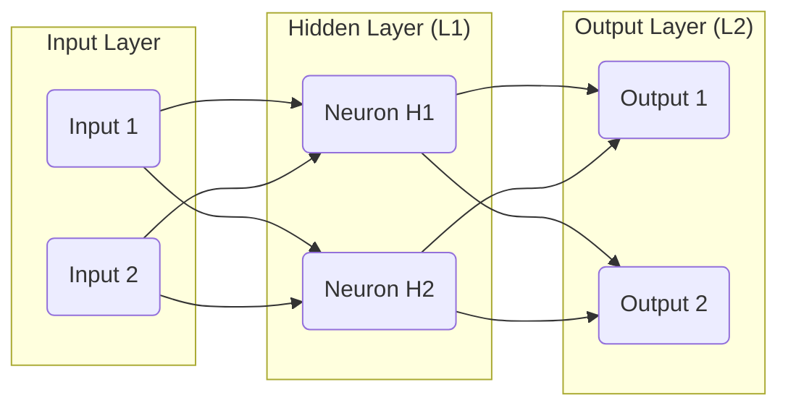
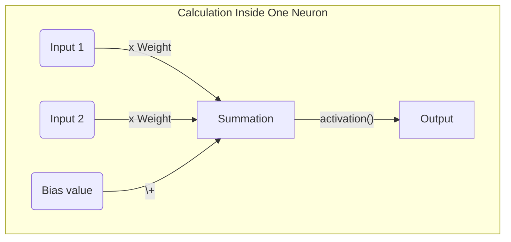

# Input

## Keywords
1. Input Layer
2. Dense Layer / Hidden Layer / Fully Connected Layer
3. Output Layer
4. Forward pass
5. Backward propagation
6. Activation function
## Questions
1. What makes multilayer perceptron so powerful and so popular?
2. Why call it "forward pass" and "backpropagation" rather than "predict" and "update
weights"? Is there a material difference?
3. Devise a formula for number of parameters in a neural network with fully connected
layers, given the size of each layer.
4. In the learning phase, when a prediction is wrong, how can you know the direction
needed to correct the different parameters?
5. What's the point of adding layers?
6. How can you know the contribution of a specific layer to the overall result?
7. How many layers is too many layers?
8. How can you go from binary to multiclass classification?
9. How much data do you need to use this model?
10. What is the best activation function?
11. Can a linear activation function be useful?
## Exercises
1. Draw a detailed diagram of a multilayer perceptron.
- Start with 2 layers of 2 neurons each
- Then generalize it
2. The backward propagation seems more complex than things we built so far.
- Calculate the gradients for each parameter in any layer.
- Use the chain rule wisely, it might help you computationally later.
3. Implement a multilayer perceptron with NumPpy.
- Start with 2 layers of 2 neurons each.
- How does this model perform with a circles toy dataset?
4. Extend your implementation for any number of layers of any number of neurons
- How does this model perform with a circles toy dataset?
- Try different numbers of layers and neurons.

# Chapter: Multilayer Perceptron

## Keywords

### 1. Input Layer

* **What is it?**
    The input layer is the very first layer in a neural network, which receives and holds the raw feature data from the dataset.

* **What is it good for?**
    Its sole purpose is to pass the initial data into the neural network for further processing. It acts as the entry point for the network.

* **Details**
    * This layer doesn't perform any computations like matrix multiplications or apply activation functions. It simply represents the input vector.
    * The number of neurons in the input layer must be equal to the number of features (or variables) in the input data.
    * For example, if you are predicting house prices based on 10 features (like area, number of bedrooms, etc.), the input layer will have 10 neurons.
    * For image data, the input is typically flattened. A 28x28 pixel grayscale image would be unrolled into a vector of 784 features, so the input layer would have 784 neurons.

* **Example**
    
    In Python with `scikit-learn`, the input layer is defined **implicitly**. Its size is automatically inferred from the number of features in the training data when you call the `.fit()` method.

    ```python
    # scikit-learn Example
    from sklearn.neural_network import MLPClassifier
    import numpy as np

    # Imagine a dataset has 10 features
    num_features = 10
    X_train = np.random.rand(100, num_features) # 100 samples, 10 features
    y_train = np.random.randint(0, 2, 100)

    # The input layer size is not explicitly defined in the constructor.
    # It will be automatically set to 10 (the number of features in X_train)
    # when we call mlp.fit(X_train, y_train).
    mlp = MLPClassifier(hidden_layer_sizes=(32,), activation='relu')

    # The moment of creation for the input layer:
    # mlp.fit(X_train, y_train)
    print("Scikit-learn infers the input layer size from the training data's shape.")
    ```

    
    Conceptually, if your data for a single sample is `[1500, 3, 2, 1995]` (representing area, bedrooms, bathrooms, year built), the input layer is just a set of 4 neurons, each holding one of these values.

    In Python, the input layer is often implicitly defined by the `input_shape` argument of the first hidden layer.

    ```python
    # Keras / TensorFlow Example
    import tensorflow as tf
    from tensorflow.keras.models import Sequential
    from tensorflow.keras.layers import Dense

    # Dataset has 10 features
    num_features = 10

    model = Sequential([
        # The first Dense layer is connected to the input layer.
        # `input_shape=(num_features,)` implicitly defines an input layer with 10 neurons.
        Dense(units=32, activation='relu', input_shape=(num_features,))
    ])
    ```

---

### 2. Dense Layer / Hidden Layer / Fully Connected Layer

* **What is it?**
    A dense layer, also known as a fully connected layer, is a core building block where each neuron is connected to every single neuron from the previous layer.

* **What is it good for?**
    These layers are responsible for learning complex patterns from the data. By stacking them, the network can learn hierarchical features, where each layer learns progressively more abstract representations of the input.

* **Details**
    * "Hidden layer" is a term for any dense layer that is between the input and output layers. Their values are not directly observed in the input or output.
    * The primary operation within a neuron in a dense layer is a linear transformation (a weighted sum of its inputs plus a bias) followed by a non-linear activation function.
    * The number of neurons in a dense layer is a crucial hyperparameter that determines the layer's learning capacity. Too few neurons might underfit, while too many might overfit or be computationally expensive.
    * The term "fully connected" or "dense" comes from the fact that every possible connection between neurons of consecutive layers exists, and each connection has its own weight.

* **Example**
    Imagine trying to recognize a face. The first hidden layer might learn to recognize simple edges from the pixel inputs. The second hidden layer might combine those edges to learn to recognize shapes like eyes, noses, and mouths. A third layer might combine those features to recognize a face.

    **Library (Scikit-learn) Implementation:**
    ```python
    from sklearn.neural_network import MLPClassifier

    # A network with ONE hidden layer of 64 neurons.
    # The `hidden_layer_sizes` argument takes a tuple, where each element
    # is the size of a hidden layer.
    mlp_one_layer = MLPClassifier(hidden_layer_sizes=(64,), activation='relu')

    # A network with TWO hidden layers:
    # First hidden layer: 100 neurons
    # Second hidden layer: 50 neurons
    mlp_two_layers = MLPClassifier(hidden_layer_sizes=(100, 50), activation='relu')
    ```


    **Library (Keras) Implementation:**
    ```python
    # A dense layer with 64 neurons and a ReLU activation function.
    # It expects input from a layer that has 128 neurons.
    layer = Dense(units=64, activation='relu', input_shape=(128,))
    ```

    **From-Scratch (NumPy) Snippet:**
    ```python
    import numpy as np

    # Example: A layer with 3 neurons, receiving input from a layer with 4 neurons.
    num_inputs = 4
    num_neurons = 3

    # Randomly initialize weights and biases
    weights = np.random.randn(num_inputs, num_neurons) # Shape: (4, 3)
    biases = np.zeros((1, num_neurons)) # Shape: (1, 3)

    # Example input from previous layer (1 sample, 4 features)
    inputs_from_prev_layer = np.random.rand(1, 4) # Shape: (1, 4)

    # Linear transformation
    z = np.dot(inputs_from_prev_layer, weights) + biases

    # Apply a non-linear activation function (to be defined elsewhere)
    # output = activation_function(z)
    print(f"Output of linear step: {z}")
    ```

* **Math**
    For a given layer $l$, the computation is a two-step process. First, a linear combination $Z^{[l]}$ is calculated, then an activation function $g$ is applied to get the layer's output, $A^{[l]}$.

    1.  **Linear Step**: The input to the layer is the activation $A^{[l-1]}$ from the previous layer. The weights for the current layer are in a matrix $W^{[l]}$ and the biases are in a vector $b^{[l]}$.
        $$Z^{[l]} = W^{[l]} A^{[l-1]} + b^{[l]}$$
        * If layer $l-1$ has $n^{[l-1]}$ neurons and layer $l$ has $n^{[l]}$ neurons, then $W^{[l]}$ has dimensions $(n^{[l]}, n^{[l-1]})$, $b^{[l]}$ has dimensions $(n^{[l]}, 1)$, and $A^{[l-1]}$ has dimensions $(n^{[l-1]}, m)$ where $m$ is the number of examples in the batch.

    2.  **Activation Step**: A non-linear activation function $g$ is applied element-wise to $Z^{[l]}$.
        $$A^{[l]} = g(Z^{[l]})$$
        This $A^{[l]}$ is then passed as input to the next layer, $l+1$.

---

### 3. Output Layer

* **What is it?**
    The output layer is the final layer in a neural network that produces the model's ultimate prediction.

* **What is it good for?**
    It formats the network's learned internal representations into the desired output format required by the specific task, such as a class probability for classification or a continuous value for regression.

* **Details**
    * The number of neurons in the output layer is determined by the problem statement.
        * **Binary Classification**: 1 neuron (typically with a Sigmoid activation function).
        * **Multiclass Classification**: $N$ neurons, where $N$ is the number of classes (typically with a Softmax activation function).
        * **Regression**: 1 neuron (typically with no activation function, i.e., a linear activation).
    * The choice of activation function for the output layer is critical and directly impacts the interpretation of the model's output.
    * The output of this layer is what is compared to the true labels ($Y$) using a loss function to calculate the model's error.

* **Example**
    With `scikit-learn`, the output layer is created **automatically** based on the class you use (`MLPClassifier` vs. `MLPRegressor`) and the nature of the target variable `y` you provide during training.

    **Library (Scikit-learn) Implementation:**
    ```python
    from sklearn.neural_network import MLPClassifier, MLPRegressor

    # For a 3-class classification problem:
    # When fit on data where y has 3 unique classes, sklearn automatically creates an
    # output layer with 3 neurons and a 'softmax' activation.
    mlp_multi_class = MLPClassifier(hidden_layer_sizes=(64,))

    # For a binary classification problem:
    # When fit on data where y has 2 unique classes, sklearn automatically creates an
    # output layer with 1 neuron and a 'logistic' (sigmoid) activation.
    mlp_binary = MLPClassifier(hidden_layer_sizes=(64,))

    # For a regression problem:
    # MLPRegressor automatically uses an output layer with 1 neuron and a linear
    # ('identity') activation to predict continuous values.
    mlp_regression = MLPRegressor(hidden_layer_sizes=(64,))
    ```
    The from-scratch implementation is identical to a dense layer, just with a specific choice of `units` and `activation`.

* **Example**
    **Library (Keras) Implementation:**
    ```python
    # For a 3-class classification problem
    output_layer_multi = Dense(units=3, activation='softmax')

    # For a binary classification problem
    output_layer_binary = Dense(units=1, activation='sigmoid')

    # For a regression problem (e.g., predicting house price)
    output_layer_regression = Dense(units=1, activation='linear') # or just activation=None
    ```
    The from-scratch implementation is identical to a dense layer, just with a specific choice of `units` and `activation`.

* **Math**
    The calculation is the same as any other dense layer. However, the choice of activation function $g$ is special. For multiclass classification, the **Softmax** function is commonly used. It takes the vector $Z^{[L]}$ (where $L$ is the final layer) and turns it into a probability distribution. For a vector $z$ with $K$ elements (one for each class):
    $$\text{Softmax}(z)_i = \frac{e^{z_i}}{\sum_{j=1}^{K} e^{z_j}} \quad \text{for } i=1, \dots, K$$
    This ensures that each output is between 0 and 1, and all outputs sum to 1, which is the definition of a probability distribution.

---

### 4. Forward Pass

* **What is it?**
    A forward pass (or forward propagation) is the process of data flowing through the neural network from the input layer, through the hidden layers, to the output layer to produce a prediction.

* **What is it good for?**
    It's how the network makes a prediction for a given set of inputs. During training, this prediction is then compared against the true label to calculate the error, which is the basis for learning.

* **Details**
    * The process starts with the input data $X$.
    * The data is passed sequentially through each layer. The output of one layer, $A^{[l]}$, becomes the input for the next layer, $l+1$.
    * Each layer performs its specific computation (linear transformation followed by activation).
    * The process ends when the final output layer produces the prediction, denoted as $\hat{Y}$. This entire flow is one "forward pass".

* **Example**
    Conceptually, it's like an assembly line.
    1.  Raw materials (input data) enter at the start.
    2.  Station 1 (Layer 1) processes them and passes the result to Station 2.
    3.  Station 2 (Layer 2) does its work and passes the result on.
    4.  ...
    5.  The final station (Output Layer) produces the finished product (the prediction).

    **From-Scratch (NumPy) Snippet:**
    ```python
    import numpy as np

    def sigmoid(z):
        return 1 / (1 + np.exp(-z))

    # Assume a 2-layer network with pre-defined weights/biases
    # X -> Layer 1 -> Layer 2 -> Y_hat
    W1, b1 = np.random.randn(2, 2), np.zeros((1, 2)) # Input: 2 feats, Layer 1: 2 neurons
    W2, b2 = np.random.randn(2, 1), np.zeros((1, 1)) # Layer 1: 2 neurons, Layer 2: 1 neuron

    # Input data (1 sample, 2 features)
    X = np.array([[0.5, -0.2]])

    # Pass through Layer 1
    Z1 = np.dot(X, W1) + b1
    A1 = sigmoid(Z1)

    # Pass through Layer 2 (Output Layer)
    Z2 = np.dot(A1, W2) + b2
    Y_hat = sigmoid(Z2)

    print(f"Prediction (Y_hat): {Y_hat}")
    ```

* **Math**
    For a simple 2-layer network (1 hidden, 1 output), the forward pass is the sequence of these calculations:
    1.  $Z^{[1]} = W^{[1]} X + b^{[1]}$
    2.  $A^{[1]} = g^{[1]}(Z^{[1]})$
    3.  $Z^{[2]} = W^{[2]} A^{[1]} + b^{[2]}$
    4.  $\hat{Y} = A^{[2]} = g^{[2]}(Z^{[2]})$

---

### 5. Backward Propagation

* **What is it?**
    Backward propagation (or backpropagation) is an algorithm used to train neural networks by efficiently calculating the gradient of the loss function with respect to each weight and bias in the network.

* **What is it good for?**
    It's the engine of learning in most neural networks. It tells the network *how* to adjust its parameters (weights and biases) to reduce the error. It determines both the direction and magnitude of the required change for each parameter.

* **Details**
    * Backpropagation works by propagating the error signal from the output layer backward through the network.
    * It relies heavily on the **chain rule** from calculus to calculate the gradients for each layer. The gradient of a layer depends on the gradients of the layers that come after it.
    * First, the error between the prediction ($\hat{Y}$) and the true label ($Y$) is calculated using a loss function.
    * Then, the gradient of this loss is computed for the parameters of the output layer.
    * This gradient is then propagated backward, layer by layer, allowing each layer to calculate the gradient of its own parameters. The process continues until the first hidden layer is reached.

* **Example**
    Imagine a game of "telephone" but for blame.
    1.  The final player (Output Layer) realizes the message is wrong and calculates the total error.
    2.  They turn to the player before them (Last Hidden Layer) and say, "Based on what you told me, you are responsible for *this much* of the error."
    3.  That player then turns to the one before them and does the same calculation: "Based on the blame I received and what you told me, you are responsible for *this much* of my portion of the error."
    4.  This continues until the blame is assigned all the way back to the first player. Each "blame" is the gradient.

* **Math**
    Backpropagation's core is the chain rule. The goal is to compute derivatives of the loss function $L$ with respect to parameters like $W^{[l]}$ and $b^{[l]}$ in any layer $l$.

    Let's find the gradient for the weights of the final layer, $W^{[L]}$:
    $$\frac{\partial L}{\partial W^{[L]}} = \frac{\partial L}{\partial A^{[L]}} \times \frac{\partial A^{[L]}}{\partial Z^{[L]}} \times \frac{\partial Z^{[L]}}{\partial W^{[L]}}$$
    * $\frac{\partial L}{\partial A^{[L]}}$: The derivative of the loss with respect to the final prediction.
    * $\frac{\partial A^{[L]}}{\partial Z^{[L]}}$: The derivative of the output activation function.
    * $\frac{\partial Z^{[L]}}{\partial W^{[L]}}$: The derivative of the linear combination with respect to the weights, which is simply the activation from the previous layer, $A^{[L-1]}$.

    Let's define $\delta^{[L]} = \frac{\partial L}{\partial A^{[L]}} \times \frac{\partial A^{[L]}}{\partial Z^{[L]}}$. This is the "error" at the output layer. The gradient is then:
    $$\frac{\partial L}{\partial W^{[L]}} = \delta^{[L]} (A^{[L-1]})^T$$
    For a hidden layer $l$, the error $\delta^{[l]}$ is calculated based on the error from the next layer, $\delta^{[l+1]}$:
    $$\delta^{[l]} = (W^{[l+1]})^T \delta^{[l+1]} \times g'^{[l]}(Z^{[l]})$$
    This recursive relationship is what allows the error to be propagated backward efficiently.

---

### 6. Activation Function

* **What is it?**
    An activation function is a mathematical function applied to the output of a neuron (or a layer of neurons) that introduces non-linear properties to the network.

* **What is it good for?**
    It allows the neural network to learn complex, non-linear relationships in the data. Without non-linear activation functions, a deep neural network would behave just like a single linear model, no matter how many layers it had.

* **Details**
    * The activation function takes the result of the linear transformation ($Z = WX + b$) and transforms it into the neuron's final output, or "activation".
    * They are typically chosen to be differentiable, which is a requirement for backpropagation to work.
    * Common activation functions for hidden layers include **ReLU**, **Leaky ReLU**, and **Tanh**.
    * Common activation functions for output layers include **Sigmoid** (for binary classification), **Softmax** (for multiclass classification), and **Linear** (for regression).

* **Example**
    **Library (Scikit-learn) Implementation:**
    ```python
    from sklearn.neural_network import MLPClassifier

    # Use ReLU activation for the hidden layers (this is the default).
    mlp_relu = MLPClassifier(hidden_layer_sizes=(32,), activation='relu')

    # Use sigmoid ('logistic') activation for the hidden layers.
    mlp_sigmoid = MLPClassifier(hidden_layer_sizes=(32,), activation='logistic')

    # Note: The output layer activation is set automatically by scikit-learn.
    # It will be 'logistic' for binary classification or 'softmax' for multiclass.
    ```

* **Example**
    **Library (Keras) Implementation:**
    ```python
    # Using ReLU in a hidden layer
    hidden_layer = Dense(units=32, activation='relu')

    # Using Sigmoid in the output layer
    output_layer = Dense(units=1, activation='sigmoid')
    ```

    **From-Scratch (NumPy) Snippet:**
    ```python
    import numpy as np

    def relu(z):
      """ReLU activation function."""
      return np.maximum(0, z)

    def sigmoid(z):
      """Sigmoid activation function."""
      return 1 / (1 + np.exp(-z))

    # Output from the linear step
    z = np.array([[-1.2, 0.5, 2.8, -0.1]])

    # Apply activations
    relu_output = relu(z)
    sigmoid_output = sigmoid(z)

    print(f"ReLU output: {relu_output}")
    print(f"Sigmoid output: {sigmoid_output}")
    ```

* **Math**
    The choice of function is critical. Two of the most common are:
    1.  **Sigmoid**: Squeezes numbers into a (0, 1) range.
        $$\sigma(z) = \frac{1}{1 + e^{-z}}$$
        Its derivative is simple: $\sigma'(z) = \sigma(z)(1 - \sigma(z))$.

    2.  **ReLU (Rectified Linear Unit)**: A piecewise linear function that is 0 for negative inputs and equal to the input for positive inputs.
        $$\text{ReLU}(z) = \max(0, z)$$
        Its derivative is also very simple: $1$ for $z > 0$ and $0$ for $z < 0$. This computational simplicity is one reason for its popularity.


---
## New Terms

### Sigmoid Function

* **What is it?**
    The sigmoid function is a mathematical function that maps any real-valued number into a value between 0 and 1.

* **What is it good for?**
    It's particularly useful in the output layer of a neural network for binary classification, where its output can be interpreted as the probability of the positive class.

* **Details**
    * It has an "S"-shaped curve.
    * While historically used in hidden layers, it has fallen out of favor for them due to the **vanishing gradient problem**. For inputs that are very large or very small, the function's slope (derivative) is close to zero.
    * During backpropagation, these near-zero gradients get multiplied repeatedly, causing the overall gradient for earlier layers to "vanish," effectively stopping them from learning.
    * Its output is not zero-centered (it's always positive), which can slow down gradient descent.

* **Example**
    ```python
    import numpy as np
    import matplotlib.pyplot as plt

    def sigmoid(z):
        return 1 / (1 + np.exp(-z))

    z = np.linspace(-10, 10, 100)
    plt.plot(z, sigmoid(z))
    plt.title("Sigmoid Function")
    plt.xlabel("z")
    plt.ylabel("sigmoid(z)")
    plt.grid(True)
    plt.show()
    ```

* **Math**
    * **Formula**:
        $$\sigma(z) = \frac{1}{1 + e^{-z}}$$
    * **Derivative**: The derivative is needed for backpropagation and can be conveniently expressed in terms of the function's output.
        $$\frac{d\sigma(z)}{dz} = \sigma(z)(1 - \sigma(z))$$
        This means if you've already calculated $\sigma(z)$ during the forward pass, you can easily compute its derivative for the backward pass.

---

### ReLU (Rectified Linear Unit)

* **What is it?**
    ReLU is an activation function that outputs the input directly if it is positive, and outputs zero otherwise.

* **What is it good for?**
    It is the most popular activation function for hidden layers in deep neural networks due to its computational efficiency and ability to mitigate the vanishing gradient problem.

* **Details**
    * **Computational Efficiency**: The function $\max(0, z)$ is very fast to compute compared to the exponentials in Sigmoid or Tanh.
    * **Non-saturating**: For positive inputs, the gradient is a constant 1. This means it doesn't "saturate" and kill the gradient for large positive values, which helps learning.
    * **Sparsity**: Because it outputs 0 for all negative inputs, it can lead to "sparse" activations, where some neurons are inactive. This can make the network more efficient.
    * **Dying ReLU Problem**: A potential downside is that if a neuron's weights are updated such that its input is always negative, it will always output 0. The gradient flowing through it will also be 0, so the neuron effectively "dies" and cannot update its weights anymore. Variants like Leaky ReLU are designed to solve this.

* **Example**
    ```python
    import numpy as np
    import matplotlib.pyplot as plt

    def relu(z):
        return np.maximum(0, z)

    z = np.linspace(-10, 10, 100)
    plt.plot(z, relu(z))
    plt.title("ReLU Function")
    plt.xlabel("z")
    plt.ylabel("relu(z)")
    plt.grid(True)
    plt.show()
    ```

* **Math**
    * **Formula**:
        $$f(z) = \max(0, z)$$
    * **Derivative**:
        $$f'(z) = \begin{cases} 1 & \text{if } z > 0 \\ 0 & \text{if } z < 0 \end{cases}$$
        The derivative is technically undefined at $z=0$, but in practice, it is set to 0 or 1. This simple derivative makes backpropagation calculations very fast.

---
## Questions

### **1. What makes multilayer perceptron so powerful and so popular?**

* **Short Answer:** MLPs are powerful because they can learn and model complex, non-linear relationships in data, something linear models cannot do.

* **Long Answer:** The power of MLPs stems from the **Universal Approximation Theorem**, which states that a neural network with at least one hidden layer containing a finite number of neurons and a non-linear activation function can approximate any continuous function to any desired degree of accuracy. This means, in theory, an MLP can learn any mapping from inputs to outputs. Their popularity comes from this power combined with the backpropagation algorithm, which provides an efficient way to train these complex models on large datasets, leading to state-of-the-art results in many fields.

---

### **2. Why call it "forward pass" and "backpropagation" rather than "predict" and "update weights"? Is there a material difference?**

* **Short Answer:** Yes, there's a material difference. The terms "forward pass" and "backpropagation" describe the *mechanisms*, while "predict" and "update weights" describe the *outcomes*.

* **Long Answer:**
    * **Forward Pass vs. Predict:** A "forward pass" is the specific algorithmic process of passing data through the network to get an output. This process is used both during training (to generate a prediction that can be used to calculate error) and during inference (to make a final "prediction" on new data). "Predict" is the purpose or result, while "forward pass" is the method.
    * **Backpropagation vs. Update Weights:** "Backpropagation" is the specific algorithm for calculating the *gradients* of the loss function. It only tells you how much and in which direction each parameter *should* change. The actual "update weights" step is done by an **optimizer** (like Gradient Descent), which takes the gradients from backpropagation and uses them to modify the weights. Backpropagation calculates the "blame"; the optimizer acts on it.

---

### **3. Devise a formula for number of parameters in a neural network with fully connected layers, given the size of each layer.**

* **Short Answer:** For each layer, calculate `(number of inputs to layer * number of neurons in layer) + number of neurons in layer`. Sum these values across all layers.

* **Long Answer:** Let the network have $L$ layers. Let $n^{[l]}$ be the number of neurons in layer $l$, and let $n^{[l-1]}$ be the number of neurons in the previous layer (which is the number of inputs to layer $l$).

    For any given dense layer $l$:
    * The **weight matrix** $W^{[l]}$ connects every neuron from layer $l-1$ to every neuron in layer $l$. Its dimensions are $(n^{[l]}, n^{[l-1]})$. The number of weights is $n^{[l]} \times n^{[l-1]}$.
    * The **bias vector** $b^{[l]}$ has one bias term for each neuron in layer $l$. The number of biases is $n^{[l]}$.
    * Total parameters for layer $l$ = $(n^{[l]} \times n^{[l-1]}) + n^{[l]}$.

    The total number of parameters in the network is the sum of parameters for all layers from $l=1$ to $L$:
    $$\text{Total Parameters} = \sum_{l=1}^{L} (n^{[l]} \times n^{[l-1]} + n^{[l]})$$
    Where $n^{[0]}$ is the number of features in the input data.

---

### **4. In the learning phase, when a prediction is wrong, how can you know the direction needed to correct the different parameters?**

* **Short Answer:** The gradient of the loss function with respect to each parameter tells you the direction of steepest ascent of the error. To reduce the error, you move in the opposite direction.

* **Long Answer:** This is the fundamental idea behind **gradient descent**. The loss function (e.g., Mean Squared Error) measures how wrong the prediction is. This function can be seen as a surface in a high-dimensional space, where the axes are the network's parameters (weights and biases). The height of the surface at any point is the error. To minimize the error, we need to "walk downhill" on this surface. The gradient, calculated via backpropagation, is a vector that points in the direction of the steepest *uphill* slope. Therefore, by taking a small step in the exact opposite direction of the gradient, we are guaranteed to move downhill, thus reducing the error and correcting the parameters in the right direction.

---

### **5. What's the point of adding layers?**

* **Short Answer:** Adding layers allows the network to learn more complex and abstract features from the data in a hierarchical manner.

* **Long Answer:** While a single hidden layer can theoretically approximate any function, it may require an exponentially large number of neurons. Deep networks (with multiple hidden layers) learn features hierarchically.
    * The **first hidden layer** learns simple, low-level features directly from the input data (e.g., edges, colors, textures in an image).
    * The **second hidden layer** takes these simple features as input and learns to combine them into more complex features (e.g., eyes, noses, patterns).
    * **Deeper layers** continue this process, combining the features from previous layers to learn even more abstract concepts (e.g., facial structures, objects).
    This hierarchical representation is more efficient and powerful for learning complex patterns found in real-world data.

---

### **6. How can you know the contribution of a specific layer to the overall result?**

* **Short Answer:** It's very difficult to isolate the exact contribution of a single layer, but techniques like ablation studies and feature visualization can provide insights.

* **Long Answer:** Neural networks are often treated as "black boxes" because the interactions between layers are highly complex and non-linear. There is no simple metric for a layer's "contribution." However, we can use several methods to gain understanding:
    * **Ablation Studies:** This involves systematically removing a layer (or a set of neurons) from a trained network and observing the impact on performance. A large drop in performance suggests the layer was critical.
    * **Feature Visualization:** For tasks like image recognition, we can visualize the activations of neurons in a specific layer. This helps us see what kind of patterns or features that layer has learned to respond to (e.g., one layer might activate for cat ears, another for car wheels).
    * **Analyzing Gradient Magnitudes:** During training, we can monitor the size of the gradients flowing through each layer. Layers with consistently small gradients may not be learning effectively and contributing less.

---

### **7. How many layers is too many layers?**

* **Short Answer:** It's too many when the model's performance on a validation set starts to decrease, which can be due to overfitting or training difficulties like vanishing gradients.

* **Long Answer:** There is no fixed number. "Too many" depends on the dataset size and complexity. Adding layers increases the model's capacity to learn, but it also brings challenges:
    * **Overfitting:** A very deep model has many parameters and can easily memorize the training data, including its noise. This leads to poor performance on new, unseen data.
    * **Vanishing/Exploding Gradients:** In very deep networks, the gradients calculated during backpropagation can become extremely small (vanish) or extremely large (explode) as they are multiplied through many layers. Vanishing gradients stop the early layers from learning, while exploding gradients make training unstable.
    * **Computational Cost:** Each layer adds computational and memory overhead, making the model slower to train and use.
    Techniques like dropout, regularization, and specialized architectures like Residual Networks (ResNets) were developed to mitigate these issues and allow for training much deeper networks.

---

### **8. How can you go from binary to multiclass classification?**

* **Short Answer:** Change the output layer to have one neuron for each class and switch the activation function from sigmoid to softmax.

* **Long Answer:** The transition involves two key changes:
    1.  **Output Layer Structure:** In binary classification, a single output neuron suffices (e.g., output > 0.5 means class 1, else class 0). For multiclass classification with $K$ classes, you need an output layer with $K$ neurons, where each neuron's output corresponds to the score for one class.
    2.  **Activation and Loss Function:**
        * The **activation function** is changed from Sigmoid to **Softmax**. Softmax takes the scores from the $K$ neurons and converts them into a probability distribution, where each output is between 0 and 1 and all outputs sum to 1. The highest value can be taken as the predicted class.
        * The **loss function** is changed from Binary Cross-Entropy to **Categorical Cross-Entropy** (or Sparse Categorical Cross-Entropy), which is designed to measure the difference between two probability distributions (the true labels and the softmax output).

---

### **9. How much data do you need to use this model?**

* **Short Answer:** There is no magic number; it depends on the complexity of the problem and the number of parameters in the model. Generally, deep learning models are data-hungry.

* **Long Answer:** The amount of data needed is proportional to the model's complexity (number of parameters). A model with millions of parameters trained on only a few thousand examples will almost certainly overfit.
    * **Rule of Thumb:** A very rough rule of thumb is to have at least 10 times as many examples as parameters, but this is not a strict rule.
    * **Problem Complexity:** A simple problem (like linear separation) might require very little data, while a complex one (like image recognition with many classes) will require vast datasets (e.g., ImageNet has over 14 million images).
    * **Data Augmentation:** If data is scarce, techniques like data augmentation (e.g., rotating, flipping, and cropping images) can be used to artificially increase the size of the training set.
    * **Transfer Learning:** One powerful technique is to use a pre-trained model (trained on a huge dataset like ImageNet) and fine-tune it on your smaller, specific dataset. This significantly reduces the amount of data you need.

---

### **10. What is the best activation function?**

* **Short Answer:** There is no single "best" one for all cases, but **ReLU** is the most common and effective default choice for hidden layers.

* **Long Answer:** The choice depends on the specific problem and layer type:
    * **Hidden Layers:** **ReLU** is the standard go-to function. It's computationally cheap and helps with the vanishing gradient problem. If you encounter the "dying ReLU" problem, variants like **Leaky ReLU** or **ELU** are good alternatives. **Tanh** is sometimes used, especially in Recurrent Neural Networks (RNNs), but is less common in standard MLPs now.
    * **Output Layer:** The choice is dictated by the task.
        * **Sigmoid** for binary classification.
        * **Softmax** for multiclass classification.
        * **Linear** (i.e., no activation) for regression.
    The best approach is to start with ReLU for hidden layers and then experiment with others if performance is not satisfactory.

---

### **11. Can a linear activation function be useful?**

* **Short Answer:** Yes, a linear activation is essential for the **output layer** of a network performing a **regression** task.

* **Long Answer:**
    * **In the Output Layer:** For regression problems, where the goal is to predict a continuous value (e.g., a price, a temperature), the model needs to be able to output any real number. Non-linear functions like Sigmoid (0 to 1) or ReLU (0 to infinity) constrain the output range. A linear activation function (which is essentially $f(z)=z$, or no function at all) places no constraints on the output value, making it the perfect choice for regression.
    * **In Hidden Layers:** Using a linear activation function in a hidden layer is **not useful**. A sequence of linear transformations is mathematically equivalent to a single linear transformation. For example, applying two linear layers `(W2 * (W1 * X))` is the same as applying one combined linear layer `((W2 * W1) * X)`. This means that no matter how many hidden layers you add with linear activations, the entire network collapses into a single-layer linear model, completely losing the ability to learn complex, non-linear patterns. This defeats the purpose of having a "deep" network.

---
## Exercises

### 1. Draw a detailed diagram of a multilayer perceptron.

#### 2 layers of 2 neurons each

Let's represent a neuron as `( )`. The input layer will have 2 features, the hidden layer will have 2 neurons, and the output layer will have 2 neurons.

**Input (2 features)** -> **Hidden Layer (2 neurons)** -> **Output Layer (2 neurons)**



* **Connections:** Every input is connected to every neuron in the hidden layer (L1). Every neuron in the hidden layer is connected to every neuron in the output layer (L2). This is a "fully connected" structure.
* **Parameters:** Each connection has a weight (e.g., `W11`). Each neuron in the hidden and output layers has a bias term.

#### Generalization

For a network with an input layer of size $n^{[0]}$, and $L$ hidden layers of sizes $n^{[1]}, n^{[2]}, \dots, n^{[L]}$, and an output layer of size $n^{[L+1]}$:

* The input layer has $n^{[0]}$ nodes.
* The first hidden layer has $n^{[1]}$ neurons. Every one of the $n^{[0]}$ input nodes is connected to every one of the $n^{[1]}$ hidden neurons.
* For any layer $l$ (where $1 \le l \le L+1$), every neuron in the previous layer ($l-1$) is connected to every neuron in layer $l$.
* Each connection has a weight, and each neuron (in hidden and output layers) has a bias.


---

### 2. The backward propagation seems more complex than things we built so far.

This exercise is to derive the gradient formulas for backpropagation using the chain rule. Let's consider a simple 2-layer network (1 hidden, 1 output) for a single training example $(X, Y)$.

**Network Structure:**
* Input $X$
* Layer 1: $Z^{[1]} = W^{[1]} X + b^{[1]}$, $A^{[1]} = g^{[1]}(Z^{[1]})$
* Layer 2: $Z^{[2]} = W^{[2]} A^{[1]} + b^{[2]}$, $A^{[2]} = \hat{Y} = g^{[2]}(Z^{[2]})$

**Loss Function:**
Let's use Mean Squared Error (MSE) for simplicity: $L(\hat{Y}, Y) = \frac{1}{2}(\hat{Y} - Y)^2$. The $\frac{1}{2}$ is for convenience in differentiation.

**Goal:** Find the gradients $\frac{\partial L}{\partial W^{[2]}}$, $\frac{\partial L}{\partial b^{[2]}}$, $\frac{\partial L}{\partial W^{[1]}}$, and $\frac{\partial L}{\partial b^{[1]}}$.

---

#### Gradients for Layer 2 (Output Layer)

**1. Gradient for $W^{[2]}$**

Using the chain rule:
$$\frac{\partial L}{\partial W^{[2]}} = \frac{\partial L}{\partial \hat{Y}} \cdot \frac{\partial \hat{Y}}{\partial Z^{[2]}} \cdot \frac{\partial Z^{[2]}}{\partial W^{[2]}}$$

Let's calculate each part:
* $\frac{\partial L}{\partial \hat{Y}} = (\hat{Y} - Y)$
* $\frac{\partial \hat{Y}}{\partial Z^{[2]}} = g'^{[2]}(Z^{[2]})$ (derivative of activation function of layer 2)
* $\frac{\partial Z^{[2]}}{\partial W^{[2]}} = A^{[1]}$ (since $Z^{[2]} = W^{[2]} A^{[1]} + b^{[2]}$)

Combining them:
$$\frac{\partial L}{\partial W^{[2]}} = (\hat{Y} - Y) \cdot g'^{[2]}(Z^{[2]}) \cdot (A^{[1]})^T$$
(We transpose $A^{[1]}$ to match matrix dimensions).

Let's define the error term for layer 2 as $\delta^{[2]} = \frac{\partial L}{\partial \hat{Y}} \cdot \frac{\partial \hat{Y}}{\partial Z^{[2]}} = (\hat{Y} - Y) \cdot g'^{[2]}(Z^{[2]})$.
Then:
$$\frac{\partial L}{\partial W^{[2]}} = \delta^{[2]} (A^{[1]})^T$$

**2. Gradient for $b^{[2]}$**

$$\frac{\partial L}{\partial b^{[2]}} = \frac{\partial L}{\partial \hat{Y}} \cdot \frac{\partial \hat{Y}}{\partial Z^{[2]}} \cdot \frac{\partial Z^{[2]}}{\partial b^{[2]}}$$
The first two terms are the same. The last term $\frac{\partial Z^{[2]}}{\partial b^{[2]}} = 1$.
So:
$$\frac{\partial L}{\partial b^{[2]}} = \delta^{[2]}$$

---

#### Gradients for Layer 1 (Hidden Layer)

This is trickier as we need to propagate the error from Layer 2.

**3. Gradient for $W^{[1]}$**

$$\frac{\partial L}{\partial W^{[1]}} = \frac{\partial L}{\partial Z^{[2]}} \cdot \frac{\partial Z^{[2]}}{\partial A^{[1]}} \cdot \frac{\partial A^{[1]}}{\partial Z^{[1]}} \cdot \frac{\partial Z^{[1]}}{\partial W^{[1]}}$$
Let's break it down:
* $\frac{\partial L}{\partial Z^{[2]}}$ is our error term $\delta^{[2]}$.
* $\frac{\partial Z^{[2]}}{\partial A^{[1]}} = W^{[2]}$ (since $Z^{[2]} = W^{[2]} A^{[1]} + b^{[2]}$)
* $\frac{\partial A^{[1]}}{\partial Z^{[1]}} = g'^{[1]}(Z^{[1]})$ (derivative of activation function of layer 1)
* $\frac{\partial Z^{[1]}}{\partial W^{[1]}} = X$

Combining them:
$$\frac{\partial L}{\partial W^{[1]}} = (W^{[2]})^T \delta^{[2]} \cdot g'^{[1]}(Z^{[1]}) \cdot X^T$$
(Transposes are used for correct matrix multiplication dimensions).

Let's define the error term for layer 1, $\delta^{[1]}$, which is the error from layer 2 propagated back:
$$\delta^{[1]} = \frac{\partial L}{\partial Z^{[1]}} = (W^{[2]})^T \delta^{[2]} \cdot g'^{[1]}(Z^{[1]})$$
Then:
$$\frac{\partial L}{\partial W^{[1]}} = \delta^{[1]} X^T$$

**4. Gradient for $b^{[1]}$**

Using the same logic:
$$\frac{\partial L}{\partial b^{[1]}} = \frac{\partial L}{\partial Z^{[1]}} \cdot \frac{\partial Z^{[1]}}{\partial b^{[1]}}$$
We already found $\frac{\partial L}{\partial Z^{[1]}} = \delta^{[1]}$ and we know $\frac{\partial Z^{[1]}}{\partial b^{[1]}} = 1$.
So:
$$\frac{\partial L}{\partial b^{[1]}} = \delta^{[1]}$$

**Summary of Backpropagation steps:**
1.  Perform a forward pass to compute all $Z^{[l]}$ and $A^{[l]}$ and the final loss $L$.
2.  Compute the output error: $\delta^{[2]} = (\hat{Y} - Y) \cdot g'^{[2]}(Z^{[2]})$.
3.  Compute the gradients for Layer 2: $\frac{\partial L}{\partial W^{[2]}} = \delta^{[2]} (A^{[1]})^T$ and $\frac{\partial L}{\partial b^{[2]}} = \delta^{[2]}$.
4.  Compute the hidden layer error: $\delta^{[1]} = (W^{[2]})^T \delta^{[2]} \cdot g'^{[1]}(Z^{[1]})$.
5.  Compute the gradients for Layer 1: $\frac{\partial L}{\partial W^{[1]}} = \delta^{[1]} X^T$ and $\frac{\partial L}{\partial b^{[1]}} = \delta^{[1]}$.

---

### 3. Implement a multilayer perceptron with NumPy.

Here is an implementation of a 2-layer (1 hidden, 1 output) MLP using NumPy, tested on the circles dataset.

```python
import numpy as np
import matplotlib.pyplot as plt
from sklearn.datasets import make_circles
from sklearn.model_selection import train_test_split

# --- Activation Functions and their Derivatives ---
def sigmoid(Z):
    return 1 / (1 + np.exp(-Z))

def relu(Z):
    return np.maximum(0, Z)

def sigmoid_derivative(Z):
    s = sigmoid(Z)
    return s * (1 - s)

def relu_derivative(Z):
    dZ = np.array(Z, copy=True)
    dZ[Z <= 0] = 0
    dZ[Z > 0] = 1
    return dZ

# --- Loss Function ---
def binary_cross_entropy(Y_hat, Y):
    m = Y.shape[1]
    # Add a small epsilon for numerical stability to avoid log(0)
    epsilon = 1e-8
    Y_hat = np.clip(Y_hat, epsilon, 1 - epsilon)
    loss = -1/m * np.sum(Y * np.log(Y_hat) + (1 - Y) * np.log(1 - Y_hat))
    return np.squeeze(loss)

# --- Model Implementation (2 Layers) ---

# 1. Initialize Parameters
def initialize_parameters(n_x, n_h, n_y):
    """
    n_x: size of the input layer
    n_h: size of the hidden layer
    n_y: size of the output layer
    """
    W1 = np.random.randn(n_h, n_x) * 0.01
    b1 = np.zeros((n_h, 1))
    W2 = np.random.randn(n_y, n_h) * 0.01
    b2 = np.zeros((n_y, 1))
    
    parameters = {"W1": W1, "b1": b1, "W2": W2, "b2": b2}
    return parameters

# 2. Forward Propagation
def forward_pass(X, parameters):
    W1, b1, W2, b2 = parameters["W1"], parameters["b1"], parameters["W2"], parameters["b2"]
    
    Z1 = np.dot(W1, X) + b1
    A1 = relu(Z1)  # Use ReLU for the hidden layer
    Z2 = np.dot(W2, A1) + b2
    A2 = sigmoid(Z2) # Use Sigmoid for the binary output
    
    cache = {"Z1": Z1, "A1": A1, "Z2": Z2, "A2": A2}
    return A2, cache

# 3. Backward Propagation
def backward_pass(parameters, cache, X, Y):
    m = X.shape[1]
    W1, W2 = parameters["W1"], parameters["W2"]
    A1, A2 = cache["A1"], cache["A2"]
    Z1 = cache["Z1"]
    
    # Gradients for Layer 2 (Output Layer)
    dZ2 = A2 - Y # Derivative of binary cross-entropy and sigmoid
    dW2 = (1/m) * np.dot(dZ2, A1.T)
    db2 = (1/m) * np.sum(dZ2, axis=1, keepdims=True)
    
    # Gradients for Layer 1 (Hidden Layer)
    dA1 = np.dot(W2.T, dZ2)
    dZ1 = dA1 * relu_derivative(Z1) # Element-wise multiplication
    dW1 = (1/m) * np.dot(dZ1, X.T)
    db1 = (1/m) * np.sum(dZ1, axis=1, keepdims=True)
    
    grads = {"dW1": dW1, "db1": db1, "dW2": dW2, "db2": db2}
    return grads

# 4. Update Parameters
def update_parameters(parameters, grads, learning_rate):
    W1, b1, W2, b2 = parameters["W1"], parameters["b1"], parameters["W2"], parameters["b2"]
    dW1, db1, dW2, db2 = grads["dW1"], grads["db1"], grads["dW2"], grads["db2"]

    W1 = W1 - learning_rate * dW1
    b1 = b1 - learning_rate * db1
    W2 = W2 - learning_rate * dW2
    b2 = b2 - learning_rate * db2
    
    parameters = {"W1": W1, "b1": b1, "W2": W2, "b2": b2}
    return parameters

# --- Training Loop ---
def model_2_layer(X, Y, n_h, num_iterations=10000, learning_rate=0.5, print_cost=False):
    n_x = X.shape[0]
    n_y = Y.shape[0]
    
    parameters = initialize_parameters(n_x, n_h, n_y)
    costs = []
    
    for i in range(num_iterations):
        # Forward pass
        Y_hat, cache = forward_pass(X, parameters)
        
        # Cost
        cost = binary_cross_entropy(Y_hat, Y)
        
        # Backward pass
        grads = backward_pass(parameters, cache, X, Y)
        
        # Update parameters
        parameters = update_parameters(parameters, grads, learning_rate)
        
        if print_cost and i % 1000 == 0:
            print(f"Cost after iteration {i}: {cost}")
            costs.append(cost)
            
    return parameters, costs

def predict(parameters, X):
    A2, _ = forward_pass(X, parameters)
    predictions = (A2 > 0.5)
    return predictions

# --- Generate Data and Run ---
X, y = make_circles(n_samples=400, noise=0.05, factor=0.5, random_state=1)
X_train, X_test, y_train, y_test = train_test_split(X, y, test_size=0.2, random_state=42)

# Reshape data for our model (features x samples)
X_train = X_train.T
y_train = y_train.reshape(1, y_train.shape[0])
X_test = X_test.T
y_test = y_test.reshape(1, y_test.shape[0])

# Train the model
# Hidden layer with 4 neurons
parameters, costs = model_2_layer(X_train, y_train, n_h=4, num_iterations=20000, learning_rate=1, print_cost=True)

# Evaluate the model
predictions = predict(parameters, X_test)
accuracy = float((np.dot(y_test, predictions.T) + np.dot(1 - y_test, 1 - predictions.T)) / y_test.size * 100)
print(f'Accuracy on test set: {accuracy}%')

# Plot decision boundary
def plot_decision_boundary(model, X, y):
    x_min, x_max = X[0, :].min() - 0.2, X[0, :].max() + 0.2
    y_min, y_max = X[1, :].min() - 0.2, X[1, :].max() + 0.2
    h = 0.01
    xx, yy = np.meshgrid(np.arange(x_min, x_max, h), np.arange(y_min, y_max, h))
    Z = model(np.c_[xx.ravel(), yy.ravel()].T)
    Z = Z.reshape(xx.shape)
    plt.contourf(xx, yy, Z, cmap=plt.cm.Spectral, alpha=0.8)
    plt.scatter(X[0, :], X[1, :], c=y.ravel(), cmap=plt.cm.Spectral, edgecolors='k')
    plt.title("Decision Boundary")
    plt.show()

plot_decision_boundary(lambda x: predict(parameters, x), X_train, y_train)
```
**Performance on Circles Dataset:**
A simple 2-layer model with a non-linear activation like ReLU in the hidden layer performs very well on the circles dataset. A linear model would fail completely as the data is not linearly separable. This model can learn the non-linear circular boundary required to separate the two classes, typically achieving near 100% accuracy.

---

### 4. Extend your implementation for any number of layers of any number of neurons

Here is the refactored, generalized code for an L-layer neural network.

```python
import numpy as np
import matplotlib.pyplot as plt
from sklearn.datasets import make_circles
from sklearn.model_selection import train_test_split

# --- Activation Functions (same as before) ---
def sigmoid(Z): return 1 / (1 + np.exp(-Z))
def relu(Z): return np.maximum(0, Z)
def sigmoid_derivative(A): return A * (1 - A) # Takes activation A as input
def relu_derivative(Z):
    dZ = np.ones_like(Z)
    dZ[Z <= 0] = 0
    return dZ

# --- Loss Function (same as before) ---
def binary_cross_entropy(Y_hat, Y):
    m = Y.shape[1]
    epsilon = 1e-8
    Y_hat = np.clip(Y_hat, epsilon, 1 - epsilon)
    cost = -1/m * np.sum(Y * np.log(Y_hat) + (1 - Y) * np.log(1 - Y_hat))
    return np.squeeze(cost)

# --- Model Implementation (L Layers) ---

# 1. Initialize Parameters
def initialize_parameters_deep(layer_dims):
    """
    layer_dims: list containing the number of neurons in each layer (input, hidden1, ..., output)
    """
    parameters = {}
    L = len(layer_dims)
    for l in range(1, L):
        parameters[f"W{l}"] = np.random.randn(layer_dims[l], layer_dims[l-1]) * np.sqrt(2 / layer_dims[l-1]) # He initialization
        parameters[f"b{l}"] = np.zeros((layer_dims[l], 1))
    return parameters

# 2. Forward Propagation
def forward_pass_deep(X, parameters):
    caches = []
    A = X
    L = len(parameters) // 2  # number of layers
    
    # Forward pass for hidden layers (ReLU)
    for l in range(1, L):
        A_prev = A
        W = parameters[f"W{l}"]
        b = parameters[f"b{l}"]
        Z = np.dot(W, A_prev) + b
        A = relu(Z)
        cache = ((A_prev, W, b), Z)
        caches.append(cache)
        
    # Forward pass for output layer (Sigmoid)
    W = parameters[f"W{L}"]
    b = parameters[f"b{L}"]
    Z = np.dot(W, A) + b
    AL = sigmoid(Z)
    cache = ((A, W, b), Z)
    caches.append(cache)
    
    return AL, caches

# 3. Backward Propagation
def backward_pass_deep(AL, Y, caches):
    grads = {}
    L = len(caches)
    m = AL.shape[1]
    Y = Y.reshape(AL.shape)
    
    # Initial derivative for the output layer
    dAL = - (np.divide(Y, AL) - np.divide(1 - Y, 1 - AL))
    
    # Backward pass for output layer (Sigmoid)
    current_cache = caches[L-1]
    linear_cache, Z = current_cache
    A_prev, W, b = linear_cache
    s = sigmoid(Z)
    dZ = dAL * sigmoid_derivative(s)
    grads[f"dW{L}"] = (1/m) * np.dot(dZ, A_prev.T)
    grads[f"db{L}"] = (1/m) * np.sum(dZ, axis=1, keepdims=True)
    dA_prev = np.dot(W.T, dZ)
    
    # Backward pass for hidden layers (ReLU)
    for l in reversed(range(L-1)):
        current_cache = caches[l]
        linear_cache, Z = current_cache
        A_prev, W, b = linear_cache
        
        dZ = dA_prev * relu_derivative(Z)
        grads[f"dW{l+1}"] = (1/m) * np.dot(dZ, A_prev.T)
        grads[f"db{l+1}"] = (1/m) * np.sum(dZ, axis=1, keepdims=True)
        dA_prev = np.dot(W.T, dZ)
        
    return grads

# 4. Update Parameters
def update_parameters_deep(parameters, grads, learning_rate):
    L = len(parameters) // 2
    for l in range(1, L + 1):
        parameters[f"W{l}"] -= learning_rate * grads[f"dW{l}"]
        parameters[f"b{l}"] -= learning_rate * grads[f"db{l}"]
    return parameters
    
# --- Training Loop ---
def model_L_layer(X, Y, layer_dims, num_iterations=3000, learning_rate=0.075, print_cost=False):
    parameters = initialize_parameters_deep(layer_dims)
    costs = []

    for i in range(num_iterations):
        AL, caches = forward_pass_deep(X, parameters)
        cost = binary_cross_entropy(AL, Y)
        grads = backward_pass_deep(AL, Y, caches)
        parameters = update_parameters_deep(parameters, grads, learning_rate)
        
        if print_cost and i % 1000 == 0:
            print(f"Cost after iteration {i}: {cost}")
            costs.append(cost)
            
    return parameters, costs

def predict_deep(parameters, X):
    AL, _ = forward_pass_deep(X, parameters)
    predictions = (AL > 0.5)
    return predictions

# --- Generate Data and Run ---
X, y = make_circles(n_samples=400, noise=0.05, factor=0.5, random_state=1)
X_train, X_test, y_train, y_test = train_test_split(X, y, test_size=0.2, random_state=42)

X_train = X_train.T
y_train = y_train.reshape(1, y_train.shape[0])
X_test = X_test.T
y_test = y_test.reshape(1, y_test.shape[0])

# Define model architecture: Input(2) -> Hidden(10) -> Hidden(5) -> Output(1)
layer_dims = [X_train.shape[0], 10, 5, 1]

parameters, costs = model_L_layer(X_train, y_train, layer_dims, num_iterations=10000, learning_rate=0.5, print_cost=True)

# Evaluate the model
predictions = predict_deep(parameters, X_test)
accuracy = float((np.dot(y_test, predictions.T) + np.dot(1 - y_test, 1 - predictions.T)) / y_test.size * 100)
print(f'Accuracy on test set: {accuracy}%')

# Plot decision boundary
plot_decision_boundary(lambda x: predict_deep(parameters, x), X_train, y_train)
```
**Performance with different layers:**
* For the circles dataset, a single hidden layer is sufficient (`[2, 5, 1]`). Adding more layers (`[2, 10, 5, 1]`) might not significantly improve accuracy and could slightly increase the risk of overfitting if the dataset is small.
* The number of neurons is also important. Too few neurons (e.g., `[2, 2, 1]`) might struggle to learn the complex boundary. A moderate number (e.g., 5-10 neurons) is usually enough for this toy problem.
* This generalized implementation demonstrates the power of deep learning architectures, allowing for easy experimentation with different depths and widths to find the optimal model for a given problem.

