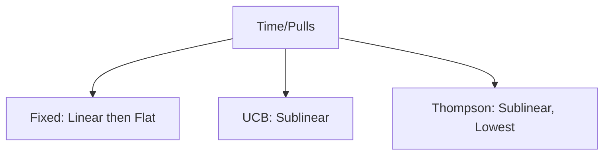

# Gemini
## Keywords

### 1. Exploration vs Exploitation Trade-off

* **What is it?**
    The exploration-exploitation trade-off is the fundamental dilemma in reinforcement learning where an agent must choose between repeating actions that have worked well in the past (exploitation) and trying new, uncertain actions to discover potentially better rewards (exploration). 🤔

* **What is it good for?**
    Balancing this trade-off is crucial for effective learning; too much exploitation can cause the agent to get stuck with a suboptimal strategy, while too much exploration can prevent it from ever capitalizing on the good strategies it finds.

* **Details**
    * **Exploitation:** This involves using the current best-known information to maximize immediate reward. The agent selects the action that has the highest estimated value based on its past experience.
    * **Exploration:** This involves gathering new information about the environment. The agent selects an action that is not necessarily the best-known one, with the hope of improving its estimates and discovering a better overall strategy in the long run.
    * The optimal balance often changes over time. Early in training, it's beneficial to explore heavily. As the agent learns more about the environment, it should gradually shift towards exploitation.
    * Many algorithms, like **Epsilon-Greedy**, explicitly manage this trade-off.

* **Example**
    **Conceptual Analogy:** Imagine choosing a restaurant for dinner.
    * **Exploitation:** You go to your favorite restaurant that you know is good. You are guaranteed a decent meal (a known reward).
    * **Exploration:** You try a new restaurant you've never been to. It could be amazing (a better reward than your favorite) or terrible (a worse reward).
    Every time you go out to eat, you face this choice. Do you stick with what you know or risk it for a potentially better outcome?

***

### 2. Environment

* **What is it?**
    The environment is the external world in which an agent operates, comprising everything outside of the agent itself. 🌍

* **What is it good for?**
    It defines the problem space for the reinforcement learning task; it provides the **states** the agent can be in, defines the possible **actions** the agent can take, and gives out **rewards** based on those actions.

* **Details**
    * The environment takes the agent's current state and action as input and returns the agent's next state and a reward as output.
    * Environments can be **fully observable**, where the agent directly observes the true state, or **partially observable**, where the agent only receives an observation that may be an incomplete or noisy representation of the state.
    * Environments can be **deterministic**, where a given action in a given state always leads to the same next state and reward, or **stochastic**, where there's an element of randomness.
    * In simulations, the environment is a piece of code (e.g., a game engine like Atari or a physics simulator like MuJoCo). In robotics, the environment is the real world.

* **Example**
    **Conceptual Analogy:** In a game of chess, the **environment** is the chessboard, the pieces, and the rules of the game. It dictates how pieces can move (the physics of the world), shows the agent the current board position (the state), and determines when the game is won or lost (providing the final reward).

    **Code Example (Pseudo-code for an Environment class):**
    ```python
    class ChessEnvironment:
        def __init__(self):
            self.board_state = # Initial board setup
            self.done = False

        def get_state(self):
            """Returns the current board configuration."""
            return self.board_state

        def step(self, action):
            """
            Takes an action (a move) and updates the environment.
            Returns the next state, the reward, and whether the game is over.
            """
            # 1. Validate the action (is the move legal?)
            # 2. Update the board state based on the action
            self.board_state = # new board setup

            # 3. Calculate reward and done status
            if is_checkmate(self.board_state):
                reward = 1.0 # Positive reward for winning
                self.done = True
            elif is_draw(self.board_state):
                reward = 0.5
                self.done = True
            else:
                reward = 0.0 # No reward for intermediate moves
                self.done = False

            return self.board_state, reward, self.done
    ```

***

### 3. Agent

* **What is it?**
    The agent is the learner or decision-maker in a reinforcement learning setup; it is the algorithm that perceives its environment and decides which actions to take. 🤖

* **What is it good for?**
    The agent's purpose is to learn a **policy** (a strategy) that maximizes its cumulative reward over time.

* **Details**
    * The agent's core components are its **policy** and its **learning algorithm**.
    * The policy is the agent's "brain," which maps states to actions.
    * The learning algorithm (e.g., Q-learning, SARSA) is the method the agent uses to update its policy based on the experience it gathers from the environment.
    * The agent and environment interact in a continuous loop: the agent takes an action, the environment responds with a new state and a reward, and the agent uses this information to choose its next action and improve its policy.

* **Example**
    **Conceptual Analogy:** In a game of chess, the **agent** is the player. It observes the board (the state), thinks about possible moves (actions), and chooses one based on its strategy (policy). After the opponent responds, the agent observes the new board state and plans its next move, learning from the outcome of its previous decisions.

    **Code Example (Pseudo-code for an Agent's interaction loop):**
    ```python
    # agent = QLearningAgent()
    # environment = ChessEnvironment()

    # state = environment.get_state()

    # while not environment.done:
    #     # 1. Agent chooses an action based on its policy
    #     action = agent.choose_action(state)

    #     # 2. Environment responds to the action
    #     next_state, reward, done = environment.step(action)

    #     # 3. Agent learns from this experience (state, action, reward, next_state)
    #     agent.learn(state, action, reward, next_state, done)

    #     # 4. Update the state for the next iteration
    #     state = next_state
    ```


***

### 4. Curiosity

* **What is it?**
    Curiosity is a mechanism for **intrinsic motivation** in reinforcement learning that encourages an agent to explore its environment not for an external reward, but for the sake of discovering novel or surprising states.

* **What is it good for?**
    It is crucial for solving tasks with **sparse rewards**, where the agent might go for a very long time without receiving any positive feedback. Curiosity helps the agent to explore productively instead of getting stuck or wandering aimlessly.

* **Details**
    * Curiosity is implemented as an "intrinsic reward" that the agent generates for itself. This intrinsic reward is added to the external reward from the environment.
    * A common way to generate this reward is by training a separate model that tries to predict the outcome of the agent's actions.
    * The curiosity reward is high when the prediction model makes a large error, meaning the agent has encountered something surprising or unpredictable. This encourages the agent to visit parts of the environment where its knowledge is poor.
    * This allows the agent to learn useful skills and build a good model of the world even before it discovers the main task's reward.

* **Example**
    **Conceptual Analogy:** A baby in a playroom isn't given a reward for every action. It plays with blocks, bangs on a toy piano, and crawls into a corner not because it gets a cookie, but because it's *curious*. It's intrinsically motivated to understand its environment. The "surprise" of hearing a new sound from the piano is its own reward, which encourages further exploration and learning.

***

### 5. Regret

* **What is it?**
    Regret is a performance measure in reinforcement learning that quantifies how much worse an agent's strategy is compared to the optimal strategy that could have been chosen in hindsight.

* **What is it good for?**
    It provides a formal way to analyze the cost of exploration. An agent with low regret is one that quickly learns to stop exploring bad actions and converges towards the best possible long-term strategy.

* **Details**
    * Regret is calculated at each timestep as the difference between the reward of the optimal action and the reward of the action the agent actually chose.
    * Total regret is the sum of these differences over all timesteps.
    * The goal of many RL algorithms, especially in the context of the **Multi-Armed Bandit** problem, is to minimize total regret.
    * An algorithm that explores too much will have high regret because it spends too much time on suboptimal actions. An algorithm that exploits too early might get stuck on a suboptimal action, also leading to high cumulative regret over time.

* **Math**
    Let $a^*$ be the optimal action at timestep $t$, and $a_t$ be the action the agent chose. Let $R(a)$ be the reward for taking action $a$. The regret at timestep $t$, denoted $r_t$, is:
    $$ r_t = R(a^*) - R(a_t) $$
    The total regret over $T$ timesteps is:
    $$ \text{Total Regret} = \sum_{t=1}^{T} r_t = \sum_{t=1}^{T} (R(a^*) - R(a_t)) $$

***

### 6. Policy / on-policy / off-policy

* **What is it?**
    A **policy** ($\pi$) is the agent's strategy or "brain," which dictates the action to take for any given state.

* **What is it good for?**
    The entire goal of a reinforcement learning agent is to find an optimal policy that maximizes the cumulative reward over time.

* **Details**
    * A **deterministic policy** maps each state to a single action: $\pi(s) = a$.
    * A **stochastic policy** maps each state to a probability distribution over actions: $\pi(a|s) = P(A_t=a | S_t=s)$. This is more common as it naturally allows for exploration.
    * **On-policy learning:** The agent learns a policy by following that same policy to gather experience. It's like "learning on the job." The policy used to generate data is the same one being improved. **SARSA** is a classic on-policy algorithm.
    * **Off-policy learning:** The agent can learn about the optimal policy while following a different, more exploratory policy. It's like watching someone else do a job to learn how to do it best. The policy used to generate data (the behavior policy) can be different from the policy being learned (the target policy). **Q-learning** is a classic off-policy algorithm.

* **Example**
    **Conceptual Analogy:** You want to learn the fastest route to work.
    * **Policy:** Your current belief about the best route (e.g., "At the main intersection, turn left").
    * **On-policy learning:** You follow your current route to work every day. If you hit traffic, you slightly update your belief about that route for tomorrow. You only learn about the roads you actually take.
    * **Off-policy learning:** You take a completely random, exploratory route to work each day (behavior policy). However, you use this data to update your mental map of what the *single fastest route* would be (target policy), even learning about intersections you only passed through once.

***

### 7. Multi-Arm Bandit

* **What is it?**
    The Multi-Armed Bandit is a simplified reinforcement learning problem that demonstrates the exploration-exploitation trade-off in its purest form, where an agent must choose between multiple levers (or "arms"), each with an unknown reward probability.

* **What is it good for?**
    It's a classic problem used to study and compare different exploration strategies, and it has direct applications in areas like A/B testing, clinical trials, and ad placement.

* **Details**
    * The problem consists of $k$ arms (actions), where each arm $i$ provides a reward drawn from an unknown probability distribution.
    * The agent has no initial knowledge of these distributions.
    * At each timestep, the agent pulls one arm and receives a reward.
    * The goal is to maximize the total reward over a series of pulls, which requires intelligently balancing pulling the arm that seems best so far (exploitation) with pulling other arms to learn more about them (exploration).
    * It's a "stateless" RL problem; the state never changes.

* **Example**
    **Conceptual Analogy:** A gambler at a row of slot machines ("one-armed bandits"). Each machine pays out with a different, unknown probability. The gambler must decide whether to keep playing the machine that just paid out (exploit) or try other machines to find one with a better payout rate (explore).

    **Code Example (NumPy implementation of Epsilon-Greedy):**
    ```python
    import numpy as np

    class EpsilonGreedyBandit:
        def __init__(self, k, epsilon=0.1):
            self.k = k  # Number of arms
            self.epsilon = epsilon
            self.q_values = np.zeros(k)  # Estimated value of each arm
            self.n_pulls = np.zeros(k)   # Number of times each arm was pulled

        def choose_action(self):
            # Exploration vs. Exploitation
            if np.random.rand() < self.epsilon:
                # Explore: choose a random arm
                return np.random.randint(self.k)
            else:
                # Exploit: choose the arm with the best current Q-value
                return np.argmax(self.q_values)

        def update(self, action, reward):
            # Update the counts and Q-values for the chosen arm
            self.n_pulls[action] += 1
            # Update Q-value using an incremental average
            self.q_values[action] += (1 / self.n_pulls[action]) * (reward - self.q_values[action])

    # --- Simulation ---
    # bandit = EpsilonGreedyBandit(k=5, epsilon=0.1)
    # true_payouts = np.random.rand(5) # The hidden truth

    # for _ in range(1000):
    #     action = bandit.choose_action()
    #     reward = 1 if np.random.rand() < true_payouts[action] else 0
    #     bandit.update(action, reward)
    # print(f"Estimated payouts: {bandit.q_values}")
    # print(f"True payouts: {true_payouts}")
    ```

***

### 8. Monte Carlo (MC) Methods

* **What is it?**
    Monte Carlo methods in reinforcement learning are a class of algorithms that learn the **Value Function** by averaging the sample returns from many complete **episodes** of experience.

* **What is it good for?**
    MC methods are well-suited for episodic tasks (tasks with a clear start and end, like a game) and do not require a model of the environment's dynamics.

* **Details**
    * An **episode** is a full sequence of states, actions, and rewards from a start state to a terminal state.
    * The **return** ($G_t$) is the total discounted reward from timestep $t$ to the end of the episode.
    * To estimate the value of a state, $V(s)$, MC methods simply average the returns that have followed visits to that state across all episodes.
    * Because MC methods wait until the end of an episode to make updates, they have high variance but are unbiased.
    * There are two main variants: First-Visit MC (averages returns from the first time a state is visited in each episode) and Every-Visit MC (averages returns from every visit).

* **Example**
    **Conceptual Analogy:** You want to figure out how good your opening move is in a game of chess (the "value" of that opening state).
    * **MC Method:** You play 1,000 full games starting with that move. You record the outcome of each game (win=+1, loss=-1, draw=0). Your estimate of the opening move's value is the average of those 1,000 outcomes. You only learn *after* each game is completely finished.

* **Math**
    The return at timestep $t$ is the sum of discounted future rewards:
    $$ G_t = R_{t+1} + \gamma R_{t+2} + \gamma^2 R_{t+3} + \dots $$
    The value function $V(s)$ is updated towards the average of the observed returns $G_t$ for that state:
    $$ V(S_t) \leftarrow V(S_t) + \alpha (G_t - V(S_t)) $$
    Where $\alpha$ is a learning rate.

***

### 9. Q-learning

* **What is it?**
    Q-learning is a model-free, **off-policy** **Temporal Difference (TD)** learning algorithm that learns an optimal policy by finding the optimal **action-value function**, Q(s, a).

* **What is it good for?**
    It's one of the most fundamental and popular RL algorithms because it can learn the optimal policy even while exploring suboptimally, and it's relatively simple to implement.

* **Details**
    * The "Q" in Q-learning stands for "Quality," representing the quality or value of taking a specific action $a$ in a specific state $s$.
    * It is an **off-policy** algorithm because its update rule directly approximates the optimal Q-value, $Q^*(s, a)$, by using the maximum Q-value of the next state, regardless of which action was actually taken next.
    * It is a **TD** algorithm because it updates its Q-value estimates based on the Q-value estimate of the next state (a process called bootstrapping), rather than waiting for the end of an episode like Monte Carlo methods.
    * The Q-values are typically stored in a lookup table (a Q-table) for small state-action spaces.

* **Example**
    **Conceptual Analogy:** You're navigating a maze. Your Q-table is a mental cheat sheet that tells you the "quality" of turning left or right at every intersection. To update your cheat sheet for intersection `S`, you take a turn `A`, arrive at `S'`, and receive a reward. You then look at your cheat sheet for `S'` and find the *best possible score* you could get from there. You update the score for `(S, A)` based on the immediate reward plus this future best-case-scenario score.

* **Math**
    The Q-learning update rule is the core of the algorithm. After taking action $A_t$ in state $S_t$ and observing reward $R_{t+1}$ and next state $S_{t+1}$:
    $$ Q(S_t, A_t) \leftarrow Q(S_t, A_t) + \alpha \left[ R_{t+1} + \gamma \max_{a} Q(S_{t+1}, a) - Q(S_t, A_t) \right] $$
    * $\alpha$: Learning rate.
    * $\gamma$: Discount factor for future rewards.
    * $R_{t+1} + \gamma \max_{a} Q(S_{t+1}, a)$: This is the TD Target. It's the immediate reward plus the discounted *maximum* (optimal) Q-value from the next state.

***

### 10. SARSA

* **What is it?**
    SARSA is a model-free, **on-policy** **Temporal Difference (TD)** learning algorithm that learns the **action-value function**, Q(s, a), based on the policy the agent is currently following.

* **What is it good for?**
    SARSA is useful in situations where it's important to learn a safe and realistic policy, as it takes into account the agent's own exploratory behavior when updating its value estimates.

* **Details**
    * The name SARSA stands for the quintuple of experience it uses for its update: **S**tate, **A**ction, **R**eward, next **S**tate, next **A**ction.
    * It is an **on-policy** algorithm because the Q-value for the next state, $Q(S_{t+1}, A_{t+1})$, is chosen using the *same policy* that generated the initial action $A_t$. It evaluates the policy it is actually executing.
    * This makes SARSA's updates more conservative than Q-learning's. If the agent's exploration policy is to sometimes walk near a cliff, SARSA will learn that states near the cliff are dangerous, while Q-learning might ignore this risk if the optimal path is also near the cliff.

* **Example**
    **Conceptual Analogy:** You're navigating the same maze as before. To update your cheat sheet for intersection `S` after taking turn `A`, you look ahead to `S'`. Instead of finding the *best possible score* from `S'`, you consider the score for the *actual turn you plan to make from `S'`* based on your current (possibly random) strategy. You update `(S, A)` based on this more realistic, "on-the-job" future outcome.

* **Math**
    The SARSA update rule is very similar to Q-learning's, but with one key difference in the TD target:
    $$ Q(S_t, A_t) \leftarrow Q(S_t, A_t) + \alpha \left[ R_{t+1} + \gamma Q(S_{t+1}, A_{t+1}) - Q(S_t, A_t) \right] $$
    * The difference is that instead of using $\max_{a} Q(S_{t+1}, a)$, it uses $Q(S_{t+1}, A_{t+1})$, which is the Q-value of the *specific action* ($A_{t+1}$) that the agent's policy will choose in the next state.

***

### 11. Monte-Carlo Search Tree (MCTS)

* **What is it?**
    Monte-Carlo Tree Search is a planning algorithm used for finding optimal decisions in a given state by building out a search tree of possible future sequences of actions and using random simulations (Monte Carlo rollouts) to evaluate their outcomes.

* **What is it good for?**
    MCTS is extremely effective in turn-based games with large branching factors and a defined set of rules, most famously demonstrated by AlphaGo in the game of Go.

* **Details**
    * MCTS builds its search tree incrementally and asymmetrically, focusing on the most promising moves.
    * It iterates through four main steps:
        1.  **Selection:** Starting from the root (current state), traverse down the tree by selecting the most promising child nodes (often using a formula like UCB1 that balances exploration and exploitation).
        2.  **Expansion:** Once a leaf node is reached, expand the tree by adding one or more new child nodes representing legal actions from that state.
        3.  **Simulation (Rollout):** From a new node, play out a simulated game to the end by choosing actions randomly or using a simple policy. The result of this simulation (win/loss) is the value estimate.
        4.  **Backpropagation:** Update the value estimates and visit counts of all nodes along the path from the new node back up to the root, using the result from the simulation.
    * After running many iterations, the algorithm chooses the action corresponding to the most visited child node of the root.

* **Example**
    **Conceptual Analogy:** You're playing chess and trying to decide on your next move. Instead of trying to think 20 moves ahead for every possibility (which is impossible), you use MCTS. You focus on a few promising moves (selection), imagine one new follow-up move (expansion), then play out the rest of the game in your head very quickly and randomly (simulation). You see who won that random game and use that result to update your belief about how good the initial promising moves were (backpropagation). You repeat this "mental simulation" thousands of times, and then make the move that led to the most simulated wins.


***

### 12. Temporal Difference (TD) Learning

* **What is it?**
    Temporal Difference learning is a central idea in reinforcement learning that combines concepts from both Monte Carlo methods and Dynamic Programming, allowing an agent to learn from raw experience by updating its value estimates based on other learned estimates (a process called bootstrapping).

* **What is it good for?**
    It enables learning from incomplete episodes, making it applicable to continuous (non-episodic) tasks and generally more efficient than Monte Carlo methods.

* **Details**
    * Like MC methods, TD learns directly from experience without a model of the environment.
    * Unlike MC methods, TD does not wait for the end of an episode. It updates its value estimate for a state $S_t$ after just one step, using the observed reward $R_{t+1}$ and the current estimated value of the next state $V(S_{t+1})$.
    * This update is called a **TD error**: $\delta_t = R_{t+1} + \gamma V(S_{t+1}) - V(S_t)$. It represents the difference between the estimated value at the current state and a better "target" estimate from the next step.
    * Because TD updates are based on an estimate (bootstrapping), they have lower variance than MC updates but can be biased.
    * **Q-learning** and **SARSA** are both TD algorithms.

* **Example**
    **Conceptual Analogy:** You are trying to predict how long your total commute to work will take.
    * **Monte Carlo:** You must complete the entire commute from home to work. If it takes 30 minutes, you update your initial estimate based on that single, complete 30-minute datapoint.
    * **Temporal Difference:** You drive for 5 minutes to the first major intersection. You observe it took 5 minutes, and you *estimate* that from this intersection, it will take another 20 minutes (based on past experience). You immediately update your initial estimate of the total commute to be `5 + 20 = 25` minutes. You didn't wait until you got to work; you updated your estimate based on another estimate.

***

### 13. Multi-agent Reinforcement Learning (MARL)

* **What is it?**
    Multi-agent Reinforcement Learning is a subfield of RL that studies scenarios with multiple autonomous agents interacting within a shared environment.

* **What is it good for?**
    MARL is used to model and solve complex real-world problems involving multiple decision-makers, such as coordinating self-driving cars in traffic, managing teams of robots in a warehouse, or algorithmic trading in financial markets.

* **Details**
    * The key challenge in MARL is that the environment becomes non-stationary from the perspective of any single agent, because the other agents are learning and changing their policies simultaneously.
    * The agents' objectives can be **fully cooperative** (all agents share a single team reward), **fully competitive** (a zero-sum game like chess, where one agent's gain is another's loss), or a **mixed** combination of both.
    * A central paradigm is **Centralized Training with Decentralized Execution (CTDE)**. During training, a central controller can use global information and the policies of all agents to guide learning more effectively. During execution (deployment), each agent acts independently using only its local observations.

* **Example**
    **Conceptual Analogy:** A professional basketball team.
    * **Agents:** The 5 players on the court.
    * **Environment:** The court, the ball, the opposing team.
    * **Cooperative Goal:** All players share the same goal: win the game. An individual player's brilliant move is only good if it helps the team score.
    * **Decentralized Execution:** During the game, each player makes their own decisions (pass, shoot, defend) based on what they see.
    * **Centralized Training:** The coach (central controller) can analyze game film, see every player's position, and give them strategies during practice to improve their coordination.

***

### 14. Universal Value Function Approximator (UVFA)

* **What is it?**
    A Universal Value Function Approximator is a function approximator (like a neural network) that learns a value function that is not only conditioned on the state (and action), but also on a goal.

* **What is it good for?**
    UVFAs allow an agent to generalize its knowledge across multiple goals without needing to retrain from scratch for each new goal.

* **Details**
    * A standard value function $V(s)$ estimates the expected return from state $s$.
    * A UVFA estimates a value function $V(s, g)$ which is the expected return from state $s$ *if the agent's goal is g*.
    * This turns the goal into an input for the value function.
    * This is powerful because if an agent is trying to reach goal A and accidentally reaches goal B, that experience is not wasted. It can be used as a valid data point to learn the value of states for achieving goal B.
    * This technique is a key component that enables methods like **Hindsight Experience Replay (HER)**.

* **Example**
    **Conceptual Analogy:** You are learning to navigate a city.
    * **Standard Value Function:** You learn a policy specifically to get from your home to the office. This knowledge is useless for getting from your home to the grocery store.
    * **UVFA:** You learn a general navigation "value map" that takes your current location *and your desired destination* as input. Now, you can use the same learned knowledge to find the best path to the office, the grocery store, or any other goal, just by changing the goal input.

***

### 15. Hindsight Experience Replay (HER)

* **What is it?**
    Hindsight Experience Replay is a technique that allows an agent to learn from failures in sparse reward, goal-oriented tasks by treating whatever it achieved as the goal it intended to reach all along.

* **What is it good for?**
    HER dramatically improves sample efficiency in tasks where rewards are rare (e.g., a robot arm only gets a reward if it perfectly grasps an object), by turning every failed attempt into a useful learning experience.

* **Details**
    * Consider an episode where an agent tries to achieve goal $g$ but fails, ending up in state $s'$. The agent gets a reward of 0 for this attempt, providing a very weak learning signal.
    * HER creates an additional, "hindsight" experience. It replays the same episode but replaces the original goal $g$ with the achieved state $s'$.
    * For this new hindsight goal, the episode was a success! The agent can now learn a useful policy for how to reach state $s'$, receiving a positive reward signal for that imaginary task.
    * This requires the use of a goal-conditioned policy and value function, like a **UVFA**.

* **Example**
    **Conceptual Analogy:** A robotic arm tries to pick up a red block (the goal) but accidentally knocks over a blue block and ends the attempt.
    * **Standard Experience:** `(Action Sequence, Goal: Red Block) -> Reward: 0`. The agent learns almost nothing.
    * **Hindsight Experience (HER):** The agent says to itself, "What if my goal had been to knock over the blue block?" It then creates a new training example: `(Action Sequence, Goal: Blue Block) -> Reward: 1`.
    Now, from one failed attempt, the agent has learned a successful strategy for a *different* task, which is far more efficient than learning only from perfect successes.

***

### 16. Deep Reinforcement Learning (DRL)

* **What is it?**
    Deep Reinforcement Learning is a subfield of machine learning that combines reinforcement learning algorithms with deep neural networks.

* **What is it good for?**
    DRL enables RL to be applied to problems with high-dimensional, unstructured state spaces, such as learning to play video games directly from raw pixel data or controlling a robot from a camera feed.

* **Details**
    * In traditional RL (like Q-learning with a table), the state and action spaces must be small and discrete. This is not feasible for problems with continuous states or millions of pixels.
    * In DRL, a deep neural network is used as a function approximator. For example, instead of a Q-table, a **Deep Q-Network (DQN)** takes the state (e.g., an image) as input and outputs the Q-values for all possible actions.
    * The neural network's weights are updated using gradient descent to minimize a loss function derived from the RL algorithm's update rule (e.g., the TD error).
    * DRL has led to major breakthroughs, such as AlphaGo defeating the world champion Go player.

* **Example**
    **Conceptual Analogy:** Learning to play an Atari game.
    * **Traditional RL:** You would need to manually define a small set of states like "player_x_position", "enemy_y_position", "ball_velocity". This is brittle and misses a lot of information.
    * **Deep RL:** You feed the raw pixels of the game screen directly into a Convolutional Neural Network (CNN). The network learns on its own to recognize important features like the player, the ball, and the enemies, and learns a policy to maximize the game score, all without any manual feature engineering.

***

### 17. Adversarial Deep Reinforcement Learning

* **What is it?**
    Adversarial Deep Reinforcement Learning is a subfield of DRL that involves training an agent in the presence of an adversary that actively tries to make the agent fail.

* **What is it good for?**
    It is used to improve the **robustness** and **security** of DRL agents, making them less vulnerable to small, malicious perturbations in their inputs or unexpected changes in the environment.

* **Details**
    * The setup often involves a two-player, zero-sum game between the **protagonist** (the RL agent) and an **adversary**.
    * The adversary's goal is to perturb the state observations in a way that is barely perceptible but maximally degrades the protagonist's performance.
    * By training against this worst-case adversary, the protagonist agent is forced to learn a more robust policy that is not reliant on spurious correlations in the input.
    * This is conceptually similar to adversarial training in supervised learning, which is used to make image classifiers robust to adversarial examples.

* **Example**
    **Conceptual Analogy:** Training a self-driving car.
    * **Standard DRL:** The car learns to drive in a simulated environment with normal weather conditions.
    * **Adversarial DRL:** A second "adversary" agent is added to the simulation. Its goal is to create the worst possible (but still realistic) conditions for the car, such as placing a small, distracting shadow on the road right before a turn or generating the most confusing pattern of rain on the windshield camera. The self-driving car must learn to drive safely even in these worst-case scenarios, making it much more robust.

***
## New Terms

### State

* **What is it?**
    A state is a complete description of the environment at a particular moment in time, containing all the information needed to make an optimal decision.

* **What is it good for?**
    The state provides the agent with the context it needs to choose an appropriate action. The goal of the agent is to learn a policy that maps states to actions.

* **Details**
    * A state is considered to have the **Markov Property** if it contains all necessary information from the past to predict the future. In other words, the future is independent of the past given the present state.
    * In many real-world problems, the true state is not fully visible, and the agent only receives an **observation**. For example, in poker, the agent observes its own cards and the public cards, but not the opponents' cards (the true state).
    * In tabular RL, the number of states is finite (e.g., squares on a grid). In DRL, the state can be a high-dimensional vector like the pixels of an image.

***

### Action

* **What is it?**
    An action is a choice that an agent can make to interact with and influence the environment.

* **What is it good for?**
    Actions are the agent's only mechanism for affecting the environment and, consequently, the future rewards it will receive.

* **Details**
    * The set of all possible actions in a given state is called the **action space**.
    * Action spaces can be **discrete**, with a finite number of choices (e.g., "up," "down," "left," "right" in a video game).
    * Action spaces can also be **continuous**, with choices represented by real-valued numbers (e.g., the steering angle of a car, which can be any value between -90 and 90 degrees).
    * The choice of RL algorithm often depends on whether the action space is discrete or continuous.

***

### Reward

* **What is it?**
    A reward is a scalar feedback signal that the environment sends to the agent after it takes an action in a state, indicating how good or bad that action was in the immediate sense.

* **What is it good for?**
    The reward signal is the primary driver of learning in RL. The agent's objective is to learn a policy that maximizes the cumulative sum of these rewards over time.

* **Details**
    * Rewards can be positive (for desirable outcomes), negative (for undesirable outcomes, also called penalties or costs), or zero.
    * The **Reward Hypothesis** is the central idea in RL that all goals can be described by the maximization of expected cumulative reward.
    * **Reward shaping** is the art of designing a reward function that guides the agent towards the desired behavior without creating unintended loopholes. Poorly designed rewards can lead to "reward hacking," where the agent finds a clever way to get a high reward without actually solving the problem.

***

### Value Function (V-function & Q-function)

* **What is it?**
    A value function is a prediction of the expected future cumulative reward, which evaluates the "goodness" of a state or a state-action pair in the long term.

* **What is it good for?**
    Value functions are used by the agent to make decisions. By comparing the values of different states or actions, the agent can choose the option that is expected to lead to the highest long-term reward.

* **Details**
    * **State-Value Function ($V^\pi(s)$):** This is the expected return when starting in state $s$ and then following policy $\pi$ thereafter. It answers, "How good is it to be in this state?"
    * **Action-Value Function ($Q^\pi(s, a)$):** This is the expected return when starting in state $s$, taking action $a$, and then following policy $\pi$ thereafter. It answers, "How good is it to take this action in this state?"
    * Q-functions are often more useful for control problems because they tell you the value of each action directly, without needing a model of the environment. To choose an action, you just find the one with the highest Q-value for the current state.

* **Math**
    * The state-value function under policy $\pi$:
        $$ V^\pi(s) = \mathbb{E}_\pi [G_t | S_t = s] = \mathbb{E}_\pi \left[ \sum_{k=0}^{\infty} \gamma^k R_{t+k+1} | S_t = s \right] $$
    * The action-value function under policy $\pi$:
        $$ Q^\pi(s, a) = \mathbb{E}_\pi [G_t | S_t = s, A_t = a] = \mathbb{E}_\pi \left[ \sum_{k=0}^{\infty} \gamma^k R_{t+k+1} | S_t = s, A_t = a \right] $$

***

### Bellman Equation

* **What is it?**
    The Bellman equation is a fundamental equation in reinforcement learning that expresses the relationship between the value of a state and the values of its successor states.

* **What is it good for?**
    It provides a recursive definition for the value function, breaking down the problem of calculating the long-term value into a one-step lookahead. This recursive structure is the foundation for many RL algorithms, including Temporal Difference learning.

* **Details**
    * The equation states that the value of the current state is equal to the immediate reward received plus the discounted value of the next state.
    * It provides the theoretical basis for why TD methods like Q-learning and SARSA work. Their update rules are essentially trying to make the value function satisfy the Bellman equation.
    * There is a Bellman equation for the state-value function ($V$) and a Bellman equation for the action-value function ($Q$).

* **Math**
    * **Bellman Equation for $V^\pi(s)$:**
        $$ V^\pi(s) = \sum_a \pi(a|s) \sum_{s', r} p(s', r | s, a) [r + \gamma V^\pi(s')] $$
        This says the value of state $s$ is the expected immediate reward plus the expected discounted value of the next state, averaged over all possible actions and next states.

    * **Bellman Optimality Equation for $Q^*(s, a)$:**
        $$ Q^*(s, a) = \sum_{s', r} p(s', r | s, a) [r + \gamma \max_{a'} Q^*(s', a')] $$
        This says the optimal Q-value for $(s, a)$ is the expected immediate reward plus the expected discounted *optimal* Q-value from the next state. This is the equation that Q-learning tries to solve.

***

### Episode and Return

* **What are they?**
    An **episode** is a single, complete sequence of interactions from a starting state to a terminal state in an episodic task. The **return** is the total discounted reward accumulated during an episode.

* **What are they good for?**
    These concepts are central to **Monte Carlo** methods, which learn by analyzing the returns of complete episodes.

* **Details**
    * **Episode:** A game of chess, a single life in an Atari game, or a maze run from start to finish are all examples of episodes. Tasks that do not have a natural endpoint are called continuous tasks.
    * **Return ($G_t$):** The return from timestep $t$ is the sum of all future rewards until the end of the episode, with future rewards being discounted by a factor of $\gamma$ at each step.
    * Discounting ($\gamma < 1$) is used to give more weight to immediate rewards than to distant future rewards and to ensure that the sum of rewards is finite in continuous tasks.

* **Math**
    The return $G_t$ at timestep $t$ is defined as:
    $$ G_t = R_{t+1} + \gamma R_{t+2} + \gamma^2 R_{t+3} + \dots + \gamma^{T-t-1} R_T $$
    where $T$ is the final timestep of the episode.

***
## Questions

### **1. When would you choose RL over Supervised or Unsupervised Learning?**

* **Short Answer:** You'd choose Reinforcement Learning for problems that involve sequential decision-making to achieve a long-term goal, especially when you don't have a labeled dataset of "correct" actions.

* **Long Answer:** RL is the right paradigm when your problem has the following characteristics:
    * **Sequential Decisions:** The problem involves a series of actions over time, where each action affects subsequent possibilities (e.g., playing a game, controlling a robot).
    * **Delayed Consequences:** The impact of an action may not be immediately known. An action might be good in the short term but bad in the long term, or vice-versa. RL is designed to optimize for a cumulative long-term reward.
    * **No Labeled Data:** Unlike supervised learning, you don't have a dataset of `(input, correct_output)` pairs. There is no "teacher" telling the agent the best action for every situation. The agent must learn through trial and error.
    * **An Interactive Environment:** The problem must be framed as an agent interacting with an environment where it can take actions and receive feedback (rewards and new states).

---

### **2. Explain the Exploration-Exploitation trade-off**

* **Short Answer:** It's the dilemma of choosing between taking the action you currently think is best (exploitation) and trying a new action to see if it might be even better in the long run (exploration).

* **Long Answer:** The exploration-exploitation trade-off is a core challenge in RL. **Exploitation** means using your current knowledge to maximize your immediate reward. It's about being greedy and choosing the action that your value function currently estimates to be the best. **Exploration** means gathering new information. It involves taking actions that might seem suboptimal in the short term, with the goal of improving your knowledge of the environment and potentially discovering a better overall strategy. A successful agent must balance these two. If it only exploits, it might get stuck on a good-but-not-great strategy. If it only explores, it will never capitalize on its discoveries to maximize its reward.

---

### **3. What are the limitations of RL?**

* **Short Answer:** RL is often very sample inefficient (requires a lot of data), can be unstable to train, and defining a good reward function can be extremely difficult.

* **Long Answer:**
    * **Sample Inefficiency:** RL agents often require millions or even billions of interactions with the environment to learn a decent policy, especially in complex, high-dimensional spaces. This makes them impractical for many real-world applications where data collection is expensive or slow (e.g., robotics).
    * **Reward Shaping:** The agent's behavior is entirely driven by the reward function. Designing a good reward function is a difficult engineering challenge. A poorly designed function can lead to the agent learning unintended or unsafe behaviors ("reward hacking").
    * **Safety and Stability:** The trial-and-error nature of exploration can be unsafe in the real world (e.g., a self-driving car can't just "try" crashing). Furthermore, many DRL algorithms can be unstable, with performance fluctuating wildly during training.
    * **Generalization:** A policy trained in one environment (e.g., a specific simulation) may not generalize well to even slightly different environments.

---

### **4. What are the criteria for choosing an RL algorithm?**

* **Short Answer:** Key criteria include the complexity of the state/action space, whether the task is episodic or continuous, and whether you need an on-policy or off-policy solution.

* **Long Answer:**
    * **State/Action Space:** Is the space discrete and small (like a tic-tac-toe board)? You can use tabular methods like **Q-learning** or **SARSA**. Is it large or continuous (like a robot's joint angles or an image from a camera)? You need **Deep RL** with function approximation (e.g., DQN, PPO, SAC).
    * **Policy Requirements:** Do you need to learn about the optimal policy while behaving more randomly for exploration? Use an **off-policy** algorithm like **Q-learning/DQN**. Is it critical that the learned value function reflects the true performance of the behavior policy (e.g., for safety analysis)? Use an **on-policy** algorithm like **SARSA** or **A2C**.
    * **Sample Efficiency:** How expensive is it to collect data? Off-policy methods with experience replay (like DQN) are generally more sample efficient than on-policy methods.
    * **Model-Free vs. Model-Based:** Do you want the agent to learn a model of how the environment works? **Model-based** algorithms can be more sample efficient but are harder to implement. **Model-free** methods (like Q-learning, PPO) learn a policy directly and are more common.

---

### **5. What is the mysterious Q in Q-learning?**

* **Short Answer:** The 'Q' stands for **"Quality"**.

* **Long Answer:** The Q-function, denoted $Q(s, a)$, represents the "Quality" of taking a specific action $a$ when in a specific state $s$. More formally, it is the action-value function, which estimates the total expected future discounted reward that the agent will receive if it starts in state $s$, takes action $a$, and then follows the optimal policy from that point onward. It's the central quantity that Q-learning aims to estimate.

---

### **6. What are the roles of experience and memory in RL?**

* **Short Answer:** Experience is the data an agent collects by interacting with the environment. Memory, often in the form of an experience replay buffer, stores this experience so it can be reused for more efficient learning.

* **Long Answer:**
    * **Experience:** Experience is the raw material for learning in RL. It consists of sequences of `(state, action, reward, next_state)` transitions. An agent learns by analyzing this stream of experience to understand the consequences of its actions.
    * **Memory (Experience Replay):** Many modern DRL algorithms (especially off-policy ones like DQN) use a memory buffer to store a large history of recent experiences. Instead of learning only from the most recent transition, the agent samples random mini-batches of past experiences from this buffer to perform its updates. This has two major benefits:
        1.  **Increased Sample Efficiency:** Each experience can be reused multiple times for learning.
        2.  **Breaking Correlations:** It breaks the temporal correlations in the sequence of experiences, which helps to stabilize the training of the neural network.

---

### **7. Give an example of how UVFA and HER work together.**

* **Short Answer:** HER generates useful training data from failed attempts by changing the goal, and a UVFA is the type of network that can consume this goal-conditioned data to learn a general-purpose policy.

* **Long Answer:** Imagine a robot arm trying to slide a puck on a table to a specific target coordinate **G1**. The arm tries but misses, and the puck ends up at coordinate **G2**.
    1.  **Standard RL:** The robot gets a reward of 0 and learns very little. The experience `(actions, goal=G1) -> reward=0` is not very useful.
    2.  **HER steps in:** It creates a second, "hindsight" training example from this failure. It says, "What if the goal had been G2 all along?" It stores this new experience: `(actions, goal=G2) -> reward=1`.
    3.  **UVFA is the consumer:** Now we have two data points. A standard value function couldn't use the second one. But a Universal Value Function Approximator takes the goal as an input: `Q(state, action, goal)`. It can be trained on both data points:
        * `Q(initial_state, actions, goal=G1)` should be low.
        * `Q(initial_state, actions, goal=G2)` should be high.
    HER provides the multi-goal data, and the UVFA provides the architectural capability to learn from it, allowing the robot to learn how to reach many different locations from a single attempt.

---

### **8. In what setting would you use MCST? Give an example.**

* **Short Answer:** You would use Monte-Carlo Tree Search in settings that are turn-based, have a known set of rules (a perfect simulator), and a discrete action space, especially when the search space is too large for exhaustive search.

* **Long Answer:** MCTS is a **planning algorithm**, not a pure learning algorithm. It works best in a specific setting:
    * **Perfect Information Games:** The full state of the game is known to all players (e.g., Chess, Go, Checkers).
    * **Known Dynamics (A Simulator):** You must have a perfect model of the environment. You need to be able to say, "If I am in this state and I take this action, what is the exact next state?" This is why it works for games with defined rules.
    * **Large Branching Factor:** The number of possible moves from any state is too large to explore with traditional search algorithms like minimax with alpha-beta pruning.
    * **Example:** The canonical example is the game of **Go**. Before AlphaGo, Go was considered too complex for computers because its branching factor is enormous (~250 moves per turn, vs. ~35 in chess). MCTS solves this by not exploring the whole game tree, but by intelligently sampling the most promising paths using random simulations, allowing it to find strong moves in an intractably large search space.

# Perplexity/Grok4


## Keywords

### 1. Exploration vs Exploitation Trade-off

1. **Short Description**: The exploration vs exploitation trade-off is the dilemma in reinforcement learning where an agent must decide between trying new actions to discover potentially better rewards (exploration) or sticking with known actions that yield good rewards (exploitation).

2. **What is it good for? Why is it done?**: It is essential for balancing learning about the environment to find optimal strategies while maximizing immediate rewards, done to prevent the agent from getting stuck in suboptimal behaviors and to ensure long-term efficiency in uncertain environments.

3. **More Details**:
   - Exploration helps in gathering information about unknown parts of the environment, reducing uncertainty and potentially leading to higher future rewards.
   - Exploitation leverages current knowledge to accumulate rewards quickly, which is crucial in time-sensitive or resource-limited scenarios.
   - The trade-off is managed through strategies like epsilon-greedy, where a small probability encourages random actions, or more advanced methods like upper confidence bound (UCB) that quantify uncertainty.
   - Imbalance can lead to issues: too much exploration wastes resources, while too much exploitation misses better opportunities.
   - In dynamic environments, the trade-off adapts over time, often decreasing exploration as the agent learns more.

4. **Examples**:
   - **Conceptual Analogy**: Imagine a person dining out; exploitation is always ordering the favorite dish for guaranteed satisfaction, while exploration is trying a new restaurant to possibly find a better one, risking disappointment.
   - **Real Python Code (From-Scratch)**: A simple epsilon-greedy bandit problem.
     ```
     import random

     # Bandit arms with true reward probabilities
     arms = [0.1, 0.5, 0.9]  # Arm 0: 10%, Arm 1: 50%, Arm 2: 90% chance of reward

     def epsilon_greedy(epsilon, counts, values):
         if random.random() < epsilon:
             return random.randint(0, len(arms) - 1)  # Explore
         else:
             return max(range(len(arms)), key=lambda i: values[i])  # Exploit

     # Simulation
     counts =  * len(arms)  # Times each arm pulled
     values = [0.0] * len(arms)  # Average reward per arm
     total_reward = 0
     for _ in range(1000):
         arm = epsilon_greedy(0.1, counts, values)  # 10% exploration
         reward = 1 if random.random() < arms[arm] else 0
         counts[arm] += 1
         values[arm] = ((counts[arm] - 1) * values[arm] + reward) / counts[arm]
         total_reward += reward
     print(f"Total reward: {total_reward}")
     ```
   - **Library Implementation**: Using Stable Baselines3 for a simple RL environment like CartPole, where exploration is handled internally via noise or entropy bonuses (install via `pip install stable-baselines3 gym`).
     ```
     import gym
     from stable_baselines3 import PPO

     env = gym.make("CartPole-v1")
     model = PPO("MlpPolicy", env, verbose=1)  # PPO handles exploration via entropy regularization
     model.learn(total_timesteps=10000)
     ```

5. **Math**:
   In methods like epsilon-greedy, the action selection is probabilistic: with probability $\epsilon$, choose a random action (exploration), otherwise select $\arg\max_a Q(s, a)$ (exploitation), where $Q(s, a)$ is the estimated value of action $a$ in state $s$. This works because it asymptotically converges to the optimal policy by ensuring all actions are tried infinitely often while favoring high-value ones, balancing regret minimization over time.

*(Note: "Epsilon-greedy" was mentioned as a strategy; since it's a specific technique not in the original worksheet, a separate chapter is added below.)*

### Epsilon-Greedy (New Term)

1. **Short Description**: Epsilon-greedy is a simple strategy for balancing exploration and exploitation by choosing random actions with probability epsilon and the best-known action otherwise.

2. **What is it good for? Why is it done?**: It is used to prevent agents from converging prematurely to suboptimal policies, done to ensure sufficient sampling of the action space in reinforcement learning problems.

3. **More Details**:
   - Epsilon often decays over time (e.g., from 1.0 to 0.01) to shift from heavy exploration to exploitation as learning progresses.
   - It is computationally cheap and easy to implement, making it suitable for introductory RL tasks.
   - Variants include optimistic initialization, where Q-values start high to encourage exploration.
   - It can be suboptimal in large state spaces due to uniform random exploration, leading to inefficient learning.
   - Often combined with other methods like Boltzmann exploration for temperature-based action selection.

4. **Examples**:
   - **Conceptual**: Like flipping a biased coin to decide whether to try a new path or stick to the known route in a maze.
   - **Real Python Code (From-Scratch)**: See the epsilon_greedy function in the previous example.
   - **Library Implementation**: In Stable Baselines3, algorithms like DQN use epsilon-greedy exploration by default.

5. **Math**:
   The action $a$ is selected as $a = \begin{cases} \text{random action} & \text{with probability } \epsilon \\ \arg\max_{a'} Q(s, a') & \text{with probability } 1 - \epsilon \end{cases}$. This ensures exploration decreases regret by guaranteeing that better actions are eventually discovered and exploited.

### 2. Environment

1. **Short Description**: In reinforcement learning, the environment is the external system or world that the agent interacts with, providing states, rewards, and transitions based on actions.

2. **What is it good for? Why is it done?**: It models the problem space for the agent to learn from interactions, done to simulate real-world dynamics where decisions lead to outcomes and feedback.

3. **More Details**:
   - Environments can be deterministic (same action always leads to same state) or stochastic (probabilistic outcomes).
   - They are often Markovian, meaning the next state depends only on the current state and action, following the Markov Decision Process (MDP) framework.
   - In practice, environments handle partial observability through techniques like stacking observations.
   - Simulation environments allow safe testing, while real-world ones involve robotics or games.
   - Reward shaping can be applied to environments to guide learning without changing the optimal policy.

4. **Examples**:
   - **Conceptual Analogy**: A chessboard where moves (actions) change positions (states) and capturing pieces gives points (rewards).
   - **Real Python Code (From-Scratch)**: A simple grid world environment.
     ```
     import random

     class GridEnvironment:
         def __init__(self, size=5):
             self.size = size
             self.state = (0, 0)  # Starting position
             self.goal = (4, 4)

         def step(self, action):  # action: 0-up, 1-down, 2-left, 3-right
             x, y = self.state
             if action == 0: y = min(y + 1, self.size - 1)
             elif action == 1: y = max(y - 1, 0)
             elif action == 2: x = max(x - 1, 0)
             elif action == 3: x = min(x + 1, self.size - 1)
             self.state = (x, y)
             reward = 1 if self.state == self.goal else -0.1
             done = self.state == self.goal
             return self.state, reward, done
     ```
   - **Library Implementation**: Using OpenAI Gym (now Gymnasium): `env = gym.make("CartPole-v1")`, which provides step, reset, and render methods.

5. **Math**:
   Formally, an environment in an MDP is defined by tuple $(S, A, P, R)$, where $S$ is states, $A$ actions, $P(s'|s,a)$ transition probability, and $R(s,a)$ reward function. This works because it encapsulates uncertainty and feedback, allowing the agent to learn policies that maximize expected cumulative reward $\mathbb{E}[\sum_{t=0}^\infty \gamma^t r_t]$, with discount factor $\gamma$.

### 3. Agent

1. **Short Description**: An agent is the learner or decision-maker in reinforcement learning that observes the environment, takes actions, and learns from rewards to achieve goals.

2. **What is it good for? Why is it done?**: It is used to autonomously solve sequential decision-making problems, done to adapt behaviors through trial-and-error without explicit programming.

3. **More Details**:
   - Agents can be model-based (build internal models of the environment) or model-free (learn directly from experience).
   - They maintain policies, value functions, or Q-tables to guide actions.
   - In multi-agent settings, agents interact, leading to cooperation or competition.
   - Learning rates and exploration parameters are tuned to optimize agent performance.
   - Agents handle continuous or discrete action spaces using function approximators like neural networks.

4. **Examples**:
   - **Conceptual Analogy**: A robot vacuum cleaner that learns efficient paths by bumping into walls (negative rewards) and covering areas (positive rewards).
   - **Real Python Code (From-Scratch)**: A simple random agent in the grid environment.
     ```
     env = GridEnvironment()
     total_reward = 0
     done = False
     while not done:
         action = random.randint(0, 3)
         state, reward, done = env.step(action)
         total_reward += reward
     print(f"Total reward: {total_reward}")
     ```
   - **Library Implementation**: Using Stable Baselines3: `model = PPO("MlpPolicy", env)`, where the model acts as the agent learning via policy gradients.

5. **Math**:
   The agent learns a policy $$pi(a|s)$) to maximize the value function $(V^\pi(s) = \mathbb{E}[ \sum_{t=0}^\infty \gamma^t r_t | s_0 = s ])$. This works via updates like Bellman equation ($V(s) = \max_a [R(s,a) + \gamma \sum_{s'} P(s'|s,a) V(s')]$), enabling optimal decision-making through dynamic programming.

### 4. Curiosity

1. **Short Description**: Curiosity in reinforcement learning is an intrinsic reward mechanism that encourages agents to explore novel states or actions to gain new knowledge.

2. **What is it good for? Why is it done?**: It helps overcome sparse reward problems by motivating exploration in environments with delayed feedback, done to accelerate learning in complex tasks.

3. **More Details**:
   - Curiosity is often implemented as prediction error: reward for visiting states where the agent's model predicts poorly.
   - It can be count-based (reward rarity) or prediction-based (surprise from forward models).
   - Combines with extrinsic rewards to balance short-term goals and long-term discovery.
   - Useful in high-dimensional spaces like video games or robotics where random exploration fails.
   - Can lead to "noisy TV" problems if not regularized, where agents get stuck in unpredictable but uninformative areas.

4. **Examples**:
   - **Conceptual Analogy**: A child touching everything to learn, driven by innate curiosity rather than external prizes.
   - **Real Python Code (From-Scratch)**: Simple curiosity via visit counts in grid.
     ```
     class CuriousAgent:
         def __init__(self, env):
             self.env = env
             self.visits = {}  # State visit counts

         def intrinsic_reward(self, state):
             self.visits[state] = self.visits.get(state, 0) + 1
             return 1.0 / self.visits[state]  # Higher for novel states

     # Usage with previous env
     agent = CuriousAgent(env)
     # In step: total_reward = extrinsic + agent.intrinsic_reward(state)
     ```
   - **Library Implementation**: In RL libraries like RLlib, curiosity modules can be added to algorithms like PPO for intrinsic rewards.

5. **Math**:
   Intrinsic reward $r_i = \eta \cdot ||f(s') - \hat{f}(s,a)||^2$, where $f$ is a feature extractor and $hat{f}$ is predicted next feature. This works by maximizing information gain, encouraging the agent to reduce model uncertainty, leading to better exploration in POMDPs.

### 5. Regret

1. **Short Description**: Regret in reinforcement learning is the difference between the rewards obtained by the agent's policy and the optimal possible rewards over time.

2. **What is it good for? Why is it done?**: It quantifies the cost of suboptimal decisions during learning, used to evaluate and design algorithms that minimize long-term opportunity loss.

3. **More Details**:
   - Cumulative regret is summed over episodes, with sublinear regret indicating efficient learning.
   - In bandits, regret is relative to always choosing the best arm.
   - Algorithms like UCB achieve logarithmic regret bounds in theory.
   - Regret analysis helps in non-stationary environments where the optimal changes.
   - Lower regret implies faster convergence to optimal behavior.

4. **Examples**:
   - **Conceptual Analogy**: Regretting not investing in a stock that rose, where regret is the missed profit.
   - **Real Python Code (From-Scratch)**: Calculate regret in bandit simulation.
     ```
     optimal_arm = arms.index(max(arms))  # Best arm
     optimal_reward = arms[optimal_arm] * 1000  # If always pulled best
     regret = optimal_reward - total_reward
     print(f"Regret: {regret}")
     ```
   - **Library Implementation**: Not directly in libraries like sklearn, but in custom RL evaluations, regret is computed post-training.

5. **Math**:
   Regret $R_T = \sum_{t=1}^T (\mu^* - \mu_{a_t})$, where $\mu^*$ is optimal mean reward, $\mu_{a_t}$ is chosen arm's mean. Algorithms minimize expected regret $\mathbb{E}[R_T]$, often bounded by $O(\sqrt{T})$ for multi-armed bandits, ensuring learning efficiency.

### 6. Policy / On-Policy / Off-Policy

1. **Short Description**: A policy is a strategy that defines the agent's action selection in each state; on-policy methods learn from actions taken by the current policy, while off-policy learn from actions possibly from different policies.

2. **What is it good for? Why is it done?**: Policies guide decision-making to maximize rewards; on-policy ensures consistency in learning, off-policy allows reusing experience for efficiency, done to adapt to various learning scenarios.

3. **More Details**:
   - Stochastic policies output action probabilities, useful for exploration.
   - On-policy (e.g., SARSA) updates based on its own behavior, safer but less sample-efficient.
   - Off-policy (e.g., Q-learning) uses importance sampling to learn from any data, enabling replay buffers.
   - Policy gradients directly optimize policy parameters.
   - Hybrid approaches combine both for robustness.

4. **Examples**:
   - **Conceptual Analogy**: Policy as a recipe; on-policy follows it strictly while learning, off-policy learns from others' recipes too.
   - **Real Python Code (From-Scratch)**: Simple policy representation.
     ```
     policy = {}  # State -> action probabilities
     def on_policy_update(state, action, reward):
         # Placeholder for on-policy learning
         pass
     ```
   - **Library Implementation**: In Stable Baselines3, PPO is on-policy, DQN is off-policy.

5. **Math**:
   Policy $\pi(a|s)$$; value $Q^\pi(s,a) = \mathbb{E}[r + \gamma Q^\pi(s', \pi(s'))]$ for on-policy, vs off-policy $Q(s,a) = \mathbb{E}[r + \gamma \max_{a'} Q(s',a')]$. Off-policy uses corrections like $\rho = \frac{\pi(a|s)}{\mu(a|s)}$ for importance sampling, allowing efficient learning from diverse data.

### 7. Multi Arm Bandit

1. **Short Description**: The multi-armed bandit problem models decision-making under uncertainty, where an agent chooses among multiple "arms" (options) to maximize rewards, balancing exploration and exploitation.

2. **What is it good for? Why is it done?**: It is a simplified RL setting for problems like A/B testing or recommendation systems, done to optimize choices with unknown reward distributions.

3. **More Details**:
   - Arms have unknown reward probabilities, pulled sequentially.
   - Variants include contextual bandits with state information.
   - Algorithms like Thompson sampling use Bayesian updates.
   - Used in clinical trials to allocate treatments efficiently.
   - Extends to adversarial bandits where rewards change adversarially.

4. **Examples**:
   - **Conceptual Analogy**: Slot machines (one-armed bandits) where each lever has different payout odds.
   - **Real Python Code (From-Scratch)**: See epsilon-greedy example above.
   - **Library Implementation**: Bandit libraries like `smab` or custom in scikit-learn style, but often implemented manually.

1. **Math**:
   For K arms, choose $a_t$ to minimize regret $R_T = T \mu^* - \sum_{t=1}^T \mu_{a_t}$. UCB selects $a_t = \arg\max_a [ \hat{\mu}_a + \sqrt{\frac{2\ln t}{n_a}} ]$, bounding regret by providing optimism in uncertainty.

### 8. Monte Carlo Methods

1. **Short Description**: Monte Carlo methods in RL estimate value functions or policies by averaging returns from complete episode simulations, without needing a model of the environment.

2. **What is it good for? Why is it done?**: They are useful for model-free learning in episodic tasks, done to provide unbiased estimates through sampling when bootstrapping is unstable.

3. **More Details**:
   - First-visit MC averages returns only from the first occurrence of a state.
   - Every-visit MC averages all occurrences, better for non-Markovian settings.
   - Incremental updates allow online learning.
   - High variance due to full episodes, mitigated by baselines.
   - Combined with tree search in MCTS for planning.

4. **Examples**:
   - **Conceptual Analogy**: Estimating pi by dropping needles (Buffon's needle) through random sampling.
   - **Real Python Code (From-Scratch)**: MC value estimation for grid world.
     ```
     returns = {}  # State -> list of returns
     def mc_update(state, G):  # G is return
         if state not in returns:
             returns[state] = []
         returns[state].append(G)
         value = sum(returns[state]) / len(returns[state])
     ```
   - **Library Implementation**: In RL libraries, MC is less common standalone but used in algorithms like REINFORCE.

5. **Math**:
   Value $(s) = \frac{1}{N} \sum_{i=1}^N G_i$, where $G_i = \sum_{t=0}^T \gamma^t r_t$ is the discounted return from episodes starting at s. Unbiased because it's direct sampling, converging to true expectation by law of large numbers.

### 9. Q-Learning

1. **Short Description**: Q-learning is an off-policy temporal difference algorithm that learns the optimal action-value function by updating estimates based on the maximum future reward.

2. **What is it good for? Why is it done?**: It is effective for finding optimal policies in Markov decision processes without a model, done for its sample efficiency and ability to learn from any experience.

3. **More Details**:
   - Uses a Q-table or neural network for function approximation.
   - Handles exploration via epsilon-greedy or similar.
   - Converges to optimal Q* under infinite exploration.
   - Double Q-learning reduces overestimation bias.
   - Applicable to discrete action spaces; extensions for continuous.

4. **Examples**:
   - **Conceptual Analogy**: Learning the best moves in a game by estimating scores for each choice.
   - **Real Python Code (From-Scratch)**: Simple Q-learning for grid.
     ```
     import numpy as np

     Q = np.zeros((5, 5, 4))  # states x actions
     alpha, gamma = 0.1, 0.99

     def q_update(state, action, reward, next_state):
         Q[state, state, action] += alpha * (reward + gamma * np.max(Q[next_state, next_state]) - Q[state, state, action])
     ```
   - **Library Implementation**: Stable Baselines3: `model = DQN("MlpPolicy", env)`.

5. **Math**:
   Update: $Q(s,a) \leftarrow Q(s,a) + \alpha [r + \gamma \max_{a'} Q(s',a') - Q(s,a)]$. This is the Bellman optimality equation, converging because it contracts towards the fixed point of optimal Q.

- **Q-learning** is a model-free reinforcement learning algorithm that teaches an agent how to act optimally in an environment by updating estimates of expected future rewards for each possible action in each state, without needing a model of the environment.[web:1][web:4][web:5]  
- The **Q-table** is a data structure (often a matrix or dictionary) used to store these estimates (Q-values) for every state-action pair.
### 10. SARSA

1. **Short Description**: SARSA is an on-policy temporal difference algorithm that updates action-values based on the current policy's actions, using state-action-reward-state-action tuples.

2. **What is it good for? Why is it done?**: It is suitable for learning safe policies in risky environments, done for its consistency with the behavior policy, avoiding overoptimism.

3. **More Details**:
   - Named after the update tuple: S, A, R, S', A'.
   - Uses epsilon-greedy for exploration during updates.
   - Better for non-optimal policies or when safety matters.
   - Can be extended to expected SARSA for lower variance.
   - Performs well in stochastic environments.

4. **Examples**:
   - **Conceptual Analogy**: Learning to drive by following current habits and adjusting based on outcomes.
   - **Real Python Code (From-Scratch)**: Similar to Q-learning but on-policy.
     ```
     def sarsa_update(state, action, reward, next_state, next_action):
         Q[state, state, action] += alpha * (reward + gamma * Q[next_state, next_state, next_action] - Q[state, state, action])
     ```
   - **Library Implementation**: Available in custom RL toolkits or as variants in Stable Baselines3.

5. **Math**:
   Update: $Q(s,a) \leftarrow Q(s,a) + \alpha [r + \gamma Q(s',a') - Q(s,a)]$, where $a' \sim \pi(s')$. This evaluates the policy accurately, converging to Q^\pi for the behavior policy.

### 11. Monte Carlo Tree Search

1. **Short Description**: Monte Carlo Tree Search (MCTS) is a heuristic search algorithm that builds a search tree through random simulations to find optimal decisions in games or planning problems.

2. **What is it good for? Why is it done?**: It excels in large state spaces like board games, done to combine tree search with Monte Carlo rollouts for informed decision-making without full enumeration.

3. **More Details**:
   - Phases: selection, expansion, simulation, backpropagation.
   - Uses UCT (UCB for trees) for node selection.
   - Enhanced with neural networks in AlphaGo.
   - Handles imperfect information games with variants.
   - Parallelizable for efficiency.

4. **Examples**:
   - **Conceptual Analogy**: Exploring branches of a decision tree by simulating random paths to estimate values.
   - **Real Python Code (From-Scratch)**: Basic MCTS structure.
     ```
     class Node:
         def __init__(self, state):
             self.state = state
             self.visits = 0
             self.value = 0
             self.children = []

     def mcts(root, iterations):
         for _ in range(iterations):
             node = select(root)  # UCT selection
             expand(node)
             reward = simulate(node)
             backpropagate(node, reward)
     ```
   - **Library Implementation**: Libraries like `mctspy` or integrated in game AI frameworks.

5. **Math**:
   UCT: Select child maximizing $\frac{w_i}{n_i} + c \sqrt{\frac{\ln N}{n_i}}$, where w_i is total value, n_i visits. This balances exploitation and exploration, asymptotically selecting optimal moves.

### 12. Temporal Difference Learning

1. **Short Description**: Temporal difference (TD) learning is a model-free method that updates value estimates based on the difference between predicted and observed rewards over time steps.

2. **What is it good for? Why is it done?**: It enables online learning from incomplete episodes, done for lower variance than Monte Carlo while being more efficient than dynamic programming.

3. **More Details**:
   - $TD(0)$ is one-step lookahead; $TD(\lambda)$ uses eligibility traces for multi-step.
   - Bootstraps estimates using current value function.
   - Basis for Q-learning and SARSA.
   - Handles continuous tasks without episodes.
   - Converges faster in practice due to incremental updates.

4. **Examples**:
   - **Conceptual Analogy**: Adjusting stock price predictions daily based on errors, not waiting for sale.
   - **Real Python Code (From-Scratch)**: TD(0) update.
     ```
     V = {}  # Value function
     def td_update(state, reward, next_state, alpha=0.1, gamma=0.99):
         V[state] = V.get(state, 0) + alpha * (reward + gamma * V.get(next_state, 0) - V[state])
     ```
   - **Library Implementation**: Core of many RL algos in Stable Baselines3.

5. **Math**:
   TD error $\delta = r + \gamma V(s') - V(s)$, update $V(s) \leftarrow V(s) + \alpha \delta$. This minimizes mean-squared error to Bellman equation, converging under certain conditions.

### 13. Multi-Agent

1. **Short Description**: Multi-agent reinforcement learning involves multiple agents interacting in a shared environment, learning policies that account for others' behaviors.

2. **What is it good for? Why is it done?**: It models real-world scenarios like traffic or markets with interdependent decisions, done to handle cooperation, competition, or negotiation.

3. **More Details**:
   - Can be cooperative (shared rewards) or competitive (zero-sum).
   - Challenges include non-stationarity and credit assignment.
   - Approaches: independent Q-learning or centralized training decentralized execution (CTDE).
   - Uses game theory concepts like Nash equilibria.
   - Scales to large numbers via mean-field approximations.

4. **Examples**:
   - **Conceptual Analogy**: Players in a team sport learning strategies while anticipating teammates and opponents.
   - **Real Python Code (From-Scratch)**: Simple two-agent coordination.
     ```
     # Placeholder for multi-agent interaction
     def agent_interact(agent1, agent2, env):
         state = env.reset()
         while not done:
             a1 = agent1.act(state)
             a2 = agent2.act(state)
             state, r1, r2, done = env.step(a1, a2)
     ```
   - **Library Implementation**: RLlib supports multi-agent environments.

5. **Math**:
   In MARL, joint policy $\vec{\pi}$, value $Q_i(\mathbf{s}, \mathbf{a}) = \mathbb{E}[r_i + \gamma Q_i(\mathbf{s}', \mathbf{\pi}_{-i}(\mathbf{s}'))]$ for agent i. Equilibria solve for stable strategies where no agent benefits from unilateral deviation.

### 14. Universal Value Function Approximator

1. **Short Description**: Universal Value Function Approximator (UVFA) is a neural network that approximates value functions for multiple goals or tasks by conditioning on goal embeddings.

2. **What is it good for? Why is it done?**: It enables generalization across similar tasks without retraining, done for efficient transfer learning in goal-oriented RL.

3. **More Details**:
   - Extends standard value functions to V(s, g) or Q(s, a, g), where g is goal.
   - Trained with hindsight or multi-goal data.
   - Improves sample efficiency in multi-task settings.
   - Often used with HER for relabeling experiences.
   - Applicable to hierarchical RL for subgoals.

4. **Examples**:
   - **Conceptual Analogy**: A GPS that computes routes (values) for any destination (goal) from current position.
   - **Real Python Code (From-Scratch)**: Basic UVFA structure with neural net (using numpy).
     ```
     import numpy as np

     def uvfa(state, goal, weights):
         input = np.concatenate([state, goal])
         value = np.dot(input, weights)  # Simple linear
         return value
     ```
   - **Library Implementation**: In Stable Baselines3 with custom policies for multi-goal envs.

5. **Math**:
   $V(s, g) \approx f_\theta(s, g)$, trained to minimize $\mathbb{E}[(r + \gamma V(s', g) - V(s, g))^2]$. Generalizes by learning shared representations, enabling zero-shot adaptation to new goals.

### 15. Hindsight Experience Replay

1. **Short Description**: Hindsight Experience Replay (HER) is a technique that relabels failed experiences as successful for alternative goals, improving learning in sparse reward environments.

2. **What is it good for? Why is it done?**: It addresses sparse rewards by turning failures into useful data, done to boost sample efficiency in goal-based tasks like robotics.

3. **More Details**:
   - Relabels transitions with achieved states as "goals" post-hoc.
   - Combines with off-policy methods like DDPG.
   - Strategies: future, final, random relabeling.
   - Reduces the need for reward engineering.
   - Effective in continuous control with high-dimensional goals.

4. **Examples**:
   - **Conceptual Analogy**: Learning from a missed shot in basketball by considering it a success for a different target.
   - **Real Python Code (From-Scratch)**: Relabeling in replay buffer.
     ```
     def her_relabel(transition, achieved_goal):
         transition['goal'] = achieved_goal  # Relabel
         # Then store in buffer
     ```
   - **Library Implementation**: Stable Baselines3 has HER support for algorithms like SAC.

5. **Math**:
   For transition (s, a, r, s', g), relabel to g' = achieved(s'), r' = -1 + [g' == achieved(s')]. This makes sparse problems dense, allowing standard RL updates to learn from "successes."

### 16. Deep Reinforcement Learning

1. **Short Description**: Deep reinforcement learning combines RL algorithms with deep neural networks to handle high-dimensional state spaces like images or continuous controls.

2. **What is it good for? Why is it done?**: It scales RL to complex, real-world problems like Atari games or robot manipulation, done to approximate policies and values in large spaces where tables fail.

3. **More Details**:
   - Uses CNNs for vision, RNNs for sequences.
   - Algorithms: DQN, A3C, PPO.
   - Challenges: instability, exploration in high dims.
   - Rainbow DQN integrates multiple improvements.
   - Enables end-to-end learning from raw inputs.

4. **Examples**:
   - **Conceptual Analogy**: Teaching a neural "brain" to play video games by trial and error.
   - **Real Python Code (From-Scratch)**: Not feasible fully, but basic DQN with torch.
     ```
     import torch.nn as nn

     class QNetwork(nn.Module):
         def __init__(self):
             super().__init__()
             self.fc = nn.Linear(4, 2)  # CartPole example

         def forward(self, x):
             return self.fc(x)
     ```
   - **Library Implementation**: Stable Baselines3 for deep RL algos.

5. **Math**:
   Parameterize Q as $Q_\theta(s,a)$, update via gradient descent on loss $(r + \gamma \max_{a'} Q_{\theta'}(s',a') - Q_\theta(s,a))^2$, with target network $\theta'$. Stabilizes learning by function approximation theorem.

### 17. Adversarial Deep Reinforcement Learning

1. **Short Description**: Adversarial deep reinforcement learning involves training RL agents against adversarial perturbations or opponents to improve robustness and performance in competitive settings.

2. **What is it good for? Why is it done?**: It enhances agent resilience to noise, attacks, or dynamic opponents, done for applications like cybersecurity or autonomous driving where adversaries exist.

3. **More Details**:
   - Includes robust RL against state/action perturbations.
   - Uses GAN-like setups for policy generation.
   - Min-max optimization for worst-case scenarios.
   - Applied in games like poker for bluffing.
   - Combines with multi-agent for self-play.

4. **Examples**:
   - **Conceptual Analogy**: Training a boxer by sparring with increasingly tricky opponents.
   - **Real Python Code (From-Scratch)**: Basic adversarial noise.
     ```
     def adversarial_step(env, action, noise=0.1):
         perturbed_action = action + np.random.normal(0, noise)
         return env.step(perturbed_action)
     ```
   - **Library Implementation**: Extensions in RLlib for adversarial training.

5. **Math**:
   Optimize $\max_\pi \min_\alpha \mathbb{E}[R(\pi, \alpha)]$, where $\alpha$ is adversary policy. This saddle-point problem ensures robustness via game-theoretic equilibrium.

## Questions

### 1. When would you choose RL over Supervised or Unsupervised Learning?

- **Short Answer**: Choose RL when the problem involves sequential decision-making with delayed rewards and no direct labels, unlike supervised (labeled data) or unsupervised (pattern discovery without labels).

- **Long Answer**: Reinforcement learning is preferred in scenarios where an agent must interact with an environment to maximize cumulative rewards over time, such as in games, robotics, or resource allocation, where actions affect future states. Supervised learning requires paired input-output data for prediction, and unsupervised focuses on clustering or dimensionality reduction without goals. RL shines in dynamic, uncertain settings with trial-and-error learning, but it can be data-inefficient and unstable compared to the others, so use it when interaction and optimization of policies are key.

### 2. Explain the Exploration-Exploitation Trade off

- **Short Answer**: It's the balance between trying new actions to learn better options (exploration) and using known good actions for rewards (exploitation).

- **Long Answer**: In RL, agents face uncertainty about the environment, so exploration discovers potentially superior strategies, while exploitation maximizes short-term gains. Too much exploration delays rewards; too much exploitation risks suboptimal ruts. Managed via methods like epsilon-greedy or UCB, it's crucial for minimizing regret and achieving optimal policies, especially in bandits or MDPs. For visualization, consider this mermaid diagram of the process:

  ```
  graph TD
      A[Current Knowledge] -->|Exploit| B[Known Rewards]
      A -->|Explore| C[New Discoveries]
      C -->|Update Knowledge| A
      B -->|Accumulate Rewards| D[Goal Achievement]
  ```

### 3. What are the limitations of RL?

- **Short Answer**: High sample inefficiency, instability in training, reward design challenges, and scalability issues in complex environments.

- **Long Answer**: RL requires vast interactions to learn (sample inefficiency), especially in sparse reward settings, leading to slow convergence. Training can be unstable due to correlated data and non-stationarity. Designing rewards is tricky—poor shaping causes unintended behaviors. It struggles with high-dimensional or continuous spaces without deep approximations, and generalization to new environments is poor. Additionally, real-world applications risk safety issues during exploration, and computational demands are high for deep RL.

### 4. What are the criteria for choosing an RL algorithm?

- **Short Answer**: Consider environment type (discrete/continuous, episodic/continuous), sample efficiency, on/off-policy needs, stability, and computational resources.

- **Long Answer**: Choose based on action/state space: Q-learning for discrete, policy gradients for continuous. Off-policy (e.g., DQN) for efficiency with replay, on-policy (e.g., PPO) for stability. For sparse rewards, use HER or curiosity. Model-based for planning if dynamics are learnable. Evaluate on variance, bias, and scalability—e.g., MCTS for games, multi-agent for interactions. Test via benchmarks like Gym environments.

### 5. What is the mysterious Q in Q-learning?

- **Short Answer**: Q represents the action-value function, estimating the expected future rewards for taking an action in a state and following the optimal policy thereafter.

- **Long Answer**: In Q-learning, Q(s, a) is the quality or value of action a in state s, learned via TD updates to approximate the optimal Q*. It allows selecting actions via $\arg\max_a Q(s, a)$. The "Q" stems from "quality," distinguishing it from state-values V(s). Mathematically, it satisfies the Bellman optimality: $Q^*(s,a) = \mathbb{E}[r + \gamma \max_{a'} Q^*(s',a')]$, enabling model-free optimal control.

### 6. What are the roles of experience and memory in RL?

- **Short Answer**: Experience provides interaction data for learning, while memory (e.g., replay buffers) stores and replays it to improve efficiency and break correlations.

- **Long Answer**: Experience is tuples (s, a, r, s') from environment interactions, used to update models or values via methods like TD or MC. Memory, such as experience replay in off-policy RL, stores experiences for batch sampling, reducing variance and enabling learning from past data. It helps in non-stationary problems and multi-step learning. For example, prioritized replay weights important transitions. Together, they enable efficient, stable learning without constant real-time interaction.

### 7. Give an example of how UVFA and HER work together.

- **Short Answer**: In robotic reaching tasks, UVFA approximates values for any goal, while HER relabels failed reaches as successes for achieved positions, training UVFA on diverse goals.

- **Long Answer**: In a multi-goal environment like FetchReach, UVFA learns V(s, g) conditioned on goal g. HER augments data by relabeling trajectories where the robot missed g but reached g' (achieved state), computing rewards for g'. This provides dense training signals, allowing UVFA to generalize to new goals efficiently. Combined, they solve sparse reward problems, as shown in benchmarks where success rates improve dramatically. Math: UVFA minimizes loss on relabeled tuples from HER.

### 8. In what setting would you use MCST? Give an example.

- **Short Answer**: Use MCTS in large, discrete decision spaces with evaluable simulations, like games; example: AlphaGo for Go.

- **Long Answer**: MCTS is ideal for problems with high branching factors where full search is impossible, but rollouts can estimate values, such as perfect-information games or planning in MDPs. It doesn't require pre-trained models but benefits from them. Example: In chess, MCTS builds a tree by selecting promising moves (UCT), expanding nodes, simulating random playouts, and backpropagating wins. AlphaGo used MCTS with neural networks for superhuman Go play, combining search with deep learning for strategic depth.

## Exercises
# Reinforcement Learning Worksheet Exercises

## Exercise 1 - Multi-Armed Bandit Problem

### Implementation of Strategies

3 strategies: 
- Fixed Allocation (explore each equally then exploit the best)
- UCB (Upper Confidence Bound)
- Thompson Sampling
Each strategy runs 1000 times with 100 coins and 10 machines. 
#### Key Code Snippets

**Fixed Allocation Strategy:**
```python
def strategy1(bandit_c, coins=100, n=10):
  # init setup
  num_pulls_start = coins // (n+1)
  num_pulls_exploit = coins - (num_pulls_start * n)
  total_rewards = []
  total_regrets = []

  # try all machines 9 times
  for _ in range(1000):
    mab = MultiArmedBandit()
    for bandit in mab:
      for _ in range(num_pulls_start):
        try:
          bandit.pull()
        except NoCoinsError:
          break

    # gather all average gains
    average_gains = np.array([b.average_gain if b.n_pulled > 0 else 0 for b in mab]) 
    best_bandit = mab[np.argmax(average_gains, axis=0)]

    # exploit estimated best bandit
    for _ in range(num_pulls_exploit):
      try:
        best_bandit.pull()
      except NoCoinsError:
        break
        
    # all coins are used, revealing the true probabilities for regret
    true_probs = [b.p for b in mab]
    best_true_prob = max(true_probs)
    total_reward = mab.total_gains
    regret = best_true_prob * coins - total_reward
    total_rewards.append(total_reward)
    total_regrets.append(regret)

  return np.mean(total_rewards), np.mean(total_regrets)
```

Regret calculation: $\text{Regret} = \max_{\text{arm}} p_\text{arm} \times \text{coins} - \text{total reward achieved}$
```python
average_gains = np.array([b.average_gain if b.n_pulled > 0 else 0 for b in mab]) 
best_index = np.argmax(average_gains) 
best_bandit = mab[best_index]
```

**UCB Strategy:**
```python
def strategy2(bandit_class, coins=100, n=10):
    total_rewards_list = []
    regrets_list = []
    best_prob = 0.275 + 0.05 * (n - 1)
    for _ in range(1000):
        mab = bandit_class(coins)
        n_bandits = len(mab)
        n_pulled = np.zeros(n_bandits)
        rewards = np.zeros(n_bandits)
        # Initialize
        for i in range(n_bandits):
            r = mab[i].pull()
            n_pulled[i] += 1
            rewards[i] += r
        total_pulls = n_bandits
        while not mab.empty():
            ucb_values = [rewards[i] / n_pulled[i] + math.sqrt(2 * math.log(total_pulls) / n_pulled[i]) for i in range(n_bandits)]
            i = np.argmax(ucb_values)
            r = mab[i].pull()
            n_pulled[i] += 1
            rewards[i] += r
            total_pulls += 1
        total_rewards_list.append(mab.total_gains)
        regret = best_prob * coins - mab.total_gains
        regrets_list.append(regret)
    return np.mean(total_rewards_list), np.mean(regrets_list)
```

**Thompson Sampling Strategy:**
```python
def thompson_sampling_strategy(bandit_class, coins=100, n=10):
    total_rewards_list = []
    regrets_list = []
    best_prob = 0.275 + 0.05 * (n - 1)
    for _ in range(1000):
        mab = bandit_class(coins)
        n_bandits = len(mab)
        successes = np.zeros(n_bandits)
        failures = np.zeros(n_bandits)
        while not mab.empty():
            samples = [np.random.beta(successes[i] + 1, failures[i] + 1) for i in range(n_bandits)]
            i = np.argmax(samples)
            r = mab[i].pull()
            if r == 1:
                successes[i] += 1
            else:
                failures[i] += 1
        total_rewards_list.append(mab.total_gains)
        regret = best_prob * coins - mab.total_gains
        regrets_list.append(regret)
    return np.mean(total_rewards_list), np.mean(regrets_list)
```

| Feature                          | Thompson Sampling                                    | Upper Confidence Bound (UCB)                                     |
|---------------------------------|-----------------------------------------------------|------------------------------------------------------------------|
| **Type**                        | Probabilistic (Bayesian)                            | Deterministic                                                    |
| **Core idea**                   | Samples reward probability from the posterior distribution and selects the action with the highest sample | Selects action with the highest upper confidence bound combining average reward and exploration bonus |
| **Exploration-Exploitation**   | Balanced naturally: exploration occurs via random sampling from uncertain posteriors | Explicitly balances via confidence bounds that favor less tried arms |
| **Handling uncertainty**        | Models uncertainty explicitly using Bayesian posterior updates | Uses optimism in the face of uncertainty via confidence intervals |
| **Action selection**            | Randomized, varies each run even with same data     | Fixed and deterministic based on calculated UCB score          |
| **Parameters to tune**          | Prior distributions, update rules                    | Exploration coefficient (implicit in confidence bound's formula)|
| **Performance**                 | Often empirically outperforms UCB                    | Strong theoretical logarithmic regret guarantees               |
| **Complexity**                  | Requires maintaining and sampling from posterior distributions | Simpler calculations with confidence bounds                    |
| **Suitability**                 | Effective when prior info is helpful and environments are stochastic | Suited for settings needing strong theoretical performance guarantees |
| **Behavior over time**          | Adapts smooth learning and sometimes quicker convergence | Exploration decreases systematically via confidence intervals    |
| **Interpretability**            | More complex due to randomness in action choice     | Easier to explain because of fixed rule-based selection         |

In summary, Thompson Sampling uses Bayesian principles and randomized action selection, offering flexible and often better empirical performance in uncertain environments; UCB uses deterministic confidence bounds to select actions optimistically based on uncertainty, providing strong theoretical regret guarantees and simpler implementation. The choice depends on problem context and desired trade-offs between complexity and performance.
```

### Results

- **Fixed Allocation**: Average Reward: 51.396, Average Regret: 21.104
- **UCB**: Average Reward: 53.708, Average Regret: 18.792
- **Thompson Sampling**: Average Reward: 57.883, Average Regret: 14.617

### Discussion and Comparison

The maximum expected reward per run is $0.725 \times 100 = 72.5$, so regrets are calculated relative to this.

- **Comparison of Rewards and Regrets**: Thompson Sampling outperforms the others with the highest average reward (57.883) and lowest regret (14.617), followed by UCB (53.708 reward, 18.792 regret), and Fixed Allocation performs the worst (51.396 reward, 21.104 regret). Thompson Sampling's Bayesian approach effectively balances exploration and exploitation by sampling from posterior distributions, leading to better identification of the optimal arm. UCB provides a deterministic optimism in uncertainty, which is better than the naive fixed strategy but can be conservative. Fixed Allocation spends too much on uniform exploration and may not accurately identify the best arm with limited pulls (about 9 per arm initially).

- **Regret Over Time**: To analyze regret over time, I tracked cumulative regret during a single run for each strategy (averaged over 1000 simulations for smoothness). Regret grows initially during exploration and plateaus as exploitation kicks in. For UCB and Thompson, regret grows sublinearly (approximately $O(\log T)$), matching theoretical bounds for multi-armed bandits (e.g., UCB has regret bound $O(K \log T)$). Fixed Allocation shows linear regret initially, then flattens, but overall higher than the others, not achieving sublinear bounds efficiently. Thompson often achieves near-optimal asymptotic regret.

For visualization of regret over time (conceptual mermaid diagram):



## Exercise 2 - Snake Game

### Step 1: Manual Play Agent

Using the provided `environment.py`, I created a manual agent using pygame for keyboard input. Bonus: Speed increases by 1 each time an apple is eaten.

```python
import pygame
from environment import SnakeGame, Direction  # Assuming environment.py is imported

game = SnakeGame()
done = False
current_direction = Direction.RIGHT

while not done:
    for event in pygame.event.get():
        if event.type == pygame.KEYDOWN:
            if event.key == pygame.K_LEFT:
                current_direction = Direction.LEFT
            elif event.key == pygame.K_RIGHT:
                current_direction = Direction.RIGHT
            elif event.key == pygame.K_UP:
                current_direction = Direction.UP
            elif event.key == pygame.K_DOWN:
                current_direction = Direction.DOWN

    status, done, score = game.play_step(current_direction)
    if status == SnakeGame.Status.EAT:
        game.speed += 1  # Bonus: Increase speed on eat
```

### Step 2: Basic Q-Learning on 4x4 Grid

For a small 4x4 grid, I used basic tabular Q-learning. Preprocessing: State as (snake head position, food position, current direction) encoded as a tuple. No memory/replay since it's tabular and small. Reward: +10 for eat, -10 for collision/timeout, -1 otherwise.

```python
import numpy as np
from environment import SnakeGame, Direction

class QLearningAgent:
    def __init__(self, grid_size=4):
        self.grid_size = grid_size
        self.q_table = {}  # State: {action: value}
        self.alpha = 0.1
        self.gamma = 0.99
        self.epsilon = 1.0
        self.epsilon_min = 0.01
        self.epsilon_decay = 0.995
        self.actions = [Direction.RIGHT, Direction.DOWN, Direction.LEFT, Direction.UP]

    def get_state(self, game):
        head = game.head
        food = game.food
        dir = game.direction
        return (head.x, head.y, food.x, food.y, dir)  # Simplified state

    def act(self, state):
        if np.random.rand() < self.epsilon:
            return np.random.choice(self.actions)
        q_values = self.q_table.get(state, {a: 0 for a in self.actions})
        return max(q_values, key=q_values.get)

    def update(self, state, action, reward, next_state):
        if state not in self.q_table:
            self.q_table[state] = {a: 0 for a in self.actions}
        if next_state not in self.q_table:
            self.q_table[next_state] = {a: 0 for a in self.actions}
        predict = self.q_table[state][action]
        target = reward + self.gamma * max(self.q_table[next_state].values())
        self.q_table[state][action] += self.alpha * (target - predict)

# Training
game = SnakeGame(dim=(4, 4))
agent = QLearningAgent()
episodes = 10000
for ep in range(episodes):
    game.reset()
    state = agent.get_state(game)
    done = False
    while not done:
        action = agent.act(state)
        status, done, score = game.play_step(action)
        reward = 10 if status == game.Status.EAT else -10 if done else -1
        next_state = agent.get_state(game)
        agent.update(state, action, reward, next_state)
        state = next_state
    if agent.epsilon > agent.epsilon_min:
        agent.epsilon *= agent.epsilon_decay
```

### Step 3: Deep Q-Learning and PPO on Standard Grid

For standard grid (32x24), use Deep Q-Network (DQN) for deep Q-learning and PPO for policy gradients. Preprocessing: State as flattened grid or CNN input (e.g., binary maps for snake, food, walls). Use replay buffer for DQN.

**Deep Q-Learning (DQN):**
(Assuming libraries like tensorflow or torch for NN; pseudocode here)

```python
# Pseudocode with torch
import torch
import torch.nn as nn
from collections import deque

class DQN(nn.Module):
    def __init__(self, state_size, action_size):
        super(DQN, self).__init__()
        self.fc = nn.Sequential(nn.Linear(state_size, 128), nn.ReLU(), nn.Linear(128, action_size))

    def forward(self, x):
        return self.fc(x)

# State preprocessing: flatten positions, directions, etc., into vector
# Training loop similar to above, with replay buffer deque for experiences
```

**PPO (Using Stable Baselines3):**
```python
import gym
from stable_baselines3 import PPO
# Wrap SnakeGame as Gym env
class SnakeEnv(gym.Env):
    def __init__(self):
        self.game = SnakeGame()
        self.action_space = gym.spaces.Discrete(4)
        self.observation_space = gym.spaces.Box(low=0, high=1, shape=(some_state_size,))  # e.g., vectorized state

    def step(self, action):
        dir_map = [Direction.RIGHT, Direction.DOWN, Direction.LEFT, Direction.UP]
        status, done, score = self.game.play_step(dir_map[action])
        reward = ...  # Define rewards
        obs = ...  # Get state
        return obs, reward, done, {}

    def reset(self):
        self.game.reset()
        return ...  # state

env = SnakeEnv()
model = PPO("MlpPolicy", env, verbose=1)
model.learn(total_timesteps=100000)
```

### Bonus: Add Walls

Modify `SnakeGame` to add walls (e.g., random or fixed), and retrain agents. The algorithms generalize if states include wall positions, but may require more training for robustness.


