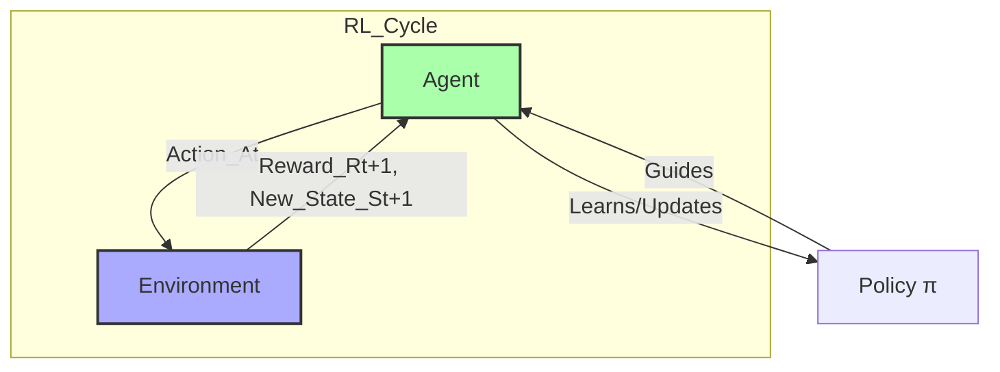

---
tags:
  - data_science
  - machine_learning
  - reinforcement_learning
  - learning_paradigm
  - concept
aliases:
  - Reinforcement Learning
  - RL
related:
  - "[[Supervised_Learning]]"
  - "[[Unsupervised_Learning]]"
  - "[[Markov_Decision_Process_MDP]]"
  - "[[Q_Learning]]"
worksheet:
  - WS_Math_Foundations_2
date_created: 2025-08-07
---
# Reinforcement Learning

## Definition
**Reinforcement Learning (RL)** is one of the three main paradigms of machine learning, alongside [[Supervised_Learning|supervised learning]] and [[Unsupervised_Learning|unsupervised learning]]. It is a goal-oriented learning paradigm where an **agent** learns to make decisions by performing actions in an **environment** to maximize a cumulative **reward**.

Unlike supervised learning, the agent is not told which actions to take. Instead, it must discover which actions yield the most reward by trying them. This is a trial-and-error learning process. The feedback is often delayed; an action may not be rewarded (or punished) until many steps later.

## Core Components of RL
- **Agent:** The learner or decision-maker.
- **Environment:** The external world with which the agent interacts.
- **State ($S_t$):** A description of the environment at a specific time $t$.
- **Action ($A_t$):** A choice made by the agent from a set of possible actions.
- **Reward ($R_{t+1}$):** A scalar feedback signal received by the agent from the environment after performing an action. The agent's objective is to maximize the total cumulative reward.
- **Policy ($\pi$):** The agent's strategy or behavior. It is a mapping from states to actions, defining which action the agent will take in a given state.
- **Value Function ($V(s)$ or $Q(s,a)$):** Predicts the expected future reward. The state-value function $V(s)$ is the expected return starting from state $s$ and following policy $\pi$. The action-value function $Q(s,a)$ is the expected return starting from state $s$, taking action $a$, and then following policy $\pi$.
- **Model (Optional):** The agent's representation of the environment, which predicts what the environment will do next.
    - **Model-Based RL:** The agent learns a model of the environment and uses it for planning.
    - **Model-Free RL:** The agent learns a policy or value function directly from experience without explicitly learning a model of the environment.

## The RL Loop (Agent-Environment Interaction)

1.  At time $t$, the agent observes the current **state** $S_t$ of the environment.
2.  Based on its **policy** $\pi$, the agent selects an **action** $A_t$.
3.  The agent performs the action $A_t$.
4.  The environment transitions to a new **state** $S_{t+1}$ and provides a **reward** $R_{t+1}$ to the agent.
5.  The agent uses the reward and the new state to update its policy or value function, improving its decision-making for the future.
6.  The loop repeats.

## Key Concepts
- **Exploration vs. Exploitation:** A fundamental tradeoff in RL.
    - **Exploitation:** The agent makes the best decision it knows based on current knowledge to maximize immediate reward.
    - **Exploration:** The agent tries random or new actions to discover more about the environment, which might lead to better long-term rewards.
- **Markov Decision Process (MDP):** The mathematical framework for modeling decision-making in RL. It assumes the "Markov property," meaning the future is independent of the past given the present state.
- **Discount Factor ($\gamma$):** A value between 0 and 1 that discounts future rewards. It reflects the preference for immediate rewards over delayed rewards. The cumulative reward (Return) is often calculated as $G_t = R_{t+1} + \gamma R_{t+2} + \gamma^2 R_{t+3} + \dots$.

## Types of RL Algorithms
[list2tab|#RL Algorithm Types]
- Value-Based
    - **Goal:** Learn the optimal action-value function $Q^*(s,a)$. The policy is then to choose the action with the highest Q-value in any given state.
    - **Examples:** [[Q_Learning|Q-Learning]], SARSA, Deep Q-Networks (DQN).
- Policy-Based
    - **Goal:** Directly learn the optimal policy $\pi^*(a|s)$ that maps states to actions.
    - **Examples:** REINFORCE, Actor-Critic methods.
- Actor-Critic
    - **Goal:** A hybrid approach that learns both a policy (the "Actor") and a value function (the "Critic"). The Critic evaluates the actions taken by the Actor, and the Actor updates its policy based on this feedback.
    - **Examples:** A2C, A3C, DDPG, PPO.

## Applications
- **Game Playing:** Mastering complex games like Go (AlphaGo), Chess, and video games (Atari, Dota 2).
- **Robotics:** Training robots to perform tasks like walking, grasping objects, and navigation.
- **Autonomous Systems:** Self-driving cars, drone control.
- **Resource Management:** Optimizing operations in data centers, supply chains, and financial trading.
- **Personalized Recommendations:** Optimizing which content to show users to maximize long-term engagement.
- **Chemistry and Drug Discovery:** Designing new molecules or chemical synthesis pathways.

---