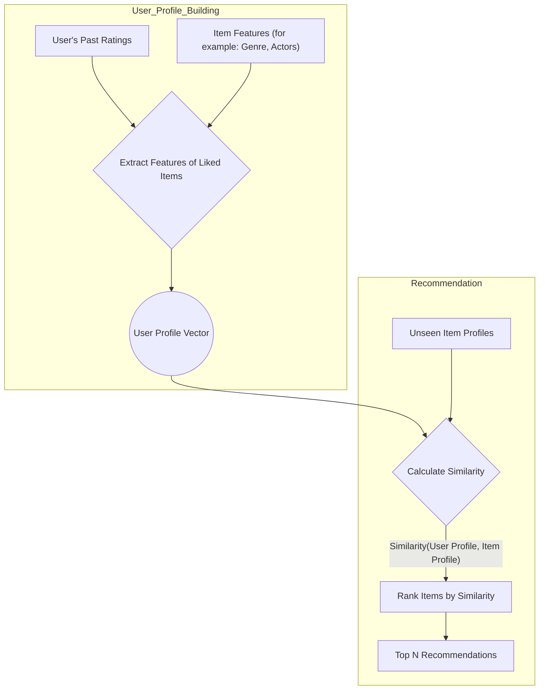

---
tags:
  - data_science
  - recommender_systems
  - content_based_filtering
  - concept
aliases:
  - Content-Based Recommenders
related:
  - "[[_Collaborative_Filtering_MOC]]"
  - "[[Hybrid_Recommender_Systems]]"
  - "[[Cold_Start_Problem]]"
  - "[[TF_IDF]]"
worksheet:
  - WS_Collaborative_Filtering_1
date_created: 2025-08-13
---
# Content-Based Filtering

## Definition
**Content-Based Filtering** is a type of recommender system that recommends items to a user based on the attributes of the items and a profile of the user's preferences. It operates on the principle: "Show me more of what I've liked in the past."

Unlike [[_Collaborative_Filtering_MOC|Collaborative Filtering]], which uses the behavior of other users, content-based filtering focuses solely on the properties of the items and the past preferences of the individual user.

## How it Works
1.  **Item Profile Creation:** Each item in the catalog is described by a set of features or attributes. For movies, this could be genre, director, actors, plot keywords, etc. These features are often transformed into a numerical vector representation for each item (an **item profile**). For text data, techniques like [[TF_IDF|TF-IDF]] are common.
2.  **User Profile Creation:** A profile of the user's preferences is created based on the items they have previously liked. The user profile is also a vector in the same feature space as the items. It can be created by taking a weighted average of the item profiles for the items the user has rated positively.
3.  **Recommendation Generation:** To make a recommendation, the system compares the user profile vector with the item profile vectors of unseen items. It then recommends the items that are most similar to the user's profile. Similarity is often measured using metrics like [[Cosine_Similarity|cosine similarity]] or [[Dot_Product|dot product]].

## Diagram: Content-Based Filtering Process

## Advantages and Disadvantages
[list2tab|#Pros and Cons]
- Advantages
    - **No Cold Start for Items:** New items can be recommended immediately as long as their features are available, without needing any user ratings. This is a major advantage over pure collaborative filtering.
    - **User Independence:** Recommendations for one user do not depend on the data of other users. This can be useful for privacy reasons and makes the system scalable to new users.
    - **Interpretability:** Recommendations can be explained by listing the content features that caused an item to be recommended (e.g., "Recommended because you liked other movies with Sean Connery").
    - **Handles Niche Tastes:** Can recommend items to users with unique tastes, even if those tastes are not shared by a large group of other users.
- Disadvantages
    - **Limited Serendipity:** The system tends to recommend items that are very similar to what a user has already liked. It is less likely to discover novel and unexpected items from different categories. This can create a "filter bubble".
    - **Requires Feature Engineering:** The quality of recommendations is heavily dependent on the quality and completeness of the item feature data. This requires significant domain knowledge and effort to create and maintain.
    - **Overspecialization:** If a user has only interacted with a narrow range of items, the system will only recommend items from that same narrow range.
    - **No Cold Start for Users:** A new user must provide some initial preferences before the system can build a profile and make recommendations.

## Use Cases
Content-based filtering is often used as a component in [[Hybrid_Recommender_Systems|Hybrid Recommender Systems]] to solve the **[[Cold_Start_Problem|new item problem]]** and to provide a baseline recommendation for new users.

---