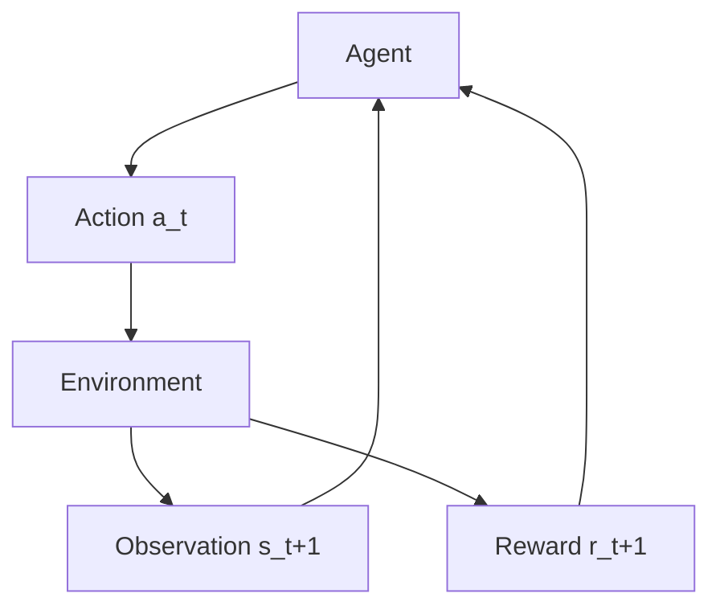

---
tags:
  - reinforcement_learning
  - rl
  - agent
  - environment
  - state
  - action
  - reward
  - concept
aliases:
  - Agent in RL
  - Environment in RL
related:
  - "[[140_Data_Science_AI/Reinforcement_Learning/_Reinforcement_Learning_MOC|_Reinforcement_Learning_MOC]]"
  - "[[RL_State_Action_Reward]]"
worksheet:
  - WS_RL_1
date_created: 2025-09-10
---
# RL: Agent and Environment

The fundamental interaction in Reinforcement Learning (RL) occurs between an **Agent** and its **Environment**. This continuous loop of observation, action, and reward is how the agent learns.

## The Agent
-   **Definition:** The **agent** is the learner and decision-maker in an RL system. It is the entity that perceives the [[#The Environment|environment]] and performs actions within it.
-   **Goal:** To learn an optimal [[RL_Policy|policy]] (a strategy) that maximizes its cumulative reward over time.
-   **Components:** An agent typically consists of:
    -   **Policy:** A mapping from observed states to actions. This is what the agent learns.
    -   **Value Function (optional):** An estimate of how good it is for the agent to be in a given state or to perform a given action in a given state.
    -   **Model (optional):** An agent's representation of the environment's dynamics (how the environment changes in response to actions).
-   **Learning Process:** The agent learns through trial and error, exploring different actions and observing the consequences (rewards and new states).

## The Environment
-   **Definition:** The **environment** is everything outside the [[#The Agent|agent]]. It is the world with which the agent interacts.
-   **Responsibilities:**
    -   Receives actions from the agent.
    -   Updates its internal state based on the agent's action and its own dynamics.
    -   Sends a new observation (the current [[RL_State_Action_Reward|state]]) and a [[RL_State_Action_Reward|reward]] signal back to the agent.
-   **Characteristics:**
    -   **State:** The environment has a state that fully describes the current situation.
    -   **Dynamics:** The rules governing how the environment's state changes in response to actions.
    -   **Reward Function:** Defines the goal of the RL problem by specifying the immediate reward an agent receives for transitioning between states or performing certain actions.
-   **Types:**
    -   **Deterministic Environment:** For a given state and action, the next state and reward are always the same.
    -   **Stochastic Environment:** For a given state and action, there is a probability distribution over possible next states and rewards. Most real-world environments are stochastic.

## The Agent-Environment Interaction Loop
The interaction between the agent and environment is a continuous loop:

1.  At each time step $t$, the **Agent** observes the current [[RL_State_Action_Reward|state]] $s_t$ of the environment.
2.  Based on its [[RL_Policy|policy]], the Agent selects an [[RL_State_Action_Reward|action]] $a_t$.
3.  The Agent sends the action $a_t$ to the **Environment**.
4.  The Environment, in response to $a_t$, transitions to a new state $s_{t+1}$ and emits a [[RL_State_Action_Reward|reward]] $r_{t+1}$.
5.  The Agent receives $s_{t+1}$ and $r_{t+1}$, and the loop continues.

This loop continues until the environment reaches a terminal state (for episodic tasks) or indefinitely (for continuous tasks). The agent's goal is to maximize the *cumulative* reward received over the long run.

## Example: A Robot Learning to Navigate a Maze
-   **Agent:** The robot.
-   **Environment:** The maze, including its walls, open paths, and the robot's current location.
-   **Interaction:**
    -   **State ($s_t$):** The robot's current position in the maze (e.g., coordinates, sensor readings).
    -   **Action ($a_t$):** Move North, South, East, West.
    -   **Reward ($r_{t+1}$):**
        -   +100 for reaching the goal.
        -   -1 for hitting a wall.
        -   -0.1 for each step taken (to encourage finding the shortest path).
    -   **Next State ($s_{t+1}$):** The robot's new position after taking the action.

Through repeated trials in the maze, the robot (agent) learns which actions to take in which states to reach the goal (maximize reward) efficiently.

---