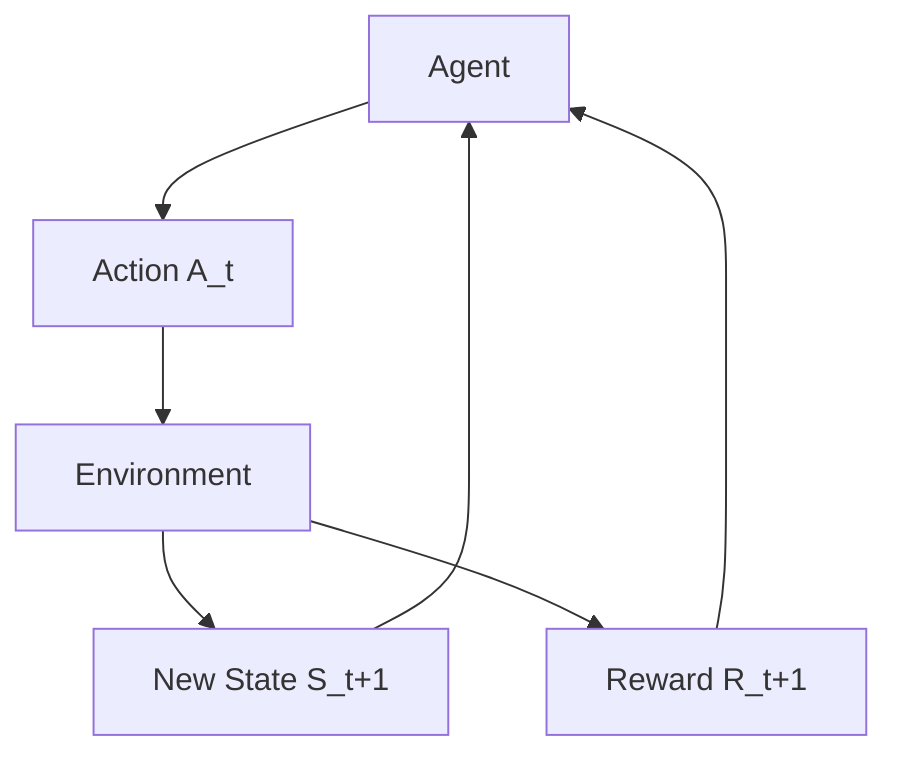

---
tags:
  - reinforcement_learning
  - rl
  - state
  - action
  - reward
  - concept
aliases:
  - State in RL
  - Action in RL
  - Reward in RL
related:
  - "[[140_Data_Science_AI/Reinforcement_Learning/_Reinforcement_Learning_MOC|_Reinforcement_Learning_MOC]]"
  - "[[RL_Agent_Environment]]"
  - "[[RL_Policy]]"
worksheet:
  - WS_RL_1
date_created: 2025-09-10
---
# RL: State, Action, Reward

The fundamental elements that define the interaction between an [[RL_Agent|agent]] and its [[RL_Environment|environment]] in Reinforcement Learning are **State**, **Action**, and **Reward**. These form the core feedback loop that drives learning.

## State ($S_t$)
-   **Definition:** The **state** at time $t$, denoted $S_t$, is a complete description of the current situation of the [[RL_Environment|environment]]. It provides all the necessary information for the [[RL_Agent|agent]] to decide what to do next.
-   **Characteristics:**
    -   **Observation:** What the agent perceives from the environment.
    -   **Completeness:** Ideally, the state should be a **Markov state**, meaning it contains all information from the past that is relevant to predicting the future. The future is conditionally independent of the past given the present state.
    -   **Representation:** Can be simple (e.g., a single integer representing a grid cell in a maze) or complex (e.g., raw pixel data from a camera, a vector of sensor readings, a game board configuration).
-   **Example:**
    -   **Chess Game:** The current configuration of all pieces on the board.
    -   **Autonomous Car:** Current speed, position, sensor readings (from lidar, camera), traffic light status.
    -   **Inventory Management:** Current stock levels, demand forecasts, order lead times.

## Action ($A_t$)
-   **Definition:** An **action** at time $t$, denoted $A_t$, is a choice made by the [[RL_Agent|agent]] that influences the [[RL_Environment|environment]].
-   **Characteristics:**
    -   **Decision:** The agent selects an action based on its current [[RL_Policy|policy]] and the observed state.
    -   **Impact:** Actions cause the environment to transition to a new state and/or yield a reward.
    -   **Action Space:** The set of all possible actions available to the agent in a given state.
-   **Types of Action Spaces:**
    -   **Discrete Action Space:** A finite set of distinct actions (e.g., "move left," "move right," "jump," "buy," "sell").
    -   **Continuous Action Space:** Actions are chosen from a continuous range (e.g., "steering angle from -30 to +30 degrees," "throttle percentage from 0% to 100%").
-   **Example:**
    -   **Chess Game:** Moving a specific piece from one square to another.
    -   **Autonomous Car:** Accelerate, brake, turn steering wheel by X degrees.
    -   **Inventory Management:** Place an order for Y units, do nothing.

## Reward ($R_{t+1}$)
-   **Definition:** The **reward** at time $t+1$, denoted $R_{t+1}$, is a scalar feedback signal from the [[RL_Environment|environment]] to the [[RL_Agent|agent]] after an action $A_t$ is taken in state $S_t$. It indicates how good or bad the agent's immediate action was.
-   **Characteristics:**
    -   **Scalar Value:** A single number (positive for good, negative for bad).
    -   **Immediate Feedback:** Received directly after an action.
    -   **Goal Definition:** The reward signal is the *sole* definition of the goal for the agent. The agent's objective is to maximize the *cumulative* (total sum) reward over the long run, not just the immediate reward.
    -   **Sparse vs. Dense:**
        -   **Sparse Reward:** Rewards are given only for specific, important events (e.g., +100 for winning a game, -100 for losing, 0 otherwise).
        -   **Dense Reward:** Rewards are given more frequently, providing continuous feedback (e.g., -1 for each step taken in a maze, +1 for getting closer to the goal).
-   **Example:**
    -   **Chess Game:** +1 for winning, -1 for losing, 0 for a draw or intermediate moves.
    -   **Autonomous Car:** +100 for reaching destination, -10 for hitting an obstacle, -1 for each second spent driving.
    -   **Inventory Management:** +$X$ for fulfilling an order, -$Y$ for stockout, -$Z$ for holding costs.

## The Agent-Environment Loop with S, A, R
The interaction loop is a continuous cycle of these three elements:

1.  Agent observes $S_t$.
2.  Agent chooses $A_t$.
3.  Environment receives $A_t$.
4.  Environment transitions to $S_{t+1}$ and emits $R_{t+1}$.
5.  Agent receives $S_{t+1}$ and $R_{t+1}$.

The agent learns to choose actions in states that lead to sequences of rewards that maximize the total sum of rewards over an episode or indefinitely.

---