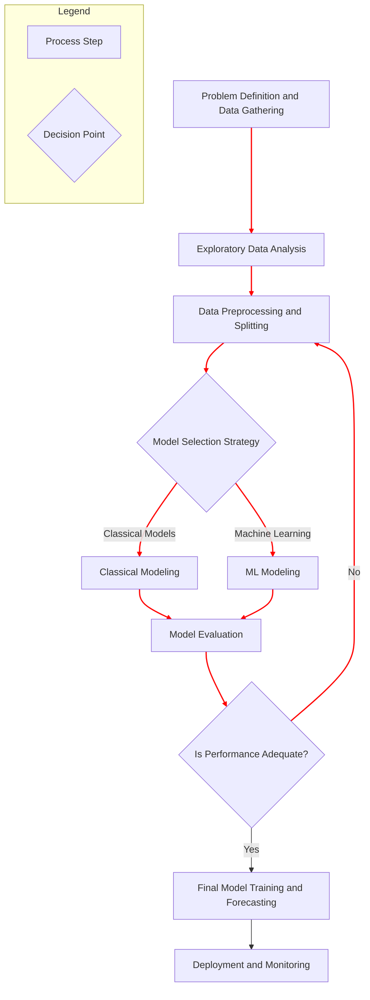

---
tags:
  - time_series
  - forecasting
  - workflow
  - eda
  - preprocessing
  - model_selection
  - evaluation
  - sktime
  - sklearn
  - concept
aliases:
  - Time Series Workflow
  - Forecasting Project Workflow
related:
  - "[[140_Data-Science_AI/Time_Series_Analysis/_Time_Series_Analysis_MOC|_Time_Series_Analysis_MOC]]"
  - "[[Exploratory_Data_Analysis_Workflow]]"
  - "[[TS_Cross_Validation_Evaluation]]"
  - "[[TS_Stationarity]]"
  - "[[TS_Components_Decomposition]]"
  - "[[TS_Feature_Engineering_for_ML]]"
worksheet:
  - WS_TimeSeries_1
date_created:
---
# A Comprehensive Time Series Analysis Workflow

A time series analysis project follows a structured workflow, from understanding the data to deploying a final forecasting model. This workflow is iterative and requires careful consideration of the temporal nature of the data at each step to avoid common pitfalls like [[TS_Look_Ahead_Bias|look-ahead bias]].

This note outlines a comprehensive workflow using a combination of `pandas`, `numpy`, `matplotlib`, `seaborn`, `statsmodels` (for diagnostics), `sktime`, and `sklearn`.

## Workflow Overview



---

## 1. Problem Definition & Data Gathering
-   **Define the Goal:** What exactly are you trying to forecast? (e.g., "Forecast daily unit sales for product X for the next 14 days").
-   **Determine the Horizon:** How far into the future do you need to predict? (e.g., 1 day, 7 days, 3 months).
-   **Gather Data:** Collect historical time series data. Ensure you have timestamps and the target variable. Collect any relevant exogenous variables (e.g., marketing spend, holidays, weather).

---

## 2. Exploratory Data Analysis (EDA)
The goal of EDA is to understand the characteristics of your time series.

[list2tab|#EDA Steps]
- Visualize the Series
    -   **Action:** Plot the time series data against time.
    -   **Purpose:** To visually identify key patterns.
    -   **Checks & Decisions:**
        -   **[[TS_Components_Decomposition|Trend]]:** Is there a long-term upward or downward direction? -> *Influences choice of detrending or using `d` in ARIMA.*
        -   **[[TS_Components_Decomposition|Seasonality]]:** Are there regular, repeating patterns? (e.g., daily, weekly, yearly) -> *Influences choice of seasonal models (SARIMA, Holt-Winters) or seasonal features.*
        -   **Changing Variance:** Does the spread of the data change over time? -> *May require transformations like Log or Box-Cox.*
        -   **Outliers/Anomalies:** Are there obvious unusual data points? -> *May need to be investigated or handled.*
    -   **Code:**
        ```python
        import pandas as pd
        import matplotlib.pyplot as plt
        import seaborn as sns
        from sktime.datasets import load_airline

        y = load_airline()
        y.index = y.index.to_timestamp() # Convert to timestamp for easier plotting

        # Simple time series plot
        fig, ax = plt.subplots(figsize=(12, 5))
        y.plot(ax=ax, title="Airline Passengers Over Time")
        ax.set_xlabel("Year")
        ax.set_ylabel("Number of Passengers")
        plt.grid(True)
        plt.show()
        ```
- Decompose the Series
    -   **Action:** Use a decomposition method to separate the series into trend, seasonal, and residual components.
    -   **Purpose:** To formally isolate and inspect the underlying patterns.
    -   **Checks & Decisions:**
        -   **Strength of Components:** How strong are the trend and seasonality?
        -   **Residuals:** Do the residuals look like [[TS_White_Noise_and_Random_Walks|white noise]]? If not, there are more patterns to model.
    -   **Code:**
        ```python
        from statsmodels.tsa.seasonal import STL

        # STL is a robust decomposition method
        stl_result = STL(y, period=12).fit()
        fig = stl_result.plot()
        fig.suptitle("STL Decomposition of Airline Data", y=1.02)
        plt.show()
        ```
- Check for Stationarity
    -   **Action:** Use visual plots (ACF) and statistical tests (ADF, KPSS) to check for [[TS_Stationarity|stationarity]].
    -   **Purpose:** Many classical models require stationarity. It's a key diagnostic.
    -   **Checks & Decisions:**
        -   **Slowly Decaying ACF / High ADF p-value:** The series is non-stationary. -> *Decision: [[TS_Lag_and_Differencing|Differencing]] is required (sets the `d` in ARIMA).*
    -   **Code:**
        ```python
        from statsmodels.tsa.stattools import adfuller
        from statsmodels.graphics.tsaplots import plot_acf
        
        # Perform the Augmented Dickey-Fuller test
        adf_result = adfuller(y)
        
        # The adfuller function returns a tuple:
        # 0: The ADF statistic
        # 1: The p-value
        # 2: The number of lags used
        # 3: The number of observations used for the ADF regression and critical values calculation
        # 4: Critical values for different significance levels (1%, 5%, 10%)
        # 5: The maximum information criterion specified
        
        # Access the p-value from the tuple
        adf_p_value = adf_result[1]
        
        print(f"ADF Test p-value on original data: {adf_p_value:.4f}") # Will be high
        
        fig, ax = plt.subplots(figsize=(10, 4))
        plot_acf(y, ax=ax, lags=40)
        plt.title("ACF of Original Airline Data (Slow Decay)")
        plt.show()
        ```
- Analyze Autocorrelation (ACF/PACF)
    -   **Action:** Plot the ACF and PACF of the *stationary* (e.g., differenced) series.
    -   **Purpose:** To identify the orders ($p, q$) for ARIMA-family models.
    -   **Checks & Decisions:**
        -   **PACF cuts off at lag $p$:** Suggests an AR($p$) component.
        -   **ACF cuts off at lag $q$:** Suggests an MA($q$) component.
        -   **Both tail off:** Suggests a mixed ARMA model.
        -   **Significant spikes at seasonal lags:** Confirms seasonality and suggests a SARIMA model is needed.

---

## 3. Data Preprocessing & Splitting
-   **Handling Missing Values:** Use appropriate methods like forward-fill or interpolation. See [[TS_Handling_Missing_Values]].
-   **Transformations:** Apply Log or Box-Cox transforms to stabilize variance if needed.
-   **Train/Test Split:** **Crucially, this must be a temporal split.** The test set must come after the training set.
    ```python
    # Using the airline data 'y'
    y_train = y[y.index < "1958-01-01"]
    y_test = y[y.index >= "1958-01-01"]
    plot_series(y_train, y_test, labels=["Train", "Test"])
    plt.show()
    ```

---

## 4. Model Selection & Training
This is a decision point. You can pursue classical statistical models, machine learning models, or both.

### 4a. Classical Modeling (e.g., `sktime` with `statsmodels` backend)
-   **Action:** Select a model based on EDA (e.g., `ExponentialSmoothing` for trend/seasonality, `AutoARIMA` for complex autocorrelation).
-   **Process:** Fit the model on `y_train`.
-   **Code:**
    ```python
    from sktime.forecasting.arima import AutoARIMA
    from sktime.forecasting.base import ForecastingHorizon

    forecaster_arima = AutoARIMA(sp=12, suppress_warnings=True)
    forecaster_arima.fit(y_train)
    ```

### 4b. Machine Learning Modeling (e.g., `sktime` with `sklearn` backend)
-   **Action:** Transform the time series into a supervised learning problem.
-   **Process:**
    1.  **[[TS_Feature_Engineering_for_ML|Feature Engineering]]:** Create lag features, rolling window features, and date/time features.
    2.  **Train a Regressor:** Use a standard `sklearn` model like `RandomForestRegressor`.
-   **Code (using `sktime`'s reducer):**
    ```python
    from sklearn.ensemble import RandomForestRegressor
    from sktime.forecasting.compose import make_reduction

    # This wraps the sklearn regressor and automatically creates lag features
    regressor = RandomForestRegressor(random_state=42)
    forecaster_rf = make_reduction(regressor, window_length=15, strategy="recursive")
    forecaster_rf.fit(y_train)
    ```

---

## 5. Model Evaluation (Backtesting)
-   **Action:** Evaluate the fitted model(s) on the unseen test set. For more robust evaluation, use [[TS_Cross_Validation_Evaluation|temporal cross-validation]].
-   **Purpose:** To get a realistic estimate of the model's future performance.
-   **Metrics:** Use appropriate [[TS_Forecast_Error_Metrics|forecast error metrics]] like MAPE or RMSE.
-   **Code:**
    ```python
    from sktime.performance_metrics.forecasting import mean_absolute_percentage_error

    # Define the forecasting horizon for the test period
    fh = ForecastingHorizon(y_test.index, is_relative=False)

    # Predict with the ARIMA model
    y_pred_arima = forecaster_arima.predict(fh)
    mape_arima = mean_absolute_percentage_error(y_test, y_pred_arima, symmetric=False)
    print(f"ARIMA Model MAPE: {mape_arima:.4f}")

    # Predict with the RandomForest model
    y_pred_rf = forecaster_rf.predict(fh)
    mape_rf = mean_absolute_percentage_error(y_test, y_pred_rf, symmetric=False)
    print(f"Random Forest Model MAPE: {mape_rf:.4f}")
    ```

---

## 6. Final Model Training & Forecasting
-   **Action:** Once you have selected the best model and its hyperparameters (tuned via [[sktime_Model_Selection_Tuning|temporal grid search]]), re-fit the final model on **all available historical data** (`y`).
-   **Process:**
    1.  `final_model.fit(y)`
    2.  Define the future forecasting horizon (`fh = np.arange(1, 13)` for the next 12 months).
    3.  `future_forecast = final_model.predict(fh)`
-   **Visualize:** Plot the historical data along with the final forecast and prediction intervals.

---

## 7. Deployment & Monitoring
-   **Deployment:** Integrate the trained model into a production system to generate forecasts on a schedule.
-   **Monitoring:** Continuously monitor the model's performance as new actual data becomes available. Track forecast accuracy over time.
-   **Retraining:** Establish a schedule or trigger-based system for retraining the model with new data to keep it up-to-date.

This structured workflow ensures that time series models are built and evaluated in a methodologically sound way, leading to more reliable and trustworthy forecasts.

---