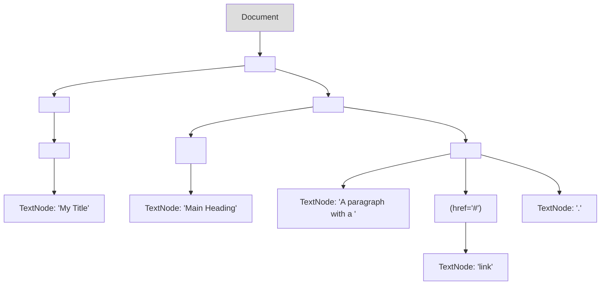

---
tags:
  - web_scraping
  - web_development
  - dom
  - html
  - javascript
  - parsing
  - concept
aliases:
  - Document Object Model
  - DOM Tree
related:
  - "[[_Web_Scraping_Crawling_MOC]]"
  - "[[HTML_Basics]]"
  - "[[HTML_Parsing]]"
  - "[[JavaScript_Basics_for_Scraping]]"
worksheet:
  - WS_WebScraping_1
date_created: 2025-06-18
---
# DOM (Document Object Model)

## Definition
The **Document Object Model (DOM)** is a cross-platform and language-independent application programming interface (API) for treating an HTML, XHTML, or XML document as a **tree structure** wherein each node is an object representing a part of the document. The DOM represents the document with a logical tree. Each branch of the tree ends in a node, and each node contains objects.

Essentially, when a web browser loads an HTML document, it creates a DOM representation of that page in memory. This tree structure allows programs and scripts (like [[JavaScript_Basics_for_Scraping|JavaScript]]) to dynamically access and manipulate the content, structure, and style of documents.

## Key Aspects of the DOM
-   **Tree Structure:** The DOM represents a document as a hierarchy of nodes.
    -   The topmost node is the "document object" itself.
    -   Below it is the root element (e.g., `<html>` for HTML documents).
    -   This root element has child nodes (e.g., `<head>` and `<body>`).
    -   These children can have their own children, forming a tree.
-   **Nodes:** Everything in an HTML document is a node:
    -   **Element nodes:** Represent HTML tags (e.g., `<p>`, `<div>`, `<a>`).
    -   **Text nodes:** Represent the textual content within elements.
    -   **Attribute nodes:** Represent the attributes of elements (e.g., `href` in `<a>`, `class` in `<div>`). Note: In some DOM specifications, attributes are properties of element nodes rather than separate child nodes.
    -   Comment nodes, document type nodes, etc.
-   **Object-Oriented Representation:** Each node in the DOM tree is an object with properties and methods that allow for its manipulation.
-   **Language-Neutral Interface:** The DOM is a W3C (World Wide Web Consortium) standard, designed to be independent of any particular programming language. Bindings exist for many languages, with JavaScript being the most common in web browsers.
-   **Dynamic Modification:** Scripts can change the DOM dynamically, which means they can:
    -   Add, remove, or modify HTML elements and attributes.
    -   Change the text content of elements.
    -   Alter CSS styles.
    -   Respond to user events (clicks, key presses).
    This dynamic nature is key to [[Static_vs_Dynamic_Web_Pages|dynamic web pages]].

## How it Relates to Web Scraping
When you use a library like [[160_Python_Libraries/Beautiful_Soup/_Beautiful_Soup_MOC|Beautiful Soup]] or the selectors in [[160_Python_Libraries/Scrapy/_Scrapy_MOC|Scrapy]], you are essentially working with a representation of the DOM (or a parse tree very similar to it).
-   **[[HTML_Parsing|HTML Parsing]]** libraries read the raw HTML string and build this tree structure in memory.
-   **Navigation and Searching:** Tools like `find()`, `select()`, XPath, and CSS selectors operate on this DOM-like tree to locate specific nodes (elements) based on their tags, attributes, text content, or relationships to other nodes.
-   **[[Data_Extraction_Web|Data Extraction]]:** Once the desired nodes are located, scrapers extract information (text, attribute values like `href` or `src`) from these nodes.

For [[Static_vs_Dynamic_Web_Pages|static web pages]], the initial HTML content directly forms the DOM that scrapers parse. For **dynamic web pages**, JavaScript often modifies the DOM *after* the initial page load (e.g., to load more content via AJAX, render components). This means:
-   Simple HTTP request libraries (like [[160_Python_Libraries/Requests_Library|Requests]]) only get the initial HTML and won't see JavaScript-rendered content.
-   To scrape dynamic content, tools that can execute JavaScript and interact with the DOM as a browser does are needed (e.g., [[Web_Drivers_for_Scraping|web drivers]] like Selenium or Playwright). These tools work with the live, JavaScript-modified DOM.

## Conceptual DOM Tree Example
For HTML:
```html
<html>
  <head>
    <title>My Title</title>
  </head>
  <body>
    <h1>Main Heading</h1>
    <p>A paragraph with a <a href="#">link</a>.</p>
  </body>
</html>
```

A simplified DOM representation might look like:

Understanding the DOM structure is fundamental for writing effective web scrapers, as it dictates how you navigate and target the specific data you wish to extract.

---