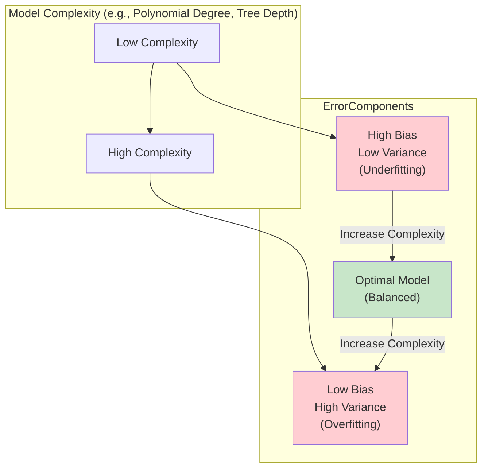

---
tags:
  - statistics
  - machine_learning
  - bias
  - variance
  - tradeoff
  - model_evaluation
  - overfitting
  - underfitting
  - concept
aliases:
  - Bias-Variance Dilemma
  - Bias-Variance Decomposition
related:
  - "[[200_Statistics_Probability/Estimation/Estimators_in_Statistics|Estimators in Statistics]]"
  - "[[Overfitting_Underfitting]]"
  - "[[Regularization_ML|Regularization (L1, L2)]]"
  - "[[Sklearn_Ensemble_Methods|Ensemble Methods]]"
worksheet:
  - WS_StatsProb_1
date_created: 2025-08-20
---
# Bias-Variance Tradeoff

The **bias-variance tradeoff** (or dilemma) is a fundamental concept in supervised machine learning and statistics that describes the tension between two sources of error that prevent models from generalizing perfectly to new, unseen data: **bias** and **variance**.

-   **Goal of a Model:** To learn the true underlying signal in the training data while ignoring the noise.
-   **Total Error:** The total expected error of a model on unseen data can be decomposed into three parts: bias, variance, and irreducible error.
    $$ \text{Total Error} = \text{Bias}^2 + \text{Variance} + \text{Irreducible Error} $$

## Definitions

[list2tab|#Bias vs Variance]
- Bias
    -   **Definition:** Bias is the error introduced by approximating a real-world problem, which may be very complex, by a much simpler model. It represents the difference between the average prediction of our model and the correct value which we are trying to predict.
    -   **High Bias:** A model with high bias pays very little attention to the training data and oversimplifies the model. It consistently misses the true relationship. This leads to **[[Overfitting_Underfitting|underfitting]]**.
    -   **Characteristics of High-Bias Models:**
        -   Simple models (e.g., linear regression on a complex, non-linear problem).
        -   Performs poorly on both training and test data.
        -   Makes strong assumptions about the form of the target function.
- Variance
    -   **Definition:** Variance is the error from sensitivity to small fluctuations in the training set. It represents how much the model's prediction would change if we were to train it on a different training dataset drawn from the same population.
    -   **High Variance:** A model with high variance pays too much attention to the training data, learning not only the underlying signal but also the noise. It fails to generalize to new, unseen data. This leads to **[[Overfitting_Underfitting|overfitting]]**.
    -   **Characteristics of High-Variance Models:**
        -   Complex models (e.g., a very deep decision tree, a high-degree polynomial regression).
        -   Performs extremely well on training data but poorly on test data.
        -   Makes very few assumptions about the form of the target function.
- Irreducible Error
    -   **Definition:** This error is due to inherent noise or randomness in the data itself. It cannot be reduced by any model, no matter how good. It represents the lower bound on the error for any model.

## The Tradeoff
There is an inverse relationship between bias and variance:
-   **Increasing model complexity** typically **decreases bias** (the model can fit the training data better) but **increases variance** (the model becomes more sensitive to the specific training data and risks overfitting).
-   **Decreasing model complexity** (simplifying the model) typically **increases bias** (the model may no longer be flexible enough to capture the true signal) but **decreases variance** (the model is less sensitive to noise).

The goal is to find a sweet spot—a model with the right level of complexity that minimizes the **total error** by balancing bias and variance.

**Visualization of the Tradeoff:**

## Mathematical Expression

>[!question]- What is the mathematical expression of the bias-variance dilemma?
>For a given test point $x$, let the true value be $y$ and our model's prediction be $\hat{f}(x)$. The underlying relationship is $y = f(x) + \epsilon$, where $\epsilon$ is noise with mean 0 and variance $\sigma_\epsilon^2$.
>
>The **Mean Squared Error (MSE)** of our model's prediction at point $x$ can be decomposed as follows:
>$$ E[(y - \hat{f}(x))^2] = (\text{Bias}[\hat{f}(x)])^2 + \text{Var}[\hat{f}(x)] + \sigma_\epsilon^2 $$
>Where:
>-   **$E[\cdot]$** denotes the expected value over many different training sets.
>-   **Bias:** $\text{Bias}[\hat{f}(x)] = E[\hat{f}(x)] - f(x)$. This is the difference between the *average prediction* of our model and the true function value.
>-   **Variance:** $\text{Var}[\hat{f}(x)] = E[(\hat{f}(x) - E[\hat{f}(x)])^2]$. This is the variance of the model's predictions for a given point $x$ across different training sets.
>-   **Irreducible Error:** $\sigma_\epsilon^2 = E[(y - f(x))^2]$. This is the variance of the noise term $\epsilon$, which cannot be reduced.
>
>This decomposition shows that the total expected error is a sum of these three components. To minimize the total error, we must find a balance that minimizes the sum of squared bias and variance.

## Managing the Tradeoff
-   **To reduce high bias:**
    -   Increase model complexity (e.g., use a higher-degree polynomial, a deeper decision tree).
    -   Add more features or create more informative features.
    -   Decrease regularization.
-   **To reduce high variance:**
    -   Decrease model complexity (e.g., use a simpler model, prune decision trees).
    -   Use more training data.
    -   Use **[[Regularization_ML|regularization]]** (L1/Lasso, L2/Ridge) to penalize model complexity.
    -   Use **[[Sklearn_Ensemble_Methods|ensemble methods]]** like Bagging (e.g., Random Forests) which average multiple models to reduce variance.
    -   Use cross-validation to get a better estimate of test error and tune model complexity.

>[!question]- Is linear regression a "biased" estimator?
>It depends on the context.
>-   **In a statistical sense:** The Ordinary Least Squares (OLS) estimator for the coefficients in a linear regression model is **unbiased** *if the assumptions of the linear model hold true*. This means that if the true relationship between the features and the target *is* linear, then on average (over many datasets), the OLS coefficients will be equal to the true coefficients.
>-   **In a machine learning sense (Bias-Variance Tradeoff):** A linear regression model is often considered a **high-bias, low-variance** model. This is because it makes a very strong assumption about the data: that the relationship between features and the target is linear.
>    -   **High Bias:** If the true relationship is non-linear (e.g., quadratic, exponential), the linear model will be unable to capture it, leading to high systematic error (bias) and underfitting.
>    -   **Low Variance:** Because the model is simple (a line or hyperplane), its parameters won't change drastically if trained on different subsets of the data. It is less sensitive to noise in the training data.
>
>So, while the OLS *estimator* is statistically unbiased under ideal conditions, the linear regression *model* itself has high bias in the machine learning sense because of its strong simplifying assumptions.

---