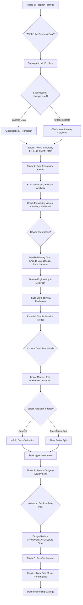

# Statistics And Probability Intro
1. Descriptive Statistics
2. Inferential statistics
3. Probability Distributions
4. Probability
5. Likelihood
6. Bayes rule
7. Central Limit Theorem
8. Correlation

## Probability Distributions

1. Uniform
2. Bernoulli
3. Binomial
4. Normal (Gaussian)
5. Exponential
6. Poisson
7. Power Law
## Estimation

1. Estimator
2. Bias / Variance dilemma

# Statistical Hypothesis Testing

## Keywords

1. Hypothesis testing
2. Null hypothesis / alternative hypothesis
3. Type error / type ll error
4. alpha (significance level)
5. Critical value
6. Confidence interval
7. Effect size
8. Statistical power
9. Paired samples / independant samples
10. 1-tailed / 2-tailed tests
11. Parametric / nonparametric test
12. Sampling
13. Bootstrapping
14. Principle of indifference
15. Simpson's Paradox
16. Q-QPlot

## Tests

1. ttest
2. zest
3. ANOVA
4. Chi-2 test
5. Mann-Whitney U Test
6. Kolmogorov-Smirnov Test
7. Monte Carlo testing

## Hypotheses Checklist

1. Normality
2. Outliers
3. Correlation (linear/rank)
4. Homogeneity of Variances
5. Equality of distribution
6. Homoscedasticity/Heteroscedasticity
7. Multicollinearity
8. Significance of regression coefficients
9. Trend
10. Stationarity
11. Autocorrelation
12. Causality
13. Clustering tendency
14. Sampling adequacy

# Entropy

## Keywords

1. Information
2. Surprise
3. Shannon Entropy
4. Cross Entropy
5. Mutual Information
6. Relative Entropy (Kullback-Leibler Divergence)
7. Perplexity

# Machine Learning Intro

## ML Lifecycle
1. Business goal
+ KPls
+ Constraints
2. ML problem framing
+ Metrics
3. Literary review
4. Acquire Data
5. Explore Data
6. Process Data
7. Model Data
8. Interpret
9. Deploy
10. Monitor
11. Iterate

## Keywords

1. Artificial Intelligence (Al)
2. Machine Learning (ML)
3. Supervized Learning
4. Unsupervized Learning
5. Reinforcement Learning (RL)
6. Regression
7. Classification
8. Clustering
9. Deep Learning (DL)

# EDA - Exploratory Data Analysis

## Keywords

1. Objectives
2. Variable descriptions
3. Target variable
4. Data understanding
5. Missing values
6. Duplicated values
7. Outliers
8. Data visualization
9. Univariate, bivariate and multivariate analysis

# Preprocessing

## Keywords

1. Standardization
2. Normalization
3. Scaling
4. Outliers
5. Encoding
6. Imputation
7. Binning
8. Feature Engineering

## Encoders

1. Label Encoder
2. One Hot Encoder
3. Ordinal Encoder
4. Target Encoder

## SKLearn's Preprocessing

1. OneHotEncoder , OrdinalEncoder , LabelEncoder , TargetEncoder
2. MaxAbsscaler , MinMaxScaler , StandardScaler , Robustscaler
3. PolynomialFeatures, PowerTransformer, QuantileTransformer, FunctionTransformer, KBinsDiscretizen

# Supervized Learning Intro

## Keywords

1. Regression
2. Classification
3. Loss function
4. Generalization error
5. Underfitting / Overfitting
6. Bias-variance tradeoff
7. Data splitting (2 parts vs. 3 parts)
8. Cross validation
9. Curse of dimensionality
10. Noise
11. Regularization
12. Data leak

## Models

1. Linear Regression
2. Logistic Regression / GLM
3. Decision Trees
4. Random Forest
5. Gradient Boosting Machines
6. K-Nearest Neighbors
7. Naive Bayes
8. Kemel approximation
9. Support Vector Machine / Support Vector Regression
10. Linear Discriminant Analysis
11. Neural network

# Classification

## Keywords

1. Binary Classification
2. Multiclass Classification
3. Multi-Label Classification
4. Confusion Matrix
5. Accuracy
6. True positive, false positive, true negative, false negative
7. Precision / Recall
8. F1 Score / FBeta Score
9. Class imbalance
10. Threshold value
11. Decision boundary
12. Gini impurity
13. ROC-AUC, PR-AUC
14. Oversamplina / Undersampling
15. Cost-Sensitive Training
16. SMOTE

## Models

1. k-Nearest Neighbors Classifier
2. Logistic Regression
3. SVM Classifier
4. Naive Bayes Classifier
5. Random Forest Classifier
6. AdaBoost/LGBM/CatBoost/XGBoost Classifier
7. Kernel Approximation

# k-Nearest Neighbors

## Keywords

1. Nonparametric
2. Distance
3. Statistical consistency
4. Data reduction
5. Locality-sensitive hashing

# Regression

## Keywords

1. Estimator
2. Regressor
3. Maximum Likelihood
4. Errors and residuals
5. R-squared

## Models

1. Linear Regression
2. Polynomial Regression
3. Quantile Regression
4. Principal Components Regression
5. k-Nearest Neighbors Regressor
6. Random Forest Regressor
7. GBM Regressor
8. Support Vector Regression
9. Piecewise Linear Regression
10. Generalized Linear Models
11. Linear Mixture Model

# Linear Regression

## Keywords

1. Linearity
2. Model assumptions
3. Feature Engineering
4. Loss function
5. Analytical solution
6. Optimization
7. Ordinary Least Squares / Gradient Descent
8. R-squared
9. Ridge/Lasso/ElasticNet

# Logistic Regression

## Keywords

1. Generalized Linear Model
2. Link function
3. Sigmoid
4. Logit function
5. Perceptron
6. Decision boundary

# Model Selection

## Keywords

1. Bias / Variance dilemma
2. Train / Test split
3. Train / Validation / Test split
4. Exhaustive / non-exhaustive CV
5. kfold
6. Stratified k-fold
7. Leave-pout
8. Shuffle split
9. Time series split
10. Grid Search / Random Search / Bayesian Optimization

## Sklearn Practical Application

1. train_test_split

2. cross_val score, cross_validate , cross_val_predict
3. KFold, StratifiedKFold, ShuffleSplit
4. LeaveOneOut, LeavePOut, LeavePGroupsOut
5. GridsearchCV, ParameterGrid

# Feature Selection

## Keywords

1. Filter Methods
2. Information Gain
3. x2 test
4. Fisher's score
5. Correlation Coefficient
6. Variance threshold
7. Mean Absolute Difference
8. Forward Feature Selection
9. Backward Feature Elimination
10. Exhaustive Feature Selection
11. Recursive Feature Elimination
12. Embedded Methods
13. LASSO Regularization
14. Random Forest Importance

# Unsupervised Learning

## Keywords

1. Clustering
2. Dimensionality reduction
3. Association Rule Learning
4. Anomaly detection
5. Autoencoding

# Clustering

## Keywords
1. Hard vs soft clustering
2. Partitioning clustering
- K-means (or K-medioids)
3. Hierarchical clustering
+ Agglomerative (bottom-up) algorithms
+ Divisive (top-down) algorithms
4. Density-based clustering
- DBSCAN
5. Model-based clustering
+ Gaussian Mixture Models
1. Extrinsic vs. intrinsic evaluation

# Dimensionality Reduction

## Keywords

1. Dimension
2. Curse of dimensionality

## Dimensionality Reduction Techniques

1. Principal Component Analysis (PCA)
2. Factor Analysis
3. Linear Discriminant Analysis (LDA)
4. distributed Stochastic Neighbor Embedding (t-SNE)
5. Autoencoder

# Anomaly Detection

## Keywords
1. Outlier
2. Anomaly
3. Supervized / Unsupervized
4. Multivariate outliers

## Methods/Models
1. Gaussian Mixture Models
- Expectation-Maximization
2. Isolation Forest
3. Histogram-Based Outlier Score (HBOS)
4. One-Class SVM

# Collaborative Filtering

## Keywords

1. Matrix Factorization
2. Singular Value Decomposition
3. Latent vectors
4. Alternating Least Squares
5. Implicit vs. explicit feedback
6. Cold start problem
7. Normalized Discounted Cumulative Gain
8. Mean Reciprocal Rank
9. Concept Drift

# Gradient Descent

## Keywords
1. Gradient
2. optimization
3. Computational efficiency
4. saddle point
5. Learning rate
6. Convex functions
7. Stochastic gradient descent
8. Epoch
9. Batch
10. Mini Batch
11. Momentum gradient descent
12. Nesterov Accelerated Gradient
13. Adagrad
14. RMsProp
15. Adam

# Ensemble Learning

## Keywords

1. Bagging
2. Boosting
3. Stacking
4. Weak learner
5. Wisdom of the crowd
6. Random forest
7. Adaptative Boosting
8. Gradient Boosting
9. XGBoost

# Decision Trees and Random Forest

## Keywords

1. Node splitting
2. Tree depth
3. Decision stump
4. Bagging
5. CART
6. C4.5
7. Random Forest
8. Out-of-bag error

# Mindmap

# Take 1

### 📊 Preprocessing Techniques

Preprocessing is about transforming raw data into a clean, understandable format that is suitable for machine learning models. Your choice of technique depends heavily on the model you intend to use and the nature of your data.

| **Technique**       | **How It Works (Briefly)**                                                                                                    | **Pros (Advantages)**                                                                                                                        | **Cons (Disadvantages)**                                                                                                                                                                 | **When to Use It**                                                                                                                                  | **When to Avoid It**                                                                                               |
| ------------------- | ----------------------------------------------------------------------------------------------------------------------------- | -------------------------------------------------------------------------------------------------------------------------------------------- | ---------------------------------------------------------------------------------------------------------------------------------------------------------------------------------------- | --------------------------------------------------------------------------------------------------------------------------------------------------- | ------------------------------------------------------------------------------------------------------------------ |
| **StandardScaler**  | Rescales data to have a mean (μ) of 0 and a standard deviation (σ) of 1. Formula: z=(x−μ)/σ.                                  | Centers the data. Useful for models that assume a Gaussian distribution.                                                                     | Can be skewed by outliers, as it uses the mean and standard deviation.                                                                                                                   | **Default choice** for models sensitive to feature scale: Linear/Logistic Regression, SVM, KNN, PCA, Neural Networks.                               | When you have significant outliers that you don't want to remove. Tree-based models don't require it.              |
| **MinMaxScaler**    | Rescales data to a fixed range, usually [0, 1]. Formula: x′=(x−min(x))/(max(x)−min(x)).                                       | Guarantees all features have the exact same scale. Good for algorithms that don't assume a specific distribution, like some Neural Networks. | Highly sensitive to outliers; a single extreme value can compress all other data points into a tiny range.                                                                               | When you need features within a bounded interval, especially for image processing (pixel values 0-255) or some neural network activation functions. | If your data has significant outliers or you expect future data to be outside the original min/max range.          |
| **RobustScaler**    | Rescales data using statistics that are robust to outliers (median and interquartile range, IQR). Formula: x′=(x−median)/IQR. | Not influenced by outliers, making it a safer choice for datasets with extreme values.                                                       | Doesn't center the data around 0 and may not work as well for models that assume a zero-centered distribution.                                                                           | **Best choice** when your dataset has a lot of outliers and you plan to use a scale-sensitive model.                                                | When your data is already normally distributed and has no significant outliers (StandardScaler would be better).   |
| **One-Hot Encoder** | Creates a new binary (0/1) column for each unique category in a feature.                                                      | No ordinal relationship is implied. Works with all models. The standard for nominal categorical data.                                        | Can create a huge number of new features if the original feature has high cardinality (**Curse of Dimensionality**).                                                                     | For nominal features (no intrinsic order), like 'City' or 'Color', especially with low-to-moderate cardinality.                                     | For features with very high cardinality (e.g., 'ZIP Code'). For tree models, Label Encoding might be simpler.      |
| **Ordinal Encoder** | Assigns a unique integer to each category (e.g., 'Low'=0, 'Medium'=1, 'High'=2).                                              | Simple, doesn't increase the number of features.                                                                                             | Implies an ordinal relationship (e.g., High > Medium > Low), which might not be true and can mislead linear models.                                                                      | For ordinal features where the order matters (e.g., 'Education Level', 'Customer Satisfaction Score').                                              | For nominal features, as it creates an artificial order.                                                           |
| **Target Encoder**  | Replaces each category with the average value of the target variable for that category.                                       | Very effective for high-cardinality features. Captures information about the target variable directly.                                       | **High risk of data leakage and overfitting.** Requires careful implementation (e.g., using cross-validation) to prevent the model from learning from the target it's trying to predict. | For high-cardinality features in a classification or regression problem, especially when used with tree-based models.                               | When you have a small dataset (estimates will be unstable) or if you're not careful about preventing data leakage. |

---

### 🤖 Supervised Learning Models

Your choice of model is a trade-off between performance, interpretability, training time, and data assumptions. Always start with a simple baseline.

| **Model**                        | **How It Works (Briefly)**                                                                                                                             | **Pros (Advantages)**                                                                                                             | **Cons (Disadvantages)**                                                                                                                                        | **When to Use It**                                                                                                    | **When to Avoid It**                                                                                                   |
| -------------------------------- | ------------------------------------------------------------------------------------------------------------------------------------------------------ | --------------------------------------------------------------------------------------------------------------------------------- | --------------------------------------------------------------------------------------------------------------------------------------------------------------- | --------------------------------------------------------------------------------------------------------------------- | ---------------------------------------------------------------------------------------------------------------------- |
| **Linear/Logistic Regression**   | Finds a linear relationship between features and a target. Logistic regression passes the linear output through a sigmoid function for classification. | Highly interpretable, fast to train, good baseline, provides coefficient insights.                                                | Assumes linearity and that features are independent. Performs poorly on complex, non-linear problems.                                                           | As a **first baseline model**. When interpretability is more important than raw predictive power.                     | When relationships are highly non-linear. When features are highly correlated (**multicollinearity**).                 |
| **K-Nearest Neighbors (KNN)**    | A "lazy learner" that classifies a new data point based on the majority class of its 'k' nearest neighbors in the feature space.                       | Simple to understand, no training phase, works well on non-linear data, makes no assumptions about data distribution.             | Slow at prediction time (must compare to all training points). Performance degrades with high dimensionality and irrelevant features. Requires feature scaling. | For simple classification tasks with low dimensionality. When you need a quick, easy-to-implement model.              | For large datasets (slow inference). For high-dimensional datasets. When you need fast predictions.                    |
| **Support Vector Machine (SVM)** | Finds the optimal hyperplane that best separates classes by maximizing the margin between them. "Kernels" can be used for non-linear separation.       | Effective in high-dimensional spaces, memory efficient (uses only support vectors), versatile due to kernels.                     | Slow to train on large datasets (O(n2) or worse). Can be hard to interpret and tune (choosing the right kernel and parameters).                                 | For high-dimensional data like text classification or bioinformatics. For complex but small-to-medium sized datasets. | For very large datasets (>100k samples) where training time is a concern. When you need high interpretability.         |
| **Decision Trees**               | Splits the data into branches based on feature values to make a decision. The goal is to create "pure" leaf nodes.                                     | Very easy to interpret and visualize. Handles both numerical and categorical data. No need for feature scaling.                   | Prone to **overfitting**. Can be unstable (small changes in data can lead to a completely different tree).                                                      | When you need a highly interpretable "white box" model. As a building block for powerful ensemble methods.            | When you have a lot of complex interactions that a single tree can't capture without becoming overly deep and overfit. |
| **Naive Bayes**                  | A probabilistic classifier based on **Bayes' theorem**. It "naively" assumes that all features are independent of each other.                          | Extremely fast, works well on high-dimensional data (like text), performs well even with the unrealistic independence assumption. | The independence assumption is almost never true, which can hurt performance if features are highly correlated.                                                 | **Text classification** (spam detection, sentiment analysis). Real-time prediction tasks where speed is critical.     | When features are known to be strongly correlated. For problems requiring nuanced probability estimates.               |

---

### 🧬 Dimensionality Reduction

These techniques are used to reduce the number of features, which can help with visualization, model performance, and training time.

| **Technique**                                           | **How It Works (Briefly)**                                                                                                                        | **Pros (Advantages)**                                                                                        | **Cons (Disadvantages)**                                                                                                                                                | **When to Use It**                                                                                                                   | **When to Avoid It**                                                                                                                              |
| ------------------------------------------------------- | ------------------------------------------------------------------------------------------------------------------------------------------------- | ------------------------------------------------------------------------------------------------------------ | ----------------------------------------------------------------------------------------------------------------------------------------------------------------------- | ------------------------------------------------------------------------------------------------------------------------------------ | ------------------------------------------------------------------------------------------------------------------------------------------------- |
| **PCA (Principal Component Analysis)**                  | An **unsupervised** method that transforms data into a new set of orthogonal dimensions (principal components) that capture the maximum variance. | Reduces dimensionality, removes multicollinearity, fast and efficient.                                       | The new components are linear combinations of the old features and are **not easily interpretable**. Can be affected by feature scaling.                                | As a preprocessing step to speed up models. For visualizing high-dimensional data in 2D/3D. When you have many correlated features.  | When you need to maintain the original, interpretable features. When your data has non-linear structures that PCA can't capture.                  |
| **LDA (Linear Discriminant Analysis)**                  | A **supervised** method that finds the feature subspace that maximizes the separability between classes.                                          | Produces more separable clusters than PCA if the goal is classification. Can be used as a classifier itself. | It is supervised, so it requires labeled data. Assumes data is normally distributed and classes have equal covariance matrices.                                         | When your main goal is to separate classes for a classification problem. When you have labeled data.                                 | For unsupervised tasks. When the assumptions (normality, equal covariance) are strongly violated.                                                 |
| **t-SNE (t-distributed Stochastic Neighbor Embedding)** | An **unsupervised** non-linear technique that maps high-dimensional data to 2D/3D for visualization. It focuses on preserving local structures.   | Excellent at visualizing clusters and local structure in high-dimensional data.                              | **Extremely slow**, computationally intensive. The output is stochastic (can change on different runs). Cluster sizes and global distances in the plot are meaningless. | **Purely for visualization.** For exploring datasets like image embeddings or gene expression data to see if natural clusters exist. | For dimensionality reduction as a preprocessing step for modeling (use PCA instead). Do not use the output plot to infer cluster size or density. |

I feel some stuff is missing, below a list of things i feel are missing. Additionally, i need you to add more columns to explain statements you make in each row. For example: when you write about decision trees "Prone to overfitting" this statement needs to be explained -> why its prone to overfitting. or you write about SVM "Slow to train on large datasets (O(n2) or worse)" -> why is it slow to train, what makes it slow to train? So put one or two columns for more explanations. Other example, when you'll fit the factorization machines, explain why it handles sparse data, why do we have sparse data, how does this model overcome it. so add explanations to everything, about every statement and claim you make for every keywords

---

### 🌳 Ensemble Methods

Ensembles combine multiple models (weak learners) to create a single, more powerful model (strong learner).

| **Method**                                 | **How It Works (Briefly)**                                                                                                                                     | **Pros (Advantages)**                                                                                          | **Cons (Disadvantages)**                                                                                                           | **When to Use It**                                                                                                                         | **When to Avoid It**                                                                                                       |
| -------------------------------------- | ---------------------------------------------------------------------------------------------------------------------------------------------------------- | ---------------------------------------------------------------------------------------------------------- | ------------------------------------------------------------------------------------------------------------------------------ | -------------------------------------------------------------------------------------------------------------------------------------- | ---------------------------------------------------------------------------------------------------------------------- |
| **Bagging (e.g., Random Forest)**      | Trains multiple models (e.g., Decision Trees) in **parallel** on different random subsets of the data (bootstrapping). Averages their predictions.         | **Reduces variance** and prevents overfitting. Robust and easy to use. Provides feature importance scores. | Loses the interpretability of a single decision tree. Can be computationally expensive if you use many trees.                  | When you have a single model that is overfitting (high variance). A great general-purpose algorithm for classification and regression. | When you need high interpretability or when a single model is underfitting (high bias).                                |
| **Boosting (e.g., XGBoost, AdaBoost)** | Trains models **sequentially**. Each new model focuses on correcting the errors made by the previous ones.                                                 | **Reduces bias** and creates very high-performance models. Often wins machine learning competitions.       | Prone to overfitting if not carefully tuned. Can be sensitive to outliers. Slower to train than bagging since it's sequential. | When you need the highest possible performance and are willing to spend time on hyperparameter tuning.                                 | When training time is a major constraint. When the data is extremely noisy, as boosting might try to fit the noise.    |
| **Stacking**                           | Trains multiple different models (e.g., a Random Forest, an SVM, a KNN) and then uses a final "meta-model" to learn how to best combine their predictions. | Can achieve state-of-the-art performance by combining the strengths of different model types.              | Very complex to implement and tune. High risk of data leakage if not done correctly. Can be very computationally expensive.    | In machine learning competitions or when you need to squeeze out the last bit of performance from your models.                         | For most standard business problems, where the complexity and cost are not justified by the marginal performance gain. |

---

### ⚙️ Gradient Descent Optimizers

These algorithms are used to find the minimum of a loss function during model training.

| **Optimizer**                             | **How It Works (Briefly)**                                                                                                                        | **Pros (Advantages)**                                                                                       | **Cons (Disadvantages)**                                                                                            | **When to Use It**                                                                                                 | **When to Avoid It**                                                                                                        |
| ------------------------------------- | --------------------------------------------------------------------------------------------------------------------------------------------- | ------------------------------------------------------------------------------------------------------- | --------------------------------------------------------------------------------------------------------------- | -------------------------------------------------------------------------------------------------------------- | ----------------------------------------------------------------------------------------------------------------------- |
| **Batch Gradient Descent**            | Calculates the gradient using the **entire training dataset** for each update.                                                                | Stable convergence, guaranteed to converge to the global minimum for convex functions.                  | Very slow and memory-intensive for large datasets. Can get stuck in local minima for non-convex problems.       | For small datasets where you can afford the computational cost.                                                | For any large-scale dataset.                                                                                            |
| **Stochastic GD (SGD)**               | Updates the model parameters using the gradient from a **single, randomly chosen training sample** at a time.                                 | Much faster, requires less memory, can escape shallow local minima due to noisy updates.                | The updates are very noisy, leading to a lot of fluctuation in the loss function. May never fully converge.     | When you have a very large and redundant dataset.                                                              | When you need stable convergence or if the noisy updates are too chaotic for your specific problem.                     |
| **Mini-Batch GD**                     | Updates parameters using a **small batch** of training samples (e.g., 32, 64, 128).                                                           | A **balance** between Batch and SGD. Provides stable convergence while being computationally efficient. | Adds an extra hyperparameter to tune (the batch size).                                                          | This is the **standard, default approach** for training most deep learning and other large-scale models.       | It's almost always the right choice, but batch size selection can matter.                                               |
| **Adam (Adaptive Moment Estimation)** | Combines ideas from **Momentum** (using a moving average of the gradient) and **RMSprop** (using adaptive learning rates for each parameter). | Fast convergence, easy to tune, works well on a wide range of problems.                                 | Can sometimes fail to converge on certain problems where simpler optimizers like SGD with momentum work better. | The **go-to default optimizer** for most deep learning applications. It's a safe and effective starting point. | If you are having convergence issues with Adam, it can be worthwhile to try a simpler optimizer like SGD with Momentum. |
# Take 2

### 🛠️ Preprocessing & Feature Engineering

This table covers techniques for transforming raw data features into a format suitable for modeling.

|Keyword|How It Works (Briefly)|How It Works (Not Briefly)|Pros|Cons|Analogy / Intuition|Reasoning / Elaboration 1 (Explaining a Pro/Con)|Reasoning / Elaboration 2 (Explaining another Pro/Con)|
|---|---|---|---|---|---|---|---|
|**Label Encoder**|Assigns a unique integer to each category in a feature.|It iterates through all unique categories in a column and assigns an integer, starting from 0 up to N-1, where N is the number of unique categories. For example, ['red', 'green', 'blue', 'red'] would become [2, 1, 0, 2].|- Very simple. - Doesn't increase feature space.|- Creates an artificial ordinal relationship. - Not suitable for linear models.|**Assigning bib numbers to runners.** Each runner gets a unique number, but the number itself doesn't mean one runner is "better" than another. However, a model might mistakenly think runner #500 is "greater than" runner #10.|**Why it creates an artificial order:** A linear model's formula is y=w_1x_1+.... If 'blue' is encoded as 0 and 'red' as 2, the model will interpret 'red' as having twice the magnitude/impact of 'blue' before a weight is even applied, which is almost always incorrect.|**When is it acceptable?** Tree-based models like Decision Trees and Random Forests are less affected. They make splits based on thresholds (e.g., feature < 1), so they only care about grouping the numbers, not their magnitude. It's also used to encode the target variable (y).|
|**Quantile Transformer**|Transforms features to follow a uniform or normal distribution based on their rank or quantile.|It calculates the cumulative distribution function (CDF) for a feature and uses it to map the original values to new ones. For a uniform output, it maps each value to its quantile. For a normal output, it maps the quantiles to a normal distribution.|- Effective at handling and spreading out outliers. - Can help models that assume a normal distribution.|- Can distort the relationships between data points. - Loses information about the original distribution's shape.|**Grading on a curve.** Instead of your raw score (e.g., 85/100), your grade is based on your percentile (e.g., you're in the 90th percentile). This normalizes everyone's scores regardless of the test's difficulty.|**Why it handles outliers:** An extreme outlier, say at the 99.9th percentile, will be mapped to 0.999 (for a uniform output). A slightly less extreme outlier at the 99.8th percentile will be mapped to 0.998. Their absolute difference becomes very small, preventing the outlier from dominating the feature's scale.|**Why it distorts relationships:** Two points that are close together in a sparse region of the original distribution might be pushed far apart after transformation to fit the target distribution, and vice-versa for points in a dense region.|
|**Power Transformer**|Applies a power function (like square root, log, or Box-Cox/Yeo-Johnson transforms) to make data more Gaussian-like.|It identifies the optimal lambda (lambda) parameter for a power transformation that best stabilizes variance and minimizes skewness. The Box-Cox transform requires positive data, while Yeo-Johnson can handle both positive and negative data.|- Stabilizes variance. - Reduces heteroscedasticity. - Can make data conform better to model assumptions.|- Can be complex to interpret. - The optimal lambda may not generalize well to new data.|**Putting on glasses.** If the data is "blurry" (skewed), a power transform is like finding the right prescription (lambda) to make the picture clearer and more focused (Gaussian).|**Why stabilizing variance is useful:** Many statistical and ML models (like Linear Regression and ANOVA) assume homoscedasticity (constant variance of errors). If variance grows with the feature's value, a power transform (like a log transform) can compress the higher values, making the variance more uniform across the range.|**How it differs from Quantile:** A Power Transformer tries to fit the data to a known parametric distribution (Gaussian). A Quantile Transformer forces the data into a non-parametric shape (uniform or Gaussian quantiles) regardless of its original distribution.|
|**KBins Discretizer**|Bins continuous data into discrete intervals (bins).|It partitions a continuous feature into a specified number of bins. The strategy can be 'uniform' (all bins have the same width), 'quantile' (all bins have the same number of data points), or 'kmeans' (bins formed by a 1D K-Means clustering).|- Can capture non-linear relationships with a linear model. - Robust to outliers.|- **Information loss** is a major drawback. - The number of bins is a critical hyperparameter.|**Sorting people into age groups.** Instead of using exact age (21, 22, 45, 46), you group them into bins like 'Young Adult' (18-29), 'Middle-Aged' (30-49), etc. You lose precision but might see clearer trends between groups.|**Why it causes information loss:** You lose the ability to distinguish between values within the same bin. A value at the low end of a bin is treated identically to a value at the high end, discarding potentially useful variance.|**How it helps linear models:** A linear model can only capture a linear trend. If the true relationship is U-shaped, the model will fail. By binning the feature, the model can assign a separate weight to each bin (after one-hot encoding), effectively learning a step-function that approximates the non-linear U-shape.|
|**Polynomial Features**|Creates new features that are powers and interaction terms of the original features.|Given features [a, b], a 2-degree polynomial transformation will create [1, a, b, a², ab, b²]. It systematically generates all combinations and powers up to the specified degree.|- Allows linear models to capture complex, non-linear relationships. - Can model feature interactions explicitly.|- **Explodes the feature space**, increasing risk of overfitting. - Can lead to high multicollinearity.|**Giving a simple tool more attachments.** A basic wrench (linear model) can only turn a standard bolt. Adding polynomial features is like giving it a set of extensions and swivel joints, allowing it to reach and turn bolts at complex angles (non-linear relationships).|**Why it leads to overfitting:** A high-degree polynomial can create an extremely flexible curve. With enough degrees, it can perfectly weave through every single training data point, memorizing the noise. This complex curve will fail to generalize to new data. This is a classic example of the bias-variance tradeoff.|**Why multicollinearity is an issue:** The new features (e.g., x and x2) are often highly correlated. For linear models, this makes the coefficient estimates unstable and difficult to interpret. However, for prediction quality (especially with regularization), it may still be beneficial.|

---

### 🤖 Supervised Learning Models

This table details various models used for prediction tasks where the data is labeled.

|Keyword|How It Works (Briefly)|How It Works (Not Briefly)|Pros|Cons|Analogy / Intuition|Reasoning / Elaboration 1 (Explaining a Pro/Con)|Reasoning / Elaboration 2 (Explaining another Pro/Con)|
|---|---|---|---|---|---|---|---|
|**Linear Regression**|Fits a straight line (or hyperplane) to a dataset to predict a continuous target value.|It finds the optimal coefficients (weights w_i) for each feature that minimize a loss function, typically the **Sum of Squared Errors (SSE)** between the predicted values (haty) and actual values (y). The formula is haty=w_0+w_1x_1+...+w_nx_n.|- Highly interpretable. - Fast to train. - No hyperparameters to tune (excluding regularization).|- Assumes a linear relationship. - Sensitive to outliers. - Assumes features are not correlated.|**Drawing a 'line of best fit' through a scatter plot.** It's the single straight line that is, on average, closest to all the data points.|**Why it's interpretable:** The learned coefficient (w_i) for a feature x_i has a clear meaning: "A one-unit increase in x_i is associated with a w_i change in the target y, holding all other features constant." This is very powerful for business explanations.|**Why it's sensitive to outliers:** The loss function is the _sum of squared errors_. A single point far from the regression line will have a very large error, and squaring it makes it enormous. The model will shift the line significantly just to reduce this one massive squared error, potentially at the expense of fitting the rest of the data well.|
|**Logistic Regression**|Predicts the probability of a binary outcome (0 or 1) by passing a linear equation through a sigmoid function.|It first calculates a linear combination of features (z=w_0+w_1x_1+...). This output z can be any real number. To convert it into a probability (between 0 and 1), it's passed through the **sigmoid (or logit) function**: P(y=1)=1/(1+e−z). The model learns the weights by minimizing the **Log Loss (or Cross-Entropy)**.|- Interpretable (coefficients affect log-odds). - Provides probabilities. - Efficient and fast.|- Assumes linearity between features and the log-odds of the outcome. - Can't capture complex relationships.|**A switch with a dimmer.** Instead of just being on or off (a hard classification), it gives you a probability (like a dimmer setting) that it belongs to the positive class. If the probability is > 0.5, we typically classify it as 'on'.|**Why it assumes linearity with log-odds:** The core of the model is z=WX. The sigmoid function then maps this z to a probability. If you rearrange the sigmoid formula, you get ln(P/(1−P))=z=WX. The term ln(P/(1−P)) is the "log-odds". So, the model directly assumes that the features are linearly related to the log-odds of the event.|**How it differs from Linear Regression:** While both have a linear core, their goals are different. Linear Regression predicts a continuous value by minimizing squared error. Logistic Regression predicts a probability for a categorical outcome by minimizing log loss, which is better suited for classification problems.|
|**Perceptron**|A single-neuron model that is a building block for neural networks; a simple binary classifier.|It takes a set of inputs, multiplies each by a weight, sums them up, and adds a bias. This result is passed through an activation function (a simple step function) that outputs 1 if the sum is above a certain threshold and 0 otherwise. It learns by adjusting weights based on misclassified points.|- Very simple and fast. - Foundation for understanding neural networks.|- Can only solve linearly separable problems. - Very basic; rarely used alone in practice.|**A single, decisive voter.** The voter (perceptron) listens to several advisors (inputs), each with a certain level of influence (weights). The voter sums up all the advice and if it passes a personal conviction threshold, they vote 'Yes' (1); otherwise, 'No' (0).|**Why it's limited to linear separability:** The perceptron's decision boundary is defined by the equation w_1x_1+w_2x_2+...+b=0, which is the equation of a line or hyperplane. It has no mechanism (like kernels in SVM or hidden layers in NNs) to create a curved, non-linear boundary. It can only draw a single straight line to separate classes.|**How it learns:** The Perceptron Learning Algorithm is simple: For each training example, if it's misclassified, the weights are updated. If a positive point is wrongly classified as negative, the weights are nudged in the direction of that point's features. If a negative point is wrongly classified as positive, the weights are nudged in the opposite direction.|
|**Random Forest**|An ensemble model that builds many decision trees on different random subsets of data and features, then averages their predictions.|It uses two key techniques: **1) Bagging (Bootstrap Aggregating):** It creates multiple random bootstrap samples (sampling with replacement) of the training data. **2) Feature Randomness:** For each tree, at each split, it only considers a random subset of the total features. This creates a forest of diverse, de-correlated trees. The final prediction is the average (regression) or mode (classification) of all tree predictions.|- High accuracy. - Robust to outliers and overfitting. - Provides feature importance scores.|- A "black box"; not easily interpretable. - Can be slow to train and memory-intensive.|**A council of diverse experts.** Instead of asking one expert (a single decision tree) who might be biased, you ask a large council. Each expert has seen slightly different evidence (bootstrap sample) and focuses on different aspects of the problem (random feature subset). The council's final majority vote is more robust and reliable.|**Why it's robust to overfitting:** A single decision tree will overfit by growing deep to capture noise. In a Random Forest, averaging the predictions of many different trees (each trained on different data/features) smooths out these individual noisy predictions. The errors of one tree tend to be cancelled out by the other trees, reducing the overall model variance.|**How feature randomness helps:** Standard bagging can produce correlated trees if there's one very strong predictor, as most trees will pick it for the top split. By restricting the features available at each split, Random Forest forces other, weaker predictors to be considered. This de-correlates the trees, making their combined average more effective.|
|**Gradient Boosting Machines (GBM)**|An ensemble model that builds trees **sequentially**, where each new tree corrects the errors of the previous ones.|It starts with a simple initial prediction (e.g., the mean of the target). It then calculates the errors (residuals) of this prediction. A new (usually shallow) decision tree is trained to predict these residuals. The prediction from this tree is added to the initial prediction. This process is repeated, with each new tree fitting the _new_ residuals of the combined ensemble.|- State-of-the-art predictive accuracy. - Very flexible and can optimize any differentiable loss function.|- Prone to overfitting if not tuned carefully. - Training is sequential and can be slow.|**Building something with a team of apprentices.** The first apprentice makes a rough version. The second looks at the mistakes of the first and makes specific corrections. The third looks at the remaining mistakes and makes further corrections, and so on. Each member learns from the cumulative errors of the team.|**Why it's prone to overfitting:** Boosting's goal is to hunt down and correct every last bit of error. If you allow it to run for too many iterations (too many trees), it will start fitting the random noise in the training data, treating it as a correctable error. This is why parameters like learning rate and early stopping are crucial.|**How it differs from Random Forest:** **Parallel vs. Sequential:** RF builds trees independently in parallel. GBM builds them sequentially. **Goal:** RF focuses on reducing variance by averaging de-correlated trees. GBM focuses on reducing bias by sequentially correcting errors. **Trees:** RF uses deep, fully-grown trees. GBM uses shallow trees (weak learners).|
|**Kernel Approximation**|Transforms a feature set into a higher-dimensional space to approximate a kernel function, allowing linear models to solve non-linear problems.|Instead of calculating the full N x N kernel matrix like an SVM (which is slow), it uses a mathematical trick (like Random Fourier Features) to find an approximate mapping to a higher-dimensional space. After this transformation, you can apply a fast linear model (like Linear Regression) on the new, transformed features.|- Allows linear models to handle non-linear data. - Much faster and more scalable than traditional kernel methods (like Kernel SVM).|- It's an approximation, so it may not be as accurate as a true kernel method. - Adds complexity and more hyperparameters.|**Creating a better shadow.** Imagine trying to separate two tangled ropes on the floor (non-linearly separable). Kernel approximation is like shining a special flashlight (the mapping function) on them from an angle that projects a shadow on the wall where the two ropes appear as separate, straight lines (linearly separable). Now it's easy to draw a line between the shadows.|**Why it's faster than Kernel SVM:** A Kernel SVM computes the pairwise similarities between all N points, which is O(N2). A kernel approximation method like Random Kitchen Sinks creates D new features (where D is independent of N). You then train a linear model on the N x D matrix, which is much faster (e.g., O(ND2)). For large N, this is a huge speed-up.|**Where it's useful:** It's a powerful technique for scaling up non-linear modeling to very large datasets where using a Kernel SVM would be computationally infeasible. It provides a practical trade-off between accuracy and scalability.|
|**Factorization Machines (FM)**|A model that can effectively capture feature interactions in high-dimensional sparse datasets.|FMs are an extension of linear models. In addition to a linear term (w_ix_i), they add a term for pairwise feature interactions. Crucially, they model the interaction weight between two features (x_i,x_j) by factorizing it into the dot product of two low-dimensional latent vectors ($\).|- Excellent performance on sparse data. - Captures interactions even for feature pairs that never co-occur in the data.|- Can be more computationally intensive than linear models.|**Recommending movies based on latent features.** Instead of saying "people who like _Die Hard_ also like _Lethal Weapon_", an FM learns latent factors like '80s action', 'buddy cop', 'Bruce Willis'. It finds that both movies score high on these factors and recommends them based on this shared _latent space_, even if no single user has ever watched both.|**Why it handles sparsity well:** In sparse data (e.g., one-hot encoded user/item data), most feature pairs never appear together, so a standard polynomial model can't learn an interaction weight. FMs overcome this by learning a latent vector (v_i) for _each feature_. The interaction between feature i and feature j is estimated by $\. This allows the model to estimate interaction strength for pairs it has never seen, based on what it has learned from other pairs.|**Where sparsity comes from:** Sparsity is common in recommendation systems. Imagine a matrix of all users and all products. A user has likely only interacted with a tiny fraction of products. If you one-hot encode 'user_ID' and 'product_ID', a single transaction row will have almost all zeros, making the data extremely sparse.|

---

### 🧩 Unsupervised Learning & Dimensionality Reduction

This table covers techniques used to find structure in unlabeled data or to reduce the number of features.

|Keyword|How It Works (Briefly)|How It Works (Not Briefly)|Pros|Cons|Analogy / Intuition|Reasoning / Elaboration 1 (Explaining a Pro/Con)|Reasoning / Elaboration 2 (Explaining another Pro/Con)|
|---|---|---|---|---|---|---|---|
|**K-Means Clustering**|An algorithm that partitions data into a pre-specified number (K) of clusters by minimizing the distance from each point to its cluster's center (centroid).|**1) Initialization:** Randomly select K points as initial cluster centroids. **2) Assignment Step:** Assign each data point to the cluster of its nearest centroid. **3) Update Step:** Recalculate the centroid for each cluster as the mean of all points assigned to it. **4) Repeat:** Repeat steps 2 and 3 until the cluster assignments no longer change.|- Simple and fast. - Scales well to large datasets.|- Must specify the number of clusters (K) beforehand. - Sensitive to initial centroid placement. - Assumes spherical clusters.|**Placing post offices in a new city.** You want to place K post offices (centroids) such that the average travel distance for all citizens (data points) to their nearest post office is minimized. You iteratively place the post offices, let people register to the closest one, then re-center the post offices based on their registered population, and repeat.|**Why initial placement matters:** If the initial centroids are chosen poorly (e.g., all very close together), the algorithm can converge to a suboptimal solution (a "local minimum") where the final clusters are not a good representation of the true underlying groups in the data. **K-Means++** is an improved initialization method that tries to place initial centroids far apart to mitigate this.|**Why it assumes spherical clusters:** K-Means uses Euclidean distance to assign points to the nearest centroid and defines the cluster center as the mean. This implicitly defines a cluster as a sphere (or hypersphere) around its centroid. It will fail to identify complex, non-convex shapes like elongated ovals, crescents, or concentric circles.|
|**DBSCAN**|A density-based clustering algorithm that groups together points that are closely packed, marking as outliers points that lie alone in low-density regions.|It defines clusters based on two parameters: **`eps`** (a distance radius) and **`min_pts`** (the minimum number of points required to form a dense region). It picks a random point and if it has at least `min_pts` within its `eps` radius, it's a "core point" and starts a cluster. It then recursively expands the cluster by adding all reachable points. Points that are not core and not reachable are labeled as noise/outliers.|- Does not require specifying the number of clusters. - Can find arbitrarily shaped clusters. - Robust to outliers.|- The `eps` and `min_pts` parameters can be hard to determine. - Struggles with clusters of varying density.|**Finding constellations in the night sky.** Your eyes naturally group stars that are close together (`eps`) into constellations, but only if there are enough stars to form a recognizable shape (`min_pts`). Stars that are far away from any group are considered isolated and not part of any constellation (noise).|**Why it handles arbitrary shapes:** Unlike K-Means, which is centroid-based, DBSCAN is connectivity-based. A point becomes part of a cluster if it's "density-reachable" from a core point. This allows clusters to grow and meander in any direction, forming complex shapes, as long as the density condition is met.|**Why varying density is a problem:** If you have one very dense cluster and one sparse cluster, a single `eps` value will not work for both. An `eps` that works for the dense cluster might merge the sparse cluster into one big blob or break it apart. An `eps` for the sparse cluster might see the dense cluster as noise.|
|**Factor Analysis (FA)**|A dimensionality reduction technique that assumes observed variables are linear combinations of a smaller number of unobserved "latent factors" plus an error term.|FA tries to explain the correlations between a set of observed variables by identifying underlying common factors. For example, high scores on "vocabulary test", "reading speed", and "grammar quiz" (observed variables) might all be explained by a single underlying latent factor called "verbal intelligence". It models the data as X=LF+epsilon, where L is the factor loading matrix and F are the latent factors.|- Highly interpretable latent factors. - Can uncover underlying causal structures.|- Makes strong assumptions about the data structure (linearity, normality). - Can be computationally intensive.|**Figuring out a musician's genre.** You don't know their genre (latent factor), but you have data on their songs: tempo, use of guitar distortion, vocal style, etc. (observed variables). Factor Analysis would find that high distortion and fast tempos correlate, and group them into a "Rock" factor, while acoustic instruments and slower tempos might form a "Folk" factor.|**How it differs from PCA:** The main difference is conceptual. **PCA** is a mathematical transformation that finds components that maximize variance, with no underlying model assumption. **FA** is a statistical model that assumes the observed variables are generated from a set of unobserved latent factors. PCA's components are linear combinations of the variables, while in FA, the variables are linear combinations of the factors.|**Why interpretability is a pro:** The goal of FA is often to understand the data's structure. The "factor loadings" tell you how much each observed variable is correlated with each latent factor, making it possible to assign a meaningful name (like "verbal intelligence") to the factors, which is not easily done for PCA's components.|
|**Autoencoder**|An unsupervised neural network used for dimensionality reduction, composed of an "encoder" that compresses the data into a low-dimensional "latent space" and a "decoder" that reconstructs the original data from this compressed representation.|The network is trained to minimize **reconstruction error** (the difference between the input and the output). The bottleneck layer in the middle (the latent space) forces the network to learn the most important and efficient features of the data to be able to reconstruct it accurately. The encoder part can then be used as a dimensionality reduction tool.|- Can learn complex, non-linear dimensionality reductions. - Can be used for generative tasks.|- Computationally expensive to train. - Can be prone to overfitting. - Less interpretable than PCA.|**Summarizing and re-telling a story.** The encoder reads a long book (high-dimensional input) and writes a one-paragraph summary (low-dimensional latent space). The decoder takes this summary and tries to re-write the original book from it. To be successful, the summary must capture the most essential plot points and character arcs.|**Why it's non-linear:** The use of non-linear activation functions (like ReLU or sigmoid) in the hidden layers of the encoder and decoder allows the Autoencoder to learn complex, curved manifolds in the data, unlike PCA which is restricted to finding a linear subspace.|**Applications beyond dimensionality reduction:** By taking the decoder part and feeding it new points from the latent space, you can generate new data that looks similar to the training data. **Denoising Autoencoders** are trained by feeding them corrupted input and forcing them to reconstruct the clean version, making them useful for noise removal.|
|**SVD (Singular Value Decomposition)**|A matrix factorization technique that decomposes a matrix into three other matrices, revealing latent factors and structures.|Any matrix A can be decomposed into A=USigmaVT. For user-item matrices in collaborative filtering, U represents user-latent factor affinities, V represents item-latent factor affinities, and the diagonal of Sigma contains the "singular values" representing the strength of each factor. By truncating these matrices to the top k factors, we get a low-rank approximation of the original matrix.|- Mathematically robust and provides an optimal low-rank approximation. - Forms the basis for many other algorithms like PCA and collaborative filtering.|- Can be computationally expensive for very large, dense matrices. - Does not directly handle missing values.|**Breaking down a smoothie into its core ingredients.** SVD takes a complex smoothie (the user-item matrix) and tells you its fundamental flavor profiles (latent factors like 'sweet', 'fruity', 'sour'), how much each person likes each profile (U matrix), and how much each ingredient contributes to each profile (V matrix).|**How it's used in recommendations:** In a user-item rating matrix, most entries are missing. SVD itself can't handle this. However, algorithms inspired by SVD (like Funk SVD or ALS) work by trying to find the U and V matrices that, when multiplied together, best reconstruct the _known_ ratings. You can then fill in the missing ratings by multiplying the learned U and V to make new predictions.|**Relationship to PCA:** PCA can be performed directly via SVD. The principal components of a data matrix are the right singular vectors (columns of V), and the variance explained by each component is related to the square of its corresponding singular value from Sigma. SVD is a more general and numerically stable way to find the principal components.|

---

### 📊 Model Training, Evaluation & Concepts

This table explains the concepts, metrics, and procedures involved in training and evaluating models.

|Keyword|How It Works (Briefly)|How It Works (Not Briefly)|Pros|Cons|Analogy / Intuition|Reasoning / Elaboration 1 (Explaining a Pro/Con)|Reasoning / Elaboration 2 (Explaining another Pro/Con)|
|---|---|---|---|---|---|---|---|
|**R-squared (R2)**|A regression metric that represents the proportion of the variance in the dependent variable that is predictable from the independent variables.|It is calculated as R2=1−(SS_res/SS_tot), where SS_res is the sum of squared residuals (errors) and SS_tot is the total sum of squares (variance of the target). It ranges from 0 to 1, where 1 means the model perfectly explains the data.|- Very intuitive; easy to explain to non-technical audiences (e.g., "our model explains 75% of the variance in sales").|- Always increases as you add more features, even if they are useless. **Adjusted R-squared** corrects for this. - Does not indicate if the model is biased.|**A weather forecast's accuracy.** If R2 is 0.8, it means your weather model can explain 80% of the day-to-day variation in temperature. The remaining 20% is due to other factors (randomness) your model doesn't capture.|**Why it always increases with more features:** The model can always gain a tiny, insignificant amount of explanatory power by fitting to the noise introduced by a new variable. It can never do worse, as it can just set the coefficient for the new variable to zero. This makes plain R2 misleading for comparing models with different numbers of features.|**What a low R-squared means:** It doesn't necessarily mean the model is bad. It might mean that the target variable is inherently noisy and difficult to predict. In fields like social sciences or finance, a low R2 can still be very significant and useful.|
|**Cross-Entropy (Log Loss)**|A loss function used for classification models that measures the performance of a model whose output is a probability value between 0 and 1.|It quantifies the "surprise" or difference between the predicted probability distribution and the true distribution. For a binary case, the formula is −(ylog(p)+(1−y)log(1−p)). The loss is low if the predicted probability (p) for the correct class (y) is high. It heavily penalizes confident wrong predictions.|- The preferred loss function for classification. - Penalizes confident but incorrect predictions severely.|- Can be less intuitive to explain than accuracy.|**A stubborn know-it-all.** This loss function is like a friend who gets extremely upset if you confidently declare something false ("I'm 99% sure Paris is in Italy!"). The more certain you are about your wrong answer, the bigger the penalty (loss). It rewards humility and accurate probabilities.|**Why it's better than accuracy:** Accuracy is a non-differentiable metric that only cares if the final class is right or wrong. Cross-entropy is a smooth, differentiable function of the model's weights, making it suitable for optimization with gradient descent. It also provides a much richer signal, rewarding models that are "more correct" (predicting 0.9 for a positive class vs. 0.6).|**How it handles multi-class:** For multi-class classification, it generalizes to summing the log probabilities for the correct classes across all examples. For a single example, it is simply −log(p_c), where p_c is the predicted probability of the correct class.|
|**Regularization (Ridge, Lasso, ElasticNet)**|A set of techniques used to prevent overfitting by adding a penalty term to the model's loss function based on the size of the coefficients.|The new loss is: `Original Loss + Penalty`.  **Lasso (L1):** Penalty is $\lambda \sum|w_i|$.  **Ridge (L2):** Penalty is lambdasum(w_i)2.  **ElasticNet:** A combination of both L1 and L2 penalties. The hyperparameter lambda controls the strength of the penalty.|- Reduces overfitting. - Can perform feature selection (Lasso). - Handles multicollinearity (Ridge).|- Adds a hyperparameter (lambda) that needs to be tuned.|**Putting a leash on a dog.** The model's coefficients (the dog) want to run wild and fit the training data perfectly (overfitting). Regularization (the leash) pulls them back towards zero, preventing them from getting too extreme and keeping them more controlled and generalizable.|
|**Cross-Validation (k-fold)**|A resampling procedure used to evaluate a model on a limited data sample by partitioning it into 'k' subsets, then training on k-1 folds and testing on the remaining fold, repeating k times.|The data is shuffled and split into k equal-sized folds. In the first iteration, fold 1 is the test set and folds 2-k are the training set. In the second, fold 2 is the test set, and so on. The final performance metric is the average of the metrics from the k iterations.|- Provides a more robust and reliable estimate of model performance on unseen data. - Uses all data for both training and validation.|- Can be computationally expensive, as it requires training the model k times.|**A student taking multiple practice exams.** Instead of studying all chapters and taking one final exam, the student studies all but one chapter and takes a practice exam on that chapter. They repeat this for every chapter. Their final estimated grade is the average of all practice exams, giving a much better idea of their true knowledge.|**Why it's more robust than a simple train/test split:** A single train/test split can be lucky or unlucky. You might randomly put all the "easy" examples in the test set, leading to an overly optimistic performance score. By averaging over k different splits, you smooth out this randomness and get a performance estimate with lower variance.|**Variants for specific needs:** **Stratified K-Fold** is essential for imbalanced classification, ensuring each fold has the same class distribution as the original dataset. **Time Series Split** is crucial for time-series data, ensuring the validation set is always in the future relative to the training set to prevent data leakage.|
|**Grid Search / Random Search / Bayesian Optimization**|Algorithms for finding the optimal hyperparameters for a model.|**Grid Search:** Exhaustively tries every possible combination of a predefined set of hyperparameter values.  **Random Search:** Samples a fixed number of random combinations from the hyperparameter space.  **Bayesian Optimization:** Intelligently builds a probabilistic model of the objective function and uses it to select the most promising hyperparameters to evaluate next.|- Automates the tuning process. - Can lead to significant performance improvements.|- Can be extremely computationally expensive, especially Grid Search.|**Finding the best recipe for a cake.** **Grid Search:** Bake a cake for every single combination of flour (1, 2, 3 cups), sugar (1, 2, 3 cups), and eggs (1, 2, 3). **Random Search:** Bake 10 cakes with random combinations of ingredients. **Bayesian Optimization:** Bake a cake, see how it tastes, and use that knowledge to make an educated guess about the next best recipe to try.|**Why Random Search is often better than Grid Search:** Often, only a few hyperparameters actually matter for a given model. Grid Search wastes a lot of time evaluating unimportant parameters. Random Search explores the parameter space more broadly and is more likely to find good values for the important parameters with fewer iterations.|**When to use Bayesian Optimization:** It is most useful when the model evaluation is very expensive (e.g., training a large deep learning model for hours). Since it makes very intelligent choices about what to try next, it can find a good solution in far fewer iterations than the other methods, saving significant time and computational resources.|
|**SMOTE (Synthetic Minority Over-sampling Technique)**|An oversampling technique to address class imbalance by creating new, synthetic data points for the minority class.|For each minority class sample, it finds its 'k' nearest minority class neighbors. It then creates a new synthetic sample by picking one of those neighbors and creating a new point on the line segment connecting the original sample and the chosen neighbor.|- A smarter way to oversample than simple duplication. - Creates new, plausible data, reducing overfitting compared to just copying data.|- Can create noise by generating synthetic samples in areas where classes overlap. - Is not effective if the minority class is very sparse and disconnected.|**Connecting the dots.** If you only have a few examples of a rare animal, SMOTE doesn't just photocopy them. It finds two nearby examples and creates a new "hybrid" animal that is a plausible mix of the two, effectively filling in the gaps in your knowledge of that species.|**How it differs from random oversampling:** Random oversampling simply duplicates existing minority samples. A model, especially a tree-based one, can easily overfit to these exact copies. SMOTE creates _new_ and _unique_ samples, providing more varied data for the model to learn from, which helps it generalize better.|**Potential pitfalls of SMOTE:** If a minority point is an outlier and isolated, its nearest neighbors might be far away. SMOTE might then create synthetic data in a "no man's land" between clusters or even inside the majority class region, which can confuse the learning algorithm and create a less clear decision boundary.|