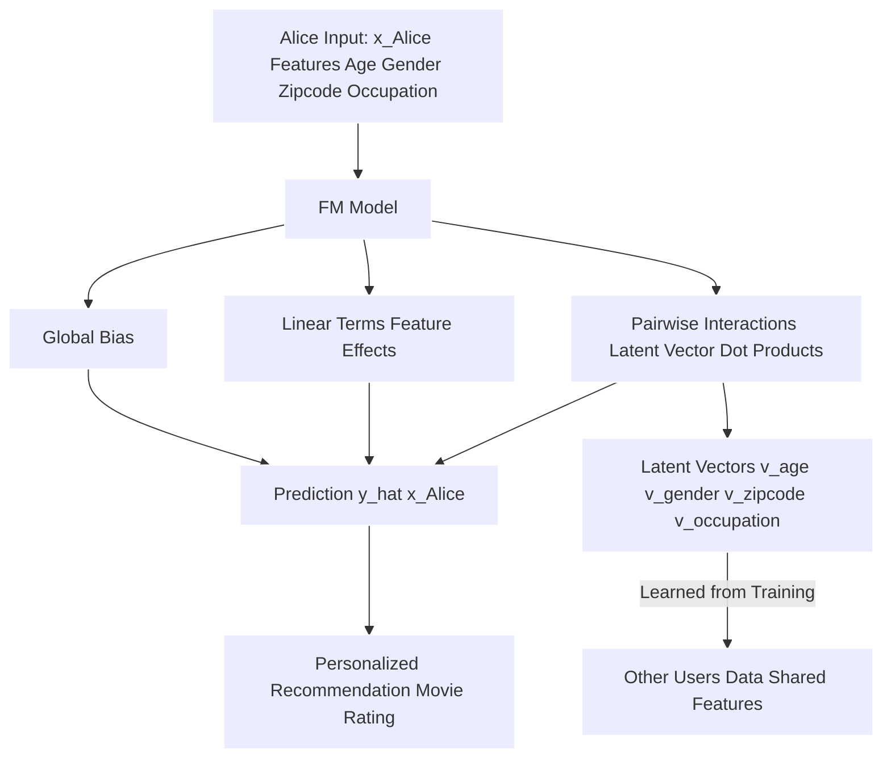

xYou've raised excellent points for clarifying the mechanics of Factorization Machines! Let's break down each part of your query.

### 1. Any interaction `x_i x_j` between different users turns out zero?

**Yes, that is generally correct.** For any _single input instance_ (e.g., a single transaction or observation), the interaction term `x_i x_j` between two _different_ users will be zero.

Here's why:

- **One-Hot Encoding of Users:** In systems like movie recommendations, user IDs are typically converted into binary (0 or 1) indicator features, often using one-hot encoding. This means `x_user01` would be 1 if the current transaction involves user01 and 0 otherwise.
- **Single Active User per Transaction:** For a specific event, such as user01 rating movie5, only _one_ user is "active" (has a non-zero feature value) for the user-ID features. If the transaction is about `user01`, then `x_user01 = 1` and `x_user02 = 0`. If the transaction is about `user02`, then `x_user02 = 1` and `x_user01 = 0`.
- **Product `x_i x_j`:** Consequently, for any single input vector `x` representing a transaction, the product of two different user indicator features (e.g., `x_user01 * x_user02`) will always be `0 * 1 = 0` or `1 * 0 = 0` or `0 * 0 = 0`. They cannot both be non-zero simultaneously for the same transaction.

**Implication for FMs:** While this specific cross-term `x_user01 * x_user02` evaluates to zero for any individual transaction, the Factorization Machine (FM) still estimates the underlying interaction `⟨v_user01, v_user02⟩` between these users. FMs are powerful because they can learn these interaction parameters even when direct observations (where `x_user01` and `x_user02` are both non-zero in the same feature vector) are absent. This is achieved by leveraging the shared latent factor vectors of each user from _all their other interactions_ (e.g., with various movies, genres, or demographic data).

### 2. How do we get `V` (the latent factor matrix)?

The matrix **`V` (representing feature embeddings)**, whose rows `v_i` are the low-dimensional latent vectors for each feature, is **learned during the model training process**.

Here's how it's typically obtained:

1. **Model Equation:** The core of a 2-way Factorization Machine is defined as: $\hat{y}(x) = \mathbf{w}_0 + \sum_{i=1}^d \mathbf{w}_i x_i + \sum_{i=1}^d\sum_{j=i+1}^d \langle\mathbf{v}_i, \mathbf{v}_j\rangle x_i x_j$. Here, $\mathbf{V} \in \mathbb{R}^{d\times k}$ represents the feature embeddings, and $\mathbf{v}_i$ is the $i$-th row of $\mathbf{V}$. k is the dimensionality of the latent factors.
2. **Parameter Initialization:** The model parameters, including the global bias $\mathbf{w}_0$, linear weights $\mathbf{w}$, and the latent vectors in $\mathbf{V}$, are initialized, typically with small random values.
3. **Loss Function:** A loss function is chosen based on the prediction task (e.g., least square error for regression, hinge loss or logit loss for binary classification). The objective of training is to **minimize this loss function**.
4. **Optimization Algorithm:** Factorization Machines are learned efficiently using **gradient descent methods**, most commonly **Stochastic Gradient Descent (SGD)**.
    - SGD is an iterative optimization algorithm that updates model parameters (including the components of $\mathbf{V}$) by taking small steps in the opposite direction of the gradient of the loss function.
    - The partial derivatives (gradients) of the FM model's prediction with respect to each parameter, including each component `v_i,f` of the latent vectors, are explicitly computed. These gradients guide how $\mathbf{V}$ is adjusted in each step.
    - The updates for all parameters for a single data point can be performed efficiently in $\mathcal{O}(kn)$ time, or even $\mathcal{O}(km(\mathbf{x}))$ for sparse data, where `m(x)` is the number of non-zero elements in `x`.
5. **Iteration and Convergence:** This process of calculating predictions, errors, gradients, and updating parameters is repeated for a fixed number of epochs (passes through the training data) or until the parameters converge (stop changing significantly).

Through this iterative optimization, the model "infers" the latent factors (the rows of `$\mathbf{V}$`) that best explain the observed data and minimize the prediction error.

### 3. What do "learning latent vectors" and "the dot product thereof" mean, and what is this "space"?

#### Learning Latent Vectors and Their Meaning ($\mathbf{v}_i$)

- **Definition:** **Latent factors** (or latent vectors, or embeddings) are low-dimensional vector representations for each feature (e.g., a specific user, a specific movie, a gender, an age range, a movie genre). They capture the **underlying, hidden, or unobserved characteristics** of that feature. The dimensionality of these vectors (`k`) is a hyperparameter.
- **Intuition:** Instead of explicitly stating that "user Alice likes action movies," the model learns a vector $\mathbf{v}_{Alice}$ and a vector $\mathbf{v}_{action\_genre}$. These vectors reside in a **shared, continuous, low-dimensional "preference space"**.
- **Implicit Meaning:** The individual dimensions within these latent vectors are **not pre-defined or explicitly labeled by humans**. The model automatically learns them based on patterns in the data. A single dimension might represent a complex blend of multiple concepts, like "serious vs. escapist films," "appeal to adults vs. children," or a combination of genre, era, and director style. While not directly interpretable, these vectors are very meaningful in their relationships to each other.
- **Discovery:** Analyzing these learned latent vectors can help discover hidden relationships, like "implicit genres" that might differ from explicit tags.

#### The Dot Product ($\langle\mathbf{v}_i, \mathbf{v}_j\rangle$)

- **Quantifying Interaction:** The dot product of two latent vectors, $\langle\mathbf{v}_i, \mathbf{v}_j\rangle$, is a single scalar value that quantifies the **strength and nature of the interaction** between feature i and feature j in the hidden $k$-dimensional latent space.
- **Similarity:** This dot product essentially represents the **similarity of the hidden features**. A higher dot product value indicates that the features are "in the neighborhood" of each other in the latent space, suggesting a stronger positive interaction or alignment.
- **Prediction:** In the FM model, the predicted outcome is influenced by how a user's latent vector aligns with an item's latent vector (e.g., $\mathbf{v}_{user} \cdot \mathbf{v}_{item}$). Geometrically, this means a user is predicted to like an item if their preference vector is pointing in a similar direction to the item's characteristic vector and both have large magnitudes.

#### The "Latent Space"

- **Abstract Representation:** This is an abstract, multi-dimensional space (of dimension `k`) where all features (users, items, genres, demographics, time, etc.) are represented as vectors.
- **Geometric Relationships:** The power of this space lies in its geometric interpretation:
    - **Similarity:** Features that are similar in terms of how they interact with other features will have their latent vectors positioned close to each other in this space. For example, users with similar tastes will have latent vectors that are close, and movies with similar characteristics will have close latent vectors.
    - **Generalization:** This shared latent space enables Factorization Machines to **generalize preferences and estimate interactions for unseen feature pairs**. Because a feature's latent vector is learned from _all_ its observed interactions, information from one interaction can be used to infer potential unobserved interactions. For instance, $\mathbf{v}_{Alice}$ is shaped by all movies Alice has rated, and $\mathbf{v}_{Star Trek}$ is shaped by all users who rated "Star Trek." Even if Alice has never rated "Star Trek," the model can predict her preference by calculating $\langle\mathbf{v}_{Alice}, \mathbf{v}_{Star Trek}\rangle$, effectively drawing on the patterns of other users with similar tastes to Alice or other movies similar to "Star Trek". This helps solve the "cold start" problem for new users or items.
- **Dimensionality Reduction:** This process is a form of **feature extraction** where high-dimensional, sparse input data is mapped into a lower-dimensional, dense representation that captures essential information. This helps combat the curse of dimensionality.

In summary, the latent vectors and their interactions allow FMs to move beyond direct observations, inferring subtle relationships between features within an abstract, shared "taste space." This makes them highly effective for prediction tasks on sparse datasets, particularly in recommender systems.

---

Yes, the Factorization Machine (FM) model **would be able to provide predictions for Alice** using her `x_Alice` as input, even though that specific combination of demographic features for Alice was never explicitly seen during the training phase as a unique `x_Alice` row.

Here's a breakdown of why and how Factorization Machines handle this "new user cold start" scenario:

1.  **The Cold Start Problem for Pure Matrix Factorization:**
    *   In a pure Matrix Factorization (MF) model, if Alice has never made a rating, her entry in the user-item interaction matrix would be entirely zeros or unknown.
    *   MF models learn latent factors (`p_u` for users and `q_i` for items) by minimizing errors on *known* ratings. If Alice has no known ratings, her latent vector `p_Alice` would remain in its initial random state and would **never be updated** during the training process. This means pure MF cannot make personalized predictions for her, which is the essence of the **new user cold start problem**.

2.  **Factorization Machines Leverage Side-Features:**
    *   Factorization Machines are a **supervised algorithm** that generalize linear regression and matrix factorization. A key strength of FMs is their ability to incorporate **any real-valued feature vector** as input. This is crucial because it means you're not limited to just user and item IDs.
    *   Alice's `x_Alice`, which contains non-zero values representing her age group, gender, zipcode, and occupation, serves as these valuable "side-features" or "auxiliary information".

3.  **The Mechanism: Factorized Interactions and Shared Parameters:**
    *   The FM model predicts an outcome (e.g., a movie rating) by combining a global bias, linear effects of individual features, and pairwise interactions between features. The pairwise interaction between two features, $i$ and $j$, is modeled by the **dot product of their respective latent vectors**, $\langle\mathbf{v}_i, \mathbf{v}_j\rangle$. Here, $\mathbf{v}_i$ is the latent vector (or "feature embedding") for the $i$-th feature.
    *   The core power of FMs in sparse settings comes from their **factorized parameters**, meaning interaction parameters share components. Even if Alice's *specific combination* of demographics is new, the individual latent vectors for each of her demographic *features* (e.g., $\mathbf{v}_{\text{age_bin_25-34}}$, $\mathbf{v}_{\text{gender_female}}$, $\mathbf{v}_{\text{occupation_engineer}}$) would have been learned during training from the interactions of *other users* who possess those same characteristics.
    *   For example, if many other "female" users rated "action movies" highly, the latent vector $\mathbf{v}_{\text{gender_female}}$ would capture some aspect of "liking action movies." Similarly, if "engineers" tend to rate "documentaries" highly, $\mathbf{v}_{\text{occupation_engineer}}$ would reflect this.

4.  **Generalization and Prediction for Alice:**
    *   When `x_Alice` is fed into the trained FM model, the model uses the **pre-learned latent vectors of her individual demographic features** (like $\mathbf{v}_{\text{age_bin}}$, $\mathbf{v}_{\text{gender}}$, etc.) to compute the various linear terms and pairwise interaction terms in the prediction equation.
    *   This allows the model to **generalize and infer Alice's likely preferences** by combining the patterns learned from other users who share her demographics. The prediction for Alice ($\hat{y}(x_{\text{Alice}})$) is thus meaningful and personalized, even without any prior ratings from her. This capability is why Factorization Machines are frequently used as a component in **hybrid recommender systems** to effectively address the cold start problem.

