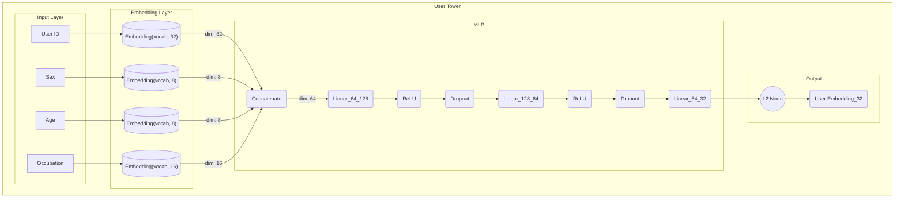
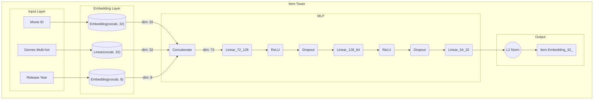
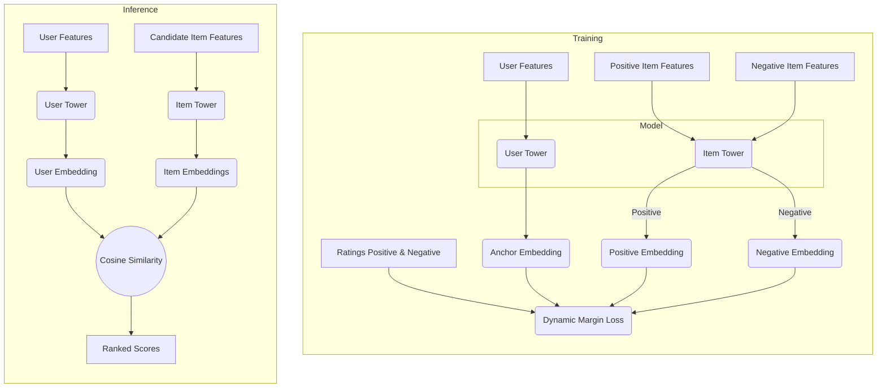

candidate generation followed by ranking

# Chosen Architecture
Candidates:
- [A Dual Augmented Two-tower Model for Online Large-scale Recommendation (Meituan)](https://dlp-kdd.github.io/assets/pdf/DLP-KDD_2021_paper_4.pdf)
- [Mixed Negative Sampling for Learning Two-tower Neural Networks in Recommendations (Google)](https://storage.googleapis.com/gweb-research2023-media/pubtools/6090.pdf)
- [Building a Two Tower Recommendation System with RedisVL (Redis)](https://redis.io/learn/building-a-two-tower-recommendation-system-with-redis-vl)
- [Learning Deep Structured Semantic Models for Web Search using Clickthrough Data (Microsoft)](https://www.microsoft.com/en-us/research/wp-content/uploads/2016/02/cikm2013_DSSM_fullversion.pdf)

# cloud.zilliz.com
user: db_db78c6e2703d3e1
pwd: Zt2+]8h2S{b}F7;u

# Vector DB

|             | FAISS                                                                                                                                                                                                                                                                  | Milvus (via pymilvus)                                                                                                                                                                                                                                                               | RedisVL                                                                                                                                                                                                                      |
| ----------- | ---------------------------------------------------------------------------------------------------------------------------------------------------------------------------------------------------------------------------------------------------------------------- | ----------------------------------------------------------------------------------------------------------------------------------------------------------------------------------------------------------------------------------------------------------------------------------- | ---------------------------------------------------------------------------------------------------------------------------------------------------------------------------------------------------------------------------- |
| What is it? | A C++ library with Python bindings that contains the core, high-performance ANN algorithms.                                                                                                                                                                            | A full-featured, standalone vector database system built for production. It often uses FAISS internally.                                                                                                                                                                            | A module for Redis that adds vector search capabilities to the popular in-memory key-value store.                                                                                                                            |
| Pros        | - Maximum Performance: The fastest option if you build a service around it. - Total Control: Huge variety of indexing algorithms to precisely tune the speed/accuracy/memory trade-off. - GPU Support: Can use GPUs to accelerate search by orders of magnitude. | -Production Ready: It's a complete, scalable, and reliable service. - Easy API: pymilvus provides a simple, high-level API for managing and searching vectors. - Dynamic & Hybrid: Easily add/delete vectors and filter results based on other metadata (e.g., genre, price). | -Convenient: If you already use Redis, adding vector search is simple. - Unified Store: Store vector embeddings and item metadata together in one place. - Real-time: Also supports dynamic data and hybrid filtering. |
| Cons        | - It's a Library, Not a Service: You have to write your own server, manage data persistence, and handle scaling. - Complex: The number of options can be overwhelming.                                                                                              | - More Infrastructure: It's a distributed system with its own components that need to be managed. - Less Low-Level Control: Abstracts away some of the finer details that FAISS exposes.                                                                                         | - Newer: Vector search is a newer feature for Redis compared to databases built from the ground up for it. - In-Memory Focus: Primarily designed as an in-memory system, which can affect cost at massive scale.          |
| Use When... | You are building a custom, high-performance vector search service from scratch and need maximum control.                                                                                                                                                               | You need a scalable, production-grade, "turn-key" solution for vector search and want to get started quickly.                                                                                                                                                                       | You already have a Redis-based infrastructure and want to add vector search capabilities without deploying a new database.                                                                                                   |
# Diagrams

