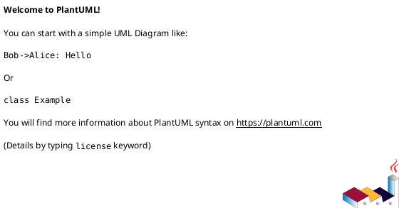

---
tags:
  - 10_linux
  - concept
  - standard
  - api
  - os
aliases:
  - Portable Operating System Interface
related:
  - "[[Operating_System]]"
  - "[[Unix]]"
  - "[[Linux]]"
  - "[[Kernel]]"
worksheet:
  - WS<% tp.file.cursor(1) %>
date_created: 2025-04-10
---
# POSIX

## Definition

<% tp.file.cursor(2) %>

## Key Aspects / Characteristics

- Aspect 1
- Aspect 2

## Examples / Use Cases

- Example 1
- Example 2

## Related Concepts
<% tp.file.cursor(3) %>
- [[Link 1]]
- [[Link 2]]

## Diagrams (Optional)
<% tp.file.cursor(4) %>

## Questions / Further Study

> [!question] Question Title  
> Answer or discussion point.
> 
> - Follow-up task related to this concept @today
>     

---

**Source:** Worksheet <% tp.file.cursor(5) %>