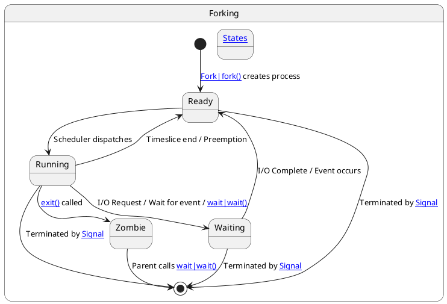

---
tags:
  - 10_linux
  - concept
  - os
  - core
aliases: 
related:
  - "[[Program]]"
  - "[[Operating_System]]"
  - "[[Kernel]]"
  - "[[CPU]]"
  - "[[50_Data_Structures/Memory_Management]]"
  - "[[Context_switch]]"
  - "[[Thread]]"
  - "[[Fork]]"
  - "[[Exec]]"
  - "[[Signal]]"
  - "[[PID]]"
  - "[[PPID]]"
  - "[[Zombie_process]]"
  - "[[Orphan_process]]"
worksheet:
  - WS<% tp.file.cursor(1) %>
date_created: 2025-04-10
---
# Process

## Definition

A **Process** is an instance of a computer [[Program]] that is being executed by one or many [[Thread|threads]]. It contains the program code and its current activity, including the program counter, processor registers, and variables stored in its own private memory space (stack, heap, data segments).

## Key Aspects / Characteristics

- **Execution Instance:** A running [[Program]]. Multiple processes can exist for the same program.
- **Resource Ownership:** Each process has its own virtual address space, [[File_descriptor|file descriptors]], [[PID]] (Process ID), [[PPID]] (Parent Process ID), execution state, etc.
- **Isolation:** Processes are typically isolated from each other by the [[Operating_System]]'s [[50_Data_Structures/Memory_Management]] for security and stability. Inter-Process Communication (IPC) mechanisms are needed for them to interact.
- **State:** A process can be in various [[Process_states]] (e.g., Running, Ready, Waiting, Terminated, [[Zombie_process|Zombie]]).
- **Creation:** Processes are typically created using a [[System_call]] like [[Fork]] (which creates a child process as a copy of the parent) often followed by an [[Exec]] call (which replaces the child's program image with a new one).
- **Termination:** Processes can terminate normally (exit call) or abnormally (e.g., receiving a fatal [[Signal]]).

## Examples / Use Cases

- Running a web browser.
- Executing a [[Shell]] command.
- A background [[Daemon]] service.
- Compiling code using a [[Compiler]].

## Related Concepts
- [[Program]] (The static code and data)
- [[Thread]] (A unit of execution *within* a process)
- [[Operating_System]] / [[Kernel]] (Manages processes)
- [[CPU]] (Executes process instructions)
- [[50_Data_Structures/Memory_Management]] (Allocates memory to processes)
- [[Context_switch]] (Switching the CPU between processes)
- [[Fork]], [[Exec]], [[wait]], [[kill]] (System calls for process management)
- [[Signal]] (Asynchronous notification to processes)
- [[PID]], [[PPID]] (Process identifiers)
- [[Process_states]], [[Zombie_process]], [[Orphan_process]]
- [[Shell_job]] (Process management within a shell)
- [[Resource_starvation]]

## Diagrams (Optional)

## Questions / Further Study

> [!question] What is the difference between a process and a program? (WS14)  
> A [[Program]] is a passive entity, like the contents of a file stored on disk (e.g., /bin/ls). A [[Process]] is an active entity, a program in execution. It has a state (running, waiting, etc.), a program counter indicating the next instruction, allocated [[RAM]], [[File_descriptor|file descriptors]], etc. One program can be run as multiple processes simultaneously.

> [!question] What is a zombie process? (WS13, WS14)  
> A [[Zombie_process]] is a process that has completed execution (terminated) but still has an entry in the process table. This entry is needed to allow the parent process to read its child's exit status using the [[wait]] system call. Once the parent calls wait, the zombie process entry is removed. If the parent terminates without waiting, the zombie becomes an [[Orphan_process]] and is typically adopted by the init process (PID 1), which periodically waits for its adopted children to clean up zombies.

> [!question] What is an orphan process? (WS13, WS14)  
> An [[Orphan_process]] is a process whose parent process has terminated before the child. In most Unix-like systems, orphan processes are "adopted" by the init process (PID 1) or a modern equivalent like systemd. This ensures they don't become [[Zombie_process|zombies]] indefinitely if they terminate later, as init will call [[wait]] for them.

---

**Source:** Worksheet WS1, WS13, WS14