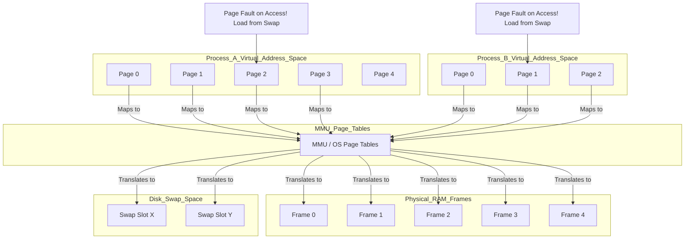

---
tags:
  - linux
  - concept
  - os
  - memory
  - core
aliases:
  - Virtual Memory Management
related:
  - "[[Operating_System]]"
  - "[[Kernel]]"
  - "[[50_Data_Structures/Memory_Management]]"
  - "[[RAM]]"
  - "[[Swap_Space]]"
  - "[[Swap_file]]"
  - "[[Swap_Partition]]"
  - "[[Paging]]"
  - "[[Page_Table]]"
  - "[[MMU]]"
  - "[[Process]]"
  - "[[Memory_Segments_C]]"
worksheet:
  - WS1
  - WS13
date_created: 2025-04-20
---
# Virtual Memory

## Definition

**Virtual Memory** is a [[50_Data_Structures/Memory_Management]] technique implemented by the [[Operating_System]] (in conjunction with hardware support, typically the [[MMU|Memory Management Unit]]) that provides each [[Process]] with the illusion of having its own private, large, contiguous address space (virtual address space), which is independent of the amount of physical [[RAM]] actually available and independent of other processes' address spaces. The OS manages the mapping between these virtual addresses used by the process and the actual physical addresses in RAM, often using secondary storage ([[Swap_Space]]) as an extension of RAM.

## Key Aspects / Characteristics

- **Address Space Abstraction:** Each process sees a large, linear range of addresses (e.g., 232 or 264 bytes), its *virtual address space*.
- **Isolation:** Each process's virtual address space is separate and protected from other processes. One process cannot directly access the memory of another (unless explicitly using shared memory mechanisms).
- **Mapping:** The OS and [[MMU]] translate virtual addresses used by the CPU into physical RAM addresses. This mapping is typically done in fixed-size chunks called **pages**. See [[Paging]].
- **[[Paging|Demand Paging]]:** Allows parts of a process's virtual address space (pages) to reside on disk ([[Swap_Space]]) when not actively in use. Pages are loaded into physical RAM only when accessed by the process (on demand). This allows running programs larger than physical RAM.
- **[[Swap_Space]]:** Disk space (a [[Swap_Partition]] or [[Swap_file]]) used to store inactive pages swapped out from RAM.
- **[[Page_Table|Page Tables]]:** Data structures maintained by the OS (and often referenced by the MMU) to store the mapping between virtual pages and physical page frames (locations in RAM) or disk locations (in swap space).
- **[[MMU]] (Memory Management Unit):** Hardware component (usually part of the [[CPU]]) that performs the fast translation of virtual addresses to physical addresses using information from the page tables. It also enforces memory protection.
- **Benefits:**
    - Allows running more processes than can fit entirely in physical RAM.
    - Allows running individual processes larger than physical RAM.
    - Provides memory protection between processes.
    - Simplifies memory allocation for programmers (processes see a large, contiguous space).
    - Enables efficient sharing of memory (e.g., shared libraries can map the same physical code pages into multiple processes' virtual address spaces).

## Visualization (Conceptual Mapping)

## Related Concepts
- [[50_Data_Structures/Memory_Management]] (Virtual memory is a core technique)
- [[Operating_System]], [[Kernel]], [[MMU]] (Implement and manage virtual memory)
- [[Process]] (Each process gets its own virtual address space)
- [[RAM]], [[Swap_Space]] (Physical storage backing virtual memory)
- [[Paging]], [[Page_Table]], [[Page_Fault]]
- [[Memory_Segments_C]] (Layout within the virtual address space)

## Questions / Further Study
>[!question] What is virtual memory? (WS13)
> Virtual memory is an OS [[50_Data_Structures/Memory_Management]] technique giving each [[Process]] its own large, private virtual address space, independent of physical [[RAM]]. The OS and hardware ([[MMU]]) map virtual addresses to physical RAM addresses (or [[Swap_Space]] on disk) using [[Paging]]. This provides process isolation, allows running programs larger than RAM, and enables more efficient memory use.

>[!question] Explain the need in memory management? (WS13)
> Memory management is needed to:
> 1.  **Allocate/Deallocate:** Provide memory to processes when needed and reclaim it when they finish.
> 2.  **Sharing:** Allow multiple processes to share memory safely and efficiently (e.g., shared libraries).
> 3.  **Protection:** Prevent processes from interfering with each other's memory or the OS kernel's memory.
> 4.  **Abstraction:** Hide the physical organization of memory from processes, providing a simpler, logical view (like the large, contiguous virtual address space).
> 5.  **Efficiency:** Manage the limited physical RAM effectively, often using techniques like [[Virtual_memory]] and [[Paging]] to run more programs than would physically fit.

---
**Source:** Worksheet WS1, WS13