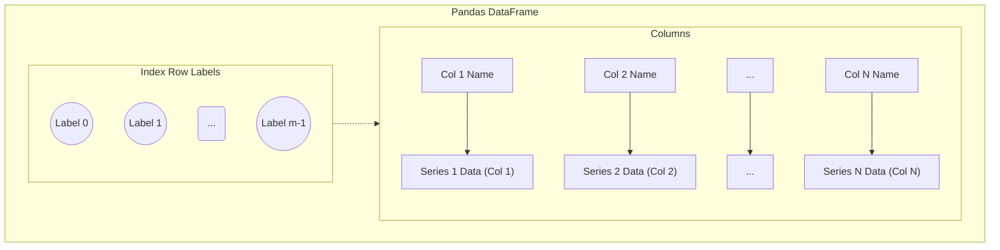

---
tags:
  - pandas
  - python
  - data_structure
  - core
  - 2d_array
  - table
aliases:
  - Pandas DataFrame
  - pd.DataFrame
  - DataFrame
related:
  - "[[Pandas]]"
  - "[[Pandas_Series]]"
  - "[[Pandas_Index_Object]]"
  - "[[NumPy_ndarray]]"
  - "[[Tabular_Data]]" # Placeholder
  - "[[Spreadsheet]]" # Analogy
  - "[[SQL_Table]]" # Analogy
worksheet: [WS_Pandas_Intro] # Assuming
date_created: <% tp.file.creation_date("YYYY-MM-DD") %>
---
# Pandas `DataFrame`

## Definition

A **Pandas `DataFrame`** is a **two-dimensional, size-mutable, and potentially heterogeneous tabular data structure** with labeled rows and columns. It is the primary data structure in [[Pandas]] and can be thought of as analogous to a spreadsheet, an SQL table, or a dictionary of [[Pandas_Series|Series objects]] (where each Series represents a column and they all share the same index).

## Key Characteristics

- **Two-Dimensional:** Organizes data in rows and columns.
- **Labeled Axes:** Has both row labels (**[[Pandas_Index_Object|index]]**) and column labels (**columns**).
- **Heterogeneous Data:** Columns can have different [[NumPy_Data_Types|data types]] (e.g., one column of integers, another of strings, another of floats). Each column itself is a `Series` and is internally homogeneous.
- **Size-Mutable:** Rows and columns can be inserted, deleted, and modified.
- **Built on NumPy:** Internally, the data is often stored as one or more [[NumPy_ndarray|NumPy arrays]], allowing for efficient numerical operations.
- **Rich Functionality:** Provides a vast array of methods for:
    - Data loading and saving (CSV, Excel, SQL, etc.)
    - Indexing, selection, and slicing (`.loc[]`, `.iloc[]`, boolean indexing)
    - Data cleaning (handling missing values, duplicates)
    - Data transformation (applying functions, grouping, merging, reshaping)
    - Statistical analysis (`describe()`, `mean()`, `corr()`, etc.)
    - Basic plotting.

## Creating a DataFrame

DataFrames can be created from various sources:

[list2tab]
- From Dictionary of Lists/Arrays
	Each dictionary key becomes a column name, and each list/array becomes a column. Lists must be of the same length.
	```python
	import pandas as pd
	data_dict = {
	    'Name': ['Alice', 'Bob', 'Charlie', 'David'],
	    'Age': [25, 30, 22, 35],
	    'City': ['New York', 'Paris', 'London', 'Tokyo']
	}
	df1 = pd.DataFrame(data_dict)
	print("DataFrame from dict of lists:\n", df1)
	```
- From List of Dictionaries
	Each dictionary in the list represents a row. Keys become column names. Pandas infers columns and handles missing keys by inserting `NaN`.
	```python
	import pandas as pd
	list_of_dicts = [
	    {'Name': 'Eve', 'Age': 28, 'Country': 'Canada'},
	    {'Name': 'Frank', 'Age': 32, 'City': 'Berlin'}, # 'Country' missing, 'City' new
	    {'Name': 'Grace', 'Age': 29, 'Country': 'USA', 'City': 'Chicago'}
	]
	df2 = pd.DataFrame(list_of_dicts)
	print("\nDataFrame from list of dicts:\n", df2)
	```
- From NumPy Array
	Can specify index and column labels.
	```python
	import pandas as pd
	import numpy as np
	data_np = np.array([, , ])
	df3 = pd.DataFrame(data_np,
	                     index=['R1', 'R2'],
	                     columns=['C1', 'C2', 'C3'])
	print("\nDataFrame from NumPy array:\n", df3)
	```
- From a Series
	A single Series can be converted to a single-column DataFrame.
	```python
	import pandas as pd
	s = pd.Series([10, 20, 30], name='Values', index=['a', 'b', 'c'])
	df4 = pd.DataFrame(s) # Or pd.DataFrame({'MyCol': s})
	print("\nDataFrame from Series:\n", df4)
	```
- From CSV File
	One of the most common ways.
	```python
	import pandas as pd
	# Assume 'data.csv' exists
	# df_csv = pd.read_csv('data.csv')
	# print("\nDataFrame from CSV (first 5 rows):\n", df_csv.head())
	```
	*Example of `data.csv`:*
	```csv
	Name,Age,City
	Alice,25,New York
	Bob,30,Paris
	```

## Basic Attributes and Methods

- **`df.index`**: Row labels.
- **`df.columns`**: Column labels.
- **`df.values`**: Data as a NumPy array (might be `object` dtype if columns are mixed).
- **`df.dtypes`**: Data types of each column.
- **`df.shape`**: Tuple of (number of rows, number of columns).
- **`df.size`**: Total number of elements.
- **`df.ndim`**: Number of dimensions (always 2 for a DataFrame).
- **`df.head(n)` / `df.tail(n)`**: First/last `n` rows.
- **`df.info()`**: Summary of DataFrame (index dtype, column dtypes, non-null values, memory usage).
- **`df.describe()`**: Descriptive statistics for numerical columns.

## Visualization (Conceptual)



## Related Concepts
- [[Pandas]], [[Pandas_Series]] (Columns are Series)
- [[Pandas_Index_Object]] (Row and column labels)
- [[NumPy_ndarray]] (Underlying data representation)
- [[Tabular_Data]], Spreadsheets, SQL Tables (Analogous structures)
- Data I/O, Data Cleaning, Data Transformation, Grouping, Merging

---
**Source:** Pandas Documentation