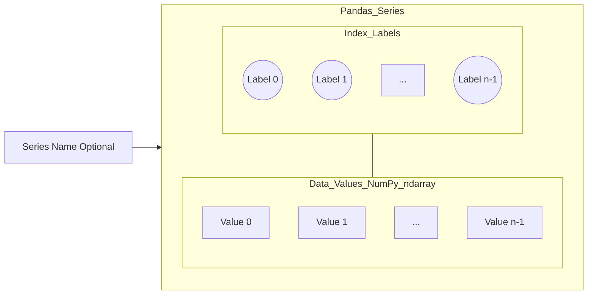

---
tags:
  - pandas
  - python
  - data_structure
  - core
  - 1d_array
aliases:
  - Pandas Series
  - pd.Series
related:
  - "[[Pandas]]"
  - "[[Pandas_DataFrame]]"
  - "[[Pandas_Index_Object]]"
  - "[[NumPy_ndarray]]"
worksheet:
[WS_Pandas_Intro, WS_Pandas]
date_created: <% tp.file.creation_date("YYYY-MM-DD") %>
---
# Pandas `Series`

## Definition

A **Pandas `Series`** is a **one-dimensional labeled array** capable of holding data of any [[NumPy_Data_Types|NumPy data type]] (integers, strings, floating-point numbers, Python objects, etc.). It is one of the two primary data structures in [[Pandas]], the other being the [[Pandas_DataFrame|DataFrame]]. A Series can be thought of as a single column in a spreadsheet or a 1D [[NumPy_ndarray]] with an associated set of labels, called the **[[Pandas_Index_Object|index]]**.

## Key Characteristics

- **One-Dimensional:** Represents a single sequence of data.
- **Labeled Index:** Each element has an associated label in its index. If no index is explicitly provided during creation, a default integer index `RangeIndex(0, 1, ..., n-1)` is created.
- **Homogeneous Data (Usually):** While a Series *can* hold mixed data types (by using an `object` dtype), it is most efficient and commonly used with homogeneous data, similar to a NumPy array. Operations are generally faster on homogeneous Series.
- **NumPy `ndarray` Backend:** The actual data in a Series is typically stored internally as a NumPy `ndarray`. This allows Series to leverage NumPy's performance for numerical operations.
- **Named:** A Series can optionally have a `name` attribute, which is useful when it's part of a DataFrame (where the name often corresponds to the column name).
- **Vectorized Operations:** Supports element-wise operations and many NumPy ufuncs, similar to `ndarray`s.
- **Alignment:** When performing operations between Series, Pandas automatically aligns data based on index labels.

## Creating a Series

```python
import pandas as pd
import numpy as np

# From a Python list (default integer index)
s1 = pd.Series([10, 20, 30, 40])
# 0    10
# 1    20
# 2    30
# 3    40
# dtype: int64

# From a Python list with custom index
s2 = pd.Series([1.5, 2.5, 3.5], index=['a', 'b', 'c'], name='MyFloats')
# a    1.5
# b    2.5
# c    3.5
# Name: MyFloats, dtype: float64

# From a Python dictionary (keys become index, values become data)
data_dict = {'x': 100, 'y': 200, 'z': 300}
s3 = pd.Series(data_dict)
# x    100
# y    200
# z    300
# dtype: int64

# From a NumPy array
arr = np.array()
s4 = pd.Series(arr, index=['p', 'q', 'r'])
# p    1
# q    2
# r    3
# dtype: int64 (or whatever arr.dtype is)

# From a scalar value (value will be repeated to match index length)
s5 = pd.Series(5, index=['row1', 'row2', 'row3'])
# row1    5
# row2    5
# row3    5
# dtype: int64
```

## Basic Attributes and Methods

- **`series.values`**: Returns the data as a NumPy `ndarray`.
- **`series.index`**: Returns the [[Pandas_Index_Object|Index object]].
- **`series.dtype`**: Returns the data type of the elements.
- **`series.shape`**: Returns a tuple of the Series dimensions (e.g., `(n,)`).
- **`series.size`**: Returns the number of elements.
- **`series.name`**: Get or set the name of the Series.
- **`series.head(n)` / `series.tail(n)`**: Get first/last `n` elements.
- **`series.isnull()` / `series.notnull()`**: Boolean Series indicating missing/non-missing values.
- Indexing (label-based with `[]` or `.loc[]`, integer-position with `.iloc[]`).
- Arithmetic operations, boolean operations, statistical methods (`mean()`, `sum()`, `std()`, etc.).

## Visualization (Conceptual)



## Related Concepts
- [[Pandas]], [[Pandas_DataFrame]] (A DataFrame is a collection of Series)
- [[Pandas_Index_Object]] (Provides the labels)
- [[NumPy_ndarray]] (Underlying data storage)
- 1D Labeled Array
- Data Alignment

---
**Source:** Pandas Documentation