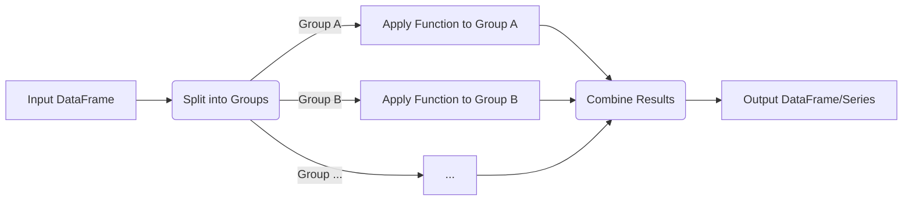

---
tags:
  - pandas
  - python
  - data_manipulation
  - aggregation
  - transformation
  - filtering
  - concept
  - function
aliases:
  - df.groupby
  - Pandas GroupBy
  - Split-Apply-Combine
related:
  - "[[Pandas_DataFrame]]"
  - "[[Pandas_Series]]"
  - "[[Pandas_Aggregation_Functions]]"
  - "[[Pandas_Apply_Map_Applymap]]" # .apply() on groups
  - "[[Pandas_transform]]" # Placeholder
  - "[[Pandas_filter_groupby]]" # Placeholder
worksheet: [WS_Pandas_Main]
date_created: <% tp.file.creation_date("YYYY-MM-DD") %>
---
# Pandas `groupby()`

## Definition

The `groupby()` operation in Pandas is a powerful mechanism for **splitting** a [[Pandas_DataFrame|DataFrame]] into groups based on some criteria (e.g., values in one or more columns), **applying** a function to each group independently, and then **combining** the results into a new data structure (often a DataFrame or Series). This "split-apply-combine" strategy is fundamental for many data analysis tasks.

## `DataFrame.groupby(by=None, axis=0, level=None, as_index=True, sort=True, group_keys=True, squeeze=<no_default>, observed=False, dropna=True)`

- **`by`**: Used to determine the groups. Can be:
    - A column name or list of column names.
    - A Series or list of Series (same length as the DataFrame's index).
    - A dictionary or Series mapping index labels to group names.
    - A function to be called on index labels.
- **`axis`**: (Default `0`) Split along rows (group by index) or columns (group by columns). Grouping by columns is less common.
- **`as_index`**: (Default `True`) For aggregated output, return object with group labels as the index. If `False`, group labels become regular columns (SQL-like grouped output).
- **`sort`**: (Default `True`) Sort group keys. Turning this off can improve performance.
- **`group_keys`**: (Default `True` before Pandas 1.5.0, `False` from 1.5.0 when calling `apply`). When `apply` is used, add group keys to index to identify pieces.
- **`observed`**: (Default `False`) Only for Categorical groupers. If `True`, only show observed values for categorical groupers.

## The Split-Apply-Combine Process



1.  **Split:** The data is split into groups based on the criteria specified in the `by` parameter.
2.  **Apply:** A function is applied to each group independently. This function can be:
    -   **Aggregation:** Computes a summary statistic for each group (e.g., `sum()`, `mean()`, `count()`, `min()`, `max()`, or custom functions via `.agg()`). See [[Pandas_Aggregation_Functions]].
    -   **Transformation:** Performs some group-specific computation and returns a like-indexed object (e.g., standardizing data within groups using `.transform()`). See [[Pandas_transform]].
    -   **Filtration:** Discards entire groups based on a group-wise computation that returns `True` or `False` (using `.filter()`). See [[Pandas_filter_groupby]].
    -   General application using `.apply()` for more complex, custom operations.
3.  **Combine:** The results of the function applications are combined into a new DataFrame or Series. The structure of the result depends on the function applied.

## Example

```python
import pandas as pd
import numpy as np

data = {
    'Team': ['A', 'B', 'A', 'B', 'A', 'C'],
    'Player': ['P1', 'P2', 'P3', 'P4', 'P5', 'P6'],
    'Score':,
    'Assists':
}
df = pd.DataFrame(data)
print("Original DataFrame:\n", df)

# Group by 'Team'
grouped_by_team = df.groupby('Team')

# --- Aggregation Examples ---
# Sum of Scores and Assists per Team
team_totals = grouped_by_team[['Score', 'Assists']].sum()
print("\nSum of Scores/Assists per Team:\n", team_totals)

# Mean Score per Team
mean_score_per_team = grouped_by_team['Score'].mean()
print("\nMean Score per Team:\n", mean_score_per_team)

# Multiple aggregations
team_stats = grouped_by_team.agg(
    total_score=('Score', 'sum'),
    avg_assists=('Assists', 'mean'),
    num_players=('Player', 'count')
)
print("\nMultiple Stats per Team:\n", team_stats)

# Group by multiple columns
team_player_first_char_group = df.groupby(['Team', df['Player'].str])
print("\nFirst player in each Team-Initial group:\n", team_player_first_char_group.first())


# --- Transformation Example ---
# Standardize scores within each team (z-score)
# df['StdScore'] = grouped_by_team['Score'].transform(lambda x: (x - x.mean()) / x.std())
# print("\nDataFrame with Standardized Scores within Team:\n", df)

# --- Filtration Example ---
# Keep only teams with an average score greater than 15
# filtered_teams = grouped_by_team.filter(lambda x: x['Score'].mean() > 15)
# print("\nTeams with average score > 15:\n", filtered_teams)
```

## Key Points

- `groupby()` itself returns a `DataFrameGroupBy` or `SeriesGroupBy` object. No actual computation happens until an aggregation, transformation, or filter function is called on this object.
- It's one of the most powerful and flexible features in Pandas for data analysis.

## Related Concepts
- [[Pandas_DataFrame]], [[Pandas_Series]]
- [[Pandas_Aggregation_Functions]] (`sum`, `mean`, `count`, `agg`)
- [[Pandas_transform]] (Group-wise transformation)
- [[Pandas_filter_groupby]] (Group-wise filtering)
- [[Pandas_Apply_Map_Applymap]] (`.apply()` can be used on GroupBy objects for custom functions)
- Split-Apply-Combine paradigm
- SQL `GROUP BY` clause (analogous concept)

---
**Source:** WS_Pandas_Main, Pandas Documentation