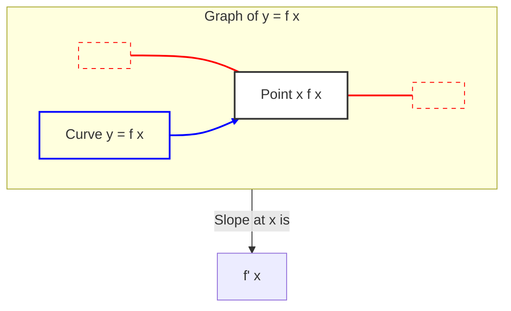

---
tags:
  - mathematics
  - calculus
  - derivatives
  - rate_of_change
  - slope
  - concept
aliases:
  - Derivative
  - Differentiation
  - Slope of a function
related:
  - "[[_Calculus_MOC]]"
  - "[[Limits]]"
  - "[[Calculus_Integrals]]"
  - "[[Calculus_Optimization]]"
  - "[[Gradient]]"
  - "[[Matrix_Calculus]]"
worksheet:
  - WS_Math_Foundations_1
date_created: 2025-05-30
---
# Derivatives

## Definition
In calculus, the **derivative** of a function of a real variable measures the sensitivity to change of the function value (output value) with respect to a change in its argument (input value). Derivatives are a fundamental tool of calculus.

For a function $f(x)$, the derivative at a point $x_0$, denoted as $f'(x_0)$, $\frac{df}{dx}(x_0)$, or $y'$, represents the **instantaneous rate of change** of the function with respect to its variable at that specific point.

Geometrically, the derivative of a function at a point is the **slope of the tangent line** to the graph of the function at that point.

## Formal Definition (Using Limits)
The derivative of a function $f(x)$ with respect to $x$ is defined by the limit:
$$ f'(x) = \lim_{h \to 0} \frac{f(x+h) - f(x)}{h} $$
This limit, if it exists, gives the derivative of $f$ at $x$. The process of finding a derivative is called **differentiation**.

## Key Aspects & Interpretations
[list2tab|#Derivative Aspects]
- Rate of Change
    - If $y = f(t)$ where $t$ represents time, then $f'(t)$ represents the rate of change of $y$ with respect to time. For example, if $y$ is position, $f'(t)$ is velocity.
- Slope of Tangent Line
    - The derivative $f'(a)$ is the slope of the line tangent to the graph of $y=f(x)$ at the point $(a, f(a))$.
- Approximation
    - For a small change $\Delta x$, the change in $f(x)$, $\Delta f = f(x+\Delta x) - f(x)$, can be approximated by $\Delta f \approx f'(x) \Delta x$.
- Increasing/Decreasing Functions
    - If $f'(x) > 0$ on an interval, then $f(x)$ is increasing on that interval.
    - If $f'(x) < 0$ on an interval, then $f(x)$ is decreasing on that interval.
    - If $f'(x) = 0$ at a point, it may indicate a local maximum, local minimum, or an inflection point (critical points).

## Common Derivative Rules
[list2mdtable]
- **Constant Rule:** 
	- $\frac{d}{dx}(c) = 0$
- **Power Rule:**
	- $\frac{d}{dx}(x^n) = nx^{n-1}$
- **Constant Multiple Rule:**
	- $\frac{d}{dx}(cf(x)) = c f'(x)$
- **Sum/Difference Rule:** 
	- $\frac{d}{dx}(f(x) \pm g(x)) = f'(x) \pm g'(x)$
- **Product Rule:** 
	- $\frac{d}{dx}(f(x)g(x)) = f'(x)g(x) + f(x)g'(x)$
- **Quotient Rule:** 
	- $\frac{d}{dx}\left(\frac{f(x)}{g(x)}\right) = \frac{f'(x)g(x) - f(x)g'(x)}{[g(x)]^2}$
- **Chain Rule:** 
	- If $y = f(g(x))$, then $\frac{dy}{dx} = f'(g(x)) \cdot g'(x)$
- **Derivatives of Common Functions:**
    - $\frac{d}{dx}(e^x) = e^x$
    - $\frac{d}{dx}(\ln x) = \frac{1}{x}$
    - $\frac{d}{dx}(\sin x) = \cos x$
    - $\frac{d}{dx}(\cos x) = -\sin x$

## Higher-Order Derivatives
The derivative of a derivative is called the **second derivative**, denoted $f''(x)$ or $\frac{d^2f}{dx^2}$. It measures the rate of change of the slope, or the concavity of the function.
- If $f''(x) > 0$, the function is concave up (like a cup).
- If $f''(x) < 0$, the function is concave down (like a frown).
One can continue to take derivatives to get third, fourth, and higher-order derivatives.

## Applications in AI/ML
- **[[Calculus_Optimization|Optimization]]:** Derivatives are crucial for finding minima or maxima of functions, which is the core of training most machine learning models (e.g., minimizing a loss function using [[Gradient Descent]]).
- **[[Gradient Descent]]:** An iterative optimization algorithm that uses the [[Gradient|gradient]] (a vector of partial derivatives) to update model parameters.
- **Backpropagation:** The algorithm for training neural networks, which uses the chain rule to efficiently compute gradients.
- **Sensitivity Analysis:** Understanding how changes in input variables affect the output of a model.

## Diagram: Derivative as Slope of Tangent

> The diagram illustrates that the derivative $f'(x)$ at a point $(x, f(x))$ on the curve of $y=f(x)$ is the slope of the tangent line (T1-A-T2) to the curve at that point.

---