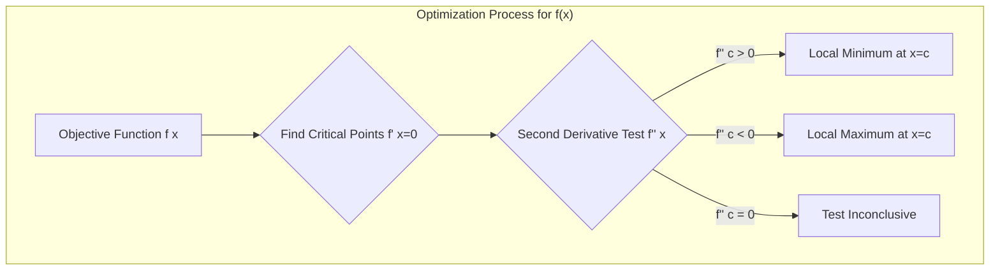

---
tags:
  - mathematics
  - calculus
  - optimization
  - minimization
  - maximization
  - gradient_descent
  - concept
aliases:
  - Optimization Problems
  - Mathematical Optimization
  - Function Optimization
related:
  - "[[_Calculus_MOC]]"
  - "[[Calculus_Derivatives]]"
  - "[[Gradient]]"
  - "[[Hessian]]"
  - "[[Loss_Function]]"
  - "[[Gradient_Descent]]"
  - "[[Linear_Programming]]"
  - "[[Convex_Optimization]]"
worksheet:
  - WS_Math_Foundations_1
date_created: 2025-05-30
---
# Optimization in Calculus

## Definition
**Optimization** is the process of finding the best solution from a set of available alternatives, typically by maximizing or minimizing a real function. In the context of calculus, optimization involves finding the input values (arguments) of a function that result in its maximum or minimum output values (extrema).

This involves:
- **Objective Function:** The function $f(x)$ that we want to maximize or minimize.
- **Variables:** The input $x$ (which can be a scalar, [[Vector|vector]], or [[Matrix|matrix]]) that we can control.
- **Constraints (Optional):** Conditions or restrictions that the variables must satisfy.

## Role of Derivatives in Optimization
[[Calculus_Derivatives|Derivatives]] are fundamental tools for unconstrained optimization of differentiable functions.
- **First-Order Condition (Necessary Condition for Extrema):** If a function $f(x)$ has a local maximum or minimum at a point $c$ and $f'(c)$ exists, then $f'(c) = 0$. Points where $f'(c) = 0$ or $f'(c)$ is undefined are called **critical points**.
- **Second-Order Condition (Sufficient Condition for Extrema):**
    - If $f'(c) = 0$ and $f''(c) > 0$, then $f$ has a local minimum at $c$. (The function is concave up).
    - If $f'(c) = 0$ and $f''(c) < 0$, then $f$ has a local maximum at $c$. (The function is concave down).
    - If $f'(c) = 0$ and $f''(c) = 0$, the test is inconclusive.

For functions of multiple variables ($f(\mathbf{x})$ where $\mathbf{x}$ is a vector), these concepts extend:
- The [[Gradient|gradient]] $\nabla f(\mathbf{x})$ must be the zero vector at a local extremum: $\nabla f(\mathbf{x}) = \mathbf{0}$.
- The [[Hessian]] matrix (matrix of second-order partial derivatives) is used for the second-order test (e.g., positive definite Hessian for a local minimum).

>[!question] Should the keyword "Optimization" appear under "Calculus"? List different types of optimization problems.
>Yes, "Optimization" is a core application and topic within calculus, especially for continuous, differentiable functions. Calculus provides the foundational tools (derivatives) for finding optima.
>
>However, optimization is a broader field in mathematics and computer science.
>
>**Different Types of Optimization Problems:**
>1.  **Based on Constraints:**
>    *   **Unconstrained Optimization:** No constraints on the variables.
>    *   **Constrained Optimization:** Variables must satisfy certain equalities or inequalities (e.g., [[Linear_Programming]], Quadratic Programming). Methods like Lagrange multipliers are used.
>2.  **Based on Nature of Variables:**
>    *   **Continuous Optimization:** Variables can take any real value within a range. (Calculus is primarily used here).
>    *   **Discrete Optimization (Combinatorial Optimization):** Variables are restricted to discrete values (e.g., integers). Examples include the Traveling Salesperson Problem, Integer Programming.
>3.  **Based on Nature of Objective Function & Constraints:**
>    *   **Linear Programming (LP):** Objective function and constraints are linear.
>    *   **Nonlinear Programming (NLP):** Objective function or constraints (or both) are nonlinear.
>        *   **[[Convex_Optimization|Convex Optimization]]:** A special case of NLP where the objective function is convex and the feasible set is convex. Convex problems are desirable because local optima are also global optima.
>        *   **Non-Convex Optimization:** Objective function or feasible set is non-convex. These problems can have multiple local optima, making finding the global optimum challenging. Many deep learning optimization problems are non-convex.
>4.  **Based on Number of Objectives:**
>    *   **Single-Objective Optimization:** Optimizing a single objective function.
>    *   **Multi-Objective Optimization:** Optimizing multiple, often conflicting, objective functions simultaneously (e.g., finding Pareto optimal solutions).
>5.  **Based on Determinism:**
>    *   **Deterministic Optimization:** All input data is known with certainty.
>    *   **Stochastic Optimization (Optimization under Uncertainty):** Some input data is uncertain or random.
>6.  **Global vs. Local Optimization:**
>    *   **Local Optimization:** Finding a solution that is optimal within a neighboring set of candidate solutions.
>    *   **Global Optimization:** Finding the absolute best solution among all feasible solutions.

## Optimization in Machine Learning
Optimization is central to machine learning:
- **Training Models:** Most ML models are trained by minimizing a **[[Loss_Function|loss function]]** (or maximizing a likelihood function). The loss function measures the discrepancy between the model's predictions and the actual target values.
- **[[Gradient_Descent|Gradient Descent]] and its Variants:** These are iterative algorithms that use the gradient of the loss function to update model parameters in the direction that minimizes the loss. Examples include:
    - Batch Gradient Descent
    - Stochastic Gradient Descent (SGD)
    - Mini-batch Gradient Descent
    - Adam, RMSprop, Adagrad (adaptive learning rate methods)
- **Hyperparameter Optimization:** Finding the best set of hyperparameters for a model, which itself can be framed as an optimization problem.

## Example: Minimizing a Simple Function
Consider minimizing $f(x) = x^2 - 4x + 5$.
1.  **Find the derivative:** $f'(x) = 2x - 4$.
2.  **Set derivative to zero:** $2x - 4 = 0 \implies 2x = 4 \implies x = 2$. This is a critical point.
3.  **Find the second derivative:** $f''(x) = 2$.
4.  **Evaluate second derivative at critical point:** $f''(2) = 2$. Since $f''(2) > 0$, the function has a local minimum at $x=2$.
The minimum value is $f(2) = 2^2 - 4(2) + 5 = 4 - 8 + 5 = 1$.

---