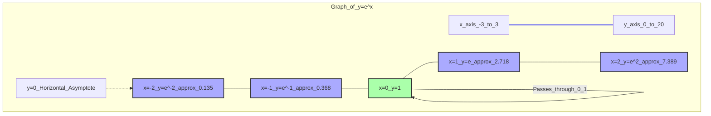

---
tags:
  - mathematics
  - functions
  - exponential
  - euler_number
  - growth
  - decay
  - concept
aliases:
  - exp(x)
  - e^x
  - Natural Exponential Function
related:
  - "[[_Functions_MOC]]"
  - "[[Logarithmic_Function]]"
  - "[[Euler_Number_e]]"
  - "[[Calculus_Derivatives]]"
  - "[[Hyperbolic_Functions]]"
  - "[[Sigmoid_Function]]"
  - "[[Softmax_Function]]"
  - "[[Exponential_Function_Significance]]"
worksheet:
  - WS_Math_Foundations_1
date_created: 2025-05-30
---
# Exponential Function

## Definition
The **exponential function** is a mathematical function denoted by $f(x) = \exp(x)$ or $e^x$, where $e$ is [[Euler_Number_e|Euler's number]], an irrational and transcendental constant approximately equal to $2.71828$.

The function $e^x$ is often called the **natural exponential function**.
More generally, an exponential function is any function of the form $f(x) = a^x$, where $a$ is a positive constant called the base, and $a \neq 1$. However, $e^x$ is the most common and mathematically significant form. Any exponential function $a^x$ can be written in terms of $e^x$ as $a^x = e^{x \ln a}$.

## Properties of $e^x$
Let $f(x) = e^x$.
- **Domain:** $(-\infty, \infty)$ (all real numbers)
- **Range:** $(0, \infty)$ (all positive real numbers)
- **Value at $x=0$:** $e^0 = 1$. The graph passes through $(0,1)$.
- **Always Positive:** $e^x > 0$ for all real $x$.
- **Monotonically Increasing:** If $x_1 < x_2$, then $e^{x_1} < e^{x_2}$. The function is strictly increasing.
- **Limit as $x \to -\infty$:** $\lim_{x \to -\infty} e^x = 0$. The negative x-axis is a horizontal asymptote.
- **Limit as $x \to \infty$:** $\lim_{x \to \infty} e^x = \infty$. The function grows very rapidly.
- **Derivative:** One of its most remarkable properties is that its [[Calculus_Derivatives|derivative]] is itself:
  $$ \frac{d}{dx} e^x = e^x $$
  This means $e^x$ is its own slope function.
- **Integral:** Consequently, its [[Calculus_Integrals|indefinite integral]] is also itself (plus a constant):
  $$ \int e^x \,dx = e^x + C $$
- **Algebraic Properties:**
    - $e^x e^y = e^{x+y}$
    - $\frac{e^x}{e^y} = e^{x-y}$
    - $(e^x)^y = e^{xy}$
- **Inverse Function:** The inverse function of $y=e^x$ is the **[[Logarithmic_Function|natural logarithm]]** $x = \ln y$.
- **Series Expansion (Taylor Series around $x=0$):**
  $$ e^x = \sum_{n=0}^{\infty} \frac{x^n}{n!} = 1 + x + \frac{x^2}{2!} + \frac{x^3}{3!} + \frac{x^4}{4!} + \dots $$
  Setting $x=1$ gives one definition of $e$: $e = \sum_{n=0}^{\infty} \frac{1}{n!} = 1 + 1 + \frac{1}{2} + \frac{1}{6} + \frac{1}{24} + \dots$
- **Definition via Limit:** $e^x = \lim_{n \to \infty} \left(1 + \frac{x}{n}\right)^n$. For $x=1$, $e = \lim_{n \to \infty} \left(1 + \frac{1}{n}\right)^n$.

## Graph of $y = e^x$

## Why does the exponential function (with base $e$) show up in so many places?
See [[Exponential_Function_Significance]]. In summary, its unique property $\frac{d}{dx}e^x = e^x$ means it naturally describes processes where the rate of change is proportional to the current quantity. It also arises from compound interest, solutions to differential equations, probability theory (e.g., normal distribution, Poisson distribution), complex analysis (Euler's formula $e^{ix} = \cos x + i \sin x$), and its simple Taylor series.

## Applications
- **Modeling Growth and Decay:**
    - Population growth (e.g., $P(t) = P_0 e^{kt}$)
    - Radioactive decay (e.g., $N(t) = N_0 e^{-\lambda t}$)
    - Compound interest (continuous compounding $A = Pe^{rt}$)
- **Probability and Statistics:**
    - Normal distribution (Gaussian function): $f(x) = \frac{1}{\sigma\sqrt{2\pi}} e^{-\frac{1}{2}\left(\frac{x-\mu}{\sigma}\right)^2}$
    - Exponential distribution: $f(x;\lambda) = \lambda e^{-\lambda x}$ for $x \ge 0$.
    - Poisson distribution (related via limits).
- **Machine Learning:**
    - **[[Sigmoid_Function|Sigmoid function]]:** $\sigma(x) = \frac{1}{1 + e^{-x}}$, used as an activation function.
    - **[[Softmax_Function|Softmax function]]:** $\text{softmax}(\mathbf{z})_i = \frac{e^{z_i}}{\sum_j e^{z_j}}$, used for multi-class classification output.
    - Exponential terms in loss functions or regularization.
    - Kernel functions in SVMs (e.g., Radial Basis Function kernel uses $e^{-\gamma \|x-x'\|^2}$).
- **Differential Equations:** Solutions to many linear ordinary differential equations involve exponential functions.
- **Physics and Engineering:** Describing phenomena like capacitor charging/discharging, damping, wave functions.
- **Finance:** Continuous compounding, option pricing models.
- **Complex Analysis:** Euler's formula $e^{ix} = \cos x + i \sin x$ links exponential functions to [[Trigonometric_Functions|trigonometric functions]].

---