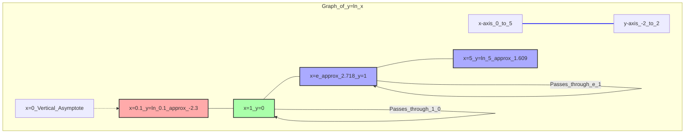

---
tags:
  - mathematics
  - functions
  - logarithm
  - natural_logarithm
  - concept
aliases:
  - log(x)
  - ln(x)
  - Natural Logarithm
related:
  - "[[_Functions_MOC]]"
  - "[[Exponential_Function]]"
  - "[[Euler_Number_e]]"
  - "[[Calculus_Derivatives]]"
  - "[[Logit_Function]]"
  - "[[Information_Theory_Entropy]]"
worksheet:
  - WS_Math_Foundations_1
date_created: 2025-05-30
---
# Logarithmic Function

## Definition
A **logarithmic function** is the inverse of an [[Exponential_Function|exponential function]]. For a base $b > 0$ and $b \neq 1$, the logarithm of a positive number $x$ to base $b$, denoted $\log_b(x)$, is the exponent to which $b$ must be raised to produce $x$.

$$ y = \log_b(x) \quad \iff \quad b^y = x $$

The most common logarithmic functions are:
1.  **Natural Logarithm ($\ln x$):** Logarithm to the base [[Euler_Number_e|Euler's number $e$]] ($\approx 2.71828$).
    $$ y = \ln x \quad \iff \quad e^y = x $$
    This is the inverse of $y = e^x$.
2.  **Common Logarithm ($\log_{10} x$ or simply $\log x$ in some contexts):** Logarithm to the base 10.
    $$ y = \log_{10} x \quad \iff \quad 10^y = x $$
3.  **Binary Logarithm ($\log_2 x$ or $\text{lb } x$):** Logarithm to the base 2.

## Properties of Natural Logarithm ($\ln x$)
Let $f(x) = \ln x$.
- **Domain:** $(0, \infty)$ (only defined for positive real numbers)
- **Range:** $(-\infty, \infty)$ (all real numbers)
- **Value at $x=1$:** $\ln 1 = 0$ (since $e^0 = 1$). The graph passes through $(1,0)$.
- **Value at $x=e$:** $\ln e = 1$ (since $e^1 = e$).
- **Monotonically Increasing:** If $0 < x_1 < x_2$, then $\ln x_1 < \ln x_2$. The function is strictly increasing.
- **Limit as $x \to 0^+$:** $\lim_{x \to 0^+} \ln x = -\infty$. The positive y-axis is a vertical asymptote.
- **Limit as $x \to \infty$:** $\lim_{x \to \infty} \ln x = \infty$. The function grows, but very slowly compared to $e^x$ or polynomials.
- **Derivative:**
  $$ \frac{d}{dx} \ln x = \frac{1}{x} \quad (\text{for } x > 0) $$
- **Integral:**
  $$ \int \ln x \,dx = x \ln x - x + C $$ (can be found using integration by parts).
- **Algebraic Properties (for any base $b$, also apply to $\ln$):**
    - $\log_b(xy) = \log_b(x) + \log_b(y)$ (Product rule)
    - $\log_b\left(\frac{x}{y}\right) = \log_b(x) - \log_b(y)$ (Quotient rule)
    - $\log_b(x^p) = p \log_b(x)$ (Power rule)
    - $\log_b(1) = 0$
    - $\log_b(b) = 1$
    - $\log_b(b^x) = x$
    - $b^{\log_b(x)} = x$ (Change of base formula if needed: $\log_b x = \frac{\log_c x}{\log_c b} = \frac{\ln x}{\ln b}$)

## Graph of $y = \ln x$

The graph of $y = \ln x$ is the reflection of the graph of $y = e^x$ across the line $y=x$.

## Applications
- **Scaling Data / Variance Stabilization:** Logarithmic transformations can compress the range of large values and expand the range of small values. This is useful for:
    - Handling skewed data in statistics and machine learning to make distributions more symmetric or normal-like.
    - Reducing the effect of outliers.
    - Example: If data spans several orders of magnitude (e.g., income, city populations), taking the log can make it easier to visualize and model.
- **Measuring Relative Change:** Logarithms convert multiplicative relationships into additive ones. $\ln(x/y) = \ln x - \ln y$. Log returns ($\ln(P_t/P_{t-1})$) are often used in finance.
- **Complexity Analysis:** Logarithms appear in the time complexity of algorithms (e.g., binary search is $O(\log n)$).
- **Information Theory:**
    - **Entropy:** $H(X) = -\sum p(x) \log p(x)$ (or $\int -p(x) \log p(x) dx$) measures the uncertainty or information content of a random variable. Log base 2 is often used, giving units of bits.
    - **Kullback-Leibler (KL) Divergence:** $D_{KL}(P\|Q) = \sum p(x) \log \frac{p(x)}{q(x)}$ measures the difference between two probability distributions.
- **pH Scale in Chemistry:** $pH = -\log_{10}[H^+]$.
- **Decibel Scale for Sound Intensity:** Uses a logarithmic scale.
- **Richter Scale for Earthquake Magnitude:** Uses a logarithmic scale.
- **Machine Learning:**
    - **[[Logit_Function|Logit function]]:** $\text{logit}(p) = \ln\left(\frac{p}{1-p}\right)$, links probabilities to the real line, used in logistic regression.
    - **Log-likelihood:** Maximizing log-likelihood is often equivalent to maximizing likelihood but computationally simpler due to products becoming sums.
    - Feature engineering (e.g., taking log of a feature).
    - Loss functions (e.g., cross-entropy loss involves logarithms).

## Example: Data Transformation
Suppose we have data for city populations: [1000, 50000, 2000000, 15000000].
The range is very large. Taking $\ln$:
- $\ln(1000) \approx 6.91$
- $\ln(50000) \approx 10.82$
- $\ln(2000000) \approx 14.51$
- $\ln(15000000) \approx 16.52$
The transformed data [6.91, 10.82, 14.51, 16.52] has a much smaller range and might be easier to work with in some models or visualizations.

---