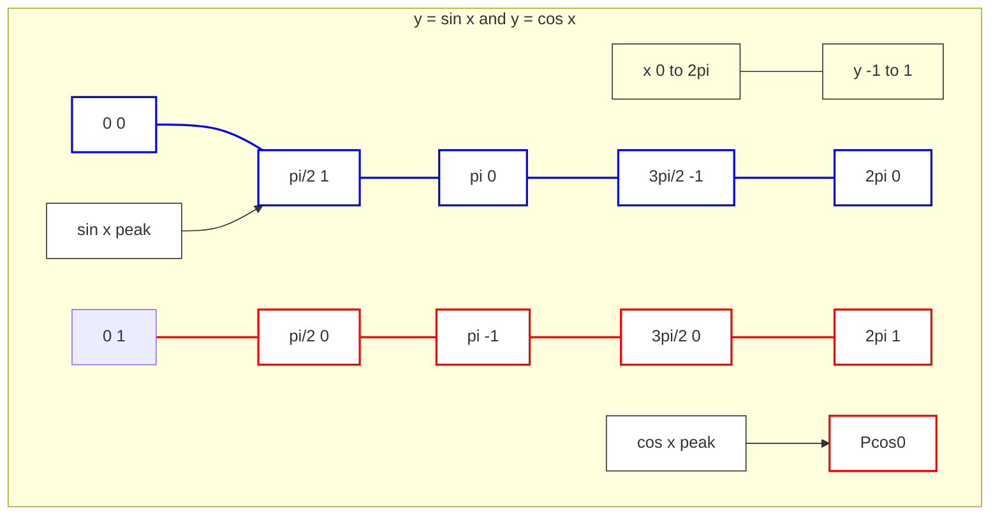

---
tags:
  - mathematics
  - functions
  - trigonometry
  - sine
  - cosine
  - tangent
  - periodic
  - concept
aliases:
  - Trig Functions
  - Circular Functions
  - sin(x)
  - cos(x)
  - tan(x)
related:
  - "[[_Functions_MOC]]"
  - "[[Unit_Circle]]"
  - "[[Exponential_Function]]"
  - "[[Hyperbolic_Functions]]"
  - "[[Calculus_Derivatives]]"
  - "[[Calculus_Integrals]]"
  - "[[Fourier_Series_Transforms]]"
worksheet:
  - WS_Math_Foundations_1
date_created: 2025-05-30
---
# Trigonometric Functions

## Definition
**Trigonometric functions** (also called **circular functions**) are functions of an angle. They are fundamental in studying triangles (trigonometry) and modeling periodic phenomena. The most common trigonometric functions are **sine ($\sin x$)**, **cosine ($\cos x$)**, and **tangent ($\tan x$)**. Others include cosecant ($\csc x$), secant ($\sec x$), and cotangent ($\cot x$).

These functions can be defined in several ways:
1.  **Right-Angled Triangle Ratios (for acute angles $0 < \theta < \pi/2$):**
    - Let $\theta$ be an angle in a right-angled triangle.
    - $\sin \theta = \frac{\text{opposite}}{\text{hypotenuse}}$
    - $\cos \theta = \frac{\text{adjacent}}{\text{hypotenuse}}$
    - $\tan \theta = \frac{\text{opposite}}{\text{adjacent}} = \frac{\sin \theta}{\cos \theta}$

2.  **[[Unit_Circle|Unit Circle]] Definition (for any real angle $x$ in radians):**
    - Consider a unit circle (radius 1, centered at origin) in the Cartesian plane.
    - Let a point $(a,b)$ on the unit circle correspond to an angle $x$ measured counter-clockwise from the positive x-axis.
    - Then:
        - $\cos x = a$ (the x-coordinate of the point)
        - $\sin x = b$ (the y-coordinate of the point)
        - $\tan x = \frac{b}{a} = \frac{\sin x}{\cos x}$ (undefined when $\cos x = 0$, i.e., $x = \frac{\pi}{2} + k\pi$)

    ```mermaid
    graph TD
    subgraph UnitCircle["Unit Circle Definition"]
        O[Origin 0 0] --- P[Point cos x sin x]
        O --- XAxisEnd[Point 1 0]
        AngleArc[Angle x] --> P
        P ---|sin x| B[Point cos x 0]
        B ---|cos x| O
    end
    Note[Point P is on unit circle] --> P
    XAxisEnd ---|x-axis| O

    style O fill:#ddd,stroke:#333,stroke-width:2px
    style P fill:#afa,stroke:#333,stroke-width:2px
    style XAxisEnd fill:#ddd,stroke:#333,stroke-width:2px
    style B fill:#ddd,stroke:#333,stroke-width:2px
    style AngleArc fill:none,stroke:#00f,stroke-width:2px
    style Note fill:#fff,stroke:#333,stroke-width:1px
    linkStyle 0 stroke:#333,stroke-width:2px
    linkStyle 1 stroke:#333,stroke-width:2px
    linkStyle 2 stroke:#00f,stroke-width:2px
    linkStyle 3 stroke:#333,stroke-width:2px
    linkStyle 4 stroke:#333,stroke-width:2px
    linkStyle 5 stroke:#333,stroke-width:1px
    ```

## Key Trigonometric Functions & Their Properties

[list2tab|#Trig Functions]
- Sine Function
	$y = \sin x$
    - **Domain:** $(-\infty, \infty)$
    - **Range:** $[-1, 1]$
    - **Period:** $2\pi$ (i.e., $\sin(x + 2\pi) = \sin x$)
    - **Odd function:** $\sin(-x) = -\sin x$
    - **Zeros:** $x = k\pi$ for integer $k$
    - **Derivative:** $\frac{d}{dx} \sin x = \cos x$
    - **Integral:** $\int \sin x \,dx = -\cos x + C$

- Cosine Function
	$y = \cos x$
    - **Domain:** $(-\infty, \infty)$
    - **Range:** $[-1, 1]$
    - **Period:** $2\pi$ (i.e., $\cos(x + 2\pi) = \cos x$)
    - **Even function:** $\cos(-x) = \cos x$
    - **Zeros:** $x = \frac{\pi}{2} + k\pi$ for integer $k$
    - **Derivative:** $\frac{d}{dx} \cos x = -\sin x$
    - **Integral:** $\int \cos x \,dx = \sin x + C$
    - **Relationship to Sine:** $\cos x = \sin\left(x + \frac{\pi}{2}\right)$ (phase shift)

- Tangent Function
	$y = \tan x = \frac{\sin x}{\cos x}$
    - **Domain:** All real numbers except $x = \frac{\pi}{2} + k\pi$ (where $\cos x = 0$)
    - **Range:** $(-\infty, \infty)$
    - **Period:** $\pi$ (i.e., $\tan(x + \pi) = \tan x$)
    - **Odd function:** $\tan(-x) = -\tan x$
    - **Zeros:** $x = k\pi$ (where $\sin x = 0$)
    - **Vertical Asymptotes:** At $x = \frac{\pi}{2} + k\pi$
    - **Derivative:** $\frac{d}{dx} \tan x = \sec^2 x = \frac{1}{\cos^2 x}$
    - **Integral:** $\int \tan x \,dx = -\ln|\cos x| + C = \ln|\sec x| + C$

- Other Functions:
    - **Cosecant:** $\csc x = \frac{1}{\sin x}$
    - **Secant:** $\sec x = \frac{1}{\cos x}$
    - **Cotangent:** $\cot x = \frac{1}{\tan x} = \frac{\cos x}{\sin x}$

## Fundamental Identities
- **Pythagorean Identity:** $\sin^2 x + \cos^2 x = 1$
- **Other Pythagorean Identities:**
    - $1 + \tan^2 x = \sec^2 x$
    - $1 + \cot^2 x = \csc^2 x$
- **Angle Sum/Difference Formulas:**
    - $\sin(A \pm B) = \sin A \cos B \pm \cos A \sin B$
    - $\cos(A \pm B) = \cos A \cos B \mp \sin A \sin B$
    - $\tan(A \pm B) = \frac{\tan A \pm \tan B}{1 \mp \tan A \tan B}$
- **Double Angle Formulas:**
    - $\sin(2x) = 2 \sin x \cos x$
    - $\cos(2x) = \cos^2 x - \sin^2 x = 2\cos^2 x - 1 = 1 - 2\sin^2 x$
- **Euler's Formula (links to [[Exponential_Function|exponential function]]):**
  $$ e^{ix} = \cos x + i \sin x $$
  From this, $\cos x = \frac{e^{ix} + e^{-ix}}{2}$ and $\sin x = \frac{e^{ix} - e^{-ix}}{2i}$.

## Graphs of Sine and Cosine


> The blue curve represents $y = \sin x$ and the red curve represents $y = \cos x$.

## Applications
- **Modeling Periodic Phenomena:** Sound waves, light waves, alternating current, tides, seasons, planetary orbits, business cycles.
    - Example: A simple sound wave can be modeled as $y(t) = A \sin(2\pi f t + \phi)$, where $A$ is amplitude, $f$ is frequency, $t$ is time, and $\phi$ is phase.
- **[[Fourier_Series_Transforms|Fourier Series and Fourier Transforms]]:** Any periodic function can be represented as a sum of sine and cosine functions (Fourier series). Fourier transforms decompose a function into its constituent frequencies, essential in signal processing, image analysis.
- **Geometry and Navigation:** Calculating distances, angles, positions (e.g., GPS).
- **Physics and Engineering:** Oscillations, waves, mechanics, electromagnetism, optics.
- **Computer Graphics:** Rotations, creating circular or wave-like patterns.
- **Robotics:** Calculating joint angles and end-effector positions.
- **Machine Learning:**
    - **Positional Encoding in Transformers (NLP):** Sine and cosine functions are used to inject information about the position of tokens in a sequence.
    - Feature engineering for cyclical data (e.g., encoding time of day or month of year using $\sin(2\pi x / P)$ and $\cos(2\pi x / P)$ where $P$ is the period).
    - In some activation functions or specialized neural network architectures.

## Example: Positional Encoding
For a position `pos` and dimension `i` in a transformer model, a common positional encoding might use:
$PE_{(pos, 2i)} = \sin(pos / 10000^{2i/d_{model}})$
$PE_{(pos, 2i+1)} = \cos(pos / 10000^{2i/d_{model}})$
This uses sine and cosine functions of different frequencies to give each position a unique, yet relative, encoding.

---