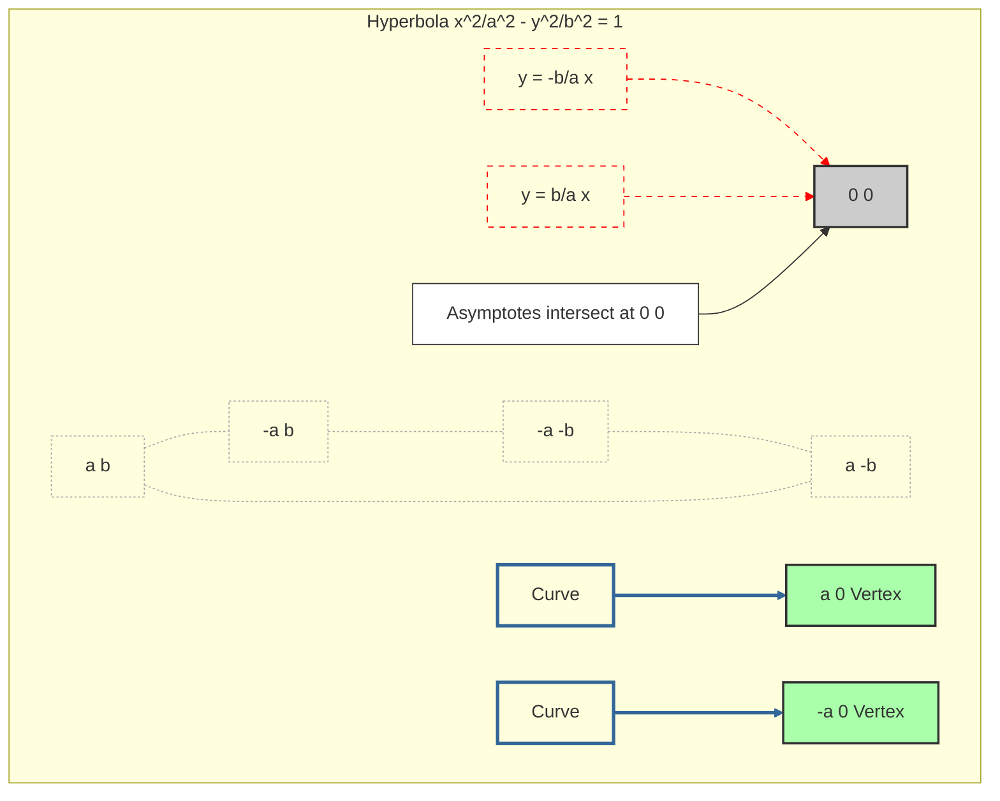

---
tags:
  - mathematics
  - geometry
  - hyperbola
  - asymptotes
  - conic_section
  - concept
aliases:
  - Hyperbola Asymptotes
  - Asymptotic Lines
related:
  - "[[Hyperbola]]"
  - "[[Conic_Sections]]"
  - "[[Limits]]"
worksheet:
  - WS_Math_Foundations_1
date_created: 2025-05-30
---
# Asymptotes of a Hyperbola

## Definition
**Asymptotes** of a [[Hyperbola|hyperbola]] are straight lines that the branches of the hyperbola approach arbitrarily closely as they extend to infinity. The asymptotes provide a guide to the overall shape and orientation of the hyperbola.

For a hyperbola centered at the origin $(0,0)$, the asymptotes pass through the center.

## Equations of Asymptotes for Standard Hyperbolas

1.  **Hyperbola Opening Left and Right (Transverse Axis is x-axis):**
    Standard equation: $\frac{x^2}{a^2} - \frac{y^2}{b^2} = 1$
    The equations of the asymptotes are:
    $$ y = \pm \frac{b}{a} x $$
    These can be derived by considering the behavior of $y$ as $x \to \pm \infty$. From the hyperbola equation:
    $\frac{y^2}{b^2} = \frac{x^2}{a^2} - 1 = \frac{x^2}{a^2} \left(1 - \frac{a^2}{x^2}\right)$
    $y^2 = \frac{b^2 x^2}{a^2} \left(1 - \frac{a^2}{x^2}\right)$
    $y = \pm \frac{b}{a} x \sqrt{1 - \frac{a^2}{x^2}}$
    As $x \to \pm \infty$, the term $\frac{a^2}{x^2} \to 0$, so $\sqrt{1 - \frac{a^2}{x^2}} \to 1$.
    Thus, $y \to \pm \frac{b}{a} x$.

    A quick way to find the asymptotes for $\frac{x^2}{a^2} - \frac{y^2}{b^2} = 1$ is to set the constant term to 0:
    $\frac{x^2}{a^2} - \frac{y^2}{b^2} = 0 \implies \frac{y^2}{b^2} = \frac{x^2}{a^2} \implies y^2 = \frac{b^2}{a^2}x^2 \implies y = \pm \frac{b}{a}x$.

2.  **Hyperbola Opening Up and Down (Transverse Axis is y-axis):**
    Standard equation: $\frac{y^2}{a^2} - \frac{x^2}{b^2} = 1$
    The equations of the asymptotes are:
    $$ y = \pm \frac{a}{b} x $$
    Derived similarly by setting the constant term to 0:
    $\frac{y^2}{a^2} - \frac{x^2}{b^2} = 0 \implies \frac{y^2}{a^2} = \frac{x^2}{b^2} \implies y^2 = \frac{a^2}{b^2}x^2 \implies y = \pm \frac{a}{b}x$.

## Geometric Construction (Central Rectangle)
For a hyperbola centered at the origin:
- Construct a rectangle with vertices at $(\pm a, \pm b)$ if the transverse axis is horizontal (so vertices of hyperbola are $(\pm a, 0)$).
- Or, construct a rectangle with vertices at $(\pm b, \pm a)$ if the transverse axis is vertical (so vertices of hyperbola are $(0, \pm a)$).

The asymptotes are the extended diagonals of this "central rectangle" (also called the fundamental rectangle or defining rectangle).

**Example for $\frac{x^2}{a^2} - \frac{y^2}{b^2} = 1$:**
The rectangle has corners $(a,b), (a,-b), (-a,b), (-a,-b)$. The diagonals pass through the origin and these corners. The line passing through $(0,0)$ and $(a,b)$ has slope $b/a$, so $y = (b/a)x$. The line passing through $(0,0)$ and $(a,-b)$ has slope $-b/a$, so $y = -(b/a)x$.

## Visualization

> The diagram shows a hyperbola (blue curves) opening left/right, its central rectangle (dashed grey), and its asymptotes (dashed red lines) which are the extended diagonals of the rectangle.

## Hyperbolas Not Centered at the Origin
If a hyperbola is centered at $(h,k)$, its asymptotes will also pass through $(h,k)$, and their equations will be shifted accordingly:
- For $\frac{(x-h)^2}{a^2} - \frac{(y-k)^2}{b^2} = 1$:
  Asymptotes: $y-k = \pm \frac{b}{a} (x-h)$
- For $\frac{(y-k)^2}{a^2} - \frac{(x-h)^2}{b^2} = 1$:
  Asymptotes: $y-k = \pm \frac{a}{b} (x-h)$

## Significance
- **Graphing:** Asymptotes are crucial for accurately sketching the graph of a hyperbola, as they define the limiting behavior of its branches.
- **Analysis:** They help understand the overall shape and spread of the hyperbola. The angle between the asymptotes is related to the [[Eccentricity_Conic|eccentricity]]. If the asymptotes are perpendicular ($a=b$), the hyperbola is called a **rectangular hyperbola** (like the [[Unit_Hyperbola|unit hyperbola]] $x^2-y^2=1$ or $xy=k$).
- **Applications:** In physics or engineering where hyperbolic paths or shapes occur, the asymptotes can represent limiting directions or behaviors.

The asymptotes are an intrinsic part of the definition and characterization of a hyperbola.

---