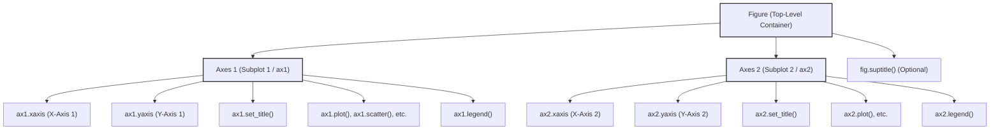

---
tags:
  - matplotlib
  - python
  - plotting
  - figure
  - axes
  - subplot
  - structure
  - concept
aliases:
  - Matplotlib Figure
  - Matplotlib Axes
  - Matplotlib Subplot
  - Axes Object Matplotlib
related:
  - "[[Matplotlib_Overview]]"
  - "[[Matplotlib_Pyplot_API_vs_OO_API]]"
worksheet:
  - WS_DataViz_1
date_created: 2025-06-03
---
# Matplotlib: Figure, Axes, and Subplots

Understanding the hierarchy of Matplotlib objects is key to creating and customizing visualizations effectively. The main components are the **Figure** and the **Axes**.

## Anatomy of a Matplotlib Plot

1.  **Figure (`matplotlib.figure.Figure`):**
    -   The **top-level container** for all plot elements. Think of it as the entire window or page on which everything is drawn.
    -   A Figure can contain one or more [[#Axes (`matplotlib.axes.Axes`)|Axes objects (subplots)]].
    -   Responsible for aspects like overall figure size (`figsize`), DPI, background color, and a global title (`fig.suptitle()`).
    -   Created explicitly using `fig = plt.figure()` or commonly with `fig, ax = plt.subplots()`.

2.  **Axes (`matplotlib.axes.Axes`):**
    -   An **individual plot or chart** within a Figure. This is the region where data is actually plotted with x and y coordinates (or other coordinates for different plot types like polar or 3D). It is **not** the plural of "axis".
    -   Each Axes object has its own:
        -   Coordinate system.
        -   X-axis (`xaxis`) and Y-axis (`yaxis`) objects, which control [[Plot_Elements_Anatomy#Ticks_and_Tick_Marks|ticks, tick labels]], axis labels, and limits.
        -   Title (`ax.set_title()`).
        -   X-label (`ax.set_xlabel()`) and Y-label (`ax.set_ylabel()`).
        -   Plotted data (lines, scatter points, bars, etc.).
        -   [[Plot_Elements_Anatomy#Legend|Legend]] (`ax.legend()`).
        -   [[Plot_Elements_Anatomy#Gridlines|Gridlines]] (`ax.grid()`).
    -   A Figure can have multiple Axes objects, arranged in a grid (subplots) or positioned more freely.
    -   **This is the object you will interact with most when customizing a plot in the [[Matplotlib_Pyplot_API_vs_OO_API|Object-Oriented API]].**

    >[!question] What is an ax ?
    >`ax` (or `axes`) is the common variable name used to refer to an instance of a Matplotlib `Axes` object. It represents a single plotting area within a Figure. You call methods on this `ax` object to draw data, set labels, titles, etc., for that specific plot.
    >Example:
    >```python
    >import matplotlib.pyplot as plt
    >fig, ax = plt.subplots() # ax is an Axes object
    >ax.plot([1,2,3], [4,5,6])
    >ax.set_title("My Plot on an Axes")
    >```

3.  **Subplot:**
    -   A common way to refer to an **Axes** object when it's part of a regular grid of plots within a Figure.
    -   `fig, axs = plt.subplots(nrows, ncols)` is a convenient function to create a Figure and a NumPy array of Axes (subplots) simultaneously.
    -   `fig.add_subplot(nrows, ncols, index)` or `plt.subplot(nrows, ncols, index)` (pyplot API) are used to add individual subplots to a figure.

## Visualization with AnyBlock

### Conceptual Diagram

-   The diagram shows a Figure containing two Axes objects (subplots). Each Axes has its own components like x/y axes, title, and plotted data.

### Code Example (Object-Oriented API)
```python
        import matplotlib.pyplot as plt
        import numpy as np

        # Data
        x = np.linspace(0, 10, 100)
        y1 = np.sin(x)
        y2 = np.cos(x)

        # Create a Figure and a single Axes object
        fig, ax = plt.subplots(figsize=(7, 4)) # fig is the Figure, ax is the Axes

        # Plot on the Axes object
        ax.plot(x, y1, label='sin(x)')
        ax.set_title('Plot on a Single Axes')
        ax.set_xlabel('X data')
        ax.set_ylabel('Y data')
        ax.legend()
        ax.grid(True)
        # plt.show() # Display the plot (commented out for batch generation)

        # Create a Figure with two subplots (Axes)
        fig2, (ax1, ax2) = plt.subplots(nrows=2, ncols=1, figsize=(7, 6), sharex=True)
        # fig2 is the Figure
        # ax1 is the first Axes (top subplot)
        # ax2 is the second Axes (bottom subplot)

        fig2.suptitle('Figure with Two Subplots') # Overall title for the Figure

        ax1.plot(x, y1, color='r', label='sin(x)')
        ax1.set_ylabel('sin(x) values')
        ax1.legend()
        ax1.grid(True)

        ax2.plot(x, y2, color='g', label='cos(x)')
        ax2.set_ylabel('cos(x) values')
        ax2.set_xlabel('Shared X data')
        ax2.legend()
        ax2.grid(True)

        plt.tight_layout(rect=[0, 0, 1, 0.96]) # Adjust layout to prevent suptitle overlap
        # plt.show() # Display the plot
```
-  This code demonstrates creating a figure with one Axes, and another figure with two stacked Axes (subplots), using the object-oriented approach.

## Working with Figure and Axes
-   **[[Matplotlib_Pyplot_API_vs_OO_API|Pyplot API]]:** `plt.figure()`, `plt.subplot()`, `plt.title()`, `plt.plot()` often act on the "current" implicitly managed Figure and Axes.
-   **[[Matplotlib_Pyplot_API_vs_OO_API|Object-Oriented API]]:** You explicitly get Figure and Axes objects (e.g., `fig, ax = plt.subplots()`) and call methods on them (e.g., `ax.plot()`, `ax.set_title()`, `fig.savefig()`). This approach offers more control and is generally preferred for complex plots or when writing reusable plotting functions.

---