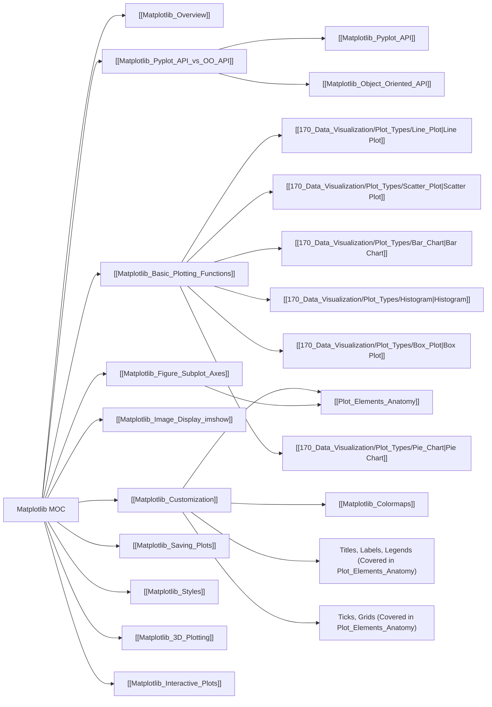

---
tags:
  - matplotlib
  - python
  - plotting
  - data_visualization
  - library
  - moc
  - concept
aliases:
  - Matplotlib Library MOC
related:
  - "[[_Data_Visualization_MOC]]"
  - "[[_NumPy_MOC]]"
  - "[[_Pandas_MOC]]"
  - "[[Matplotlib_Overview]]"
  - "[[Matplotlib_Pyplot_API_vs_OO_API|Pyplot API vs Object-Oriented API]]"
  - "[[Matplotlib_Figure_Subplot_Axes|Figure, Axes, and Subplots]]"
  - "[[Matplotlib_Basic_Plotting_Functions|Basic Plotting Functions]]"
  - "[[Matplotlib_Customization|Customizing Plots]]"
  - "[[Matplotlib_Image_Display_imshow|Image Display (imshow)]]"
  - "[[Matplotlib_Colormaps|Colormaps]]"
  - "[[Matplotlib_3D_Plotting|3D Plotting]]"
  - "[[Matplotlib_Interactive_Plots|Interactive Plots]]"
worksheet:
  - WS_DataViz_1
date_created: 2025-06-03
---
# Matplotlib MOC 🎨

**[[Matplotlib_Overview|Matplotlib]]** is a comprehensive library for creating static, animated, and interactive visualizations in Python. It is the foundational plotting library in the Python scientific computing stack.

## Core Concepts & Usage
-   [[Matplotlib_Overview|Overview of Matplotlib]]
-   [[Matplotlib_Pyplot_API_vs_OO_API|Pyplot API vs. Object-Oriented API]]
    -   Understanding the two main approaches to using Matplotlib.
-   [[Matplotlib_Figure_Subplot_Axes|Figure, Axes, and Subplots]]
    -   The fundamental building blocks of a Matplotlib plot.
-   [[Plot_Elements_Anatomy|Anatomy of a Plot]] (General, but heavily applicable here)

## Basic Plotting
-   [[Matplotlib_Basic_Plotting_Functions|Basic Plotting Functions]]
    -   [[Line_Plot|Line Plot]] (`plt.plot()` / `ax.plot()`)
    -   [[Scatter_Plot|Scatter Plot]] (`plt.scatter()` / `ax.scatter()`)
    -   [[Bar_Chart|Bar Chart]] (`plt.bar()` / `ax.bar()`, `plt.barh()` / `ax.barh()`)
    -   [[Histogram|Histogram]] (`plt.hist()` / `ax.hist()`)
    -   [[Box_Plot|Box Plot]] (`plt.boxplot()` / `ax.boxplot()`)
    -   [[Pie_Chart|Pie Chart]] (`plt.pie()` / `ax.pie()`)
-   [[Matplotlib_Image_Display_imshow|Image Display with `imshow`]]

## Customization & Advanced Features
-   [[Matplotlib_Customization|Customizing Plots]]
    -   Titles, Labels, Legends (`ax.set_title()`, `ax.set_xlabel()`, `ax.legend()`)
    -   Colors, Linestyles, Markers
    -   [[Plot_Elements_Anatomy#Ticks_and_Tick_Marks|Ticks, Tick Labels]], and [[Plot_Elements_Anatomy#Gridlines|Gridlines]] (`ax.set_xticks()`, `ax.grid()`)
    -   Text and Annotations (`ax.text()`, `ax.annotate()`)
    -   [[Matplotlib_Colormaps|Working with Colormaps]]
-   [[Matplotlib_Saving_Plots|Saving Plots]] (`plt.savefig()` / `fig.savefig()`)
-   [[Matplotlib_Styles|Using Stylesheets (`plt.style.use()`)_]]
-   [[Matplotlib_3D_Plotting|3D Plotting with `mpl_toolkits.mplot3d`]]
-   [[Matplotlib_Interactive_Plots|Interactive Plotting (e.g., with Jupyter, `ipympl`)]]



## Notes in this Section
```dataview
LIST
FROM "170_Data_Visualization/Matplotlib"
WHERE file.folder = this.file.folder AND file.name != this.file.name AND !contains(file.name, "MOC")
SORT file.name ASC
```

---