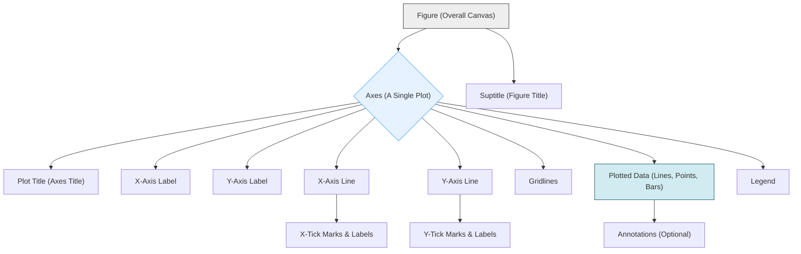
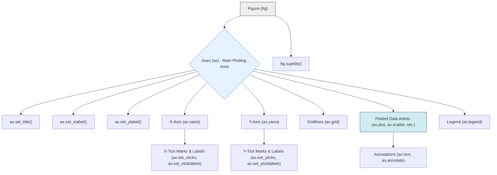

---
tags:
  - data_visualization
  - plotting
  - anatomy
  - axes
  - ticks
  - gridlines
  - legend
  - title
  - concept
aliases:
  - Anatomy of a Plot
  - Chart Elements
  - Plot Components
  - Matplotlib Plot Anatomy
related:
  - "[[_Data_Visualization_MOC]]"
  - "[[Matplotlib_Figure_Subplot_Axes]]"
worksheet:
  - WS_DataViz_1
date_created: <% tp.file.creation_date("YYYY-MM-DD") %>
---
# Anatomy of a Plot (Key Elements)

Understanding the common components or "anatomy" of a plot is essential for creating clear, informative, and effective visualizations. While specific terminology might vary slightly between plotting libraries (like [[Matplotlib_Overview|Matplotlib]], [[170_Data_Visualization/Seaborn/_Seaborn_MOC|Seaborn]], ggplot2), the core concepts are largely universal.

[list2tab|#Plot Elements]
- Figure
    - **Definition:** The top-level container or the entire window/page on which everything is drawn. A figure can contain one or more individual plots (Axes/Subplots).
    - **[[Matplotlib_Figure_Subplot_Axes|Matplotlib Term]]:** `Figure` object.
    - **Purpose:** Holds all plot elements, sets overall size, resolution, and can have a global title (suptitle).
- Axes (Plotting Area)
    - **Definition:** The actual region where the data is plotted, defined by x and y coordinates (or other coordinate systems like polar or 3D). This is what one typically thinks of as "a plot" or "a chart."
    - **[[Matplotlib_Figure_Subplot_Axes|Matplotlib Term]]:** `Axes` object (singular, not to be confused with "axis" lines). Often referred to as a "subplot" if part of a grid.
    - **Purpose:** Contains the data representation (lines, points, bars), axes lines, ticks, labels, title specific to this plot, legend, grid.
- Axis (X-axis, Y-axis)
    - **Definition:** The lines that frame the plotting area and provide the scale for the data. Typically, there's a horizontal x-axis and a vertical y-axis. 3D plots have a z-axis.
    - **[[Matplotlib_Figure_Subplot_Axes|Matplotlib Term]]:** `XAxis` and `YAxis` objects, attributes of an `Axes` object.
    - **Purpose:** Define the data range, display ticks and labels for values.
    - **Elements:**
        -   **Axis Label:** Text describing the variable and units represented by the axis (e.g., "Time (seconds)", "Temperature (°C)").
            -   Matplotlib: `ax.set_xlabel()`, `ax.set_ylabel()`.
- Ticks and Tick Marks
    - **Definition:**
        -   **Tick Marks (Ticks):** Small marks along the axes indicating specific values in the data range.
        -   **Tick Labels:** The numerical or categorical labels associated with the tick marks.
    - **[[Matplotlib_Figure_Subplot_Axes|Matplotlib Term]]:** `Tick` objects, managed by `XAxis` and `YAxis`. Customizable via `ax.set_xticks()`, `ax.set_xticklabels()`, etc.
    - **Purpose:** Provide reference points for reading data values from the plot.
    - **Types:**
        -   **Major Ticks:** Usually have labels.
        -   **Minor Ticks:** Smaller ticks between major ticks, often without labels, for finer gradation.
- Gridlines
    - **Definition:** Lines extending from the tick marks across the plotting area, forming a grid.
    - **[[Matplotlib_Figure_Subplot_Axes|Matplotlib Term]]:** Controlled by `ax.grid()`.
    - **Purpose:** Help in accurately reading data values by aligning points with axis ticks. Can be horizontal, vertical, or both.
- Plot Title
    - **Definition:** Descriptive text at the top of an Axes object, summarizing what the plot shows.
    - **[[Matplotlib_Figure_Subplot_Axes|Matplotlib Term]]:** Set by `ax.set_title()`. A figure can also have a `fig.suptitle()`.
    - **Purpose:** Provides context and a brief explanation of the plot's content.
- Legend
    - **Definition:** An explanatory list or key that identifies different data series, symbols, or colors used in the plot. Essential when multiple datasets or categories are plotted on the same Axes.
    - **[[Matplotlib_Figure_Subplot_Axes|Matplotlib Term]]:** Created with `ax.legend()`. Requires that plotted elements have labels (e.g., `ax.plot(x, y, label='Data Series 1')`).
    - **Purpose:** Helps the viewer distinguish and interpret different elements in the plot.
- Data Representation
    - **Definition:** The visual elements used to represent the data values themselves.
    - **Examples:**
        -   [[Line_Plot|Lines]] (for trends, continuous data)
        -   Markers/Points ([[Scatter_Plot|scatter plots]])
        -   [[Bar_Chart|Bars]] (for categorical comparisons, distributions)
        -   [[Pie_Chart|Slices]] (for proportions)
        -   Colors/Shades ([[Heatmap|heatmaps]], filled contours)
- Annotations & Text
    - **Definition:** Additional text or arrows placed on the plot to highlight specific points, trends, or provide further information.
    - **[[Matplotlib_Figure_Subplot_Axes|Matplotlib Term]]:** `ax.text()`, `ax.annotate()`.
    - **Purpose:** Draw attention to important features or add explanatory notes directly on the visualization.

## Visual Example (Conceptual)

Understanding these components allows for more effective creation and customization of plots to clearly communicate data insights.

---

# Anatomy of a Plot (Key Elements)

Understanding the common components or "anatomy" of a plot is essential for creating clear, informative, and effective visualizations. While specific terminology might vary slightly between plotting libraries (like [[Matplotlib_Overview|Matplotlib]], [[170_Data_Visualization/Seaborn/_Seaborn_MOC|Seaborn]], ggplot2), the core concepts are largely universal.

[list2tab|#Plot Elements]
- Figure
    - **Definition:** The top-level container or the entire window/page on which everything is drawn. A figure can contain one or more individual plots (Axes/Subplots).
    - **[[Matplotlib_Figure_Subplot_Axes|Matplotlib Term]]:** `Figure` object (`matplotlib.figure.Figure`).
    - **Purpose:** Holds all plot elements, sets overall size (`figsize`), resolution (DPI), and can have a global title (`fig.suptitle()`).
- Axes (Plotting Area)
    - **Definition:** The actual region where the data is plotted, defined by x and y coordinates (or other coordinate systems like polar or 3D). This is what one typically thinks of as "a plot" or "a chart." It is **not** the plural of "axis."
    - **[[Matplotlib_Figure_Subplot_Axes|Matplotlib Term]]:** `Axes` object (`matplotlib.axes.Axes`). Often referred to as a "subplot" if part of a grid.
    - **Purpose:** Contains the data representation (lines, points, bars), axes lines, ticks, labels, title specific to this plot, legend, grid.
- Axis (X-axis, Y-axis)
    - **Definition:** The lines that frame the plotting area and provide the scale for the data. Typically, there's a horizontal x-axis and a vertical y-axis. 3D plots have a z-axis.
    - **[[Matplotlib_Figure_Subplot_Axes|Matplotlib Term]]:** `XAxis` and `YAxis` objects (`matplotlib.axis.XAxis`, `matplotlib.axis.YAxis`), which are attributes of an `Axes` object.
    - **Purpose:** Define the data range, display ticks and labels for values.
    - **Elements:**
        -   **Axis Label:** Text describing the variable and units represented by the axis (e.g., "Time (seconds)", "Temperature (°C)").
            -   Matplotlib: `ax.set_xlabel()`, `ax.set_ylabel()`.
- Ticks and Tick Marks
    - **Definition:**
        -   **Tick Marks (Ticks):** Small marks along the axes indicating specific values in the data range.
        -   **Tick Labels:** The numerical or categorical labels associated with the tick marks.
    - **[[Matplotlib_Figure_Subplot_Axes|Matplotlib Term]]:** `Tick` objects (`matplotlib.axis.Tick`), managed by `XAxis` and `YAxis`. Customizable via methods like `ax.set_xticks()`, `ax.set_xticklabels()`, `ax.tick_params()`.
    - **Purpose:** Provide reference points for reading data values from the plot.
    - **Types:**
        -   **Major Ticks:** Usually have labels and are more prominent.
        -   **Minor Ticks:** Smaller ticks between major ticks, often without labels, for finer gradation.
- Gridlines
    - **Definition:** Lines extending from the tick marks across the plotting area, forming a grid.
    - **[[Matplotlib_Figure_Subplot_Axes|Matplotlib Term]]:** Controlled by `ax.grid(True/False, which='major'/'minor', axis='x'/'y'/'both', ...)`.
    - **Purpose:** Help in accurately reading data values by aligning points with axis ticks. Can be horizontal, vertical, or both, and for major or minor ticks.
- Plot Title
    - **Definition:** Descriptive text at the top of an Axes object, summarizing what the plot shows.
    - **[[Matplotlib_Figure_Subplot_Axes|Matplotlib Term]]:** Set by `ax.set_title()`. A figure can also have a `fig.suptitle()` for an overall title above all subplots.
    - **Purpose:** Provides context and a brief explanation of the plot's content.
- Legend
    - **Definition:** An explanatory list or key that identifies different data series, symbols, or colors used in the plot. Essential when multiple datasets or categories are plotted on the same Axes.
    - **[[Matplotlib_Figure_Subplot_Axes|Matplotlib Term]]:** Created with `ax.legend()`. Plotting functions must have been called with a `label` argument (e.g., `ax.plot(x, y, label='Data Series 1')`) for the legend to pick them up automatically.
    - **Purpose:** Helps the viewer distinguish and interpret different elements in the plot. Location, style, and content are customizable.
- Data Representation
    - **Definition:** The visual elements used to represent the data values themselves. These are often called "artists" in Matplotlib.
    - **Examples:**
        -   [[Line_Plot|Lines]] (`matplotlib.lines.Line2D`)
        -   Markers/Points (`matplotlib.collections.PathCollection` for scatter)
        -   [[Bar_Chart|Bars]] (`matplotlib.patches.Rectangle`)
        -   [[Pie_Chart|Slices/Wedges]] (`matplotlib.patches.Wedge`)
        -   Colors/Shades in [[Heatmap|heatmaps]] (`matplotlib.image.AxesImage` from `imshow`)
- Annotations & Text
    - **Definition:** Additional text or arrows placed on the plot to highlight specific points, trends, or provide further information beyond standard labels and titles.
    - **[[Matplotlib_Figure_Subplot_Axes|Matplotlib Term]]:** `ax.text()` for general text, `ax.annotate()` for text with arrows pointing to specific data points or regions.
    - **Purpose:** Draw attention to important features or add explanatory notes directly on the visualization.

## Visual Example (Conceptual)

Understanding these components allows for more effective creation and customization of plots to clearly communicate data insights.

---