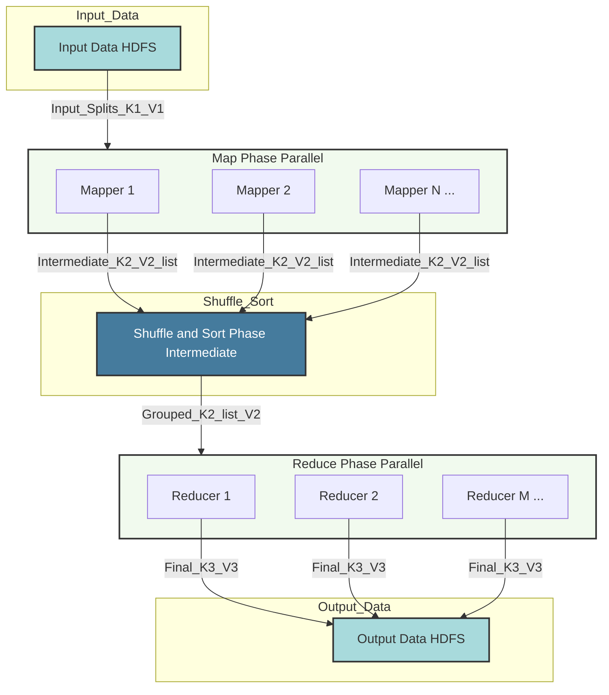

---
tags:
  - hadoop
  - mapreduce
  - distributed_computing
  - big_data
  - programming_model
  - concept
aliases:
  - MapReduce Framework
  - Map Reduce
related:
  - "[[_Hadoop_MOC]]"
  - "[[HDFS]]"
  - "[[YARN]]"
  - "[[Parallelism_vs_Mass_Parallelism]]"
  - "[[Hadoop_Fault_Tolerance]]"
  - "[[Data_Locality_Hadoop]]"
worksheet:
  - WS_BigData_1
date_created: 2025-06-09
---
# MapReduce Programming Model

## Definition
**MapReduce** is a programming model and an associated implementation for processing and generating large data sets with a parallel, distributed algorithm on a cluster. It was originally developed by Google and later became a core component of the [[180_Big_Data/Hadoop/_Hadoop_MOC|Apache Hadoop]] framework.

The model is inspired by the `map` and `reduce` functions common in functional programming. Users specify two primary functions:
1.  **Map Function:** Processes input key/value pairs to generate a set of intermediate key/value pairs.
2.  **Reduce Function:** Merges all intermediate values associated with the same intermediate key.

>[!question] What is the purpose of MapReduce?
>The primary purposes of MapReduce are:
>1.  **Process Massive Datasets:** To enable the processing of very large datasets (terabytes or petabytes) that cannot fit or be efficiently processed on a single machine.
>2.  **Parallel Processing:** To automatically parallelize computation across a large cluster of commodity machines. The framework handles the complexities of distributing tasks, managing inter-machine communication, and coordinating the overall job.
>3.  **[[Hadoop_Fault_Tolerance|Fault Tolerance]]:** To provide a resilient processing environment. The MapReduce framework can detect and recover from task or machine failures by re-executing failed tasks on other nodes, ensuring job completion even in unreliable hardware environments.
>4.  **[[Data_Locality_Hadoop|Data Locality]]:** To minimize network I/O by moving computation to the data whenever possible. Map tasks are preferably scheduled on nodes where their input data resides (on [[HDFS|HDFS]]).
>5.  **Abstraction and Simplicity:** To simplify distributed programming for developers. Users focus on the `map` and `reduce` logic for their specific problem, while the framework handles complex distributed systems issues like task scheduling, data distribution, synchronization, and fault tolerance.
>6.  **Scalability:** To allow applications to scale linearly by adding more machines to the cluster.

## MapReduce Workflow / Steps

>[!question] Describe all the steps of MapReduce

The MapReduce workflow involves several distinct phases, managed by the framework:

```d2
direction: right
shape: sequence_diagram

InputSplits: "Input Data (HDFS)" {shape: step}
MapPhase: "Map Phase (Parallel)" {shape: rectangle}
  Mapper1: "Mapper 1"
  Mapper2: "Mapper 2"
  MapperN: "Mapper N ..."
ShuffleSort: "Shuffle & Sort Phase (Intermediate)" {shape: rectangle}
ReducePhase: "Reduce Phase (Parallel)" {shape: rectangle}
  Reducer1: "Reducer 1"
  Reducer2: "Reducer 2"
  ReducerM: "Reducer M ..."
Output: "Output Data (HDFS)" {shape: step}

InputSplits -> MapPhase: "Input Splits (K1, V1)"
MapPhase.Mapper1 -> ShuffleSort: "Intermediate (K2, V2) list"
MapPhase.Mapper2 -> ShuffleSort: "Intermediate (K2, V2) list"
MapPhase.MapperN -> ShuffleSort: "Intermediate (K2, V2) list"
ShuffleSort -> ReducePhase: "Grouped (K2, list[V2])"
ReducePhase.Reducer1 -> Output: "Final (K3, V3)"
ReducePhase.Reducer2 -> Output: "Final (K3, V3)"
ReducePhase.ReducerM -> Output: "Final (K3, V3)"

style InputSplits { style.fill: "#A8DADC" }
style MapPhase { style.fill: "#F1FAEE" }
style ShuffleSort { style.fill: "#457B9D"; style.font-color: white }
style ReducePhase { style.fill: "#F1FAEE" }
style Output { style.fill: "#A8DADC" }
```



1.  **Input Splitting:**
    -   The input dataset (typically residing in [[HDFS|HDFS]]) is divided into fixed-size chunks called **input splits**. Each split is usually the size of an HDFS block (e.g., 128MB or 256MB).
    -   Each input split is processed by a single Map task.

2.  **Map Phase (User-defined `map` function):**
    -   The MapReduce framework spawns multiple **Map tasks** in parallel, one for each input split.
    -   Each Map task reads its assigned input split, processing it record by record (e.g., line by line for text files).
    -   The user-defined `map(key_in, value_in) -> list[(key_intermediate, value_intermediate)]` function is applied to each input record.
        -   It takes an input key/value pair (e.g., byte offset as key, line content as value).
        -   It outputs a list of zero or more intermediate key/value pairs.
    -   The output of all Map tasks is a collection of intermediate key/value pairs. This output is typically stored temporarily on the local disk of the mapper nodes.
    -   **Example (Word Count):** `map(doc_id, doc_content)` might emit `(word, 1)` for each word in `doc_content`.

3.  **Combiner Phase (Optional, User-defined `combine` function):**
    -   Before sending data to reducers, a **Combiner** function can be run on the output of each Map task.
    -   The Combiner has the same signature as the Reduce function and performs a local aggregation on the intermediate key/value pairs produced by a single mapper.
    -   Its purpose is to reduce the amount of data transferred over the network to the reducers, improving efficiency.
    -   **Example (Word Count):** A combiner on a mapper node could sum the counts for identical words emitted by that mapper, e.g., `(word,) -> (word, 3)`.

4.  **Shuffle and Sort Phase (Framework-managed):**
    -   This is a crucial and often complex phase handled by the MapReduce framework.
    -   **Partitioning:** The intermediate key/value pairs from all mappers are partitioned based on the intermediate key. Typically, a hash function on the key determines which Reducer task will process that key (`hash(key_intermediate) % num_reducers`). All pairs with the same key go to the same reducer.
    -   **Sorting:** Within each partition (i.e., for each reducer), the intermediate key/value pairs are sorted by the intermediate key.
    -   **Grouping:** After sorting, all values associated with the same intermediate key are grouped together.
    -   The framework physically transfers (shuffles) the partitioned and sorted data from the mapper nodes to the reducer nodes.

5.  **Reduce Phase (User-defined `reduce` function):**
    -   The framework spawns multiple **Reduce tasks** in parallel. The number of reducers is configurable by the user.
    -   Each Reduce task receives a stream of intermediate keys, along with an iterator over all the intermediate values associated with that key from the Shuffle and Sort phase: `(key_intermediate, list[value_intermediate])`.
    -   The user-defined `reduce(key_intermediate, list_of_values_intermediate) -> list[(key_out, value_out)]` function is applied for each unique intermediate key.
    -   It processes the list of values for a given key and outputs zero or more final key/value pairs.
    -   **Example (Word Count):** `reduce(word,)` would sum the 1s and emit `(word, 4)`.

6.  **Output:**
    -   The output from all Reduce tasks is written to an output directory in HDFS (or another configured output system). Each reducer typically writes its output to a separate file within this directory.

## Key Concepts
-   **Key-Value Pairs:** Data is processed as key-value pairs at all stages.
-   **Parallelism:** Map tasks run in parallel; Reduce tasks run in parallel.
-   **[[Data_Locality_Hadoop|Data Locality]]:** The framework tries to run Map tasks on the nodes where their input data splits reside to minimize network transfer.
-   **[[Hadoop_Fault_Tolerance|Fault Tolerance]]:** If a mapper or reducer task fails, the framework can re-execute it on another node. If a node fails, tasks running on it are rescheduled.
-   **No Inter-Reducer Communication:** Reducers operate independently on their assigned key groups.

## Limitations of MapReduce

>[!question] What are the limitations of the MapReduce model?
>While powerful for batch processing, the classic MapReduce model has several limitations:
>1.  **High Latency / Batch-Oriented:** MapReduce is designed for high-throughput batch processing, not for low-latency, real-time, or interactive queries. Each job involves significant overhead for task scheduling, data shuffling, and disk I/O.
>2.  **Disk I/O Intensive:** Intermediate data from mappers is written to local disk, and then read by reducers after shuffling. This reliance on disk I/O can be slow compared to in-memory processing.
>3.  **Rigid Data Flow (Map -> Reduce):** The strict two-stage (or slightly more with combiners) data flow is not suitable for all algorithms. Iterative algorithms (common in machine learning) or more complex data flow graphs require chaining multiple MapReduce jobs, which is inefficient due to repeated HDFS reads/writes.
>4.  **Boilerplate Code:** Writing MapReduce jobs in Java (the native Hadoop language) can involve a lot of boilerplate code for mappers, reducers, drivers, and data types (Writables). Higher-level abstractions like Pig and Hive were developed to mitigate this.
>5.  **Inefficient for Iterative Algorithms:** Algorithms that require multiple passes over the data (e.g., K-Means clustering, PageRank) are cumbersome and slow to implement as a sequence of MapReduce jobs because each iteration involves reading from and writing to HDFS.
>6.  **Limited for Graph Processing:** While graph algorithms can be implemented, MapReduce is not inherently optimized for iterative graph traversals or computations that rely heavily on pointer chasing or random data access.
>7.  **Resource Management (Pre-YARN):** In early Hadoop (MapReduce v1), JobTracker handled both job scheduling and resource management, which could be a bottleneck and had limitations in supporting non-MapReduce applications. [[YARN|YARN]] (MapReduce v2) addressed this by separating these concerns.
>8.  **State Management:** Sharing state between mappers or between reducers (or across iterations of a job) is difficult and typically requires external mechanisms or HDFS.
>
>These limitations led to the development of newer frameworks like **Apache Spark**, which offers in-memory processing, more flexible data flow models (DAGs), and better support for iterative algorithms and interactive queries, often outperforming MapReduce for many use cases. However, MapReduce remains a foundational concept and is still used for certain types of large-scale batch processing.

MapReduce provides a robust and scalable way to process massive datasets, abstracting away many complexities of distributed computing.

---