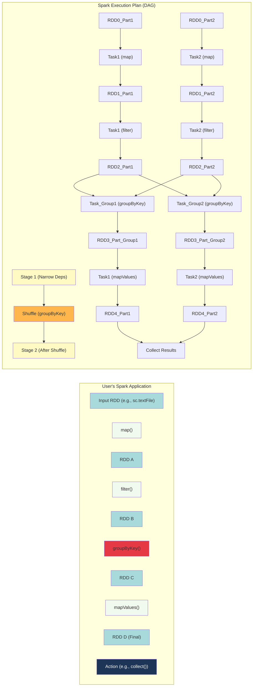

---
tags:
  - spark
  - dag
  - scheduler
  - execution_plan
  - transformations
  - actions
  - optimization
  - concept
aliases:
  - Spark DAG
  - Directed Acyclic Graph Spark
  - Spark Execution Plan
related:
  - "[[180_Big_Data/Spark/_Spark_MOC|_Spark_MOC]]"
  - "[[RDD_Resilient_Distributed_Dataset|RDD]]"
  - "[[Spark_Transformations_Actions|Spark Transformations and Actions]]"
  - "[[Spark_Lazy_vs_Eager_Execution|Spark Lazy Execution]]"
  - "[[Spark_Shuffle_Operations]]"
worksheet:
  - WS_Spark_1
date_created: 2025-06-11
---
# Spark DAG (Directed Acyclic Graph) Scheduler

## Definition
In Apache Spark, a **Directed Acyclic Graph (DAG)** represents the sequence of computations (transformations) to be performed on [[RDD_Resilient_Distributed_Dataset|RDDs]] (or implicitly on [[Spark_DataFrame_SQL|DataFrames]]/Datasets). When a user writes a Spark application, they define a series of transformations on data. Due to Spark's [[Spark_Lazy_vs_Eager_Execution|lazy execution]] model, these transformations are not executed immediately. Instead, Spark builds up a DAG of these operations.

The **DAG Scheduler** is a component within the Spark Driver program that:
1.  Takes this logical DAG of RDD transformations.
2.  Optimizes it.
3.  Divides it into a set of **stages**.
4.  Determines the preferred locations for tasks based on data locality.
5.  Passes these stages to the Task Scheduler for execution on the cluster.

## How the DAG is Formed
-   Each RDD maintains a pointer to its parent RDD(s) and information about the transformation that created it from its parent(s). This lineage information forms the DAG.
-   The vertices of the DAG are RDDs.
-   The edges of the DAG are the transformations applied to the RDDs.
-   The graph is "directed" because transformations flow from parent RDDs to child RDDs.
-   The graph is "acyclic" because RDDs are immutable, and transformations always create new RDDs; there are no backward dependencies that would form a cycle.

## Role of Lazy Execution
[[Spark_Lazy_vs_Eager_Execution|Lazy execution]] is key to DAG formation:
-   **[[Spark_Transformations_Actions|Transformations]]** (e.g., `map`, `filter`, `join`) are lazy. When you call a transformation, Spark adds it to the DAG but doesn't execute it immediately.
-   **[[Spark_Transformations_Actions|Actions]]** (e.g., `count`, `collect`, `saveAsTextFile`) trigger the actual execution. When an action is called, the DAG Scheduler examines the complete DAG of RDDs required to compute the result of that action.

## Stages
The DAG Scheduler divides the DAG into **stages**. A stage is a group of tasks that can be executed together without a [[Spark_Shuffle_Operations|shuffle]] of data across the network.
-   **[[Spark_Transformations_Actions|Narrow transformations]]** (e.g., `map`, `filter`, where each input partition contributes to at most one output partition and data doesn't need to be moved between executors for computation) can typically be pipelined together within a single stage.
-   **[[Spark_Transformations_Actions|Wide transformations]]** (e.g., `groupByKey`, `reduceByKey`, `join` where data from multiple input partitions is needed to compute a single output partition) require a shuffle operation. These shuffle operations mark the **boundary between stages**.
    -   The output of one stage (e.g., map-side of a shuffle) becomes the input for the next stage (e.g., reduce-side of a shuffle).

## DAG Scheduler Workflow
1.  **Action Trigger:** An action is called on an RDD.
2.  **DAG Construction:** The DAG Scheduler looks at the RDD's lineage to build the full graph of transformations needed to compute the final RDD.
3.  **Optimization (Logical Plan):** The DAG might undergo some logical optimizations (especially when using DataFrames/SQL via the Catalyst Optimizer, which generates a logical plan that is then converted to a physical plan of RDD operations).
4.  **Stage Creation (Physical Plan):**
    -   The DAG Scheduler works backward from the final RDD.
    -   It creates a new stage whenever it encounters a wide dependency (shuffle boundary).
    -   Tasks within a stage do not require shuffling data among executors.
5.  **Task Generation:**
    -   Within each stage, the DAG Scheduler creates a set of tasks. The number of tasks usually corresponds to the number of partitions in the RDD being processed in that stage.
    -   It determines the preferred location for each task based on [[Spark_Data_Parallelism|data locality]] (e.g., trying to schedule a task on the node where its input data partition resides).
6.  **Submission to Task Scheduler:**
    -   The stages (and their tasks) are submitted to the **Task Scheduler** (part of the `SparkContext`).
    -   The Task Scheduler is responsible for actually launching tasks on available [[Spark_Cluster_Architecture|executors]] via the [[Spark_Cluster_Manager|Cluster Manager]], handling retries for failed tasks, etc.

## Visualization of a DAG (Conceptual)

> The user code defines a sequence of RDD transformations. The `groupByKey()` is a wide transformation, creating a stage boundary. The DAG scheduler creates tasks within stages that can run in parallel.

## Advantages of DAG and Lazy Execution
-   **Optimization:** By having the complete graph of computations before execution, Spark can perform various optimizations, such as:
    -   Pipelining narrow transformations within a stage to avoid writing intermediate data to disk/memory unnecessarily.
    -   Optimizing shuffle operations.
    -   Predicate pushdown (with DataFrames/SQL via Catalyst).
-   **[[Hadoop_Fault_Tolerance|Fault Tolerance]]:** The lineage information in the DAG allows Spark to recompute lost partitions of RDDs efficiently if a node fails.
-   **Efficiency:** Avoids materializing intermediate RDDs that are not strictly necessary.

The DAG model is a core reason for Spark's performance and resilience in distributed data processing. The Spark Web UI provides visualizations of the DAG, stages, and tasks for running applications, which is very helpful for debugging and performance tuning.

---