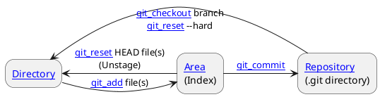

---
tags:
  - version_control
  - concept
  - git
aliases:
  - Index
  - Cache (Git context
related:
  - "[[Git]]"
  - "[[Repository]]"
  - "[[Working_directory]]"
  - "[[Commit_object]]"
  - "[[git_add]]"
  - "[[git_commit]]"
  - "[[git_status]]"
  - "[[git_reset]]"
worksheet:
  - WS<% tp.file.cursor(1) %>
date_created: 2025-04-10
---
# Staging Area

## Definition

In [[Git]], the **Staging Area** (also commonly referred to as the "index" or sometimes the "cache") is an intermediate area where you prepare and review changes before committing them permanently to the [[Repository]]. It acts as a buffer between your [[Working_directory]] (where you modify files) and your commit history.

## Key Aspects / Characteristics

- **Snapshot Preparation:** Allows you to selectively choose which modifications from your [[Working_directory]] will be included in the next [[Commit_object|commit]].
- **File Tracking:** Technically, it's a file (usually `.git/index`) that stores information about what will go into your next commit: list of files, their modes, and SHA-1 hashes of their content (as blobs).
- **Controlled Commits:** Enables crafting well-defined, logical commits by staging only related changes together, even if multiple unrelated changes exist in the working directory.
- **Interaction:** Changes are moved from the working directory to the staging area using [[git_add]]. The [[git_commit]] command then takes the contents of the staging area to create a new commit. [[git_status]] shows the state of files relative to the staging area and working directory. [[git_reset]] can be used to unstage changes.

## Examples / Use Cases

- Modifying three files (A, B, C) for two different features.
- Use `git add A B` to stage changes related to the first feature.
- Use `git commit -m "Implement feature 1"` to commit only A and B.
- Later, use `git add C` and `git commit -m "Implement feature 2"` to commit the remaining change.

## Related Concepts
- [[Git]] (The VCS featuring the staging area)
- [[Working_directory]] (Where files are edited)
- [[Repository]] (Where commits are permanently stored)
- [[Commit_object]] (The snapshot created *from* the staging area)
- [[git_add]] (Command to move changes *to* the staging area)
- [[git_commit]] (Command to record the staging area *into* the repository)
- [[git_status]] (Command to view the state of the staging area)
- [[git_reset]] (Command to remove changes *from* the staging area)

## Diagrams (Optional)

## Questions / Further Study

> [!question] Why do we need git add before commit and then push after a commit? (WS2)
> 
> 1. **git add before commit:** The [[Staging_area]] allows selective committing. You might edit multiple files for different tasks. git add lets you choose only the changes relevant to the current logical task to include in the next [[Commit_object|commit]]. This promotes creating clean, focused commits rather than large, unrelated ones.
>     
> 2. **push after commit:** [[Git]] is a distributed system. [[git_commit]] saves the snapshot only to your local [[Repository]]. It doesn't affect any [[Remote_repository|remote repositories]]. [[git_push]] is the command used to upload your local commits (and the necessary objects) to a specified remote repository, sharing your work with collaborators or backing it up.
>     

---

**Source:** Worksheet WS2, WS15
