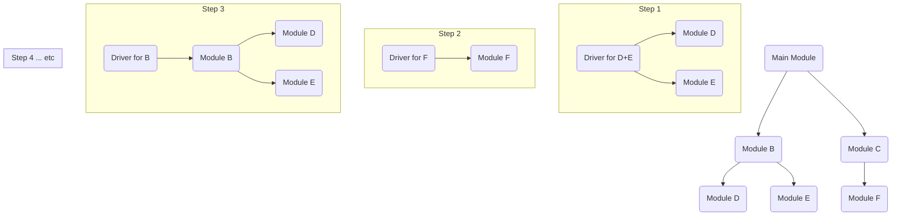

---
tags:
  - testing
  - concept
  - technique
  - integration
  - strategy
aliases:
  - Bottom-up Integration Testing
related:
  - Integration_Test
  - Top-down_Integration
  - Big_Bang_Integration
  - Test_Driver
  - Stubs
worksheet:
  - WS_Testing
date_created: 2025-04-14
---
# Bottom-up Integration Testing

## Definition

**Bottom-up Integration Testing** is an incremental strategy for [[Integration_Test|integration testing]] where testing begins with the **lowest-level modules** (e.g., utility functions, data access modules) and progressively integrates and tests modules higher up in the application's hierarchy. To test these lower-level modules before the higher-level modules that call them are available, **Test Drivers** are used to simulate the calling environment and pass test data.

## Process Flow

1.  Combine related low-level modules (units) into clusters or builds.
2.  Write a **Test Driver** for each cluster, which simulates the calls that would normally come from higher-level modules, providing necessary inputs.
3.  Test the cluster using its driver.
4.  Once a cluster is tested, replace the driver's simulation with the actual next-level-up module(s) that call this cluster.
5.  Repeat steps 2-4, moving upwards through the application's control hierarchy until the top-level module is integrated and tested. [[Stubs]] might still be needed if a module calls another module at the same or lower level that isn't part of the current cluster.

## Advantages

- **Early Testing of Critical Low-Level Modules:** Utility functions, core algorithms, or data access layers are tested early and thoroughly.
- **Easier Test Case Design:** Often easier to design test cases for lower-level, more focused modules.
- **Fault Isolation:** Failures are often easier to isolate to the newly added module or cluster.

## Disadvantages

- **Late Testing of High-Level Logic:** The overall application control flow and user interface aspects are tested last. Major architectural or design flaws might be discovered late.
- **No Working Skeleton Early:** A demonstrable, high-level prototype of the system is not available until near the end of integration.
- **Requires Many Drivers:** Can involve writing and maintaining numerous test drivers.

## Diagram (Conceptual)

## Related Concepts
- [[Integration_Test]] (The testing level)
- [[Top-down_Integration]] (Alternative strategy)
- [[Big_Bang_Integration]] (Alternative strategy)
- [[Test_Driver]] (Used extensively in bottom-up testing - *to be created*)
- [[Stubs]] (Used in top-down testing, might be needed occasionally in bottom-up)

---
**Source:** Worksheet WS_Testing