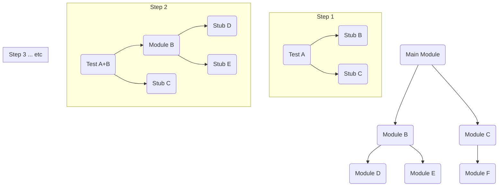

---
tags:
  - testing
  - concept
  - technique
  - integration
  - strategy
aliases:
  - Top-down Integration Testing
related:
  - Integration_Test
  - Bottom-up_Integration
  - Big_Bang_Integration
  - Stubs
  - Test_Driver
worksheet:
  - WS_Testing
date_created: 2025-04-14
---
# Top-down Integration Testing

## Definition

**Top-down Integration Testing** is an incremental strategy for [[Integration_Test|integration testing]] where testing begins with the **top-level modules** (e.g., the main control module, user interface) and progressively integrates and tests lower-level modules one by one. To test the higher-level modules when their subordinate lower-level modules are not yet available or integrated, **[[Stubs]]** are used to simulate the behavior of the missing lower-level components.

## Process Flow

1.  Test the top-level control module(s) in isolation, using stubs for all modules they directly call.
2.  Replace one stub at a time with the actual lower-level module it represents.
3.  Perform tests focusing on the interaction between the newly integrated module and its caller(s).
4.  If the newly integrated module itself calls other, lower-level modules, use stubs for those.
5.  Repeat steps 2-4, moving downwards through the application's control hierarchy until all modules are integrated and tested.

## Advantages

- **Early Verification of Major Control Flow:** Allows testing the main logic, architecture, and interfaces of the application early in the process. Major design flaws can be found sooner.
- **Working Skeleton:** Provides an early, demonstrable (though incomplete) version of the system.
- **Fault Isolation:** When a test fails after integrating a new module, the fault is likely located in that new module or its interface with the caller.

## Disadvantages

- **Requires Many Stubs:** Can involve writing and maintaining numerous stubs, which can be complex.
- **Lower-level Functionality Tested Late:** Critical low-level functions (which might perform core calculations or data manipulation) are tested last. Issues found here might require significant rework in higher levels.
- **Inadequate Testing of Lower Levels Possible:** If stubs are overly simplistic, the testing of higher-level modules using those stubs might not be fully representative.

## Diagram (Conceptual)

## Related Concepts
- [[Integration_Test]] (The testing level)
- [[Bottom-up_Integration]] (Alternative strategy)
- [[Big_Bang_Integration]] (Alternative strategy)
- [[Stubs]] (Used extensively in top-down testing)
- [[Test_Driver]] (Used in bottom-up testing)

---
**Source:** Worksheet WS_Testing